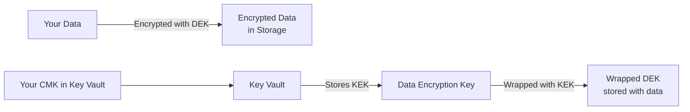

# How to Set Up Azure Storage Encryption with Customer-Managed Keys in Key Vault

Author: [nawazdhandala](https://www.github.com/nawazdhandala)

Tags: Azure, Storage Encryption, Customer-Managed Keys, Key Vault, Security, Compliance, Data Protection

Description: Step-by-step guide to configuring Azure Storage account encryption with customer-managed keys stored in Azure Key Vault for compliance and key control.

---

Azure Storage encrypts all data at rest using 256-bit AES encryption. By default, Microsoft manages the encryption keys. But if your organization needs control over the encryption keys - whether for compliance requirements, audit purposes, or security policies - you can use customer-managed keys (CMK) stored in Azure Key Vault. This post walks through the complete setup process.

## Understanding the Encryption Model

Azure Storage uses envelope encryption. Here is how it works.

Each piece of data is encrypted with a unique data encryption key (DEK). The DEK is then encrypted (wrapped) with your key encryption key (KEK) stored in Key Vault. When Azure needs to read the data, it retrieves the wrapped DEK, unwraps it using your KEK, and then decrypts the data.

This means your key never directly touches the data. It only wraps and unwraps the DEK. Azure handles the actual data encryption and decryption transparently.



## Prerequisites

Before starting, you need:

- An Azure Storage account (StorageV2/General Purpose v2)
- An Azure Key Vault with soft-delete and purge-protection enabled
- Appropriate permissions to manage both resources

## Step 1: Create or Configure the Key Vault

The Key Vault must have soft delete and purge protection enabled. These are required to prevent accidental key deletion, which would make your data permanently inaccessible.

```bash
# Create a Key Vault with required protections
az keyvault create \
  --name my-storage-cmk-kv \
  --resource-group my-resource-group \
  --location eastus \
  --enable-soft-delete true \
  --enable-purge-protection true

# If using an existing Key Vault, enable purge protection
az keyvault update \
  --name my-storage-cmk-kv \
  --resource-group my-resource-group \
  --enable-purge-protection true
```

## Step 2: Create an Encryption Key

Create an RSA or RSA-HSM key in the vault. RSA 2048 is the minimum key size, but 3072 or 4096 are recommended for stronger encryption.

```bash
# Create an RSA key for storage encryption
az keyvault key create \
  --vault-name my-storage-cmk-kv \
  --name storage-cmk \
  --kty RSA \
  --size 3072 \
  --ops wrapKey unwrapKey

# Verify the key exists
az keyvault key show \
  --vault-name my-storage-cmk-kv \
  --name storage-cmk \
  --query "{name:key.kid, type:key.kty, operations:key.keyOps}"
```

If you need HSM-backed keys for compliance (FIPS 140-2 Level 2 or 3), use a Premium Key Vault or Key Vault Managed HSM.

```bash
# Create an HSM-backed key (requires Premium SKU Key Vault)
az keyvault key create \
  --vault-name my-storage-cmk-kv \
  --name storage-cmk-hsm \
  --kty RSA-HSM \
  --size 3072
```

## Step 3: Enable Managed Identity on the Storage Account

The storage account needs a managed identity to authenticate to Key Vault.

```bash
# Enable system-assigned managed identity on the storage account
az storage account update \
  --name mystorageaccount \
  --resource-group my-resource-group \
  --assign-identity

# Get the managed identity's principal ID
IDENTITY_ID=$(az storage account show \
  --name mystorageaccount \
  --resource-group my-resource-group \
  --query "identity.principalId" -o tsv)

echo "Storage account identity: $IDENTITY_ID"
```

## Step 4: Grant Key Vault Access to the Storage Account

The storage account's managed identity needs permission to use the encryption key.

```bash
# Using Key Vault access policies
az keyvault set-policy \
  --name my-storage-cmk-kv \
  --object-id "$IDENTITY_ID" \
  --key-permissions get wrapKey unwrapKey

# Alternatively, using RBAC (if Key Vault uses RBAC authorization)
az role assignment create \
  --assignee "$IDENTITY_ID" \
  --role "Key Vault Crypto Service Encryption User" \
  --scope "/subscriptions/<sub>/resourceGroups/my-resource-group/providers/Microsoft.KeyVault/vaults/my-storage-cmk-kv"
```

## Step 5: Configure the Storage Account to Use CMK

Now link the storage account to use your Key Vault key for encryption.

```bash
# Get the key URI (without the version for automatic rotation)
KEY_VAULT_URI="https://my-storage-cmk-kv.vault.azure.net"
KEY_NAME="storage-cmk"

# Configure the storage account to use the customer-managed key
az storage account update \
  --name mystorageaccount \
  --resource-group my-resource-group \
  --encryption-key-source Microsoft.Keyvault \
  --encryption-key-vault "$KEY_VAULT_URI" \
  --encryption-key-name "$KEY_NAME"

# Verify the encryption configuration
az storage account show \
  --name mystorageaccount \
  --resource-group my-resource-group \
  --query "encryption.{source:keySource, vault:keyVaultProperties.keyVaultUri, key:keyVaultProperties.keyName, version:keyVaultProperties.keyVersion}" \
  --output table
```

## Setting Up with PowerShell

```powershell
# Enable managed identity
$storageAccount = Set-AzStorageAccount `
  -ResourceGroupName "my-resource-group" `
  -Name "mystorageaccount" `
  -AssignIdentity

# Get the identity principal ID
$identityPrincipalId = $storageAccount.Identity.PrincipalId

# Grant Key Vault access
Set-AzKeyVaultAccessPolicy `
  -VaultName "my-storage-cmk-kv" `
  -ObjectId $identityPrincipalId `
  -PermissionsToKeys get, wrapKey, unwrapKey

# Get the key
$key = Get-AzKeyVaultKey -VaultName "my-storage-cmk-kv" -Name "storage-cmk"

# Configure encryption
Set-AzStorageAccount `
  -ResourceGroupName "my-resource-group" `
  -Name "mystorageaccount" `
  -KeyvaultEncryption `
  -KeyName "storage-cmk" `
  -KeyVaultUri "https://my-storage-cmk-kv.vault.azure.net"

Write-Output "Storage account configured with CMK encryption"
```

## Setting Up with Terraform

```hcl
resource "azurerm_storage_account" "main" {
  name                     = "mystorageaccount"
  resource_group_name      = azurerm_resource_group.main.name
  location                 = azurerm_resource_group.main.location
  account_tier             = "Standard"
  account_replication_type = "LRS"

  # Enable managed identity
  identity {
    type = "SystemAssigned"
  }
}

resource "azurerm_key_vault_access_policy" "storage" {
  key_vault_id = azurerm_key_vault.main.id
  tenant_id    = data.azurerm_client_config.current.tenant_id
  object_id    = azurerm_storage_account.main.identity[0].principal_id

  key_permissions = ["Get", "WrapKey", "UnwrapKey"]
}

resource "azurerm_storage_account_customer_managed_key" "main" {
  storage_account_id = azurerm_storage_account.main.id
  key_vault_id       = azurerm_key_vault.main.id
  key_name           = azurerm_key_vault_key.storage_cmk.name
}
```

## Key Rotation

When you create a new version of the key in Key Vault, the storage account automatically picks it up if you configured it without specifying a key version.

```bash
# Create a new version of the key (automatic rotation)
az keyvault key create \
  --vault-name my-storage-cmk-kv \
  --name storage-cmk \
  --kty RSA \
  --size 3072

# The storage account will automatically detect and use the new version
# Verify by checking the key version in use
az storage account show \
  --name mystorageaccount \
  --resource-group my-resource-group \
  --query "encryption.keyVaultProperties.currentVersionedKeyIdentifier"
```

You can also set up automatic key rotation in Key Vault.

```bash
# Set up automatic rotation policy for the key
az keyvault key rotation-policy update \
  --vault-name my-storage-cmk-kv \
  --name storage-cmk \
  --value '{
    "lifetimeActions": [
      {
        "trigger": {"timeBeforeExpiry": "P30D"},
        "action": {"type": "Rotate"}
      },
      {
        "trigger": {"timeBeforeExpiry": "P7D"},
        "action": {"type": "Notify"}
      }
    ],
    "attributes": {"expiryTime": "P1Y"}
  }'
```

## Encryption Scopes

For more granular control, you can create encryption scopes that use different keys for different containers or blobs.

```bash
# Create an encryption scope with a specific CMK
az storage account encryption-scope create \
  --account-name mystorageaccount \
  --resource-group my-resource-group \
  --name marketing-scope \
  --key-source Microsoft.KeyVault \
  --key-uri "https://my-storage-cmk-kv.vault.azure.net/keys/marketing-key"

# Create a container that uses the encryption scope
az storage container create \
  --name marketing-data \
  --account-name mystorageaccount \
  --default-encryption-scope marketing-scope \
  --prevent-encryption-scope-override true \
  --auth-mode login
```

## Monitoring and Auditing

Enable Key Vault logging to track when your encryption key is used.

```bash
# Enable diagnostic logging for the Key Vault
az monitor diagnostic-settings create \
  --name kv-audit-logs \
  --resource "/subscriptions/<sub>/resourceGroups/my-resource-group/providers/Microsoft.KeyVault/vaults/my-storage-cmk-kv" \
  --workspace "/subscriptions/<sub>/resourceGroups/my-resource-group/providers/Microsoft.OperationalInsights/workspaces/my-workspace" \
  --logs '[{"category":"AuditEvent","enabled":true,"retentionPolicy":{"enabled":true,"days":90}}]'
```

## What Happens If the Key Becomes Unavailable?

If the key is deleted, disabled, or the Key Vault becomes inaccessible, the storage account enters a degraded state. Read and write operations will fail because Azure cannot decrypt the data encryption keys.

This is by design - it gives you the ability to immediately revoke access to your data by disabling the key. To restore access, re-enable the key or fix the Key Vault connectivity.

```bash
# Disable the key (immediately blocks storage access)
az keyvault key set-attributes \
  --vault-name my-storage-cmk-kv \
  --name storage-cmk \
  --enabled false

# Re-enable the key (restores storage access)
az keyvault key set-attributes \
  --vault-name my-storage-cmk-kv \
  --name storage-cmk \
  --enabled true
```

## Best Practices

Always enable purge protection on the Key Vault. Without it, a deleted key means permanently lost data.

Use automatic key rotation by omitting the key version when configuring the storage account. This way, new key versions are picked up automatically.

Monitor Key Vault health and set up alerts for access failures. If the storage account cannot reach the key, all data access stops.

Use separate Key Vaults for different environments. A key issue in your dev vault should never affect production.

Consider using Key Vault Managed HSM for the highest security level. It provides FIPS 140-2 Level 3 validated hardware security modules for key storage.

Customer-managed keys for Azure Storage give you complete control over your encryption keys, which is essential for meeting compliance requirements and maintaining a strong security posture. The setup is straightforward, and the operational overhead is minimal once automatic key rotation is configured.
