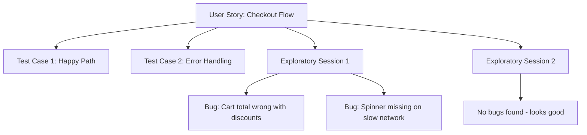

# How to Set Up Azure Test Plans Exploratory Testing Sessions with Chrome Extension

Author: [nawazdhandala](https://www.github.com/nawazdhandala)

Tags: Azure Test Plans, Exploratory Testing, Chrome Extension, QA, Azure DevOps, Testing, Quality Assurance

Description: A hands-on guide to setting up and running exploratory testing sessions using Azure Test Plans and the Test and Feedback Chrome extension.

---

Scripted test cases have their place, but they only cover scenarios someone thought to write down. Exploratory testing fills the gaps - it is about poking around the application with curiosity, finding bugs that nobody predicted, and understanding how the software actually behaves in ways that formal test plans miss.

Azure Test Plans provides built-in support for exploratory testing through the Test and Feedback browser extension. This extension lets testers capture bugs, take screenshots, record screen sessions, and create work items - all without leaving the application they are testing. Everything feeds back into Azure DevOps automatically. In this post, I will walk through setting up the extension, running effective exploratory testing sessions, and getting the most out of the feedback loop.

## Installing the Test and Feedback Extension

The Test and Feedback extension is available for Chrome and Edge (Chromium-based). Here is how to set it up:

1. Open the Chrome Web Store and search for "Test & Feedback" by Microsoft DevLabs
2. Click "Add to Chrome" and confirm the installation
3. The extension icon appears in your browser toolbar

After installation, click the extension icon and sign in with your Azure DevOps credentials. You will need to:

- Enter your Azure DevOps organization URL (e.g., `https://dev.azure.com/myorg`)
- Select the project you want to test against
- Choose a team (this determines which area path and iteration the created bugs go into)

## Understanding the Extension Interface

When you click the extension icon and start a session, you get a floating toolbar that stays on top of your browser window. The toolbar provides:

- **Capture screenshot**: Takes a screenshot of the current page with annotation tools
- **Record screen**: Records a video of your testing session
- **Create bug**: Opens a bug creation form pre-populated with your session data
- **Create task**: Creates a task work item
- **Add note**: Adds a text note to the session timeline
- **Timer**: Shows how long the current session has been running

The extension also automatically captures:

- Browser console logs
- Network requests and responses
- Page URLs and navigation history
- System information (browser version, OS, screen resolution)

All of this context gets attached to any bugs you file, making it much easier for developers to reproduce issues.

## Starting an Exploratory Testing Session

There are two ways to start a session: connected and standalone.

### Connected Mode (Recommended)

Connected mode links your session to a specific work item, like a user story or feature. This gives you traceability - you can see which stories have been explored and which have not.

1. In Azure Test Plans, go to the "Execute" tab
2. Select a work item (user story, requirement, or test case)
3. Click "Run with options" and choose "Test & Feedback extension"
4. The extension opens in your browser, pre-linked to that work item

Any bugs or issues you find during the session are automatically linked to the parent work item.

### Standalone Mode

If you just want to explore without linking to a specific story:

1. Click the extension icon in the browser toolbar
2. Click "Start session"
3. Start testing - you are free to explore anything

Bugs created in standalone mode still go into Azure DevOps but are not linked to a parent work item.

## Running an Effective Session

Exploratory testing is not random clicking. Good exploratory testers follow a structured approach. Here is a workflow that works well with the extension:

### Set a Charter

Before starting, write a brief charter that describes what you are testing and what you are looking for. For example:

- "Explore the checkout flow with edge cases: empty cart, single item, maximum quantity, expired payment method"
- "Test the search feature with special characters, very long queries, and empty searches"
- "Explore the admin dashboard with a user who has limited permissions"

The charter keeps you focused. Note it down using the extension's note feature when you start the session.

### Use Time-Boxing

Set a fixed duration for each session, typically 60 to 90 minutes. The extension shows a timer, which helps you stay on track. Shorter sessions (30 minutes) work well for focused areas. Longer sessions lead to fatigue and diminished effectiveness.

### Take Notes as You Go

Use the "Add note" feature to document your observations throughout the session. Notes create a timeline of your testing that you can review later:

- "Tested login with valid credentials - works fine"
- "Noticed the loading spinner does not appear on slow connections"
- "The error message for invalid email is confusing - says 'format error' instead of explaining the expected format"

### Capture Everything Suspicious

When you spot something that might be a bug, capture it immediately:

1. Click "Capture screenshot" - the page is captured with the current state
2. Use the annotation tools to draw arrows, circles, or highlights on the screenshot
3. Add a description of what you expected vs. what happened
4. Click "Create bug" to file it directly to Azure DevOps

The bug work item is created with:

- Your annotated screenshot
- Browser console logs from the session
- Network requests that happened during the interaction
- Your notes from the session
- System information
- A link to the parent work item (if in connected mode)

## Screen Recording for Complex Bugs

Some bugs are hard to describe in a screenshot. The screen recording feature captures a video of your session that you can trim and attach to the bug:

1. Click the record button when you are about to reproduce a tricky scenario
2. Perform the steps that trigger the bug
3. Stop the recording
4. Trim the video to just the relevant portion
5. The recording is attached to the next bug you create

Video recordings are especially valuable for:

- Intermittent bugs that are hard to reproduce
- Complex multi-step workflows
- UI animations or transitions that behave incorrectly
- Race conditions that depend on timing

## Reviewing Session Results

After you end a testing session, review the results in Azure Test Plans:

1. Go to Test Plans, then "Runs"
2. Find your exploratory testing session
3. Click into it to see the session timeline

The timeline shows everything that happened during the session in chronological order: notes, screenshots, bugs created, and pages visited. This is valuable for:

- Understanding test coverage (which areas were explored)
- Reviewing the session with team members
- Identifying areas that need more exploration

## Connecting Sessions to Test Planning

To track exploratory testing coverage alongside scripted tests, link your sessions to requirements:

This gives you a complete picture of how well each feature has been tested, combining both planned and exploratory approaches.

## Team-Based Exploratory Testing

Exploratory testing works great as a team activity. Here is how to organize it:

### Bug Bash Sessions

A bug bash is a time-boxed event where the whole team does exploratory testing together. To set one up:

1. Create a set of testing charters covering the areas you want to explore
2. Assign charters to team members based on their expertise
3. Set a time limit (1-2 hours)
4. Everyone uses the Test and Feedback extension in connected mode
5. After the session, review all findings together

### Session Handoff

When one tester finishes a session, they can hand off their findings to another tester. The session notes and timeline in Azure Test Plans provide the context the next tester needs to continue the exploration from where it left off.

## Configuring Extension Settings

The extension has several configurable settings worth knowing:

- **Image format**: Choose between PNG (lossless, larger) and JPEG (smaller, lossy) for screenshots
- **Screen recording quality**: Adjust based on your bandwidth and storage needs
- **Auto-capture**: Enable to automatically capture screenshots and console logs at regular intervals
- **Connected services**: Configure which Azure DevOps project and team to use

## Best Practices

**Keep sessions focused.** One charter per session. If you find something outside your charter's scope, note it down and come back to it in a separate session.

**File bugs immediately.** Do not save things for later. The extension captures the most context when you file the bug right when you see the issue.

**Vary your testing personas.** Test as different user types - new user, power user, admin, user with accessibility needs. Different perspectives find different bugs.

**Review sessions as a team.** Share interesting findings from exploratory sessions in team meetings. Other testers learn from each other's approaches and discoveries.

**Use the data for coverage decisions.** Track which features have been explored and which have not. Use this data to prioritize future testing sessions.

## Wrapping Up

The Test and Feedback extension turns your browser into a powerful testing workstation. It captures the context that makes bugs reproducible, links findings to user stories for traceability, and creates a record of your testing coverage. Whether you run solo sessions or team bug bashes, exploratory testing through the extension fills the gaps that scripted tests leave behind. Install it, pick a charter, and start exploring.
