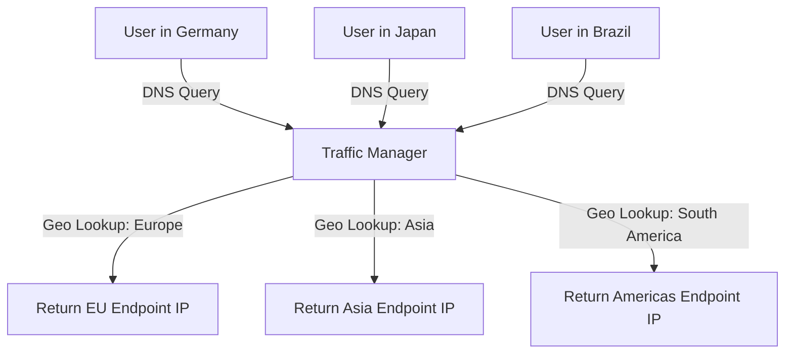

# How to Set Up Azure Traffic Manager with Geographic Routing Method

Author: [nawazdhandala](https://www.github.com/nawazdhandala)

Tags: Azure, Traffic Manager, Geographic Routing, DNS, Global Load Balancing, Networking, Geo-Routing

Description: A hands-on guide to setting up Azure Traffic Manager with geographic routing to direct users to region-specific endpoints based on their location.

---

Azure Traffic Manager's geographic routing method directs users to specific endpoints based on where their DNS queries originate. Unlike performance routing which picks the lowest-latency endpoint, geographic routing gives you explicit control over which endpoint serves which regions. This is essential for data sovereignty requirements, regional content regulations, or when you need to guarantee that users in Europe always hit your European deployment.

## When to Use Geographic Routing

Geographic routing is the right choice when:

- **Data residency laws** require that user data stays in a specific region. GDPR, for instance, may require European user traffic to be processed in the EU.
- **Regional content licensing** means certain content can only be served from specific regions.
- **Regulatory compliance** mandates that government users only access domestically hosted services.
- **Regional pricing** or feature sets differ by geography.

If your goal is simply low latency, use the performance routing method instead. Geographic routing is about control, not optimization.

## How Geographic Routing Works

Traffic Manager resolves DNS queries based on the source IP of the DNS resolver making the query. Here is the flow:

1. User in Germany tries to access `app.contoso.com`
2. The DNS query reaches Traffic Manager
3. Traffic Manager looks up the source IP of the DNS query
4. It maps the IP to a geographic region (Germany -> Europe)
5. It returns the IP of the endpoint assigned to Europe



## Prerequisites

You need:

1. A Traffic Manager profile (DNS-based, works at layer 7)
2. Endpoints deployed in the regions you want to serve (these can be Azure App Services, Cloud Services, public IPs, or external endpoints)
3. An understanding of which geographic regions map to which endpoints

## Step 1: Create the Traffic Manager Profile

```bash
# Create a Traffic Manager profile with geographic routing
az network traffic-manager profile create \
  --resource-group myResourceGroup \
  --name myGeoProfile \
  --routing-method Geographic \
  --unique-dns-name myapp-geo \
  --ttl 60 \
  --protocol HTTPS \
  --port 443 \
  --path "/health"
```

Key parameters:
- `--routing-method Geographic` enables geographic routing
- `--unique-dns-name` creates the `myapp-geo.trafficmanager.net` DNS entry
- `--ttl 60` keeps the DNS TTL low for faster failover
- `--path "/health"` is the health check endpoint

## Step 2: Add Endpoints

Add your regional endpoints. These can be Azure endpoints, external endpoints, or nested profiles:

```bash
# Add the European endpoint (Azure App Service)
az network traffic-manager endpoint create \
  --resource-group myResourceGroup \
  --profile-name myGeoProfile \
  --type azureEndpoints \
  --name europeEndpoint \
  --target-resource-id "/subscriptions/<sub-id>/resourceGroups/rgEurope/providers/Microsoft.Web/sites/myapp-europe" \
  --endpoint-status Enabled \
  --geo-mapping "GEO-EU"

# Add the North America endpoint
az network traffic-manager endpoint create \
  --resource-group myResourceGroup \
  --profile-name myGeoProfile \
  --type azureEndpoints \
  --name northAmericaEndpoint \
  --target-resource-id "/subscriptions/<sub-id>/resourceGroups/rgUS/providers/Microsoft.Web/sites/myapp-us" \
  --endpoint-status Enabled \
  --geo-mapping "GEO-NA"

# Add the Asia Pacific endpoint
az network traffic-manager endpoint create \
  --resource-group myResourceGroup \
  --profile-name myGeoProfile \
  --type azureEndpoints \
  --name asiaEndpoint \
  --target-resource-id "/subscriptions/<sub-id>/resourceGroups/rgAsia/providers/Microsoft.Web/sites/myapp-asia" \
  --endpoint-status Enabled \
  --geo-mapping "GEO-AP"
```

The `--geo-mapping` parameter accepts geographic codes. Here are the important ones:

| Code | Region |
|------|--------|
| WORLD | All regions (catch-all) |
| GEO-EU | Europe |
| GEO-NA | North America |
| GEO-SA | South America |
| GEO-AP | Asia Pacific |
| GEO-AF | Africa |
| GEO-AN | Antarctica |
| GEO-ME | Middle East |

You can also map specific countries using ISO 3166-1 alpha-2 codes.

## Step 3: Add a Catch-All Endpoint

What happens when a user comes from a region you have not mapped? Their DNS query fails. To avoid this, always add a catch-all endpoint with the `WORLD` mapping:

```bash
# Add a catch-all endpoint for unmapped regions
az network traffic-manager endpoint create \
  --resource-group myResourceGroup \
  --profile-name myGeoProfile \
  --type azureEndpoints \
  --name defaultEndpoint \
  --target-resource-id "/subscriptions/<sub-id>/resourceGroups/rgUS/providers/Microsoft.Web/sites/myapp-us" \
  --endpoint-status Enabled \
  --geo-mapping "WORLD"
```

This catches any geography not explicitly assigned to another endpoint.

## Step 4: Map Specific Countries

For finer control, you can map individual countries to specific endpoints. This is useful when a country needs special handling despite being in a larger mapped region:

```bash
# Map Germany specifically to a dedicated German endpoint
az network traffic-manager endpoint create \
  --resource-group myResourceGroup \
  --profile-name myGeoProfile \
  --type azureEndpoints \
  --name germanyEndpoint \
  --target-resource-id "/subscriptions/<sub-id>/resourceGroups/rgGermany/providers/Microsoft.Web/sites/myapp-germany" \
  --endpoint-status Enabled \
  --geo-mapping "DE"

# Map multiple countries to one endpoint
az network traffic-manager endpoint create \
  --resource-group myResourceGroup \
  --profile-name myGeoProfile \
  --type externalEndpoints \
  --name ukEndpoint \
  --target "myapp-uk.example.com" \
  --endpoint-status Enabled \
  --geo-mapping "GB" "IE"
```

**Important:** Each geographic region or country can only be mapped to one endpoint. If Germany is mapped to the Germany-specific endpoint, it will not also be routed by the broader GEO-EU mapping.

## Step 5: Configure Health Checks

Traffic Manager continuously monitors endpoint health. If a geographic endpoint goes down, Traffic Manager will not reroute traffic to another geographic endpoint by default. Users will get a failed DNS response.

To handle failover, use nested profiles:

```bash
# Create an inner profile with priority routing for EU failover
az network traffic-manager profile create \
  --resource-group myResourceGroup \
  --name euFailoverProfile \
  --routing-method Priority \
  --unique-dns-name eu-failover \
  --ttl 30 \
  --protocol HTTPS \
  --port 443 \
  --path "/health"

# Primary EU endpoint
az network traffic-manager endpoint create \
  --resource-group myResourceGroup \
  --profile-name euFailoverProfile \
  --type azureEndpoints \
  --name euPrimary \
  --target-resource-id "/subscriptions/<sub-id>/resourceGroups/rgEurope/providers/Microsoft.Web/sites/myapp-europe" \
  --priority 1

# Failover EU endpoint (maybe in a different EU region)
az network traffic-manager endpoint create \
  --resource-group myResourceGroup \
  --profile-name euFailoverProfile \
  --type azureEndpoints \
  --name euSecondary \
  --target-resource-id "/subscriptions/<sub-id>/resourceGroups/rgEurope2/providers/Microsoft.Web/sites/myapp-europe-backup" \
  --priority 2

# Now use the nested profile as the EU endpoint in the geo profile
az network traffic-manager endpoint create \
  --resource-group myResourceGroup \
  --profile-name myGeoProfile \
  --type nestedEndpoints \
  --name europeNestedEndpoint \
  --target-resource-id "/subscriptions/<sub-id>/resourceGroups/myResourceGroup/providers/Microsoft.Network/trafficManagerProfiles/euFailoverProfile" \
  --min-child-endpoints 1 \
  --geo-mapping "GEO-EU"
```

This gives you geographic routing at the top level and priority-based failover within each region.

## Testing Geographic Routing

Testing geographic routing is tricky because you need DNS queries from different geographic locations. Some approaches:

```bash
# Use Traffic Manager's built-in test tool
az network traffic-manager profile show \
  --resource-group myResourceGroup \
  --name myGeoProfile \
  --query "endpoints[].{name:name, geoMapping:geoMapping, status:endpointStatus}" \
  --output table
```

For actual testing from different locations, use online DNS lookup tools that let you choose the resolver location, or use VMs deployed in different Azure regions.

## Monitoring and Diagnostics

Keep an eye on geographic routing with Traffic Manager diagnostics:

```bash
# Check endpoint health status
az network traffic-manager endpoint list \
  --resource-group myResourceGroup \
  --profile-name myGeoProfile \
  --type azureEndpoints \
  --query "[].{name:name, status:endpointMonitorStatus}" \
  --output table
```

Enable diagnostic settings to send Traffic Manager logs to Log Analytics for deeper analysis of traffic patterns by geography.

## Common Mistakes

**Forgetting the WORLD catch-all.** Any geography not explicitly mapped will get no DNS response. Always add a WORLD endpoint.

**Overlapping mappings.** You cannot assign the same geography to two endpoints. If you try, the second assignment will fail.

**Expecting automatic failover across regions.** Geographic routing does not redirect European users to North America if the European endpoint is down. Use nested profiles for intra-region failover.

**DNS caching.** Traffic Manager responses are cached based on TTL. Keep TTL low (30-60 seconds) for faster response to endpoint health changes.

## Summary

Azure Traffic Manager geographic routing gives you deterministic control over which endpoint serves which users based on their location. Set up endpoints with appropriate geographic mappings, always include a WORLD catch-all, and use nested profiles if you need failover within a geographic region. This approach satisfies data sovereignty requirements while keeping your global routing configuration manageable and transparent.
