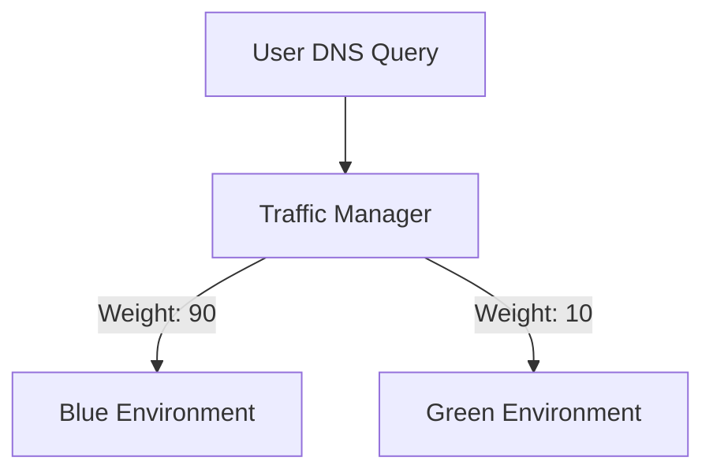
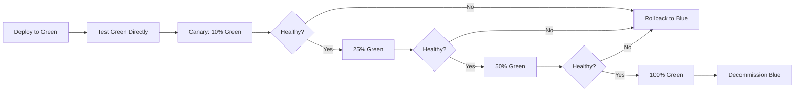

# How to Set Up Azure Traffic Manager with Weighted Routing for Blue-Green Deployments

Author: [nawazdhandala](https://www.github.com/nawazdhandala)

Tags: Azure, Traffic Manager, Weighted Routing, Blue-Green Deployment, Networking, Deployment Strategy, DNS

Description: A practical guide to using Azure Traffic Manager weighted routing to implement blue-green deployments with gradual traffic shifting between environments.

---

Blue-green deployments reduce the risk of releasing new software by running two identical production environments side by side. When the new version (green) is ready, you shift traffic from the old version (blue) to the new one. Azure Traffic Manager's weighted routing method makes this traffic shifting simple and controllable.

Instead of flipping all traffic at once, you can gradually shift traffic - start with 10% to green, watch the metrics, increase to 25%, then 50%, and finally 100%. If something goes wrong at any stage, shift traffic back to blue in seconds.

## How Weighted Routing Works

Traffic Manager's weighted routing distributes DNS queries across endpoints based on the weight you assign to each one. If blue has a weight of 90 and green has a weight of 10, roughly 90% of DNS queries resolve to blue and 10% to green.



This is not exact because it is DNS-based. The actual traffic split depends on DNS caching, but over a reasonable number of users, the distribution closely follows the weights.

## Prerequisites

1. Two deployed environments (blue and green) - these can be App Services, VMs behind a load balancer, or any web-accessible endpoint
2. Both environments running the application (blue with current version, green with new version)
3. A Traffic Manager profile

## Step 1: Create the Traffic Manager Profile

```bash
# Create a Traffic Manager profile with weighted routing
az network traffic-manager profile create \
  --resource-group myResourceGroup \
  --name blueGreenProfile \
  --routing-method Weighted \
  --unique-dns-name myapp-bg \
  --ttl 30 \
  --protocol HTTPS \
  --port 443 \
  --path "/health"
```

Key settings:
- `--routing-method Weighted` enables weight-based distribution
- `--ttl 30` keeps the DNS TTL short (30 seconds) so traffic shifts take effect quickly
- `--path "/health"` configures the health check endpoint

A short TTL is important for blue-green deployments. If the TTL is 5 minutes, it takes 5 minutes for clients to pick up the new DNS response after you change weights.

## Step 2: Add the Blue Endpoint (Current Production)

```bash
# Add the blue (current) environment endpoint with full weight
az network traffic-manager endpoint create \
  --resource-group myResourceGroup \
  --profile-name blueGreenProfile \
  --type azureEndpoints \
  --name blueEndpoint \
  --target-resource-id "/subscriptions/<sub-id>/resourceGroups/rgBlue/providers/Microsoft.Web/sites/myapp-blue" \
  --weight 100 \
  --endpoint-status Enabled
```

## Step 3: Add the Green Endpoint (New Version)

```bash
# Add the green (new) environment endpoint with zero weight initially
az network traffic-manager endpoint create \
  --resource-group myResourceGroup \
  --profile-name blueGreenProfile \
  --type azureEndpoints \
  --name greenEndpoint \
  --target-resource-id "/subscriptions/<sub-id>/resourceGroups/rgGreen/providers/Microsoft.Web/sites/myapp-green" \
  --weight 0 \
  --endpoint-status Enabled
```

Starting green at weight 0 means no production traffic reaches it yet. You can still test it directly by hitting the App Service URL.

## Step 4: Begin the Traffic Shift (Canary Phase)

Start by sending a small percentage of traffic to green. This is your canary phase - just enough traffic to detect obvious issues:

```bash
# Shift 10% of traffic to green
az network traffic-manager endpoint update \
  --resource-group myResourceGroup \
  --profile-name blueGreenProfile \
  --type azureEndpoints \
  --name blueEndpoint \
  --weight 90

az network traffic-manager endpoint update \
  --resource-group myResourceGroup \
  --profile-name blueGreenProfile \
  --type azureEndpoints \
  --name greenEndpoint \
  --weight 10
```

At this point, watch your monitoring dashboards closely. Check for:
- Error rates on the green environment
- Response time comparisons between blue and green
- Application-specific health metrics

## Step 5: Gradual Increase

If the canary phase looks good after 15-30 minutes, increase the green weight:

```bash
# Shift to 25% green
az network traffic-manager endpoint update \
  --resource-group myResourceGroup \
  --profile-name blueGreenProfile \
  --type azureEndpoints \
  --name blueEndpoint \
  --weight 75

az network traffic-manager endpoint update \
  --resource-group myResourceGroup \
  --profile-name blueGreenProfile \
  --type azureEndpoints \
  --name greenEndpoint \
  --weight 25
```

Continue monitoring. If still healthy, go to 50/50:

```bash
# Shift to 50% green
az network traffic-manager endpoint update \
  --resource-group myResourceGroup \
  --profile-name blueGreenProfile \
  --type azureEndpoints \
  --name blueEndpoint \
  --weight 50

az network traffic-manager endpoint update \
  --resource-group myResourceGroup \
  --profile-name blueGreenProfile \
  --type azureEndpoints \
  --name greenEndpoint \
  --weight 50
```

## Step 6: Complete the Shift

When you are confident the new version is healthy, shift all traffic to green:

```bash
# Complete the shift - 100% green
az network traffic-manager endpoint update \
  --resource-group myResourceGroup \
  --profile-name blueGreenProfile \
  --type azureEndpoints \
  --name blueEndpoint \
  --weight 0

az network traffic-manager endpoint update \
  --resource-group myResourceGroup \
  --profile-name blueGreenProfile \
  --type azureEndpoints \
  --name greenEndpoint \
  --weight 100
```

Keep blue running for a rollback window (typically 24-48 hours). If issues surface after full deployment, you can shift back instantly.

## Rollback

If something goes wrong at any stage, roll back by shifting weight back to blue:

```bash
# Emergency rollback - all traffic back to blue
az network traffic-manager endpoint update \
  --resource-group myResourceGroup \
  --profile-name blueGreenProfile \
  --type azureEndpoints \
  --name blueEndpoint \
  --weight 100

az network traffic-manager endpoint update \
  --resource-group myResourceGroup \
  --profile-name blueGreenProfile \
  --type azureEndpoints \
  --name greenEndpoint \
  --weight 0
```

This takes effect as DNS TTLs expire. With a 30-second TTL, most traffic shifts within a minute.

## Automating the Deployment

For CI/CD integration, script the entire workflow:

```bash
#!/bin/bash
# Blue-green deployment script with automatic rollback

RESOURCE_GROUP="myResourceGroup"
PROFILE="blueGreenProfile"
GREEN_ERROR_THRESHOLD=5  # percent

# Define the weight stages for gradual rollout
STAGES=(10 25 50 75 100)
WAIT_MINUTES=15

for WEIGHT in "${STAGES[@]}"; do
    BLUE_WEIGHT=$((100 - WEIGHT))

    echo "Setting green weight to $WEIGHT%..."

    # Update both endpoint weights
    az network traffic-manager endpoint update \
      --resource-group $RESOURCE_GROUP \
      --profile-name $PROFILE \
      --type azureEndpoints \
      --name blueEndpoint \
      --weight $BLUE_WEIGHT

    az network traffic-manager endpoint update \
      --resource-group $RESOURCE_GROUP \
      --profile-name $PROFILE \
      --type azureEndpoints \
      --name greenEndpoint \
      --weight $WEIGHT

    echo "Waiting $WAIT_MINUTES minutes to observe..."
    sleep $((WAIT_MINUTES * 60))

    # Check green environment error rate (implement your own check)
    ERROR_RATE=$(check_error_rate "green")

    if [ "$ERROR_RATE" -gt "$GREEN_ERROR_THRESHOLD" ]; then
        echo "Error rate $ERROR_RATE% exceeds threshold. Rolling back!"
        az network traffic-manager endpoint update \
          --resource-group $RESOURCE_GROUP \
          --profile-name $PROFILE \
          --type azureEndpoints \
          --name blueEndpoint --weight 100
        az network traffic-manager endpoint update \
          --resource-group $RESOURCE_GROUP \
          --profile-name $PROFILE \
          --type azureEndpoints \
          --name greenEndpoint --weight 0
        exit 1
    fi
done

echo "Deployment complete. Green is now serving 100% of traffic."
```

## The Deployment Lifecycle



## Using External Endpoints

If your blue and green environments are not Azure resources, use external endpoints instead:

```bash
# Add an external endpoint for green
az network traffic-manager endpoint create \
  --resource-group myResourceGroup \
  --profile-name blueGreenProfile \
  --type externalEndpoints \
  --name greenExternal \
  --target "green.myapp.com" \
  --weight 0 \
  --endpoint-status Enabled
```

This works with any publicly accessible endpoint, including other clouds or on-premises deployments.

## Monitoring During Deployment

During the traffic shift, monitor both environments:

```bash
# Check endpoint health status
az network traffic-manager endpoint list \
  --resource-group myResourceGroup \
  --profile-name blueGreenProfile \
  --query "[].{name:name, weight:weight, status:endpointMonitorStatus}" \
  --output table
```

Set up Azure Monitor alerts for both environments to catch issues quickly:

- HTTP 5xx error rate
- Response time (p95)
- Backend health probe failures
- Application-specific metrics (failed transactions, error counts)

## Limitations and Considerations

**DNS caching.** Even with a 30-second TTL, some resolvers cache longer. The traffic shift is gradual, not instant.

**Session affinity.** Traffic Manager does not maintain session affinity. A user might get blue for one request and green for the next. If your application requires session stickiness, combine Traffic Manager with application-level session handling.

**Database migrations.** Blue-green deployments are harder when the new version requires database schema changes. Both versions need to work with the same database during the transition period.

**Weight of 0 vs. disabled.** A weight of 0 means no traffic, but the endpoint is still monitored. Disabling the endpoint stops monitoring too. Use weight 0 to keep health checks running.

## Summary

Azure Traffic Manager weighted routing provides a simple but effective mechanism for blue-green deployments. Deploy your new version to the green environment, start with a canary (10% traffic), gradually increase the weight while monitoring health metrics, and roll back immediately if issues arise. Keep the DNS TTL short (30 seconds) for faster traffic shifts, and automate the weight changes in your CI/CD pipeline for consistent, repeatable deployments.
