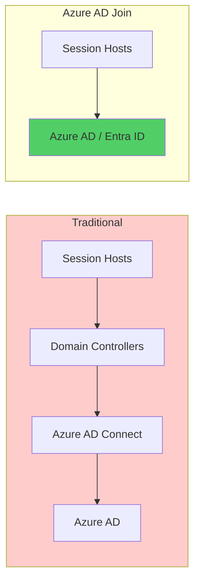

# How to Set Up Azure Virtual Desktop with Azure AD Join Without On-Premises Active Directory

Author: [nawazdhandala](https://www.github.com/nawazdhandala)

Tags: Azure Virtual Desktop, Azure AD Join, Cloud-Only, AVD, Identity, Virtual Desktop Infrastructure, Entra ID

Description: Learn how to deploy Azure Virtual Desktop with Azure AD join for a cloud-only setup that does not require on-premises Active Directory or domain controllers.

---

Traditionally, Azure Virtual Desktop (AVD) required session hosts to be joined to an Active Directory domain, which meant maintaining domain controllers - either on-premises or in Azure. Azure AD join changes this. Session hosts can now join directly to Azure AD (now called Microsoft Entra ID), eliminating the need for domain controllers entirely. This is a significant simplification for organizations that are cloud-first or that want to avoid the complexity and cost of running Active Directory infrastructure. This guide walks through the complete setup.

## Why Azure AD Join for AVD

The traditional AVD deployment with Active Directory domain join requires:
- Active Directory domain controllers (either on-premises with VPN/ExpressRoute, or Azure VMs)
- Azure AD Connect to sync identities
- DNS configuration for the domain
- Group Policy infrastructure for session host management
- Network connectivity between session hosts and domain controllers

With Azure AD join, you need:
- Azure AD (Microsoft Entra ID) - which you already have
- Intune for session host management (replaces Group Policy)

That is a dramatically simpler architecture. No domain controllers, no AD Connect, no VPN to an on-premises environment. The session hosts authenticate directly against Azure AD.



## Prerequisites

- Azure AD tenant (P1 or P2 license recommended for conditional access)
- Intune licenses for session host management
- Users must have Azure AD accounts (not synced from on-premises AD)
- Azure subscription with permissions to create VMs and networking resources
- The Windows Desktop client or web client for connecting

## Step 1: Create the Networking Infrastructure

Even though we are skipping domain controllers, session hosts still need a virtual network:

```bash
# Create the virtual network for session hosts
RESOURCE_GROUP="rg-avd-cloud"
LOCATION="eastus"

az group create --name $RESOURCE_GROUP --location $LOCATION

az network vnet create \
    --name vnet-avd \
    --resource-group $RESOURCE_GROUP \
    --location $LOCATION \
    --address-prefix 10.1.0.0/16

az network vnet subnet create \
    --name subnet-session-hosts \
    --vnet-name vnet-avd \
    --resource-group $RESOURCE_GROUP \
    --address-prefix 10.1.1.0/24

# Create an NSG with basic rules
az network nsg create \
    --name nsg-session-hosts \
    --resource-group $RESOURCE_GROUP \
    --location $LOCATION

# Allow outbound HTTPS (required for Azure AD join and AVD)
az network nsg rule create \
    --nsg-name nsg-session-hosts \
    --resource-group $RESOURCE_GROUP \
    --name AllowHTTPS \
    --priority 100 \
    --direction Outbound \
    --access Allow \
    --protocol Tcp \
    --destination-port-ranges 443

# Associate NSG with subnet
az network vnet subnet update \
    --name subnet-session-hosts \
    --vnet-name vnet-avd \
    --resource-group $RESOURCE_GROUP \
    --network-security-group nsg-session-hosts
```

## Step 2: Create the Host Pool

Create an AVD host pool configured for Azure AD join:

```bash
# Create the host pool
# The key setting is --preferred-app-group-type Desktop
az desktopvirtualization hostpool create \
    --name hp-cloud-desktop \
    --resource-group $RESOURCE_GROUP \
    --location $LOCATION \
    --host-pool-type Pooled \
    --load-balancer-type BreadthFirst \
    --max-session-limit 10 \
    --preferred-app-group-type Desktop \
    --registration-info expiration-time="2026-02-17T00:00:00Z" registration-token-operation=Update

# Get the registration token (needed when creating session hosts)
REG_TOKEN=$(az desktopvirtualization hostpool show \
    --name hp-cloud-desktop \
    --resource-group $RESOURCE_GROUP \
    --query "registrationInfo.token" -o tsv)
```

## Step 3: Create an Application Group and Workspace

```bash
# Create a desktop application group
az desktopvirtualization applicationgroup create \
    --name ag-cloud-desktop \
    --resource-group $RESOURCE_GROUP \
    --location $LOCATION \
    --host-pool-arm-path "/subscriptions/$(az account show --query id -o tsv)/resourceGroups/$RESOURCE_GROUP/providers/Microsoft.DesktopVirtualization/hostPools/hp-cloud-desktop" \
    --application-group-type Desktop

# Create a workspace and link the application group
az desktopvirtualization workspace create \
    --name ws-cloud-desktop \
    --resource-group $RESOURCE_GROUP \
    --location $LOCATION \
    --application-group-references "/subscriptions/$(az account show --query id -o tsv)/resourceGroups/$RESOURCE_GROUP/providers/Microsoft.DesktopVirtualization/applicationGroups/ag-cloud-desktop"
```

## Step 4: Assign Users to the Application Group

Users need the "Desktop Virtualization User" role on the application group:

```bash
# Assign a user or group to the application group
USER_UPN="john@contoso.onmicrosoft.com"
USER_OBJECT_ID=$(az ad user show --id $USER_UPN --query id -o tsv)

AG_ID="/subscriptions/$(az account show --query id -o tsv)/resourceGroups/$RESOURCE_GROUP/providers/Microsoft.DesktopVirtualization/applicationGroups/ag-cloud-desktop"

az role assignment create \
    --role "Desktop Virtualization User" \
    --assignee $USER_OBJECT_ID \
    --scope $AG_ID

# For a group assignment (recommended for production)
# az role assignment create \
#     --role "Desktop Virtualization User" \
#     --assignee <group-object-id> \
#     --scope $AG_ID
```

## Step 5: Deploy Session Hosts with Azure AD Join

This is where the Azure AD join configuration happens. When creating the VMs, you specify that they should join Azure AD instead of an AD domain:

```bash
# Create session host VMs with Azure AD join
# Using an ARM template for the full configuration
SESSION_HOST_COUNT=2
VM_SIZE="Standard_D4s_v5"
IMAGE="MicrosoftWindowsDesktop:windows-11:win11-23h2-avd:latest"

for i in $(seq 1 $SESSION_HOST_COUNT); do
    VM_NAME="sh-cloud-$(printf '%02d' $i)"

    # Create the VM with Azure AD join extension
    az vm create \
        --name $VM_NAME \
        --resource-group $RESOURCE_GROUP \
        --location $LOCATION \
        --image $IMAGE \
        --size $VM_SIZE \
        --vnet-name vnet-avd \
        --subnet subnet-session-hosts \
        --admin-username localadmin \
        --admin-password "$(openssl rand -base64 24)" \
        --public-ip-address "" \
        --nsg "" \
        --license-type Windows_Client

    # Join the VM to Azure AD using the AADLoginForWindows extension
    az vm extension set \
        --vm-name $VM_NAME \
        --resource-group $RESOURCE_GROUP \
        --name AADLoginForWindows \
        --publisher Microsoft.Azure.ActiveDirectory \
        --version 2.0

    # Install the AVD agent and register with the host pool
    az vm extension set \
        --vm-name $VM_NAME \
        --resource-group $RESOURCE_GROUP \
        --name DSC \
        --publisher Microsoft.Powershell \
        --version 2.77 \
        --settings "{
            \"modulesUrl\": \"https://wvdportalstorageblob.blob.core.windows.net/galleryartifacts/Configuration.zip\",
            \"configurationFunction\": \"Configuration.ps1\\\\AddSessionHost\",
            \"properties\": {
                \"hostPoolName\": \"hp-cloud-desktop\",
                \"registrationInfoToken\": \"$REG_TOKEN\",
                \"aadJoin\": true
            }
        }"

    echo "Session host $VM_NAME created and configured"
done
```

The key elements for Azure AD join are:
1. The `AADLoginForWindows` VM extension - this handles the Azure AD join
2. The `aadJoin: true` property in the DSC configuration - this tells the AVD agent to use Azure AD join

## Step 6: Configure RBAC for Session Host Login

With Azure AD join, users need the "Virtual Machine User Login" role to sign into the session hosts:

```bash
# Assign VM login role at the resource group level
# This allows assigned users to log into any session host in the group
az role assignment create \
    --role "Virtual Machine User Login" \
    --assignee $USER_OBJECT_ID \
    --scope "/subscriptions/$(az account show --query id -o tsv)/resourceGroups/$RESOURCE_GROUP"

# For admin access (local admin on the session host):
# az role assignment create \
#     --role "Virtual Machine Administrator Login" \
#     --assignee $ADMIN_OBJECT_ID \
#     --scope "/subscriptions/$(az account show --query id -o tsv)/resourceGroups/$RESOURCE_GROUP"
```

## Step 7: Configure Intune for Session Host Management

Without Group Policy, you use Intune to manage session host configuration:

```bash
# Enroll the session hosts in Intune automatically
# This is configured through Azure AD device settings

# In Azure AD portal:
# 1. Go to Devices > Device settings
# 2. Set "Users may join devices to Azure AD" to "All" or select specific groups
# 3. Set MDM scope to "All" or select specific groups
# 4. Set MDM Authority URL to https://enrollment.manage.microsoft.com
```

Common Intune policies for AVD session hosts include:
- Windows Update policies (control when updates are installed)
- Security baselines (firewall, antivirus, credential protection)
- Application deployment (install required software)
- Custom configuration profiles (AVD-specific settings like screen capture protection)

## Step 8: Configure User Profile Management

Without a domain, FSLogix profile containers need to use Azure Files with Azure AD authentication:

```bash
# Create an Azure Files share for user profiles
STORAGE_ACCOUNT="avdprofiles01"

az storage account create \
    --name $STORAGE_ACCOUNT \
    --resource-group $RESOURCE_GROUP \
    --location $LOCATION \
    --sku Premium_LRS \
    --kind FileStorage

# Create the file share
az storage share-rm create \
    --name profiles \
    --storage-account $STORAGE_ACCOUNT \
    --resource-group $RESOURCE_GROUP \
    --quota 1024 \
    --enabled-protocols SMB

# Enable Azure AD Kerberos authentication for Azure Files
az storage account update \
    --name $STORAGE_ACCOUNT \
    --resource-group $RESOURCE_GROUP \
    --enable-files-aadkerb true
```

Configure FSLogix on the session hosts through Intune with a custom configuration profile that sets the following registry values:

```
HKLM\Software\FSLogix\Profiles
- Enabled = 1
- VHDLocations = \\avdprofiles01.file.core.windows.net\profiles
- DeleteLocalProfileWhenVHDShouldApply = 1
- FlipFlopProfileDirectoryName = 1
```

## Step 9: Connect and Verify

Users can connect using the Windows Desktop client or the web client:

```
# Web client URL
https://client.wvd.microsoft.com/arm/webclient

# Windows Desktop client - download from Microsoft
# Users sign in with their Azure AD credentials
```

When users connect for the first time:
1. They open the AVD client and sign in with their Azure AD credentials
2. They see the desktop or app assigned through the application group
3. Clicking to connect prompts for credentials again (or uses SSO if configured)
4. The session loads on one of the Azure AD-joined session hosts

## Limitations to Be Aware Of

Azure AD join for AVD is great but has some limitations:

- **No on-premises resource access**: Without AD domain join, session hosts cannot access on-premises file shares or applications that require Kerberos authentication to an on-premises AD. If you need this, use Azure AD hybrid join instead.
- **Client support**: Azure AD join works with the Windows Desktop client, web client, and macOS client. Some older clients may not support it.
- **Profile management**: FSLogix with Azure Files requires Azure AD Kerberos, which needs some additional configuration compared to traditional domain-joined setups.

## Summary

Azure Virtual Desktop with Azure AD join provides a fully cloud-native virtual desktop solution without any dependency on Active Directory domain controllers. The setup involves creating a host pool, deploying session hosts with the AADLoginForWindows extension, configuring RBAC for user login, and using Intune for session host management. This approach is ideal for organizations that are cloud-first, do not have existing Active Directory infrastructure, or want to simplify their AVD deployment by removing the domain controller dependency.
