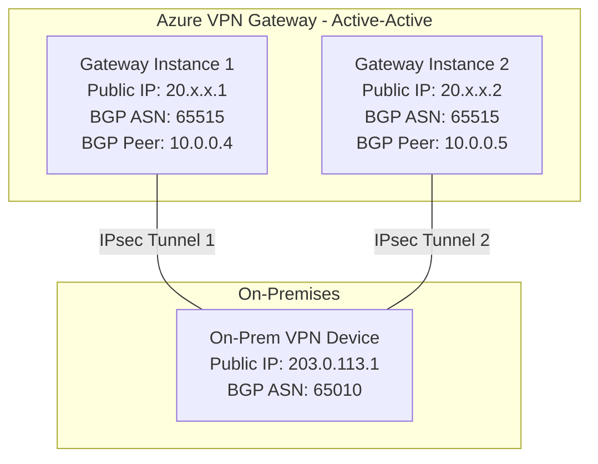

# How to Set Up Azure VPN Gateway with Active-Active Configuration for High Availability

Author: [nawazdhandala](https://www.github.com/nawazdhandala)

Tags: Azure, VPN Gateway, Active-Active, High Availability, Networking, Hybrid Cloud

Description: Configure Azure VPN Gateway in active-active mode with two public IPs and BGP to eliminate single points of failure in site-to-site VPN connectivity.

---

A standard Azure VPN Gateway runs in active-standby mode. One gateway instance handles traffic while the other sits idle, ready to take over if the active instance fails. The problem is that failover can take 30-90 seconds, and during that window, your VPN connection drops. For workloads that cannot tolerate this interruption, active-active mode eliminates the single point of failure by running both gateway instances simultaneously with their own public IPs and BGP sessions.

This guide walks through setting up an active-active VPN Gateway from scratch, including the BGP configuration and on-premises side of the setup.

## Active-Active vs Active-Standby

In active-standby mode, both gateway instances exist, but only one handles VPN tunnels. When the active instance needs maintenance or fails, Azure switches to the standby. This causes a brief interruption.

In active-active mode, both instances are active. Each has its own public IP address and maintains its own set of VPN tunnels to your on-premises devices. Traffic flows through both tunnels simultaneously, and if one instance goes down, traffic continues through the other without interruption.



## Prerequisites

- An Azure subscription with Owner or Contributor access
- A virtual network with a GatewaySubnet (/27 or larger recommended for active-active)
- An on-premises VPN device that supports BGP and multiple IPsec tunnels
- Azure CLI installed
- The on-premises VPN device's public IP address and BGP ASN

## Step 1: Create Two Public IP Addresses

Active-active mode requires two public IPs, one for each gateway instance:

```bash
# Create the first public IP for the gateway
az network public-ip create \
  --name vpn-gw-pip1 \
  --resource-group myResourceGroup \
  --location eastus \
  --allocation-method Static \
  --sku Standard

# Create the second public IP for the gateway
az network public-ip create \
  --name vpn-gw-pip2 \
  --resource-group myResourceGroup \
  --location eastus \
  --allocation-method Static \
  --sku Standard
```

Standard SKU public IPs are required for VPN gateways with zone redundancy. If you do not need zone redundancy, Basic SKU works too.

## Step 2: Create the GatewaySubnet

The GatewaySubnet must be large enough to accommodate both active instances. A /27 is the minimum, but /26 gives you room for future growth:

```bash
# Create the GatewaySubnet (must be named exactly "GatewaySubnet")
az network vnet subnet create \
  --name GatewaySubnet \
  --resource-group myResourceGroup \
  --vnet-name myVNet \
  --address-prefixes "10.0.255.0/26"
```

## Step 3: Create the Active-Active VPN Gateway

Deploy the gateway with active-active enabled and both public IPs:

```bash
# Create the VPN gateway in active-active mode
# This takes 30-45 minutes to provision
az network vnet-gateway create \
  --name myVpnGateway \
  --resource-group myResourceGroup \
  --location eastus \
  --vnet myVNet \
  --gateway-type Vpn \
  --vpn-type RouteBased \
  --sku VpnGw2 \
  --public-ip-addresses vpn-gw-pip1 vpn-gw-pip2 \
  --asn 65515 \
  --active-active true
```

Key parameters:

- **public-ip-addresses**: Both PIPs are specified, which is what makes the gateway active-active
- **asn 65515**: The BGP ASN for the Azure gateway. 65515 is the default, but you can use any private ASN
- **active-active true**: Explicitly enables active-active mode
- **sku VpnGw2**: Use VpnGw2 or higher for production. VpnGw1 supports active-active but has lower throughput

## Step 4: Retrieve the BGP Peering Addresses

After the gateway is provisioned, get the BGP peer addresses for both instances:

```bash
# Get the BGP settings for the gateway
az network vnet-gateway show \
  --name myVpnGateway \
  --resource-group myResourceGroup \
  --query "bgpSettings" -o json
```

The output shows two BGP peer IP addresses, one for each instance. These are private IPs from the GatewaySubnet (for example, 10.0.255.4 and 10.0.255.5). You will need these when configuring your on-premises VPN device.

```bash
# Get just the BGP peer addresses
az network vnet-gateway show \
  --name myVpnGateway \
  --resource-group myResourceGroup \
  --query "bgpSettings.bgpPeeringAddresses[].tunnelIpAddresses" -o json
```

## Step 5: Create the Local Network Gateway

The local network gateway represents your on-premises VPN device in Azure. For active-active, you can create one or two local gateways depending on your on-premises setup:

```bash
# Create the local network gateway with BGP enabled
az network local-gateway create \
  --name onPremGateway \
  --resource-group myResourceGroup \
  --location eastus \
  --gateway-ip-address 203.0.113.1 \
  --bgp-peering-address 192.168.1.1 \
  --asn 65010 \
  --local-address-prefixes "192.168.0.0/16"
```

If your on-premises side also has two VPN devices (for full redundancy), create a second local gateway:

```bash
# Create a second local network gateway for the second on-prem device
az network local-gateway create \
  --name onPremGateway2 \
  --resource-group myResourceGroup \
  --location eastus \
  --gateway-ip-address 203.0.113.2 \
  --bgp-peering-address 192.168.1.2 \
  --asn 65010 \
  --local-address-prefixes "192.168.0.0/16"
```

## Step 6: Create the VPN Connections

Create connections from the Azure gateway to the on-premises gateway. Each connection will automatically use both active gateway instances:

```bash
# Create the VPN connection with BGP enabled
az network vpn-connection create \
  --name azure-to-onprem \
  --resource-group myResourceGroup \
  --vnet-gateway1 myVpnGateway \
  --local-gateway2 onPremGateway \
  --shared-key "YourSuperSecureSharedKey123!" \
  --enable-bgp true \
  --location eastus
```

If you have a second on-premises device:

```bash
# Create a second connection to the second on-prem device
az network vpn-connection create \
  --name azure-to-onprem2 \
  --resource-group myResourceGroup \
  --vnet-gateway1 myVpnGateway \
  --local-gateway2 onPremGateway2 \
  --shared-key "YourSuperSecureSharedKey456!" \
  --enable-bgp true \
  --location eastus
```

## Step 7: Configure the On-Premises VPN Device

Your on-premises VPN device needs to establish two IPsec tunnels - one to each of the Azure gateway's public IPs. Here is a conceptual configuration:

**Tunnel 1**: On-prem device -> Azure Gateway Instance 1 (20.x.x.1)
- IKE Phase 1: Pre-shared key, IKEv2
- IKE Phase 2: IPsec tunnel
- BGP neighbor: Azure BGP peer IP 10.0.255.4, ASN 65515

**Tunnel 2**: On-prem device -> Azure Gateway Instance 2 (20.x.x.2)
- IKE Phase 1: Pre-shared key, IKEv2
- IKE Phase 2: IPsec tunnel
- BGP neighbor: Azure BGP peer IP 10.0.255.5, ASN 65515

The exact configuration syntax depends on your VPN device vendor. Azure provides configuration templates for common vendors (Cisco, Juniper, Fortinet, Palo Alto) in the portal under the connection's "Download configuration" option.

## Step 8: Verify the Active-Active Setup

Check the connection status and BGP session state:

```bash
# Check connection status
az network vpn-connection show \
  --name azure-to-onprem \
  --resource-group myResourceGroup \
  --query "{Name:name, Status:connectionStatus, EgressBytes:egressBytesTransferred, IngressBytes:ingressBytesTransferred}" \
  --output table

# Check BGP peer status
az network vnet-gateway list-bgp-peer-status \
  --name myVpnGateway \
  --resource-group myResourceGroup \
  --output table

# Check learned BGP routes
az network vnet-gateway list-learned-routes \
  --name myVpnGateway \
  --resource-group myResourceGroup \
  --output table
```

You should see two BGP peers (one per gateway instance) in the "Connected" state, and the routes advertised from your on-premises network should appear in the learned routes.

## Step 9: Test Failover

To verify that failover works, you can simulate an instance failure by disconnecting one tunnel on your on-premises device:

1. Shut down one of the two IPsec tunnels on your on-premises VPN device
2. Monitor traffic flow - it should continue through the remaining tunnel
3. Check the BGP peer status - one peer should show as disconnected
4. Bring the tunnel back up and verify both peers reconnect

During a real Azure maintenance event, one instance goes down while the other continues to handle traffic. The transition is seamless for established connections because the traffic was already flowing through both instances.

## Throughput and Cost Considerations

Active-active mode effectively doubles your aggregate throughput because both instances handle traffic simultaneously. However, there are cost implications:

- You pay for two public IP addresses instead of one
- The gateway SKU cost remains the same (you are not paying for two gateways)
- Data transfer costs are the same (you pay per GB transferred, not per tunnel)

The throughput per gateway instance depends on the SKU:

| SKU | Per-Instance Throughput | Active-Active Aggregate |
|-----|----------------------|------------------------|
| VpnGw1 | 650 Mbps | ~1.3 Gbps |
| VpnGw2 | 1 Gbps | ~2 Gbps |
| VpnGw3 | 1.25 Gbps | ~2.5 Gbps |

## Wrapping Up

Active-active VPN Gateway eliminates the single point of failure in your hybrid connectivity. Both instances run simultaneously, each with their own public IP and BGP session, so when one goes down, the other continues without interruption. The setup requires more configuration on the on-premises side (two tunnels instead of one) and BGP for dynamic route exchange, but the result is a VPN connection that survives Azure maintenance events and instance failures without dropping traffic.
