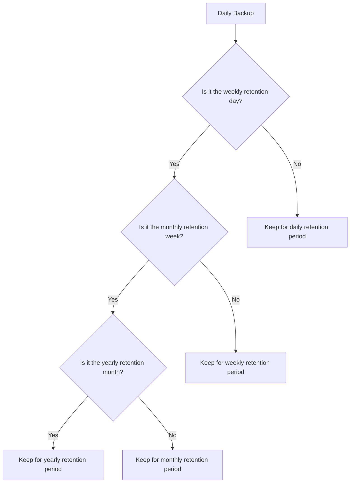

# How to Set Up Backup Policies with Long-Term Retention in Azure Backup

Author: [nawazdhandala](https://www.github.com/nawazdhandala)

Tags: Azure Backup, Long-Term Retention, Backup Policy, Compliance, Data Retention, Recovery Services Vault, Archival

Description: Learn how to configure Azure Backup policies with long-term retention for compliance requirements, including daily, weekly, monthly, and yearly retention tiers.

---

Many organizations need to keep backups for years, not just days or weeks. Regulatory requirements like HIPAA (6 years), SOX (7 years), PCI DSS (1 year minimum), and various industry-specific mandates dictate how long data must be retained. Azure Backup supports long-term retention (LTR) with configurable daily, weekly, monthly, and yearly retention settings that can extend to 99 years.

This guide covers how to design and implement backup policies with long-term retention, manage the associated costs, and leverage Azure's archive tier for significant savings.

## Understanding Retention Tiers

Azure Backup organizes retention into four tiers, each keeping a different subset of your backup recovery points:

**Daily retention** - Keeps the backup from each day. Typical range: 7-180 days.

**Weekly retention** - Keeps the backup from a specific day of the week (e.g., Sunday). Typical range: 1-52 weeks.

**Monthly retention** - Keeps the backup from a specific day or week of the month (e.g., first Sunday). Typical range: 1-60 months.

**Yearly retention** - Keeps the backup from a specific day of a specific month (e.g., first Sunday of January). Typical range: 1-99 years.

The tiers cascade. A single backup point can satisfy multiple retention requirements. For example, a backup taken on the first Sunday of January could count as a daily, weekly, monthly, and yearly recovery point simultaneously.



## Designing a Retention Strategy

Before configuring anything, map your business and regulatory requirements to retention tiers.

### Example: Healthcare Organization (HIPAA)

HIPAA requires retaining medical records for 6 years from the date of creation or last use. A backup policy for HIPAA-regulated systems might look like:

| Tier | Retention | Recovery Points Kept |
|------|-----------|---------------------|
| Daily | 90 days | ~90 |
| Weekly | 52 weeks | ~52 |
| Monthly | 72 months (6 years) | ~72 |
| Yearly | 7 years | ~7 |

### Example: Financial Services (SOX)

SOX requires 7 years of financial data retention:

| Tier | Retention | Recovery Points Kept |
|------|-----------|---------------------|
| Daily | 30 days | ~30 |
| Weekly | 12 weeks | ~12 |
| Monthly | 84 months (7 years) | ~84 |
| Yearly | 10 years | ~10 |

### Example: General Enterprise

No specific regulatory requirements, but good practice for business continuity:

| Tier | Retention | Recovery Points Kept |
|------|-----------|---------------------|
| Daily | 30 days | ~30 |
| Weekly | 12 weeks | ~12 |
| Monthly | 12 months | ~12 |
| Yearly | 3 years | ~3 |

## Step 1: Create a Long-Term Retention Policy for Azure VMs

Here is how to create a backup policy with comprehensive long-term retention:

### Using Azure CLI

```bash
# Create an Azure VM backup policy with long-term retention
# This policy is designed for compliance-regulated workloads

az backup policy create \
    --resource-group rg-backup-eastus2 \
    --vault-name rsv-backup-eastus2-001 \
    --name policy-ltr-compliance-7yr \
    --backup-management-type AzureIaasVM \
    --policy '{
        "schedulePolicy": {
            "schedulePolicyType": "SimpleSchedulePolicy",
            "scheduleRunFrequency": "Daily",
            "scheduleRunTimes": ["2026-02-16T01:00:00Z"]
        },
        "retentionPolicy": {
            "retentionPolicyType": "LongTermRetentionPolicy",
            "dailySchedule": {
                "retentionTimes": ["2026-02-16T01:00:00Z"],
                "retentionDuration": {
                    "count": 90,
                    "durationType": "Days"
                }
            },
            "weeklySchedule": {
                "daysOfTheWeek": ["Sunday"],
                "retentionTimes": ["2026-02-16T01:00:00Z"],
                "retentionDuration": {
                    "count": 52,
                    "durationType": "Weeks"
                }
            },
            "monthlySchedule": {
                "retentionScheduleFormatType": "Weekly",
                "retentionScheduleWeekly": {
                    "daysOfTheWeek": ["Sunday"],
                    "weeksOfTheMonth": ["First"]
                },
                "retentionTimes": ["2026-02-16T01:00:00Z"],
                "retentionDuration": {
                    "count": 84,
                    "durationType": "Months"
                }
            },
            "yearlySchedule": {
                "retentionScheduleFormatType": "Weekly",
                "retentionScheduleWeekly": {
                    "daysOfTheWeek": ["Sunday"],
                    "weeksOfTheMonth": ["First"]
                },
                "monthsOfYear": ["January"],
                "retentionTimes": ["2026-02-16T01:00:00Z"],
                "retentionDuration": {
                    "count": 10,
                    "durationType": "Years"
                }
            }
        },
        "instantRpRetentionRangeInDays": 2,
        "timeZone": "UTC"
    }'
```

### Using PowerShell

```powershell
# Create a long-term retention policy using PowerShell
# Configure each retention tier individually

$vault = Get-AzRecoveryServicesVault -Name "rsv-backup-eastus2-001" -ResourceGroupName "rg-backup-eastus2"

# Define daily retention: 90 days
$dailyRetention = New-AzRecoveryServicesBackupRetentionPolicyObject -RetentionType Daily
$dailyRetention.DailySchedule.DurationCountInDays = 90

# Define weekly retention: 52 weeks, keep Sunday backup
$weeklyRetention = New-AzRecoveryServicesBackupRetentionPolicyObject -RetentionType Weekly
$weeklyRetention.WeeklySchedule.DaysOfTheWeek = "Sunday"
$weeklyRetention.WeeklySchedule.DurationCountInWeeks = 52

# Define monthly retention: 84 months (7 years), first Sunday
$monthlyRetention = New-AzRecoveryServicesBackupRetentionPolicyObject -RetentionType Monthly
$monthlyRetention.MonthlySchedule.RetentionScheduleFormatType = "Weekly"
$monthlyRetention.MonthlySchedule.RetentionScheduleWeekly.DaysOfTheWeek = "Sunday"
$monthlyRetention.MonthlySchedule.RetentionScheduleWeekly.WeeksOfTheMonth = "First"
$monthlyRetention.MonthlySchedule.DurationCountInMonths = 84

# Define yearly retention: 10 years, first Sunday of January
$yearlyRetention = New-AzRecoveryServicesBackupRetentionPolicyObject -RetentionType Yearly
$yearlyRetention.YearlySchedule.RetentionScheduleFormatType = "Weekly"
$yearlyRetention.YearlySchedule.MonthsOfYear = "January"
$yearlyRetention.YearlySchedule.RetentionScheduleWeekly.DaysOfTheWeek = "Sunday"
$yearlyRetention.YearlySchedule.RetentionScheduleWeekly.WeeksOfTheMonth = "First"
$yearlyRetention.YearlySchedule.DurationCountInYears = 10

Write-Output "Long-term retention policy objects created"
```

## Step 2: Leverage the Archive Tier for Cost Savings

Azure Backup offers a vault-archive tier for long-term recovery points. Moving older recovery points to the archive tier can reduce storage costs by up to 50%.

The archive tier is suitable for:
- Recovery points older than 6 months
- Recovery points that are rarely accessed
- Monthly and yearly retention points

### Enabling Archive Tier

```bash
# Move recommended recovery points to the archive tier
# Azure Backup identifies which points are eligible for archiving

# List recovery points eligible for archive
az backup recoverypoint list \
    --resource-group rg-backup-eastus2 \
    --vault-name rsv-backup-eastus2-001 \
    --container-name "IaasVMContainer;V2;rg-production;vm-db-01" \
    --item-name "VM;iaasvmcontainerv2;rg-production;vm-db-01" \
    --is-ready-for-move true \
    --target-tier VaultArchive \
    --output table

# Move a specific recovery point to archive
az backup recoverypoint move \
    --resource-group rg-backup-eastus2 \
    --vault-name rsv-backup-eastus2-001 \
    --container-name "IaasVMContainer;V2;rg-production;vm-db-01" \
    --item-name "VM;iaasvmcontainerv2;rg-production;vm-db-01" \
    --rp-name "recovery-point-id" \
    --source-tier VaultStandard \
    --destination-tier VaultArchive
```

Keep in mind that restoring from the archive tier takes longer (up to 24 hours) and incurs rehydration costs. This is acceptable for long-term compliance backups that you rarely need to restore.

## Step 3: Configure Policy for SQL Server LTR

SQL Server databases have their own long-term retention configuration:

```bash
# Create a SQL Server backup policy with long-term retention
# Includes full, differential, and log backups with extended retention

az backup policy create \
    --resource-group rg-backup-eastus2 \
    --vault-name rsv-backup-eastus2-001 \
    --name policy-sql-ltr-7yr \
    --backup-management-type AzureWorkload \
    --workload-type SQLDataBase \
    --policy '{
        "settings": {
            "timeZone": "UTC",
            "issqlcompression": true
        },
        "subProtectionPolicy": [
            {
                "policyType": "Full",
                "schedulePolicy": {
                    "schedulePolicyType": "SimpleSchedulePolicy",
                    "scheduleRunFrequency": "Weekly",
                    "scheduleRunDays": ["Sunday"],
                    "scheduleRunTimes": ["2026-02-16T02:00:00Z"]
                },
                "retentionPolicy": {
                    "retentionPolicyType": "LongTermRetentionPolicy",
                    "weeklySchedule": {
                        "daysOfTheWeek": ["Sunday"],
                        "retentionTimes": ["2026-02-16T02:00:00Z"],
                        "retentionDuration": {
                            "count": 52,
                            "durationType": "Weeks"
                        }
                    },
                    "monthlySchedule": {
                        "retentionScheduleFormatType": "Weekly",
                        "retentionScheduleWeekly": {
                            "daysOfTheWeek": ["Sunday"],
                            "weeksOfTheMonth": ["First"]
                        },
                        "retentionTimes": ["2026-02-16T02:00:00Z"],
                        "retentionDuration": {
                            "count": 84,
                            "durationType": "Months"
                        }
                    },
                    "yearlySchedule": {
                        "retentionScheduleFormatType": "Weekly",
                        "retentionScheduleWeekly": {
                            "daysOfTheWeek": ["Sunday"],
                            "weeksOfTheMonth": ["First"]
                        },
                        "monthsOfYear": ["January"],
                        "retentionTimes": ["2026-02-16T02:00:00Z"],
                        "retentionDuration": {
                            "count": 10,
                            "durationType": "Years"
                        }
                    }
                }
            },
            {
                "policyType": "Differential",
                "schedulePolicy": {
                    "schedulePolicyType": "SimpleSchedulePolicy",
                    "scheduleRunFrequency": "Weekly",
                    "scheduleRunDays": ["Monday","Tuesday","Wednesday","Thursday","Friday","Saturday"],
                    "scheduleRunTimes": ["2026-02-16T14:00:00Z"]
                },
                "retentionPolicy": {
                    "retentionPolicyType": "SimpleRetentionPolicy",
                    "retentionDuration": {
                        "count": 30,
                        "durationType": "Days"
                    }
                }
            },
            {
                "policyType": "Log",
                "schedulePolicy": {
                    "schedulePolicyType": "LogSchedulePolicy",
                    "scheduleFrequencyInMins": 15
                },
                "retentionPolicy": {
                    "retentionPolicyType": "SimpleRetentionPolicy",
                    "retentionDuration": {
                        "count": 15,
                        "durationType": "Days"
                    }
                }
            }
        ]
    }'
```

## Cost Management for Long-Term Retention

Long-term retention can accumulate significant storage costs. Here are strategies to manage them:

**Use the archive tier aggressively.** Move monthly and yearly recovery points to the archive tier as soon as they are eligible (typically after 3-6 months in the standard tier).

**Right-size your retention.** If your compliance requirement is 7 years, do not set it to 10 "just in case." Every year of additional retention adds cost.

**Use incremental backups.** Azure Backup uses incremental snapshots by default, so each additional recovery point only stores changed data. This keeps LTR storage growth manageable.

**Monitor storage consumption.** Use Azure Cost Management to track backup storage costs by vault, policy, and protected item. Set up budgets and alerts.

```bash
# Check backup storage consumption for a vault
az backup vault show \
    --resource-group rg-backup-eastus2 \
    --name rsv-backup-eastus2-001 \
    --query "properties.storageModelType"
```

**Consider separate vaults for LTR.** If you have different compliance requirements for different workloads, use separate vaults with different storage redundancy settings. LTR-only vaults can use LRS instead of GRS to reduce costs if cross-region protection is not required for archived data.

## Auditing and Compliance Reporting

For compliance purposes, you need to prove that backups were taken and retained correctly.

Use Azure Backup Reports (powered by Azure Monitor Logs) to generate retention compliance reports:

1. Configure diagnostic settings on the vault to send data to a Log Analytics workspace
2. Use the built-in Azure Backup Reports workbook
3. Generate reports showing backup job history, retention compliance, and protected items

This gives auditors evidence that your backup policy is being enforced and data is being retained for the required duration.

## Wrapping Up

Long-term retention in Azure Backup is not complicated to set up, but it requires thoughtful planning. Map your compliance requirements to specific retention tiers, leverage the archive tier for cost optimization, and monitor storage costs over time. The incremental nature of Azure Backup keeps LTR costs reasonable, and the archive tier can cut those costs further. Build the reporting and auditing capabilities from the start so you can demonstrate compliance when auditors come knocking.
