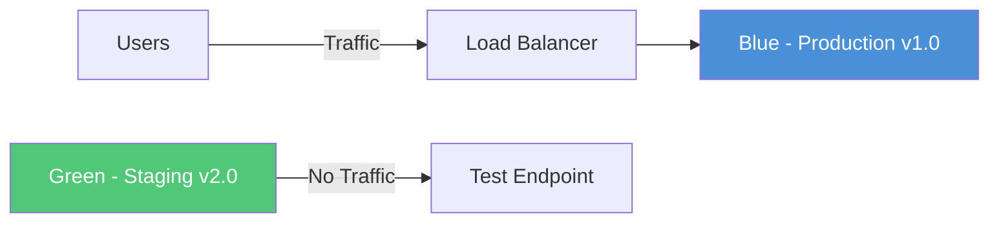
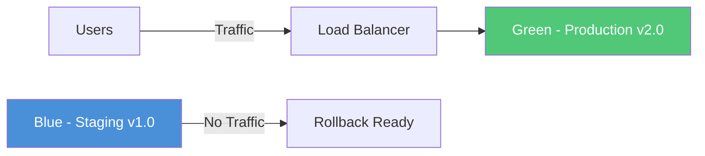

# How to Set Up Blue-Green Deployments with Staging Slots in Azure Spring Apps

Author: [nawazdhandala](https://www.github.com/nawazdhandala)

Tags: Azure Spring Apps, Blue-Green Deployment, Staging Slots, Spring Boot, DevOps, Zero Downtime, Deployment Strategy

Description: A complete guide to implementing blue-green deployments in Azure Spring Apps using staging slots for safe, rollback-ready production releases.

---

Blue-green deployment is a release strategy that reduces downtime and risk by running two identical production environments, called "blue" and "green." At any time, only one environment serves live traffic while the other sits idle or runs the next version. When the new version is validated, you switch traffic from the current environment to the new one. Azure Spring Apps supports this pattern natively through its staging deployment feature. Let me walk through how to set this up properly.

## How Blue-Green Works in Azure Spring Apps

Azure Spring Apps lets each application have two deployments: one marked as "production" (receiving live traffic) and another marked as "staging" (not receiving traffic, used for validation). When you are ready to release, you swap the designations. The swap updates the routing layer instantly, so users never see an interruption.

Here is a visual representation of the flow:



After the swap:



## Prerequisites

- Azure Spring Apps Standard or Enterprise tier (Basic tier only supports one deployment per app)
- Azure CLI with the spring extension
- A Spring Boot application to deploy
- Familiarity with basic Azure CLI commands

## Step 1: Create the Application with the Initial (Blue) Deployment

When you create an app in Azure Spring Apps, it automatically gets a "default" deployment that serves as production:

```bash
# Create the Spring Apps instance and application
RESOURCE_GROUP="rg-spring-production"
SERVICE_NAME="myorg-spring-apps"
APP_NAME="payment-service"

# Create the application
az spring app create \
    --name $APP_NAME \
    --service $SERVICE_NAME \
    --resource-group $RESOURCE_GROUP \
    --runtime-version Java_17 \
    --assign-endpoint true \
    --cpu 1 \
    --memory 2Gi \
    --instance-count 2

# Deploy version 1.0 (this is the "blue" deployment)
az spring app deploy \
    --name $APP_NAME \
    --service $SERVICE_NAME \
    --resource-group $RESOURCE_GROUP \
    --artifact-path target/payment-service-1.0.0.jar \
    --env "SPRING_PROFILES_ACTIVE=production" \
    --jvm-options "-Xmx1g -Xms512m"
```

At this point, version 1.0 is live and serving traffic. This is your blue environment.

## Step 2: Deploy the New Version to the Green (Staging) Slot

When version 2.0 is ready, deploy it to a staging deployment:

```bash
# Create the green deployment with the new version
# The --instance-count should match production for accurate testing
az spring app deployment create \
    --name green \
    --app $APP_NAME \
    --service $SERVICE_NAME \
    --resource-group $RESOURCE_GROUP \
    --artifact-path target/payment-service-2.0.0.jar \
    --env "SPRING_PROFILES_ACTIVE=production" \
    --jvm-options "-Xmx1g -Xms512m" \
    --instance-count 2
```

Something important here: match the instance count and resource allocation of the staging deployment to production. If production runs 2 instances with 2 GB of memory and staging only has 1 instance with 1 GB, your testing will not accurately reflect production behavior. I have seen teams get burned by this - the staging deployment passes all tests but the production swap fails under load because the configuration was different.

## Step 3: Validate the Green Deployment

Azure Spring Apps provides a test endpoint for staging deployments. Use it to run your validation suite:

```bash
# Check that the green deployment is running and healthy
az spring app deployment show \
    --name green \
    --app $APP_NAME \
    --service $SERVICE_NAME \
    --resource-group $RESOURCE_GROUP \
    --query "properties.status" -o tsv

# Get the test endpoint for the service
TEST_ENDPOINT=$(az spring test-endpoint list \
    --service $SERVICE_NAME \
    --resource-group $RESOURCE_GROUP \
    --query "primaryTestEndpoint" -o tsv)

# Run a health check against the staging deployment
curl -s "${TEST_ENDPOINT}/${APP_NAME}/green/actuator/health" | jq .
```

Beyond a simple health check, you should run a meaningful validation suite. Here is a script that performs a series of checks:

```bash
#!/bin/bash
# validate-staging.sh
# Runs a set of validation checks against the staging deployment

STAGING_BASE="${TEST_ENDPOINT}/${APP_NAME}/green"

echo "Running validation checks against staging deployment..."

# Check 1: Health endpoint returns UP
HEALTH=$(curl -s "${STAGING_BASE}/actuator/health" | jq -r '.status')
if [ "$HEALTH" != "UP" ]; then
    echo "FAIL: Health check returned $HEALTH"
    exit 1
fi
echo "PASS: Health check"

# Check 2: API version endpoint returns expected version
VERSION=$(curl -s "${STAGING_BASE}/api/version" | jq -r '.version')
if [ "$VERSION" != "2.0.0" ]; then
    echo "FAIL: Version mismatch. Expected 2.0.0, got $VERSION"
    exit 1
fi
echo "PASS: Version check"

# Check 3: Critical API endpoint responds within acceptable latency
START=$(date +%s%N)
HTTP_CODE=$(curl -s -o /dev/null -w "%{http_code}" "${STAGING_BASE}/api/payments/health")
END=$(date +%s%N)
LATENCY=$(( (END - START) / 1000000 ))

if [ "$HTTP_CODE" != "200" ]; then
    echo "FAIL: Payment API returned HTTP $HTTP_CODE"
    exit 1
fi

if [ "$LATENCY" -gt 2000 ]; then
    echo "FAIL: Payment API latency ${LATENCY}ms exceeds 2000ms threshold"
    exit 1
fi
echo "PASS: Payment API check (${LATENCY}ms)"

echo "All validation checks passed."
```

## Step 4: Swap Traffic to Green

Once validation passes, perform the swap:

```bash
# Swap the green deployment to production
# This is the actual blue-green cutover
az spring app set-deployment \
    --name $APP_NAME \
    --service $SERVICE_NAME \
    --resource-group $RESOURCE_GROUP \
    --deployment green
```

The swap takes just a few seconds. Traffic begins flowing to the green deployment immediately. The old blue deployment (named "default" in this case) is still running and available for rollback.

## Step 5: Monitor Post-Swap

After the swap, watch your metrics closely for the first 15 to 30 minutes:

```bash
# Verify which deployment is now active (production)
az spring app show \
    --name $APP_NAME \
    --service $SERVICE_NAME \
    --resource-group $RESOURCE_GROUP \
    --query "properties.activeDeploymentName" -o tsv

# Check instance health of the new production deployment
az spring app deployment show \
    --name green \
    --app $APP_NAME \
    --service $SERVICE_NAME \
    --resource-group $RESOURCE_GROUP \
    --query "properties.instances[].{Name:name, Status:status}" -o table
```

Pay attention to error rates, latency percentiles (p50, p95, p99), and throughput. If anything looks off, roll back immediately.

## Step 6: Rollback If Necessary

Rolling back is simply pointing production traffic back to the old deployment:

```bash
# Rollback to the blue deployment
az spring app set-deployment \
    --name $APP_NAME \
    --service $SERVICE_NAME \
    --resource-group $RESOURCE_GROUP \
    --deployment default
```

The rollback is instant because the old deployment is still running. No redeployment, no rebuilding. This is the core value of blue-green deployments.

## Cleaning Up Old Deployments

After you are confident the new version is stable (I typically wait 24 to 48 hours), clean up the old staging deployment to free resources:

```bash
# Delete the old blue deployment once you are done with it
az spring app deployment delete \
    --name default \
    --app $APP_NAME \
    --service $SERVICE_NAME \
    --resource-group $RESOURCE_GROUP
```

Note that Azure Spring Apps only allows two deployments per application. You must delete the old staging deployment before you can create a new one for the next release.

## Integrating with CI/CD

The manual process above works for understanding the mechanics, but in practice you want this automated. Here is a GitHub Actions workflow:

```yaml
# .github/workflows/blue-green-deploy.yml
name: Blue-Green Deploy
on:
  push:
    branches: [main]

jobs:
  deploy:
    runs-on: ubuntu-latest
    steps:
      - uses: actions/checkout@v4

      - name: Set up Java
        uses: actions/setup-java@v4
        with:
          java-version: '17'
          distribution: 'temurin'

      - name: Build
        run: mvn clean package -DskipTests

      - name: Azure Login
        uses: azure/login@v2
        with:
          creds: ${{ secrets.AZURE_CREDENTIALS }}

      - name: Deploy to Staging
        run: |
          # Delete existing staging if present
          az spring app deployment delete \
            --name green \
            --app payment-service \
            --service myorg-spring-apps \
            --resource-group rg-spring-production \
            --yes || true

          # Create new staging deployment
          az spring app deployment create \
            --name green \
            --app payment-service \
            --service myorg-spring-apps \
            --resource-group rg-spring-production \
            --artifact-path target/payment-service.jar \
            --instance-count 2

      - name: Validate Staging
        run: ./scripts/validate-staging.sh

      - name: Swap to Production
        run: |
          az spring app set-deployment \
            --name payment-service \
            --service myorg-spring-apps \
            --resource-group rg-spring-production \
            --deployment green
```

## Best Practices

From my experience running blue-green deployments in Azure Spring Apps, here are the key things to get right:

**Match configurations exactly.** The staging deployment should mirror production in every way - same instance count, same memory, same environment variables. The only difference should be the application code.

**Test with realistic data.** If possible, point the staging deployment at the same databases and services as production. Use feature flags if you need to prevent side effects.

**Keep the rollback window open.** Do not delete the old deployment immediately after a swap. Give yourself at least 24 hours to catch issues that only manifest under sustained production load.

**Automate the validation.** Manual smoke tests are fine for the first few deployments, but you should invest in an automated validation suite as soon as possible. This lets you do blue-green deployments with confidence, even at high frequency.

## Summary

Blue-green deployments in Azure Spring Apps give you safe, fast, and reversible production releases. The built-in staging deployment feature handles the infrastructure complexity, and the swap operation is nearly instantaneous. Combined with automated validation and proper monitoring, this pattern lets you ship with confidence knowing that a quick rollback is always one command away.
