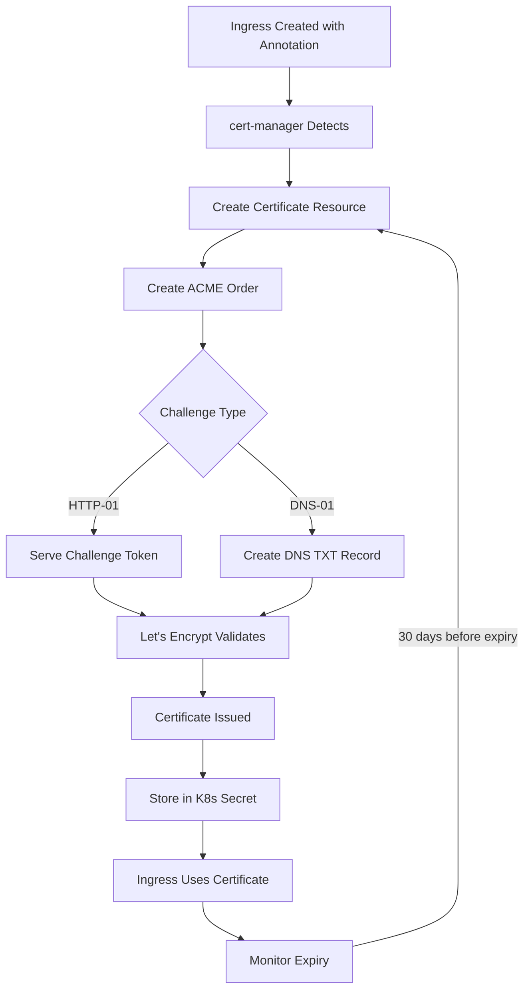

# How to Set Up cert-manager on AKS for Automatic Let's Encrypt TLS Certificate Management

Author: [nawazdhandala](https://www.github.com/nawazdhandala)

Tags: AKS, cert-manager, TLS, Let's Encrypt, Kubernetes, HTTPS, Ingress

Description: Step-by-step guide to installing cert-manager on AKS and automating TLS certificate issuance and renewal with Let's Encrypt.

---

Manually managing TLS certificates for your Kubernetes services is tedious and error-prone. Certificates expire, renewals get missed, and suddenly your users see scary browser warnings. cert-manager automates the entire lifecycle - requesting certificates from Let's Encrypt, validating domain ownership, installing the certificate, and renewing it before it expires. In this guide, I will walk through setting up cert-manager on AKS from scratch, configuring Let's Encrypt issuers, and securing your ingress resources with automatic TLS.

## What cert-manager Does

cert-manager is a Kubernetes add-on that manages TLS certificates as native Kubernetes resources. You define a Certificate resource or annotate an Ingress, and cert-manager handles everything else. It supports multiple certificate authorities, but Let's Encrypt is the most popular choice since it is free and automated.

cert-manager supports two types of domain validation with Let's Encrypt:

- **HTTP-01** - Proves you control a domain by serving a specific file on your web server. Works for publicly accessible services.
- **DNS-01** - Proves you control a domain by creating a DNS TXT record. Works for services that are not publicly accessible and supports wildcard certificates.

## Prerequisites

You need an AKS cluster with an ingress controller (NGINX Ingress is what I will use), a domain name that you control, DNS configured to point to your ingress controller's external IP, and Helm 3 installed.

## Step 1: Install cert-manager

Install cert-manager using Helm. This deploys the cert-manager controller, webhook, and CA injector.

```bash
# Add the Jetstack Helm repository (cert-manager maintainers)
helm repo add jetstack https://charts.jetstack.io
helm repo update

# Install cert-manager with CRDs included
helm install cert-manager jetstack/cert-manager \
  --namespace cert-manager \
  --create-namespace \
  --set crds.enabled=true \
  --set crds.keep=true
```

Verify the installation.

```bash
# Check that all cert-manager pods are running
kubectl get pods -n cert-manager

# Verify the webhook is working
kubectl get apiservice v1.cert-manager.io -o yaml
```

You should see three pods: cert-manager, cert-manager-cainjector, and cert-manager-webhook.

## Step 2: Create a Let's Encrypt Staging Issuer

Always start with the Let's Encrypt staging environment. It has much higher rate limits and is meant for testing. The certificates it issues are not trusted by browsers, but they prove your setup works.

```yaml
# staging-issuer.yaml
# Let's Encrypt staging issuer for testing the certificate flow
apiVersion: cert-manager.io/v1
kind: ClusterIssuer
metadata:
  name: letsencrypt-staging
spec:
  acme:
    # Staging environment URL
    server: https://acme-staging-v02.api.letsencrypt.org/directory
    # Email for certificate expiry notifications
    email: your-email@example.com
    # Secret to store the ACME account private key
    privateKeySecretRef:
      name: letsencrypt-staging-key
    solvers:
      # Use HTTP-01 challenge with the NGINX ingress class
      - http01:
          ingress:
            class: nginx
```

Apply it.

```bash
# Create the staging ClusterIssuer
kubectl apply -f staging-issuer.yaml

# Check the issuer status
kubectl get clusterissuer letsencrypt-staging -o wide
```

The status should show `Ready: True` after a few seconds. If it does not, check the cert-manager logs for errors.

## Step 3: Create a Let's Encrypt Production Issuer

Once you have confirmed everything works with staging, create the production issuer.

```yaml
# production-issuer.yaml
# Let's Encrypt production issuer for real, trusted certificates
apiVersion: cert-manager.io/v1
kind: ClusterIssuer
metadata:
  name: letsencrypt-prod
spec:
  acme:
    # Production environment URL
    server: https://acme-v02.api.letsencrypt.org/directory
    email: your-email@example.com
    privateKeySecretRef:
      name: letsencrypt-prod-key
    solvers:
      - http01:
          ingress:
            class: nginx
```

```bash
# Create the production ClusterIssuer
kubectl apply -f production-issuer.yaml
```

## Step 4: Secure an Ingress with TLS

Now configure an ingress resource to use cert-manager for automatic TLS. The key is the `cert-manager.io/cluster-issuer` annotation.

```yaml
# app-ingress.yaml
# Ingress with automatic TLS from Let's Encrypt
apiVersion: networking.k8s.io/v1
kind: Ingress
metadata:
  name: my-app-ingress
  namespace: default
  annotations:
    # Tell cert-manager which issuer to use
    cert-manager.io/cluster-issuer: "letsencrypt-prod"
    # Force HTTPS redirect
    nginx.ingress.kubernetes.io/ssl-redirect: "true"
spec:
  ingressClassName: nginx
  tls:
    # cert-manager will create and manage this secret
    - secretName: my-app-tls
      hosts:
        - myapp.example.com
  rules:
    - host: myapp.example.com
      http:
        paths:
          - path: /
            pathType: Prefix
            backend:
              service:
                name: my-app-service
                port:
                  number: 80
```

When you apply this ingress, cert-manager automatically:

1. Detects the annotation and creates a Certificate resource
2. Creates an Order with Let's Encrypt
3. Creates a temporary ingress rule to serve the HTTP-01 challenge
4. Waits for Let's Encrypt to validate the challenge
5. Stores the certificate in the `my-app-tls` secret
6. NGINX Ingress picks up the secret and starts serving HTTPS

```bash
# Apply the ingress
kubectl apply -f app-ingress.yaml

# Watch the certificate being issued
kubectl get certificate my-app-tls -w

# Check the certificate details
kubectl describe certificate my-app-tls
```

## Step 5: DNS-01 Challenge with Azure DNS

If your service is not publicly accessible or you need wildcard certificates, use DNS-01 validation with Azure DNS.

First, create a managed identity for cert-manager to manage DNS records.

```bash
# Create a managed identity for DNS management
az identity create \
  --name cert-manager-dns-identity \
  --resource-group myResourceGroup

# Get the identity client ID
DNS_IDENTITY_CLIENT_ID=$(az identity show \
  --name cert-manager-dns-identity \
  --resource-group myResourceGroup \
  --query clientId -o tsv)

# Get the DNS zone resource ID
DNS_ZONE_ID=$(az network dns zone show \
  --name example.com \
  --resource-group dns-rg \
  --query id -o tsv)

# Assign DNS Zone Contributor role
az role assignment create \
  --assignee $DNS_IDENTITY_CLIENT_ID \
  --role "DNS Zone Contributor" \
  --scope $DNS_ZONE_ID
```

Now create a ClusterIssuer that uses DNS-01 with Azure DNS.

```yaml
# dns-issuer.yaml
# ClusterIssuer using DNS-01 challenge with Azure DNS
apiVersion: cert-manager.io/v1
kind: ClusterIssuer
metadata:
  name: letsencrypt-dns
spec:
  acme:
    server: https://acme-v02.api.letsencrypt.org/directory
    email: your-email@example.com
    privateKeySecretRef:
      name: letsencrypt-dns-key
    solvers:
      - dns01:
          azureDNS:
            # Azure subscription ID
            subscriptionID: <your-subscription-id>
            # Resource group containing the DNS zone
            resourceGroupName: dns-rg
            # The DNS zone name
            hostedZoneName: example.com
            # Use managed identity for authentication
            managedIdentity:
              clientID: <DNS_IDENTITY_CLIENT_ID>
```

With DNS-01, you can issue wildcard certificates.

```yaml
# wildcard-ingress.yaml
# Ingress with wildcard TLS certificate
apiVersion: networking.k8s.io/v1
kind: Ingress
metadata:
  name: wildcard-ingress
  annotations:
    cert-manager.io/cluster-issuer: "letsencrypt-dns"
spec:
  ingressClassName: nginx
  tls:
    - secretName: wildcard-tls
      hosts:
        - "*.example.com"
  rules:
    - host: "*.example.com"
      http:
        paths:
          - path: /
            pathType: Prefix
            backend:
              service:
                name: my-app-service
                port:
                  number: 80
```

## Certificate Lifecycle

Here is how cert-manager manages the full certificate lifecycle.



## Step 6: Monitor Certificate Status

Keep an eye on your certificates to catch any issues before they cause outages.

```bash
# List all certificates and their status
kubectl get certificates --all-namespaces

# Check certificate details including expiry
kubectl describe certificate my-app-tls

# View cert-manager logs for troubleshooting
kubectl logs -n cert-manager deploy/cert-manager --tail=50

# Check certificate orders and challenges
kubectl get orders --all-namespaces
kubectl get challenges --all-namespaces
```

## Troubleshooting Common Issues

**Certificate stuck in "Issuing" state.** Check the challenges: `kubectl get challenges -A`. If the challenge is failing, it is usually because the HTTP-01 token is not accessible (firewall, DNS not pointing to the ingress IP, or wrong ingress class).

**DNS-01 challenge not creating records.** Verify the managed identity has DNS Zone Contributor permissions and the subscription ID, resource group, and zone name are correct in the issuer.

**Rate limiting on production.** Let's Encrypt limits you to 50 certificates per registered domain per week. If you hit this during testing, that is why you should always test with staging first.

**Secret not being updated.** If you change a certificate (add a new SAN, for example), delete the existing secret and cert-manager will recreate it: `kubectl delete secret my-app-tls`.

## Production Recommendations

**Use ClusterIssuers over namespace Issuers** when you want a single issuer configuration shared across all namespaces. Use namespace-scoped Issuers when teams need their own ACME accounts or different email addresses.

**Set up alerting for certificate expiry.** Even though cert-manager handles renewal automatically, you want to know if renewal fails. Monitor the `certmanager_certificate_expiration_timestamp_seconds` Prometheus metric.

**Keep cert-manager updated.** Certificate management is security-critical. Stay on supported versions and apply updates promptly.

**Back up your ACME account keys.** The private keys stored in `letsencrypt-prod-key` and similar secrets are your ACME account credentials. If you lose them, you will need to register a new account.

cert-manager on AKS turns TLS certificate management from an operational burden into a set-and-forget feature. Once configured, your certificates are automatically issued, installed, and renewed without any manual intervention.
