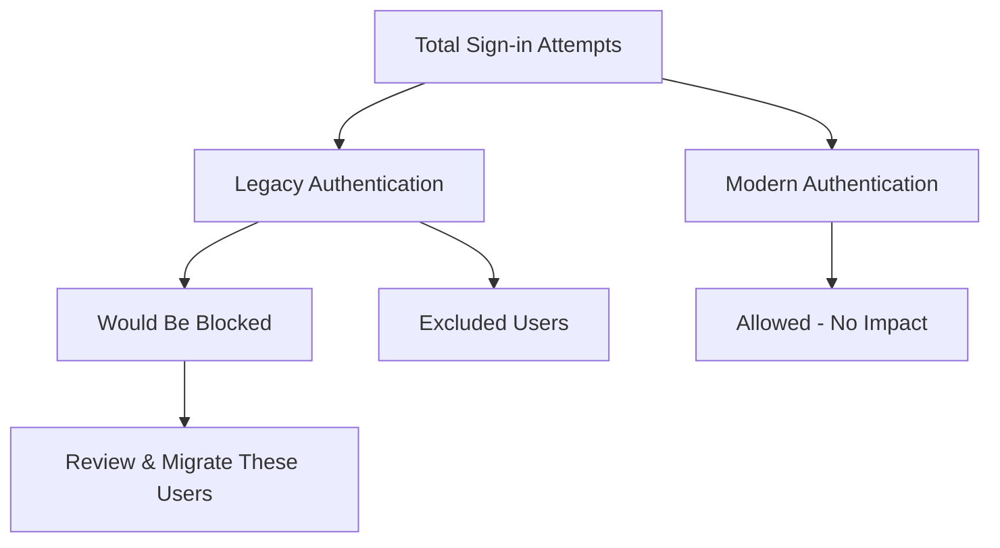

# How to Set Up Conditional Access Policies in Microsoft Entra ID to Block Legacy Authentication

Author: [nawazdhandala](https://www.github.com/nawazdhandala)

Tags: Azure, Microsoft Entra ID, Conditional Access, Legacy Authentication, Security, Identity Management, Zero Trust

Description: Learn how to create Conditional Access policies in Microsoft Entra ID that block legacy authentication protocols and strengthen your organization's security posture.

---

Legacy authentication protocols like POP3, IMAP, SMTP, and older Office clients are a major security risk for any organization. These protocols do not support modern multi-factor authentication (MFA), which means attackers can bypass your carefully configured MFA policies simply by using an older authentication method. Blocking legacy authentication through Conditional Access is one of the most impactful steps you can take to secure your Microsoft Entra ID (formerly Azure AD) tenant.

In this guide, I will walk you through the entire process of identifying legacy authentication usage in your tenant and creating Conditional Access policies to block it.

## Why Legacy Authentication Is Dangerous

Legacy authentication clients send credentials in a way that is fundamentally less secure than modern authentication. Here is what makes them problematic:

- They do not support MFA, making them ideal targets for credential stuffing and brute force attacks.
- They often transmit credentials in plaintext or use weak encryption.
- Attackers actively exploit these protocols because they know many organizations still have them enabled.
- Microsoft's own data shows that more than 99 percent of password spray attacks target legacy authentication endpoints.

Even if you have MFA enabled for all your users, an attacker can still authenticate using a legacy protocol and completely bypass that protection.

## Prerequisites

Before you start configuring policies, make sure you have:

- A Microsoft Entra ID P1 or P2 license (required for Conditional Access)
- Global Administrator or Security Administrator role
- At least one emergency access account excluded from Conditional Access policies
- Access to the Microsoft Entra admin center

## Step 1: Identify Legacy Authentication Usage

Before blocking anything, you want to understand who is still using legacy authentication. This prevents you from accidentally locking out users or breaking workflows.

Navigate to the Microsoft Entra admin center and open the Sign-in logs. You can filter these logs to show only legacy authentication attempts.

Here is a KQL query you can run in Log Analytics if you have sign-in logs forwarded there:

```kusto
// Find all sign-in attempts using legacy authentication protocols
// over the past 30 days, grouped by user and client app
SigninLogs
| where TimeGenerated > ago(30d)
| where ClientAppUsed in ("Exchange ActiveSync", "IMAP4", "MAPI Over HTTP",
    "Offline Address Book", "Other clients", "Outlook Anywhere (RPC over HTTP)",
    "POP3", "Reporting Web Services", "SMTP",
    "Authenticated SMTP", "Exchange Web Services")
| summarize Count = count() by UserPrincipalName, ClientAppUsed, AppDisplayName
| sort by Count desc
```

This query will give you a clear picture of which users and applications are still relying on legacy protocols. Reach out to those users before you flip the switch.

## Step 2: Create a Report-Only Policy First

I strongly recommend starting with a report-only policy. This lets you see exactly what would be blocked without actually enforcing anything.

1. Go to the Microsoft Entra admin center at entra.microsoft.com.
2. Navigate to Protection, then Conditional Access, then Policies.
3. Click New policy.
4. Give your policy a descriptive name like "Block Legacy Authentication - Report Only".

For the assignments:

- Under Users, select All users.
- Under Exclude, add your emergency access accounts. This is critical. If something goes wrong, you need a way to get back in.

For conditions:

- Click on Conditions, then Client apps.
- Set Configure to Yes.
- Check Exchange ActiveSync clients and Other clients. Leave Browser and Mobile apps and desktop clients unchecked.

For access controls:

- Under Grant, select Block access.

Set the policy state to Report-only and click Create.

## Step 3: Monitor the Report-Only Policy

Let the report-only policy run for at least one to two weeks. During this time, review the Conditional Access insights workbook:

1. Navigate to Protection, then Conditional Access, then Insights and reporting.
2. Select your report-only policy from the dropdown.
3. Review the impact analysis to see which users and sign-in attempts would be blocked.

The workbook shows you a breakdown like this:



If you find users who still need legacy authentication temporarily, you can create an exclusion group for them while you work on migrating their applications.

## Step 4: Migrate Users Off Legacy Protocols

For users still on legacy clients, here are the typical migration paths:

- Exchange ActiveSync users should move to the Outlook mobile app or Outlook desktop client with modern authentication.
- IMAP and POP3 users should switch to a modern email client or use OAuth 2.0 where supported.
- Third-party applications using SMTP AUTH may need to be reconfigured to use Microsoft Graph API or OAuth-based SMTP.
- PowerShell scripts using basic authentication should be updated to use the Microsoft Graph PowerShell SDK.

Here is an example of updating a PowerShell script from basic authentication to modern authentication:

```powershell
# Old approach using basic authentication (insecure)
# $credential = Get-Credential
# Connect-ExchangeOnline -Credential $credential

# Modern approach using interactive modern authentication
# This supports MFA and does not use legacy protocols
Connect-ExchangeOnline -UserPrincipalName admin@contoso.com -ShowBanner:$false

# For unattended scripts, use certificate-based authentication
# First, register an app in Microsoft Entra ID with the appropriate permissions
Connect-ExchangeOnline `
    -CertificateThumbprint "YOUR_CERT_THUMBPRINT" `
    -AppId "YOUR_APP_ID" `
    -Organization "contoso.onmicrosoft.com" `
    -ShowBanner:$false
```

## Step 5: Enable the Policy in Enforce Mode

Once you are confident that no critical workflows will break, switch the policy from report-only to on:

1. Go to Protection, then Conditional Access, then Policies.
2. Open your "Block Legacy Authentication - Report Only" policy.
3. Change the policy state from Report-only to On.
4. Click Save.

Alternatively, you can create a new policy that enforces the block from scratch. Here is how to do it using PowerShell with the Microsoft Graph module:

```powershell
# Connect to Microsoft Graph with the required permissions
Connect-MgGraph -Scopes "Policy.ReadWrite.ConditionalAccess"

# Define the Conditional Access policy to block legacy authentication
$params = @{
    DisplayName = "Block Legacy Authentication"
    State = "enabled"
    Conditions = @{
        # Apply to all users
        Users = @{
            IncludeUsers = @("All")
            # Exclude emergency access accounts
            ExcludeUsers = @("EMERGENCY_ACCOUNT_OBJECT_ID")
        }
        # Target legacy authentication client apps
        ClientAppTypes = @(
            "exchangeActiveSync"
            "other"
        )
        Applications = @{
            IncludeApplications = @("All")
        }
    }
    # Block access for legacy authentication attempts
    GrantControls = @{
        Operator = "OR"
        BuiltInControls = @("block")
    }
}

# Create the policy
New-MgIdentityConditionalAccessPolicy -BodyParameter $params
```

## Step 6: Verify the Policy Is Working

After enabling the policy, verify that it is actively blocking legacy authentication:

1. Check the sign-in logs for any attempts using legacy protocols. They should now show a failure with the reason "Blocked by Conditional Access."
2. Try authenticating with a legacy client yourself to confirm the block is in place.
3. Monitor for any help desk tickets from users who may have been missed during the discovery phase.

## Additional Best Practices

There are several related steps you should take alongside blocking legacy authentication:

First, enable Security Defaults if you do not have Conditional Access licenses for all users. Security Defaults automatically block legacy authentication for the entire tenant.

Second, disable legacy authentication at the protocol level in Exchange Online. Go to the Exchange admin center and disable POP3, IMAP, and basic authentication for SMTP at the organizational level.

Third, use Microsoft Entra ID sign-in risk policies to detect and respond to suspicious sign-in behavior that may indicate compromised accounts.

Fourth, create a Conditional Access policy that requires MFA for all users as a complement to blocking legacy authentication. Together, these two policies dramatically reduce your attack surface.

## Troubleshooting Common Issues

If users report they cannot sign in after you enable the policy, check these common scenarios:

- Older Outlook versions (2010 and earlier) do not support modern authentication. Users need to upgrade to at least Outlook 2013 with a registry key enabled, or preferably Outlook 2016 or later.
- Some multifunction printers and scanners use SMTP basic authentication to send email. These devices may need to be reconfigured to use SMTP AUTH with OAuth or use an SMTP relay.
- Older mobile email clients on iOS or Android may not support modern authentication. Users should switch to the Outlook mobile app.

## Conclusion

Blocking legacy authentication is one of the highest-impact security improvements you can make in your Microsoft Entra ID environment. The process is straightforward: discover who is using legacy protocols, plan their migration to modern authentication, deploy a report-only policy, validate the impact, and then enforce the block. Combined with MFA enforcement, this virtually eliminates the risk of password spray and brute force attacks against your tenant. Take the time to do this properly, and you will have removed one of the most commonly exploited attack vectors in cloud identity.
