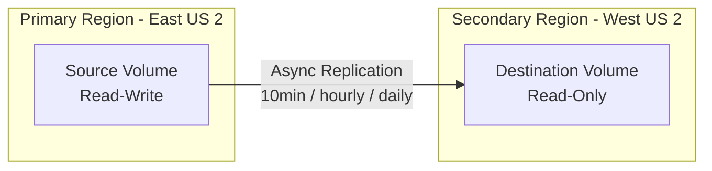

# How to Set Up Cross-Region Replication for Azure NetApp Files

Author: [nawazdhandala](https://www.github.com/nawazdhandala)

Tags: Azure, NetApp Files, Cross-Region Replication, Disaster Recovery, Data Protection, Business Continuity, Storage Replication

Description: Learn how to configure cross-region replication for Azure NetApp Files volumes to enable disaster recovery and business continuity.

---

When you run production workloads on Azure NetApp Files, having your data in a single region is a risk you probably cannot afford. A regional outage, however rare, could leave your applications without access to critical file storage. Cross-region replication for Azure NetApp Files lets you asynchronously replicate volumes to a different Azure region, giving you a ready-to-go copy of your data that you can fail over to when things go wrong. This post covers the end-to-end setup.

## How Cross-Region Replication Works

Azure NetApp Files cross-region replication uses SnapMirror technology under the hood (the same technology NetApp uses in its on-premises systems). Here is the high-level flow:

1. You create a source volume in your primary region
2. You create a destination volume in a secondary region and configure it as a replication target
3. Azure performs an initial baseline copy of all data from source to destination
4. After the baseline, incremental changes are replicated on a schedule (every 10 minutes, hourly, or daily)
5. During a disaster, you break the replication and promote the destination volume to read-write



The destination volume is read-only during normal operation. Clients in the secondary region can mount it for read access (useful for reporting or DR readiness testing), but write operations are only allowed after you break the replication relationship.

## Prerequisites

Before setting up replication, make sure you have:

1. A source volume already created in your primary region
2. A NetApp account in the destination region
3. A capacity pool in the destination region with enough capacity for the replicated volume
4. A delegated subnet in the destination region's virtual network
5. Cross-region replication enabled for the region pair (most region pairs support this by default)

## Step 1: Set Up the Destination Infrastructure

If you do not already have a NetApp account and capacity pool in the secondary region, create them:

```bash
# Create a resource group in the secondary region
az group create --name netapp-dr-rg --location westus2

# Create a virtual network in the secondary region
az network vnet create \
  --resource-group netapp-dr-rg \
  --name netapp-dr-vnet \
  --address-prefix 10.20.0.0/16 \
  --location westus2

# Create a delegated subnet for NetApp Files
az network vnet subnet create \
  --resource-group netapp-dr-rg \
  --vnet-name netapp-dr-vnet \
  --name netapp-dr-subnet \
  --address-prefix 10.20.1.0/24 \
  --delegations "Microsoft.NetApp/volumes"

# Create a NetApp account in the secondary region
az netappfiles account create \
  --resource-group netapp-dr-rg \
  --account-name drnetappaccount \
  --location westus2

# Create a capacity pool
# The service level should match the source for consistent performance
az netappfiles pool create \
  --resource-group netapp-dr-rg \
  --account-name drnetappaccount \
  --pool-name dr-pool \
  --size 4 \
  --service-level Premium \
  --location westus2
```

## Step 2: Create the Destination Volume with Replication

The destination volume must reference the source volume's resource ID and specify the replication schedule:

```bash
# Get the source volume's resource ID
SOURCE_VOLUME_ID=$(az netappfiles volume show \
  --resource-group netapp-rg \
  --account-name mynetappaccount \
  --pool-name premium-pool \
  --volume-name app-data-vol \
  --query "id" -o tsv)

# Create the destination volume with replication configured
# The volume size must be at least as large as the source
az netappfiles volume create \
  --resource-group netapp-dr-rg \
  --account-name drnetappaccount \
  --pool-name dr-pool \
  --volume-name app-data-vol-dr \
  --location westus2 \
  --service-level Premium \
  --usage-threshold 1024 \
  --file-path "appdata-dr" \
  --vnet netapp-dr-vnet \
  --subnet netapp-dr-subnet \
  --protocol-types NFSv4.1 \
  --allowed-clients "10.20.0.0/16" \
  --rule-index 1 \
  --unix-read-write true \
  --volume-type DataProtection \
  --endpoint-type dst \
  --remote-volume-resource-id "${SOURCE_VOLUME_ID}" \
  --replication-schedule "hourly"
```

The key replication parameters:

- **volume-type DataProtection**: Marks this as a replication destination
- **endpoint-type dst**: This is the destination end of the replication
- **remote-volume-resource-id**: Points to the source volume
- **replication-schedule**: How often changes are replicated. Options are `_10minutely`, `hourly`, or `daily`

## Step 3: Authorize the Replication

After creating the destination volume, you need to authorize the replication from the source side:

```bash
# Authorize the replication on the source volume
az netappfiles volume replication approve \
  --resource-group netapp-rg \
  --account-name mynetappaccount \
  --pool-name premium-pool \
  --volume-name app-data-vol \
  --remote-volume-resource-id "/subscriptions/{sub-id}/resourceGroups/netapp-dr-rg/providers/Microsoft.NetApp/netAppAccounts/drnetappaccount/capacityPools/dr-pool/volumes/app-data-vol-dr"
```

Once authorized, the initial baseline replication begins. Depending on the volume size, this can take anywhere from minutes to hours. You can monitor the progress:

```bash
# Check the replication status
az netappfiles volume replication status \
  --resource-group netapp-dr-rg \
  --account-name drnetappaccount \
  --pool-name dr-pool \
  --volume-name app-data-vol-dr
```

The output shows:

- **mirrorState**: `Mirrored` means replication is active and healthy
- **totalProgress**: Percentage of the baseline copy completed
- **relationshipStatus**: `Idle` (waiting for next sync) or `Transferring` (sync in progress)

## Step 4: Perform a Failover

When you need to fail over to the secondary region (either due to a real disaster or a planned DR test), you break the replication and make the destination volume read-write.

```bash
# Break the replication relationship
# This promotes the destination volume to read-write
az netappfiles volume replication break \
  --resource-group netapp-dr-rg \
  --account-name drnetappaccount \
  --pool-name dr-pool \
  --volume-name app-data-vol-dr
```

After breaking replication, the destination volume becomes independent and read-write. Clients in the secondary region can mount it and start using it immediately.

```bash
# Get the destination volume's mount IP
az netappfiles volume show \
  --resource-group netapp-dr-rg \
  --account-name drnetappaccount \
  --pool-name dr-pool \
  --volume-name app-data-vol-dr \
  --query "mountTargets[0].ipAddress" -o tsv
```

## Step 5: Re-establish Replication After Failover

Once the primary region is back online, you can reverse the replication direction or re-sync the original relationship.

### Option A: Reverse Replication

If the destination has accumulated new writes during the failover, you might want to reverse replication so that changes flow back to the primary:

```bash
# Re-sync from the current destination back to the original source
# This is called a "reverse resync"
az netappfiles volume replication re-initialize \
  --resource-group netapp-dr-rg \
  --account-name drnetappaccount \
  --pool-name dr-pool \
  --volume-name app-data-vol-dr
```

### Option B: Re-establish Original Direction

If you want to fail back to the primary region, re-establish the original replication direction:

```bash
# Resync replication in the original direction
az netappfiles volume replication resync \
  --resource-group netapp-dr-rg \
  --account-name drnetappaccount \
  --pool-name dr-pool \
  --volume-name app-data-vol-dr
```

This sends any changes from the destination back to the source, and then resumes the original replication schedule.

## Monitoring Replication Health

Set up monitoring to ensure replication stays healthy. Azure NetApp Files exposes replication metrics through Azure Monitor:

- **Volume replication lag time**: How far behind the destination is from the source
- **Volume replication transfer rate**: Data transfer speed between regions
- **Volume replication progress**: Bytes transferred vs. total

You can create alerts on these metrics:

```bash
# Create an alert for replication lag exceeding 2 hours
az monitor metrics alert create \
  --name "NetApp-Replication-Lag-Alert" \
  --resource-group netapp-dr-rg \
  --scopes "/subscriptions/{sub-id}/resourceGroups/netapp-dr-rg/providers/Microsoft.NetApp/netAppAccounts/drnetappaccount/capacityPools/dr-pool/volumes/app-data-vol-dr" \
  --condition "avg VolumeReplicationLagTime > 7200" \
  --window-size 15m \
  --evaluation-frequency 5m \
  --severity 2 \
  --action "/subscriptions/{sub-id}/resourceGroups/netapp-dr-rg/providers/Microsoft.Insights/actionGroups/ops-team"
```

## RPO and RTO Considerations

Your Recovery Point Objective (RPO) and Recovery Time Objective (RTO) depend on the replication schedule and your failover process:

| Replication Schedule | Approximate RPO | Use Case |
|---------------------|----------------|----------|
| 10-minutely | ~10 minutes | Critical production workloads |
| Hourly | ~1 hour | Standard business applications |
| Daily | ~24 hours | Dev/test, non-critical data |

The RTO is primarily the time it takes to break the replication and redirect clients to the new mount point. The break operation itself completes in seconds. The actual RTO depends on how quickly you can update DNS, reconfigure applications, and restart services - typically 15-60 minutes with a well-tested runbook.

## Cost Implications

Cross-region replication has three cost components:

1. **Destination volume**: You pay for the provisioned capacity in the destination pool, same as a regular volume
2. **Replication data transfer**: Cross-region data transfer charges apply for data replicated between regions
3. **Destination capacity pool**: The capacity pool in the secondary region has its own cost based on size and service level

To optimize costs, you can use a lower service level for the destination pool during normal operation (since it is read-only and performance requirements are lower), and then change the service level if you need to fail over.

Cross-region replication for Azure NetApp Files is one of the more straightforward DR setups in Azure. The SnapMirror technology is proven and reliable, the failover is fast, and the incremental replication keeps your RPO tight. The main thing is to test your failover process regularly so that when you actually need it, the team knows exactly what to do.
