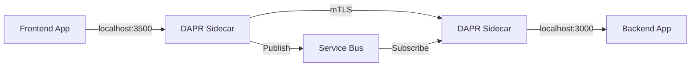

# How to Set Up DAPR Sidecar Injection on AKS for Microservice Communication

Author: [nawazdhandala](https://www.github.com/nawazdhandala)

Tags: AKS, DAPR, Microservices, Sidecar, Kubernetes, Service Invocation, Pub/Sub

Description: Complete guide to installing DAPR on AKS and configuring automatic sidecar injection for reliable microservice-to-microservice communication.

---

Building microservices means dealing with a lot of plumbing - service discovery, retries, pub/sub messaging, state management, and distributed tracing. DAPR (Distributed Application Runtime) handles all of this as a sidecar that runs alongside your application containers. Instead of baking these concerns into your application code, DAPR provides them as HTTP and gRPC APIs that your service calls locally. In this post, I will walk through installing DAPR on AKS and configuring automatic sidecar injection so that every annotated pod gets the DAPR runtime injected automatically.

## What DAPR Brings to the Table

DAPR runs as a sidecar container next to your application. Your app talks to the DAPR sidecar over localhost, and DAPR handles the complexity of communicating with other services, message brokers, state stores, and external systems. The key building blocks include:

- **Service invocation** - Call other services by name with built-in retries and mTLS
- **Pub/sub messaging** - Publish and subscribe to topics backed by any message broker
- **State management** - Key-value state storage with pluggable backends
- **Bindings** - Trigger your app from external systems or write to external systems
- **Observability** - Distributed tracing and metrics out of the box

The sidecar pattern means your application does not need a DAPR SDK (though SDKs exist for convenience). Any language that can make HTTP calls can use DAPR.

## Prerequisites

You need an AKS cluster running Kubernetes 1.24 or later, kubectl configured, and Helm 3 installed. The DAPR CLI is helpful for debugging but not strictly required for the installation.

## Step 1: Install DAPR on AKS

The recommended way to install DAPR on Kubernetes is through Helm. This installs the DAPR control plane components: the operator, sidecar injector, placement service, and sentry (for mTLS certificates).

```bash
# Add the DAPR Helm repository
helm repo add dapr https://dapr.github.io/helm-charts/
helm repo update

# Create a namespace for DAPR system components
kubectl create namespace dapr-system

# Install DAPR with high availability enabled
helm install dapr dapr/dapr \
  --namespace dapr-system \
  --set global.ha.enabled=true \
  --set global.logAsJson=true \
  --wait
```

The `global.ha.enabled=true` flag runs multiple replicas of each control plane component for production resilience. After installation, verify everything is running.

```bash
# Check that all DAPR system pods are running
kubectl get pods -n dapr-system
```

You should see pods for dapr-operator, dapr-sidecar-injector, dapr-placement-server, dapr-sentry, and dapr-dashboard.

## Step 2: Understand Sidecar Injection

DAPR uses a Kubernetes mutating admission webhook to inject the sidecar. When you create a pod with specific DAPR annotations, the webhook intercepts the pod creation and adds the daprd sidecar container to the pod spec. Your application code does not need to change at all.

The minimum annotation required is `dapr.io/enabled: "true"` and `dapr.io/app-id: "your-app-name"`. The app-id is how other services will reference your application.

## Step 3: Deploy a Service with DAPR Sidecar

Let us deploy two services that communicate through DAPR service invocation. First, a backend API service.

```yaml
# backend-deployment.yaml
# Backend service with DAPR sidecar injection enabled
apiVersion: apps/v1
kind: Deployment
metadata:
  name: backend-api
  namespace: default
  labels:
    app: backend-api
spec:
  replicas: 2
  selector:
    matchLabels:
      app: backend-api
  template:
    metadata:
      labels:
        app: backend-api
      annotations:
        # Enable DAPR sidecar injection
        dapr.io/enabled: "true"
        # Unique identifier for this service
        dapr.io/app-id: "backend-api"
        # Port your app listens on
        dapr.io/app-port: "3000"
        # Protocol your app uses (http or grpc)
        dapr.io/app-protocol: "http"
        # Enable API logging for debugging
        dapr.io/enable-api-logging: "true"
        # Resource limits for the sidecar
        dapr.io/sidecar-cpu-request: "100m"
        dapr.io/sidecar-memory-request: "128Mi"
        dapr.io/sidecar-cpu-limit: "300m"
        dapr.io/sidecar-memory-limit: "256Mi"
    spec:
      containers:
        - name: backend-api
          image: myregistry.azurecr.io/backend-api:v1
          ports:
            - containerPort: 3000
          env:
            # DAPR sidecar runs on this port by default
            - name: DAPR_HTTP_PORT
              value: "3500"
```

Now a frontend service that calls the backend.

```yaml
# frontend-deployment.yaml
# Frontend service that calls the backend through DAPR
apiVersion: apps/v1
kind: Deployment
metadata:
  name: frontend
  namespace: default
  labels:
    app: frontend
spec:
  replicas: 2
  selector:
    matchLabels:
      app: frontend
  template:
    metadata:
      labels:
        app: frontend
      annotations:
        dapr.io/enabled: "true"
        dapr.io/app-id: "frontend"
        dapr.io/app-port: "8080"
        dapr.io/app-protocol: "http"
    spec:
      containers:
        - name: frontend
          image: myregistry.azurecr.io/frontend:v1
          ports:
            - containerPort: 8080
```

Apply both deployments.

```bash
# Deploy both services
kubectl apply -f backend-deployment.yaml
kubectl apply -f frontend-deployment.yaml

# Verify that each pod has 2 containers (app + daprd sidecar)
kubectl get pods -l app=backend-api
kubectl get pods -l app=frontend
```

Each pod should show 2/2 in the READY column, indicating both your application container and the DAPR sidecar are running.

## Step 4: Service Invocation Between Services

From the frontend service, calling the backend is a simple HTTP call to the local DAPR sidecar. The URL pattern is:

```
http://localhost:3500/v1.0/invoke/<app-id>/method/<endpoint>
```

Here is an example of how the frontend calls the backend. This works in any language - here is a Node.js example.

```javascript
// frontend/app.js
// Call the backend-api service through DAPR service invocation
const axios = require('axios');

// DAPR sidecar runs on localhost:3500
const DAPR_PORT = process.env.DAPR_HTTP_PORT || '3500';

async function getOrders() {
  try {
    // Invoke the backend-api service's /orders endpoint
    // DAPR handles service discovery, retries, and mTLS
    const response = await axios.get(
      `http://localhost:${DAPR_PORT}/v1.0/invoke/backend-api/method/orders`
    );
    return response.data;
  } catch (error) {
    console.error('Failed to call backend-api:', error.message);
    throw error;
  }
}
```

DAPR resolves the `backend-api` app-id to the actual pods running that service, load-balances the request, and handles retries automatically. All communication between sidecars is encrypted with mTLS by default.

## Step 5: Configure Pub/Sub Messaging

DAPR also simplifies pub/sub. First, deploy a pub/sub component. This example uses Azure Service Bus.

```yaml
# pubsub-component.yaml
# DAPR pub/sub component backed by Azure Service Bus
apiVersion: dapr.io/v1alpha1
kind: Component
metadata:
  name: orderpubsub
  namespace: default
spec:
  type: pubsub.azure.servicebus.topics
  version: v1
  metadata:
    - name: connectionString
      secretKeyRef:
        name: servicebus-secret
        key: connectionString
```

Now the backend can publish events, and the frontend can subscribe.

```yaml
# subscription.yaml
# Declarative subscription for the frontend service
apiVersion: dapr.io/v2alpha1
kind: Subscription
metadata:
  name: order-subscription
  namespace: default
spec:
  topic: orders
  routes:
    default: /orders/new
  pubsubname: orderpubsub
  scopes:
    - frontend
```

## Step 6: Configure Sidecar Injection Settings

You can tune the DAPR sidecar behavior globally or per-deployment. For global settings, update the DAPR configuration.

```yaml
# dapr-config.yaml
# Global DAPR configuration with tracing and metrics
apiVersion: dapr.io/v1alpha1
kind: Configuration
metadata:
  name: daprsystem
  namespace: default
spec:
  # Enable distributed tracing
  tracing:
    samplingRate: "1"
    zipkin:
      endpointAddress: "http://zipkin.default.svc.cluster.local:9411/api/v2/spans"
  # Enable metrics collection
  metric:
    enabled: true
  # mTLS settings
  mtls:
    enabled: true
    workloadCertTTL: "24h"
    allowedClockSkew: "15m"
```

## Communication Flow with DAPR

Here is how service-to-service communication works with DAPR sidecars.



## Debugging DAPR Sidecar Issues

If the sidecar is not being injected, check these things:

```bash
# Check that the DAPR injector webhook is registered
kubectl get mutatingwebhookconfigurations | grep dapr

# Check DAPR injector logs for errors
kubectl logs -l app=dapr-sidecar-injector -n dapr-system

# Check if the annotation is correct on the pod template
kubectl get deployment backend-api -o jsonpath='{.spec.template.metadata.annotations}'
```

Common issues include the annotation being on the deployment metadata instead of the pod template metadata, the app-port not matching the actual container port, and namespace-level restrictions blocking injection.

## Production Recommendations

**Set resource limits on sidecars.** The DAPR sidecar consumes CPU and memory. Use the `dapr.io/sidecar-cpu-limit` and `dapr.io/sidecar-memory-limit` annotations to prevent the sidecar from consuming too many resources.

**Enable mTLS.** It is on by default, but verify it. All service-to-service communication through DAPR will be encrypted.

**Use scoping.** Limit which services can access specific components by using the `scopes` field in component definitions.

**Monitor sidecar health.** DAPR exposes health endpoints at `localhost:3500/v1.0/healthz`. Include these in your readiness probes or monitoring setup.

DAPR on AKS takes a lot of the distributed systems complexity out of your application code and puts it in the infrastructure layer where it belongs. The sidecar injection mechanism makes adoption straightforward since you just add annotations to your deployments, and your services get service discovery, retries, mTLS, and pub/sub without writing any infrastructure code.
