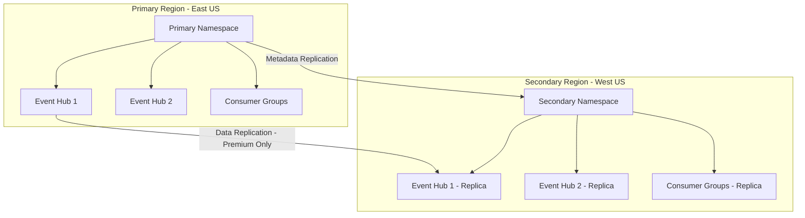

# How to Set Up Disaster Recovery for Azure Event Hubs with Geo-Replication

Author: [nawazdhandala](https://www.github.com/nawazdhandala)

Tags: Azure Event Hubs, Disaster Recovery, Geo-Replication, High Availability, Event Streaming, Business Continuity, Azure

Description: Configure geo-disaster recovery for Azure Event Hubs to ensure business continuity with automatic failover across Azure regions.

---

Event Hubs often sit at the center of critical data pipelines. Telemetry, logs, transactions, and real-time events all flow through them. If your Event Hub namespace becomes unavailable due to a regional outage, the impact cascades through your entire system. Geo-disaster recovery ensures that your event streaming infrastructure survives even a full Azure region failure.

Azure Event Hubs provides two approaches to disaster recovery: Geo-Disaster Recovery (pairing two namespaces across regions) and the newer Geo-Replication feature for Premium and Dedicated tiers. In this guide, I will cover both approaches so you can pick the one that fits your tier and requirements.

## Understanding the DR Options

**Geo-Disaster Recovery (Standard tier and above)**: Pairs a primary and secondary namespace. Metadata (event hub definitions, consumer groups, configurations) is replicated continuously. During failover, the secondary takes over the primary's connection string. Note: this does NOT replicate data, only metadata.

**Geo-Replication (Premium and Dedicated tiers)**: Replicates both metadata AND data across regions. This provides true data-level redundancy with configurable consistency.



## Prerequisites

- Two Azure Event Hubs namespaces in different regions
- Both namespaces must be on the same tier (Standard-Standard, Premium-Premium, or Dedicated-Dedicated)
- The secondary namespace must not have any existing event hubs (they will be created by the pairing)
- Azure CLI or Azure Portal access

## Approach 1: Geo-Disaster Recovery (Standard Tier)

### Step 1: Create the Primary and Secondary Namespaces

```bash
# Create the primary namespace in East US
az eventhubs namespace create \
    --name evh-primary-eastus \
    --resource-group rg-evh-dr \
    --location eastus \
    --sku Standard \
    --capacity 2

# Create the secondary namespace in West US (must be empty)
az eventhubs namespace create \
    --name evh-secondary-westus \
    --resource-group rg-evh-dr \
    --location westus2 \
    --sku Standard \
    --capacity 2
```

### Step 2: Create Event Hubs on the Primary

```bash
# Create event hubs on the primary namespace only
az eventhubs eventhub create \
    --name telemetry-events \
    --namespace-name evh-primary-eastus \
    --resource-group rg-evh-dr \
    --partition-count 8 \
    --message-retention 7

az eventhubs eventhub create \
    --name transaction-events \
    --namespace-name evh-primary-eastus \
    --resource-group rg-evh-dr \
    --partition-count 16 \
    --message-retention 7

# Create consumer groups
az eventhubs eventhub consumer-group create \
    --name analytics-consumer \
    --eventhub-name telemetry-events \
    --namespace-name evh-primary-eastus \
    --resource-group rg-evh-dr
```

### Step 3: Create the Geo-DR Pairing

```bash
# Create the disaster recovery alias that pairs the two namespaces
az eventhubs georecovery-alias set \
    --alias evh-dr-alias \
    --namespace-name evh-primary-eastus \
    --resource-group rg-evh-dr \
    --partner-namespace /subscriptions/{sub-id}/resourceGroups/rg-evh-dr/providers/Microsoft.EventHub/namespaces/evh-secondary-westus
```

After pairing, the metadata (event hub definitions, consumer groups, SAS policies) from the primary is replicated to the secondary. The alias provides a stable connection string that your applications should use instead of the namespace-specific connection string.

### Step 4: Get the Alias Connection String

```bash
# Get the alias connection string (this is what your applications should use)
az eventhubs georecovery-alias authorization-rule keys list \
    --alias evh-dr-alias \
    --namespace-name evh-primary-eastus \
    --resource-group rg-evh-dr \
    --name RootManageSharedAccessKey
```

The alias connection string looks like a regular Event Hub connection string but points to whichever namespace is currently primary. After failover, it automatically points to the new primary without any application changes.

### Step 5: Configure Your Application to Use the Alias

```python
# producer.py - Send events using the DR alias connection string
from azure.eventhub import EventHubProducerClient, EventData

# Use the alias connection string instead of a namespace-specific one
# This ensures automatic failover to the secondary during a DR event
ALIAS_CONNECTION_STRING = "Endpoint=sb://evh-dr-alias.servicebus.windows.net/;SharedAccessKeyName=RootManageSharedAccessKey;SharedAccessKey=..."

producer = EventHubProducerClient.from_connection_string(
    conn_str=ALIAS_CONNECTION_STRING,
    eventhub_name="telemetry-events"
)

# Send events as usual - the alias handles routing to the active namespace
with producer:
    batch = producer.create_batch()
    batch.add(EventData('{"server": "web-01", "cpu": 45.2}'))
    batch.add(EventData('{"server": "web-02", "cpu": 38.7}'))
    producer.send_batch(batch)
    print("Events sent successfully")
```

### Step 6: Perform a Failover

When a regional outage occurs (or during a DR test), initiate a failover:

```bash
# Initiate failover - the secondary becomes the new primary
# WARNING: This is a one-way operation that breaks the pairing
az eventhubs georecovery-alias fail-over \
    --alias evh-dr-alias \
    --namespace-name evh-secondary-westus \
    --resource-group rg-evh-dr
```

After failover:
- The secondary namespace becomes the new primary
- The alias connection string now resolves to the former secondary
- Applications using the alias connection string automatically connect to the new primary
- The pairing is broken - you need to re-pair after setting up a new secondary

Important caveat: With Standard tier Geo-DR, only metadata is replicated. Any events in the primary that were not consumed before the outage are lost. If you need data replication, use the Premium tier approach below.

## Approach 2: Geo-Replication (Premium/Dedicated Tier)

The Premium tier supports true data replication across regions.

```bash
# Create a Premium namespace with geo-replication
az eventhubs namespace create \
    --name evh-premium-primary \
    --resource-group rg-evh-dr \
    --location eastus \
    --sku Premium \
    --capacity 1

# Enable geo-replication to a secondary region
az eventhubs namespace replica add \
    --namespace-name evh-premium-primary \
    --resource-group rg-evh-dr \
    --location westus2
```

With Premium geo-replication:
- Both metadata AND data are replicated
- You can configure the replication consistency (synchronous or asynchronous)
- Failover preserves in-flight events
- Consumers can be configured to read from the closest replica for lower latency

## Step 7: Monitor Replication Health

Set up monitoring to track the health of your DR configuration:

```bash
# Check the DR alias status
az eventhubs georecovery-alias show \
    --alias evh-dr-alias \
    --namespace-name evh-primary-eastus \
    --resource-group rg-evh-dr
```

The output includes:
- **provisioningState**: Should be "Succeeded"
- **partnerNamespace**: The paired secondary namespace
- **role**: "Primary" or "Secondary"
- **pendingReplicationOperationsCount**: Number of metadata operations pending replication (should be 0 or very low)

Set up Azure Monitor alerts for replication lag:

```bash
# Create an alert for replication issues
az monitor metrics alert create \
    --name "evh-replication-lag" \
    --resource-group rg-evh-dr \
    --scopes "/subscriptions/{sub}/resourceGroups/rg-evh-dr/providers/Microsoft.EventHub/namespaces/evh-primary-eastus" \
    --condition "avg EHAMSGS > 1000" \
    --window-size 5m \
    --action-group "/subscriptions/{sub}/resourceGroups/rg-evh-dr/providers/Microsoft.Insights/actionGroups/ops-team"
```

## Testing Your DR Setup

Regular DR testing is essential. Here is a testing procedure:

1. **Pre-test**: Verify producers and consumers are working normally
2. **Initiate failover**: Run the failover command against the secondary
3. **Verify**: Confirm producers can send to the new primary, consumers can read
4. **Measure**: Record failover time, message loss (if any), and reconnection behavior
5. **Restore**: Set up a new secondary and re-pair

```python
# dr_test.py - Automated DR test script
import time
from azure.eventhub import EventHubProducerClient, EventData

ALIAS_CONN = "Endpoint=sb://evh-dr-alias.servicebus.windows.net/;..."

def test_connectivity():
    """Test that we can send events through the alias."""
    try:
        producer = EventHubProducerClient.from_connection_string(
            conn_str=ALIAS_CONN,
            eventhub_name="telemetry-events"
        )
        with producer:
            batch = producer.create_batch()
            batch.add(EventData('{"test": "dr-verification"}'))
            producer.send_batch(batch)
        return True
    except Exception as e:
        print(f"Connectivity test failed: {e}")
        return False

# Test before failover
print("Pre-failover test:", "PASS" if test_connectivity() else "FAIL")

# After manually triggering failover, test again
print("Waiting 60 seconds for failover to propagate...")
time.sleep(60)

print("Post-failover test:", "PASS" if test_connectivity() else "FAIL")
```

## Application Resilience Patterns

Even with geo-DR, your application needs resilience patterns:

```python
# resilient_producer.py - Producer with retry logic for DR scenarios
from azure.eventhub import EventHubProducerClient, EventData
import time

class ResilientProducer:
    """Event Hub producer with automatic retry for failover scenarios."""

    def __init__(self, connection_string, eventhub_name):
        self.connection_string = connection_string
        self.eventhub_name = eventhub_name
        self.max_retries = 5
        self.base_delay = 2  # seconds

    def send_events(self, events: list):
        """Send events with exponential backoff retry."""
        for attempt in range(self.max_retries):
            try:
                producer = EventHubProducerClient.from_connection_string(
                    conn_str=self.connection_string,
                    eventhub_name=self.eventhub_name
                )
                with producer:
                    batch = producer.create_batch()
                    for event in events:
                        batch.add(EventData(event))
                    producer.send_batch(batch)
                return True  # Success

            except Exception as e:
                delay = self.base_delay * (2 ** attempt)
                print(f"Send failed (attempt {attempt + 1}): {e}")
                print(f"Retrying in {delay} seconds...")
                time.sleep(delay)

        print("All retry attempts exhausted")
        return False
```

## Summary

Disaster recovery for Azure Event Hubs protects your event streaming infrastructure against regional outages. The Standard tier Geo-DR replicates metadata and provides an alias-based failover mechanism, while the Premium tier adds true data replication for zero data loss. In both cases, using the alias connection string in your applications ensures transparent failover without code changes. Regular DR testing is critical - do not wait for an actual outage to discover that your failover process does not work. Schedule quarterly tests, automate the verification, and document your runbook.
