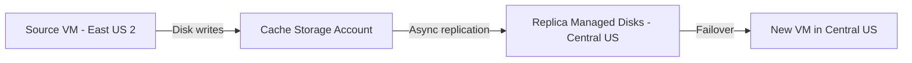

# How to Set Up Disaster Recovery for Azure VMs to a Secondary Region with Azure Site Recovery

Author: [nawazdhandala](https://www.github.com/nawazdhandala)

Tags: Azure Site Recovery, Disaster Recovery, Azure VMs, Replication, Business Continuity, Failover, Secondary Region

Description: Complete guide to setting up cross-region disaster recovery for Azure virtual machines using Azure Site Recovery, including replication, networking, and failover configuration.

---

Having your Azure VMs running in a single region is a single point of failure. If that region experiences an outage - and it does happen - your applications go down. Azure Site Recovery (ASR) lets you replicate VMs to a secondary region so you can fail over within minutes when disaster strikes. The replication is continuous, so your recovery point is usually within minutes of the failure.

This guide covers how to set up Azure-to-Azure disaster recovery for your VMs from scratch.

## How Azure Site Recovery Works

ASR continuously replicates your VM's managed disks to the secondary region. It captures writes at the disk level and sends them to a cache storage account, which then flushes to replica managed disks in the target region.



During normal operations, no VMs exist in the secondary region. Only the replicated disks and some metadata live there. When you trigger a failover, ASR creates VMs from the replica disks in the target region. This keeps your ongoing costs low because you are not paying for idle compute.

## Prerequisites

- Azure VMs running in the source region (any supported OS)
- A Recovery Services vault in the target region (already configured - see the vault setup guide)
- A virtual network in the target region for the failover VMs
- The source VMs must use managed disks (unmanaged disks are not supported for Azure-to-Azure ASR)
- The Azure Site Recovery extension will be installed automatically on the VMs

## Step 1: Prepare the Target Region Network

The failover VMs need a virtual network to land in. Create one that mirrors your source network topology:

```bash
# Create a virtual network in the DR region
# Mirror the address space from the source region but use a different range to avoid conflicts
az network vnet create \
    --resource-group rg-dr-centralus \
    --name vnet-dr-centralus \
    --location centralus \
    --address-prefix 10.2.0.0/16 \
    --subnet-name subnet-web \
    --subnet-prefix 10.2.1.0/24

# Add additional subnets to match source topology
az network vnet subnet create \
    --resource-group rg-dr-centralus \
    --vnet-name vnet-dr-centralus \
    --name subnet-app \
    --address-prefix 10.2.2.0/24

az network vnet subnet create \
    --resource-group rg-dr-centralus \
    --vnet-name vnet-dr-centralus \
    --name subnet-db \
    --address-prefix 10.2.3.0/24
```

If you have NSGs (Network Security Groups) on the source subnets, create matching NSGs in the target region. ASR can map source NSGs to target NSGs during failover.

## Step 2: Enable Replication for VMs

You can enable replication through the portal, CLI, or PowerShell. The portal experience is the most straightforward for initial setup.

### Using the Portal

1. Open the Azure portal and navigate to your VM
2. In the left menu, click "Disaster recovery" under Operations
3. Select the target region (where your Recovery Services vault is)
4. Review the default settings:
   - Target resource group
   - Target virtual network and subnet
   - Cache storage account
   - Replica managed disks
5. Click "Review + Start replication"

### Using Azure PowerShell for Bulk Setup

For multiple VMs, scripting is more practical:

```powershell
# Enable replication for an Azure VM to a secondary region
# This script configures all the necessary replication infrastructure

# Define source and target parameters
$sourceRG = "rg-production-eastus2"
$targetRG = "rg-dr-centralus"
$vaultName = "rsv-dr-centralus-001"
$vaultRG = "rg-dr-centralus"
$targetVNet = "vnet-dr-centralus"
$targetSubnet = "subnet-web"
$cacheStorageAccount = "stasrcacheeastus2"

# Get the vault context
$vault = Get-AzRecoveryServicesVault -Name $vaultName -ResourceGroupName $vaultRG
Set-AzRecoveryServicesAsrVaultContext -Vault $vault

# Get the source VM
$vm = Get-AzVM -ResourceGroupName $sourceRG -Name "vm-web-01"

# Get the managed disk IDs for the VM
$diskList = New-Object System.Collections.ArrayList
foreach ($disk in $vm.StorageProfile.DataDisks) {
    $diskInput = New-AzRecoveryServicesAsrAzureToAzureDiskReplicationConfig `
        -ManagedDisk `
        -LogStorageAccountId "/subscriptions/<sub-id>/resourceGroups/$sourceRG/providers/Microsoft.Storage/storageAccounts/$cacheStorageAccount" `
        -DiskId $disk.ManagedDisk.Id `
        -RecoveryResourceGroupId "/subscriptions/<sub-id>/resourceGroups/$targetRG" `
        -RecoveryReplicaDiskAccountType "StandardSSD_LRS" `
        -RecoveryTargetDiskAccountType "StandardSSD_LRS"
    $diskList.Add($diskInput)
}

# Include the OS disk
$osDiskInput = New-AzRecoveryServicesAsrAzureToAzureDiskReplicationConfig `
    -ManagedDisk `
    -LogStorageAccountId "/subscriptions/<sub-id>/resourceGroups/$sourceRG/providers/Microsoft.Storage/storageAccounts/$cacheStorageAccount" `
    -DiskId $vm.StorageProfile.OsDisk.ManagedDisk.Id `
    -RecoveryResourceGroupId "/subscriptions/<sub-id>/resourceGroups/$targetRG" `
    -RecoveryReplicaDiskAccountType "StandardSSD_LRS" `
    -RecoveryTargetDiskAccountType "StandardSSD_LRS"
$diskList.Add($osDiskInput)

# Start replication
New-AzRecoveryServicesAsrReplicationProtectedItem `
    -AzureToAzure `
    -AzureVmId $vm.Id `
    -Name "vm-web-01-replication" `
    -ProtectionContainerMapping $containerMapping `
    -AzureToAzureDiskReplicationConfiguration $diskList `
    -RecoveryResourceGroupId "/subscriptions/<sub-id>/resourceGroups/$targetRG" `
    -RecoveryAzureNetworkId "/subscriptions/<sub-id>/resourceGroups/$targetRG/providers/Microsoft.Network/virtualNetworks/$targetVNet" `
    -RecoveryAzureSubnetName $targetSubnet
```

## Step 3: Monitor Initial Replication

Initial replication copies all disk data to the target region. For a VM with 128 GB of disks, this typically takes 30-60 minutes depending on disk I/O and network throughput.

Monitor progress in the portal:

1. Go to the Recovery Services vault
2. Click "Replicated items"
3. Check each VM's replication health and sync percentage

The status progresses through these stages:
- **Enabling protection** - Setting up replication infrastructure
- **Initial replication in progress** - Copying disk data
- **Protected** - Replication is active and the VM can be failed over

## Step 4: Configure Network Mapping

Network mapping tells ASR which target network and subnet to use for each source network. This ensures VMs land in the right network during failover.

1. In the Recovery Services vault, go to "Site Recovery Infrastructure"
2. Click "Network mapping"
3. Add a mapping:
   - Source network: `vnet-production-eastus2`
   - Target network: `vnet-dr-centralus`

You can also configure per-VM network settings by clicking on the replicated item and adjusting the "Compute and Network" settings. This lets you:

- Change the target VM size
- Assign specific IP addresses in the target network
- Configure target availability sets or availability zones
- Assign target NSGs and public IP addresses

## Step 5: Configure Recovery Points

ASR creates recovery points continuously. You can configure how many to retain and whether to create application-consistent snapshots.

A **crash-consistent** recovery point captures the disk state at a point in time. It is like pulling the power cord - the data is consistent at the disk level but applications may need to recover uncommitted transactions.

An **application-consistent** recovery point uses VSS (Windows) or pre/post scripts (Linux) to flush application buffers before the snapshot. This gives you a clean recovery point where applications do not need crash recovery.

Configure these settings in the replication policy:

1. Go to the vault and click "Site Recovery Infrastructure"
2. Click "Replication policies"
3. Edit the default policy or create a new one:
   - **Recovery point retention**: 24 hours (default) - how long to keep recovery points
   - **App-consistent snapshot frequency**: 4 hours (default) - how often to take application-consistent snapshots
   - **Multi-VM consistency**: Enable if you need VMs to be recovered to the same point in time

## Step 6: Customize Failover Settings

For each replicated VM, configure how it should appear after failover:

1. Click on a replicated item
2. Go to "Compute and Network"
3. Configure:
   - **Target VM name**: Usually keep the same name
   - **Target VM size**: Match the source or choose a different size
   - **Target availability set/zone**: For high availability in the DR region
   - **Target IP address**: Static IP in the target subnet
   - **Target NSG**: Network security group to apply

Also configure the boot order if you have multiple VMs. Database servers should come up before application servers, which should come up before web servers.

## Step 7: Verify Replication Health

Check replication health regularly. In the vault, the "Replicated items" view shows:

- **Replication health**: Healthy, Warning, or Critical
- **RPO**: The time gap between the latest recovery point and the current time
- **Latest recovery points**: Timestamps of the most recent crash-consistent and app-consistent points
- **Active issues**: Any errors or warnings that need attention

Common issues include:

**High RPO warnings** - The replication is falling behind. This is usually caused by high disk write rates on the source VM or network throttling. Consider upgrading the source VM's disk tier or checking network throughput.

**Agent version mismatch** - The Site Recovery extension on the VM needs updating. This usually auto-updates, but sometimes requires a manual restart of the extension.

**Resynchronization required** - If replication was interrupted, ASR may need to resync. This happens automatically but may cause temporarily higher RPO values.

## Step 8: Test the Configuration

After replication is healthy, perform a test failover (covered in detail in a separate guide). This creates temporary VMs in the target region from the latest recovery point, allowing you to verify that everything works without affecting production or ongoing replication.

Never skip test failovers. Disaster recovery that has not been tested is disaster recovery that might not work when you actually need it.

## Cost Considerations

Azure Site Recovery costs include:

- **ASR license**: Per protected VM per month
- **Storage**: Replica managed disks in the target region (same size as source disks)
- **Cache storage**: Standard storage account for replication data in transit
- **Network egress**: Data transfer from source to target region
- **No compute cost** during normal operations - VMs are only created during failover

For cost optimization:

- Use Standard HDD or Standard SSD for replica disks if you do not need Premium SSD performance during DR
- Clean up test failover resources promptly
- Right-size target VMs - you might not need the same size during DR

## Wrapping Up

Setting up Azure Site Recovery for cross-region VM protection is a one-time investment that pays for itself the first time you need it. The replication is continuous and automatic after initial setup, and you can fail over individual VMs or entire groups within minutes. Combined with regular test failovers and proper monitoring, ASR gives you confidence that your applications can survive a regional outage.
