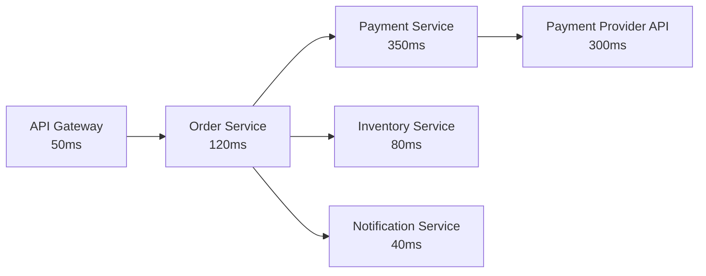

# How to Set Up Distributed Tracing Across Microservices with Azure Application Insights

Author: [nawazdhandala](https://www.github.com/nawazdhandala)

Tags: Azure Application Insights, Distributed Tracing, Microservices, OpenTelemetry, Observability, Azure Monitor, APM

Description: A hands-on guide to implementing distributed tracing across microservices using Azure Application Insights and OpenTelemetry for end-to-end request visibility.

---

When a request flows through a single monolithic application, tracing a problem is relatively simple - you follow the stack trace. But in a microservices architecture, a single user request might touch an API gateway, an order service, a payment service, an inventory service, and a notification service. When something goes wrong or a request is slow, you need to trace that request across all of those services to find the bottleneck.

Distributed tracing solves this by assigning a unique trace ID to each request and propagating it across service boundaries. Azure Application Insights supports distributed tracing out of the box, and with OpenTelemetry integration, it works across services written in different languages and running on different platforms.

## How Distributed Tracing Works

Every incoming request gets a trace ID. As the request moves from service to service (via HTTP calls, message queues, etc.), the trace ID is passed along in headers. Each service creates spans - units of work within the trace - that record what happened and how long it took.

The result is a trace timeline that shows the entire request lifecycle:



Each box is a span. The trace connects them all, and you can see that the Payment Provider API is the bottleneck at 300ms.

## Step 1: Add Application Insights to Each Service

For .NET services, install the Application Insights SDK:

```bash
# Install Application Insights for ASP.NET Core
dotnet add package Microsoft.ApplicationInsights.AspNetCore
```

Configure it in your service startup:

```csharp
// Program.cs for the Order Service
var builder = WebApplication.CreateBuilder(args);

// Add Application Insights - the connection string is pulled from configuration
builder.Services.AddApplicationInsightsTelemetry(options =>
{
    options.ConnectionString = builder.Configuration["ApplicationInsights:ConnectionString"];
});

var app = builder.Build();
app.MapControllers();
app.Run();
```

For Node.js services:

```bash
# Install the Application Insights Node.js SDK
npm install applicationinsights
```

```javascript
// Initialize Application Insights at the very top of your entry file
// This must be done before importing any other modules
const appInsights = require('applicationinsights');
appInsights.setup(process.env.APPLICATIONINSIGHTS_CONNECTION_STRING)
    .setAutoCollectRequests(true)
    .setAutoCollectDependencies(true)
    .setAutoCollectPerformance(true)
    .setDistributedTracingMode(appInsights.DistributedTracingModes.AI_AND_W3C)
    .start();

const express = require('express');
const app = express();

app.get('/api/orders', async (req, res) => {
    // Application Insights automatically tracks this request
    // and propagates trace context to outbound calls
    const inventory = await fetch('http://inventory-service/api/stock');
    res.json({ status: 'ok' });
});
```

For Java services:

```bash
# Download the Application Insights Java agent
curl -L -o applicationinsights-agent.jar \
  https://github.com/microsoft/ApplicationInsights-Java/releases/download/3.4.0/applicationinsights-agent-3.4.0.jar
```

```json
// applicationinsights.json configuration file
{
  "connectionString": "<your-connection-string>",
  "role": {
    "name": "payment-service"
  },
  "preview": {
    "sampling": {
      "percentage": 100
    }
  }
}
```

## Step 2: Configure Cloud Role Names

Cloud role names are essential for distributed tracing. They identify which service generated each span in the trace view. Without them, all your services show up as "unknown" in the application map.

For .NET:

```csharp
// Set the cloud role name so this service is identifiable in traces
builder.Services.AddApplicationInsightsTelemetry();
builder.Services.Configure<TelemetryConfiguration>(config =>
{
    config.TelemetryInitializers.Add(new CloudRoleNameInitializer("order-service"));
});

// Custom telemetry initializer to set the cloud role name
public class CloudRoleNameInitializer : ITelemetryInitializer
{
    private readonly string _roleName;

    public CloudRoleNameInitializer(string roleName)
    {
        _roleName = roleName;
    }

    public void Initialize(ITelemetry telemetry)
    {
        telemetry.Context.Cloud.RoleName = _roleName;
    }
}
```

For Node.js:

```javascript
// Set the cloud role name for this service
appInsights.defaultClient.context.tags[
    appInsights.defaultClient.context.keys.cloudRole
] = 'notification-service';
```

## Step 3: Use OpenTelemetry for Cross-Platform Tracing

If your microservices use different languages and frameworks, OpenTelemetry provides a vendor-neutral way to instrument them all. Application Insights supports the OpenTelemetry Protocol (OTLP) for ingesting traces.

For a Python service using OpenTelemetry:

```bash
# Install OpenTelemetry packages with Azure Monitor exporter
pip install opentelemetry-api opentelemetry-sdk \
    opentelemetry-instrumentation-flask \
    azure-monitor-opentelemetry-exporter
```

```python
# Configure OpenTelemetry to export traces to Application Insights
from opentelemetry import trace
from opentelemetry.sdk.trace import TracerProvider
from opentelemetry.sdk.trace.export import BatchSpanProcessor
from azure.monitor.opentelemetry.exporter import AzureMonitorTraceExporter
from opentelemetry.instrumentation.flask import FlaskInstrumentor

# Set up the tracer provider with Azure Monitor exporter
tracer_provider = TracerProvider()
exporter = AzureMonitorTraceExporter(
    connection_string="<your-connection-string>"
)
tracer_provider.add_span_processor(BatchSpanProcessor(exporter))
trace.set_tracer_provider(tracer_provider)

# Auto-instrument Flask to capture incoming requests
from flask import Flask
app = Flask(__name__)
FlaskInstrumentor().instrument_app(app)

@app.route('/api/inventory/check')
def check_inventory():
    # This request will automatically be part of the distributed trace
    # The trace context is extracted from incoming W3C headers
    return {'available': True}
```

## Step 4: Trace Context Propagation

For distributed tracing to work, the trace context must be propagated between services. The W3C Trace Context standard defines the `traceparent` and `tracestate` HTTP headers for this purpose.

Most Application Insights SDKs handle this automatically for HTTP calls. But if you are using message queues, gRPC, or custom transport, you may need to propagate the context manually.

For message queue scenarios (e.g., Azure Service Bus):

```csharp
// Producer: Add trace context to the message properties
var activity = Activity.Current;
var message = new ServiceBusMessage(JsonSerializer.Serialize(order));

// The Application Insights SDK automatically sets the Diagnostic-Id property
// But for custom properties, you can add them explicitly
if (activity != null)
{
    message.ApplicationProperties["traceparent"] = activity.Id;
    message.ApplicationProperties["tracestate"] = activity.TraceStateString;
}

await sender.SendMessageAsync(message);
```

```csharp
// Consumer: Extract trace context from the message and create a linked span
var traceparent = message.ApplicationProperties["traceparent"]?.ToString();
if (traceparent != null)
{
    var activity = new Activity("ProcessOrder");
    activity.SetParentId(traceparent);
    activity.Start();

    // Process the order within this trace context
    ProcessOrder(message.Body);

    activity.Stop();
}
```

## Step 5: View Distributed Traces in the Portal

Once all services are instrumented:

1. Go to Application Insights > Transaction Search
2. Find a request and click on it
3. The "End-to-end transaction details" view shows the entire trace

The trace view displays:

- A timeline showing each span and its duration
- The service name (cloud role) for each span
- HTTP status codes and response times
- Dependencies (database calls, HTTP calls to other services)

You can also use the Application Map (Application Insights > Application Map) to see the topology of your microservices and the traffic between them.

## Step 6: Query Traces with KQL

For deeper analysis, query the distributed trace data using KQL:

```kql
// Find the slowest end-to-end traces in the last hour
requests
| where timestamp > ago(1h)
| where duration > 2000  // Traces taking more than 2 seconds
| project operation_Id, name, duration, cloud_RoleName
| join kind=inner (
    dependencies
    | where timestamp > ago(1h)
    | project operation_Id, DependencyName = name, DependencyDuration = duration,
              DependencyTarget = target, DependencyCloud = cloud_RoleName
) on operation_Id
| summarize TotalDuration = max(duration),
            Services = make_set(cloud_RoleName),
            SlowestDependency = arg_max(DependencyDuration, DependencyName)
            by operation_Id
| order by TotalDuration desc
| take 20
```

Another useful query to find services causing the most latency:

```kql
// Identify which downstream service adds the most latency
dependencies
| where timestamp > ago(1h)
| summarize AvgDuration = avg(duration), P95Duration = percentile(duration, 95),
            CallCount = count() by target, cloud_RoleName
| where CallCount > 10
| order by P95Duration desc
```

## Step 7: Configure Sampling

In high-throughput environments, capturing every trace is expensive. Application Insights supports adaptive sampling that adjusts the collection rate based on traffic volume.

```csharp
// Configure adaptive sampling to control data volume
builder.Services.AddApplicationInsightsTelemetry(options =>
{
    options.EnableAdaptiveSampling = true;
});

// For more control, configure fixed-rate sampling
builder.Services.Configure<TelemetryConfiguration>(config =>
{
    var samplingProcessor = new FixedRateSamplingTelemetryProcessor(config.DefaultTelemetrySink.TelemetryProcessorChain)
    {
        IncludedTypes = "Request;Dependency;Trace",
        SamplingPercentage = 25  // Keep 25% of traces
    };
});
```

The critical thing is to use the same sampling decision across all services for a given trace. Application Insights handles this through the trace ID - if the first service decides to sample a trace, all downstream services respect that decision.

## Common Pitfalls

**Missing spans**: If a service does not appear in the trace, check that it is using the same Application Insights resource (or connected resources) and that the W3C trace headers are being propagated.

**Incorrect service names**: If spans show the wrong service name, verify your cloud role name configuration.

**Broken traces across message queues**: HTTP trace propagation is automatic, but message queue propagation often needs manual handling. Check that you are setting and reading the traceparent property on messages.

## Summary

Distributed tracing with Application Insights gives you end-to-end visibility across your microservices. The setup involves instrumenting each service, configuring cloud role names, and ensuring trace context propagation across all communication channels. Once in place, you can trace any request from the API gateway to the deepest downstream dependency, identify bottlenecks, and understand the real behavior of your distributed system.
