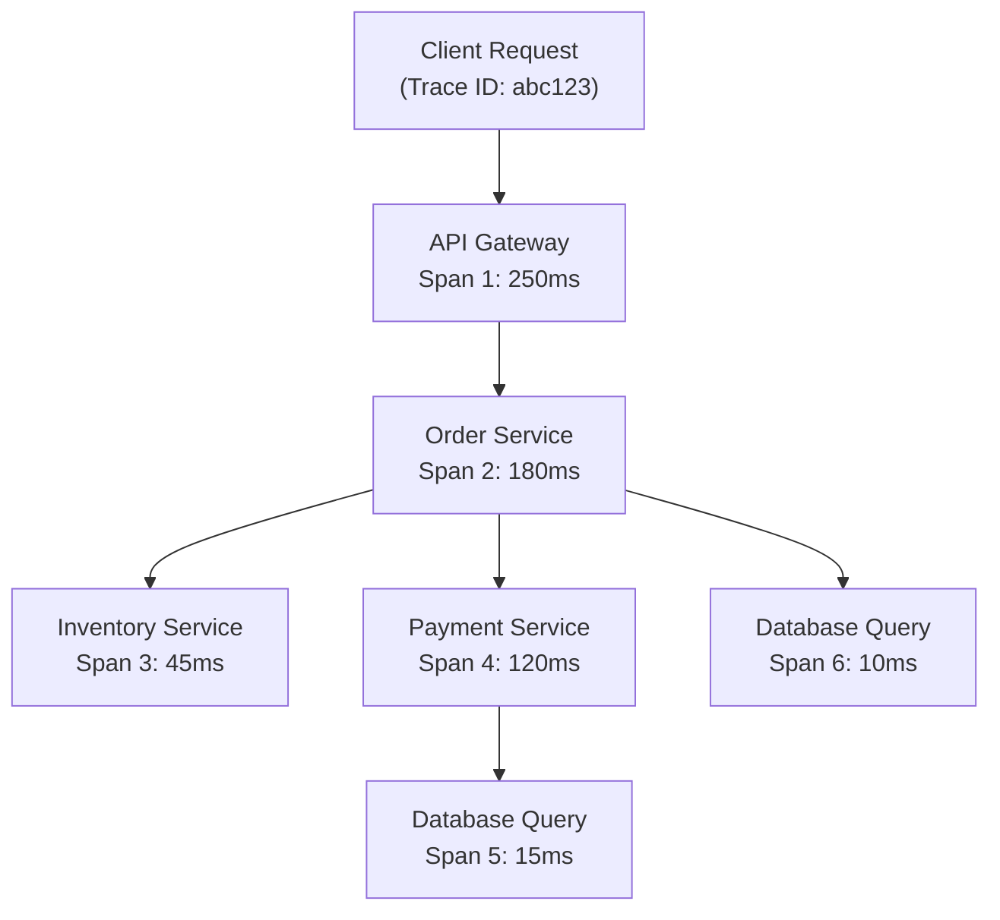

# How to Set Up Distributed Tracing with Application Insights in Azure Spring Apps

Author: [nawazdhandala](https://www.github.com/nawazdhandala)

Tags: Azure, Spring Apps, Application Insights, Distributed Tracing, Observability, Monitoring, Java

Description: Learn how to configure Application Insights for distributed tracing in Azure Spring Apps to trace requests across microservices and diagnose performance issues.

---

When a user reports that the checkout page is slow, where do you look? In a monolith, you check one application. In a microservice architecture, the request might flow through an API gateway, an order service, a payment service, and an inventory service. Without distributed tracing, finding the bottleneck is like searching for a needle in a haystack. Application Insights on Azure Spring Apps gives you end-to-end request tracing across all your microservices, automatically. This guide shows you how to set it up and use it effectively.

## What Is Distributed Tracing?

Distributed tracing tracks a single request as it moves through multiple services. Each service adds a "span" to the trace, recording the duration, status, and any errors. When you view a trace, you see the complete journey of the request - every service it touched, how long each step took, and where failures occurred.

Application Insights is Azure's APM (Application Performance Monitoring) service. It collects telemetry data including traces, metrics, logs, and exceptions. For Spring Boot applications, the Java agent instruments your code automatically - no code changes required.

## Step 1: Create an Application Insights Resource

If you do not already have an Application Insights instance, create one.

```bash
# Create an Application Insights resource
az monitor app-insights component create \
  --app my-spring-insights \
  --resource-group spring-rg \
  --location eastus \
  --kind java \
  --application-type web

# Get the connection string
AI_CONN=$(az monitor app-insights component show \
  --app my-spring-insights \
  --resource-group spring-rg \
  --query "connectionString" -o tsv)
```

## Step 2: Enable Application Insights on Azure Spring Apps

Azure Spring Apps has built-in Application Insights integration. Enable it at the service level, and all applications within the service will be instrumented.

```bash
# Enable Application Insights for the Spring Apps instance
az spring build-service update \
  --service my-spring-service \
  --resource-group spring-rg \
  --build-agent-pool-size S1

# Bind Application Insights
az spring app-insights update \
  --service my-spring-service \
  --resource-group spring-rg \
  --app-insights my-spring-insights \
  --sampling-rate 100
```

The `--sampling-rate` controls what percentage of traces are collected. 100 means every request is traced. For high-traffic production environments, a lower rate (like 10-25%) reduces costs while still providing enough data for analysis.

You can also enable it by setting the connection string as an environment variable on your applications.

```bash
# Set Application Insights connection string on each app
az spring app update \
  --name order-service \
  --service my-spring-service \
  --resource-group spring-rg \
  --env "APPLICATIONINSIGHTS_CONNECTION_STRING=$AI_CONN"
```

## Step 3: Configure Spring Boot for Application Insights

For more control over what is traced, add the Application Insights SDK to your Spring Boot application.

Add the dependency to `pom.xml`.

```xml
<!-- Application Insights SDK for Spring Boot -->
<dependency>
    <groupId>com.microsoft.azure</groupId>
    <artifactId>applicationinsights-spring-boot-starter</artifactId>
    <version>2.6.4</version>
</dependency>

<!-- OpenTelemetry support for richer tracing -->
<dependency>
    <groupId>io.opentelemetry.instrumentation</groupId>
    <artifactId>opentelemetry-spring-boot-starter</artifactId>
</dependency>
```

Configure it in `application.yml`.

```yaml
# Application Insights configuration
azure:
  application-insights:
    enabled: true
    connection-string: ${APPLICATIONINSIGHTS_CONNECTION_STRING}
    default-modules:
      # Enable automatic instrumentation for common frameworks
      SpringMVC: true
      JDBC: true
      HTTP: true
      Logging: true
    channel:
      in-process:
        developer-mode: false
        max-telemetry-buffer-capacity: 500

# Configure logging to include trace context
logging:
  pattern:
    console: "%d{yyyy-MM-dd HH:mm:ss} [%thread] [traceId=%X{traceId} spanId=%X{spanId}] %-5level %logger{36} - %msg%n"
```

The logging pattern includes `traceId` and `spanId` so you can correlate log entries with distributed traces.

## Step 4: Add Custom Spans for Business Operations

The Java agent automatically instruments HTTP calls, database queries, and message queue operations. For business-specific operations, add custom spans.

```java
// OrderService.java - Add custom spans for business logic
import io.opentelemetry.api.trace.Span;
import io.opentelemetry.api.trace.Tracer;
import org.springframework.stereotype.Service;

@Service
public class OrderService {

    private final Tracer tracer;
    private final PaymentClient paymentClient;
    private final InventoryClient inventoryClient;

    public OrderService(Tracer tracer, PaymentClient paymentClient, InventoryClient inventoryClient) {
        this.tracer = tracer;
        this.paymentClient = paymentClient;
        this.inventoryClient = inventoryClient;
    }

    public Order createOrder(OrderRequest request) {
        // Create a custom span for the order creation process
        Span span = tracer.spanBuilder("createOrder")
            .setAttribute("order.items", request.getItems().size())
            .setAttribute("order.customer_id", request.getCustomerId())
            .startSpan();

        try {
            // Validate inventory - this creates a child span automatically
            boolean available = inventoryClient.checkAvailability(request.getItems());
            span.addEvent("inventory_checked");

            if (!available) {
                span.setAttribute("order.status", "rejected");
                throw new InsufficientInventoryException("Items not available");
            }

            // Process payment - another child span
            PaymentResult payment = paymentClient.charge(request.getPaymentInfo());
            span.addEvent("payment_processed");

            // Create the order
            Order order = orderRepository.save(new Order(request, payment.getTransactionId()));
            span.setAttribute("order.id", order.getId());
            span.setAttribute("order.status", "created");

            return order;
        } catch (Exception e) {
            span.recordException(e);
            throw e;
        } finally {
            span.end();
        }
    }
}
```

## Step 5: View Traces in the Azure Portal

Navigate to your Application Insights resource in the Azure Portal and open the "Transaction search" or "Application Map" view.

**Application Map** shows a visual topology of your microservices, including the connections between them, average response times, and failure rates.

**Transaction Search** lets you find specific traces by time range, status code, or operation name.

**End-to-End Transaction Details** shows the complete waterfall view of a single request across all services.

## Step 6: Query Traces with KQL

For deeper analysis, use KQL queries in Application Insights.

```kusto
// Find the slowest requests in the last hour
requests
| where timestamp > ago(1h)
| where success == true
| order by duration desc
| take 20
| project timestamp, name, duration, cloud_RoleName, operation_Id

// View the complete trace for a specific operation
dependencies
| where operation_Id == "abc123"
| project timestamp, name, duration, type, target, success
| order by timestamp asc

// Find failed requests and their error details
requests
| where success == false
| where timestamp > ago(4h)
| summarize Count = count() by name, resultCode
| order by Count desc
```

**Find the slowest dependency (database, HTTP call, etc.):**

```kusto
// Identify slow dependencies
dependencies
| where timestamp > ago(1h)
| summarize avg(duration), percentile(duration, 95), percentile(duration, 99) by name, type
| order by percentile_duration_95 desc
```

## Step 7: Track Custom Metrics Alongside Traces

Combine tracing with custom metrics for a complete picture.

```java
// MetricsConfig.java - Register custom metrics
@Configuration
public class MetricsConfig {

    @Bean
    public MeterRegistryCustomizer<MeterRegistry> metricsCustomizer() {
        return registry -> {
            // Add common tags to all metrics
            registry.config()
                .commonTags("service", "order-service")
                .commonTags("environment", "production");
        };
    }
}
```

```java
// Track business metrics that correlate with traces
@RestController
public class OrderController {

    private final Timer orderTimer;
    private final Counter orderCounter;

    public OrderController(MeterRegistry registry) {
        // Timer for order creation duration
        this.orderTimer = Timer.builder("order.creation.time")
            .description("Time to create an order")
            .register(registry);
        // Counter for total orders
        this.orderCounter = Counter.builder("order.count")
            .description("Total orders created")
            .register(registry);
    }

    @PostMapping("/api/orders")
    public ResponseEntity<Order> createOrder(@RequestBody OrderRequest request) {
        return orderTimer.record(() -> {
            Order order = orderService.createOrder(request);
            orderCounter.increment();
            return ResponseEntity.ok(order);
        });
    }
}
```

## Distributed Trace Flow

Here is how a trace flows through a microservice architecture.



Every span shares the same Trace ID (`abc123`), which lets Application Insights reconstruct the complete request flow.

## Step 8: Set Up Smart Detection Alerts

Application Insights can automatically detect anomalies in your application's behavior.

```bash
# Create an alert for slow response times
az monitor metrics alert create \
  --name slow-response-alert \
  --resource-group spring-rg \
  --scopes "/subscriptions/{sub-id}/resourceGroups/spring-rg/providers/Microsoft.Insights/components/my-spring-insights" \
  --condition "avg requests/duration > 2000" \
  --description "Average response time exceeds 2 seconds" \
  --severity 2
```

## Sampling Strategy

For production environments with high traffic, tracing every request is expensive. Use adaptive sampling to keep costs manageable.

```yaml
# Configure adaptive sampling
azure:
  application-insights:
    channel:
      in-process:
        max-telemetry-buffer-capacity: 500
    sampling:
      percentage: 25
      include-types: "Request;Dependency;Exception"
```

A 25% sampling rate means 1 in 4 requests is fully traced. This is usually enough to identify performance issues and errors while keeping the data volume manageable.

## Troubleshooting

**No traces appearing:** Verify the Application Insights connection string is correctly set. Check the application logs for any instrumentation errors.

**Missing dependencies in traces:** Some libraries need additional instrumentation. Check the Application Insights Java agent compatibility list for your framework versions.

**High latency from telemetry collection:** If telemetry is impacting application performance, reduce the buffer capacity and increase the flush interval.

**Incomplete traces across services:** Ensure all services use the same Application Insights resource. The trace context (W3C Trace Context headers) must be propagated between services.

## Summary

Distributed tracing with Application Insights gives you deep visibility into how requests flow through your Spring Boot microservices. Azure Spring Apps makes setup easy with built-in Java agent instrumentation. For most applications, the automatic instrumentation covers HTTP calls, database queries, and message operations. Add custom spans for business-specific logic, use KQL for analysis, and configure adaptive sampling to manage costs. The ability to see the end-to-end journey of every request is what makes debugging microservice architectures practical.
