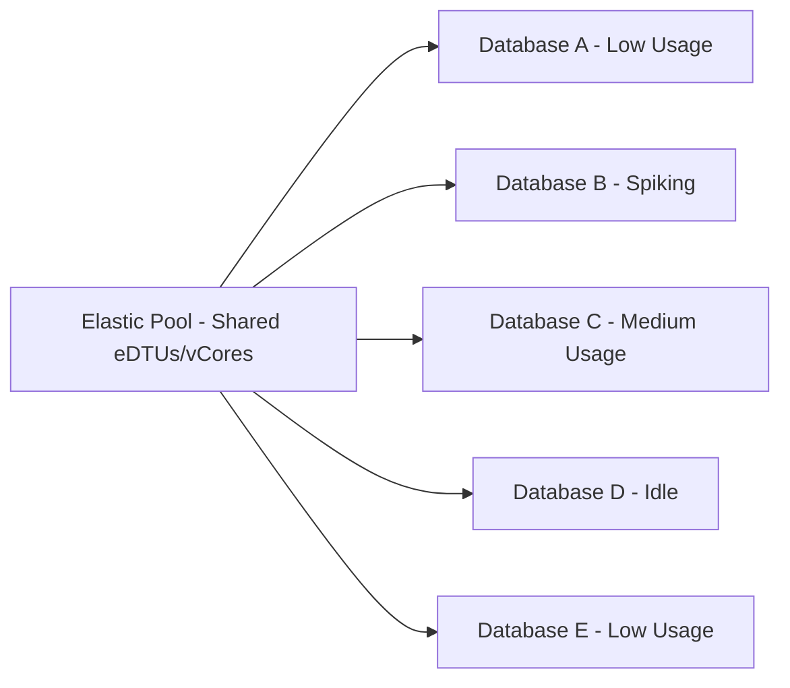

# How to Set Up Elastic Pools in Azure SQL Database to Manage Multiple Databases

Author: [nawazdhandala](https://www.github.com/nawazdhandala)

Tags: Azure SQL, Elastic Pools, Database Management, Cost Optimization, Azure, Cloud, Scaling

Description: Learn how to create and configure elastic pools in Azure SQL Database to share resources across multiple databases and reduce costs.

---

If you are managing multiple Azure SQL databases that each have unpredictable or bursty usage patterns, elastic pools can save you a significant amount of money. Instead of provisioning each database with enough resources to handle its peak load, you put them all in a shared pool where they draw from a common set of resources. One database might spike while the others are idle, and the pool handles it smoothly.

In this guide, I will explain when elastic pools make sense, walk through creating one, and show you how to manage databases within the pool.

## What Is an Elastic Pool?

An elastic pool is a collection of databases on a single Azure SQL logical server that share a set of compute and storage resources. You buy a fixed amount of resources for the pool, and the databases within it consume those resources as needed.

Think of it like a shared office building. Each tenant (database) has their own space, but they share common infrastructure like elevators, heating, and parking. During off-peak hours, one tenant might use more of the shared resources while others use less.

The key benefit is cost efficiency. Instead of paying for peak capacity on every single database, you pay for the aggregate peak of the pool.

## When Should You Use Elastic Pools?

Elastic pools work best when:

- You have multiple databases (typically 5 or more) with varying usage patterns
- Database utilization is unpredictable but averages out across the group
- The peak usage of individual databases does not all happen at the same time
- You want simplified billing for a group of databases

Elastic pools are not ideal when:

- All databases peak at the same time (e.g., all in the same time zone, same workload pattern)
- You have a single database that needs dedicated resources
- Each database needs guaranteed, consistent performance

A good rule of thumb from Microsoft's documentation is that an elastic pool becomes cost-effective when you have at least two S3 databases or at least fifteen S0 databases.



## Creating an Elastic Pool via the Azure Portal

Let me walk through the portal-based setup step by step.

### Step 1: Navigate to Your SQL Server

Go to the Azure Portal and find your logical SQL server. If you do not have one yet, create it first. Elastic pools live on a specific server, so all databases in the pool must be on the same server.

### Step 2: Create the Elastic Pool

In the server overview or from the search bar, go to "SQL elastic pools" and click "+ Create".

Fill in the basics:

- **Subscription**: Select your subscription.
- **Resource group**: Select the resource group that contains your SQL server.
- **Elastic pool name**: Pick a descriptive name like "production-pool" or "saas-tenants-pool".
- **Server**: Select your existing SQL server.

### Step 3: Configure Compute and Storage

Click "Configure elastic pool" to set the pricing tier and resource limits.

You will choose between **DTU-based** and **vCore-based** models:

- **DTU-based**: Simpler, bundled pricing. Good for straightforward workloads. Options are Basic, Standard, and Premium.
- **vCore-based**: More flexible, lets you independently configure compute and storage. Options include General Purpose and Business Critical.

For each model, set:

- **Pool eDTUs or vCores**: The total resources available to all databases in the pool.
- **Per-database settings**: The minimum and maximum resources any single database can use. The minimum can be 0, meaning a database can go fully idle. The maximum should be less than the pool total to ensure one database cannot starve the others.

For example, with a Standard pool of 200 eDTUs and 10 databases, you might set:

- Min eDTUs per database: 0
- Max eDTUs per database: 100

This means any single database can use up to half the pool's resources, but it will never consume everything.

### Step 4: Add Databases

On the "Configure elastic pool" page, you can also add existing databases to the pool. Click the "Databases" tab and select databases from your server to include in the pool.

You can also add databases after creating the pool, so do not worry if you are not ready to move everything immediately.

### Step 5: Review and Create

Review the configuration summary, paying attention to the estimated monthly cost, and click "Create". The pool is typically ready within a few minutes.

## Creating an Elastic Pool via Azure CLI

For scripting and automation, the Azure CLI works well.

```bash
# Create an elastic pool with the Standard tier and 200 eDTUs
az sql elastic-pool create \
    --resource-group myResourceGroup \
    --server myserver \
    --name my-elastic-pool \
    --edition Standard \
    --dtu 200 \
    --db-dtu-min 0 \
    --db-dtu-max 100
```

To add an existing database to the pool:

```bash
# Move an existing database into the elastic pool
az sql db update \
    --resource-group myResourceGroup \
    --server myserver \
    --name mydb \
    --elastic-pool my-elastic-pool
```

To create a new database directly in the pool:

```bash
# Create a new database inside the elastic pool
az sql db create \
    --resource-group myResourceGroup \
    --server myserver \
    --name newdb \
    --elastic-pool my-elastic-pool
```

## Creating an Elastic Pool via PowerShell

The PowerShell equivalent looks like this:

```powershell
# Create a Standard elastic pool with 200 DTUs
New-AzSqlElasticPool `
    -ResourceGroupName "myResourceGroup" `
    -ServerName "myserver" `
    -ElasticPoolName "my-elastic-pool" `
    -Edition "Standard" `
    -Dtu 200 `
    -DatabaseDtuMin 0 `
    -DatabaseDtuMax 100
```

## Managing Databases in the Pool

Once the pool is running, you can move databases in and out at any time without downtime. This is one of the great things about elastic pools - you are not locked in.

To remove a database from the pool (it becomes a standalone database):

```bash
# Move a database out of the elastic pool to standalone
az sql db update \
    --resource-group myResourceGroup \
    --server myserver \
    --name mydb \
    --service-objective S0
```

The `--service-objective` flag specifies which tier the database should move to outside the pool.

## Monitoring Pool Utilization

Monitoring is crucial to ensure your pool is sized correctly. In the Azure Portal, go to your elastic pool and check the "Resource utilization" section. Key metrics to watch include:

- **eDTU/vCore utilization percentage**: How much of the pool's total resources are being used. If this is consistently above 80%, consider scaling up.
- **Per-database resource utilization**: Which databases are the heaviest consumers. One "noisy neighbor" might need to be moved to a dedicated database.
- **Storage utilization**: The total storage used across all databases versus the pool limit.

You can also set up alerts to notify you when utilization crosses a threshold.

## Right-Sizing Your Elastic Pool

Getting the pool size right takes some iteration. Here is my approach:

1. Start by looking at the average and peak DTU or vCore usage of each database over the past 2-4 weeks.
2. Sum up the averages to estimate the baseline load.
3. Estimate the peak by looking at how many databases spike at the same time.
4. Set the pool size to handle the expected concurrent peak load with some headroom.
5. Monitor for the first few weeks and adjust as needed.

Microsoft provides a tool in the Azure Portal that recommends elastic pool configurations based on your existing databases' historical usage. Look for "Recommended elastic pools" in the SQL server blade.

## Per-Database Settings

The min and max per-database settings deserve careful thought.

**Min eDTUs/vCores per database**: Setting this above 0 guarantees a minimum performance level for each database, regardless of what other databases in the pool are doing. The total of all minimums across all databases cannot exceed the pool's total resources.

**Max eDTUs/vCores per database**: This caps how much a single database can consume. Setting this too high lets one database starve others. Setting it too low may cause performance issues during legitimate spikes.

## Cost Comparison

Let us do a quick cost comparison. Suppose you have 10 databases, each needing up to 20 DTUs at peak, but averaging only 5 DTUs.

**Without elastic pool**: 10 databases at S1 (20 DTUs each) = 200 DTUs total provisioned.

**With elastic pool**: A Standard pool with 100 eDTUs might handle the load because not all databases peak simultaneously. That is a 50% cost reduction.

The actual savings depend on your workload patterns, but 30-60% cost reductions are common with well-tuned elastic pools.

## Limitations to Keep in Mind

- All databases in a pool must be on the same logical server.
- The number of databases per pool is limited (varies by tier, typically up to 500).
- Cross-database queries are not supported within elastic pools in Azure SQL Database (they are supported in SQL Managed Instance).
- You cannot mix DTU and vCore databases in the same pool.

## Summary

Elastic pools are one of the most effective ways to manage costs when running multiple Azure SQL databases with unpredictable workloads. They let databases share resources, smooth out spikes, and simplify billing. Set up is straightforward through the Portal, CLI, or PowerShell, and you can move databases in and out of pools at any time. Monitor utilization regularly and adjust the pool size to match your actual usage patterns.
