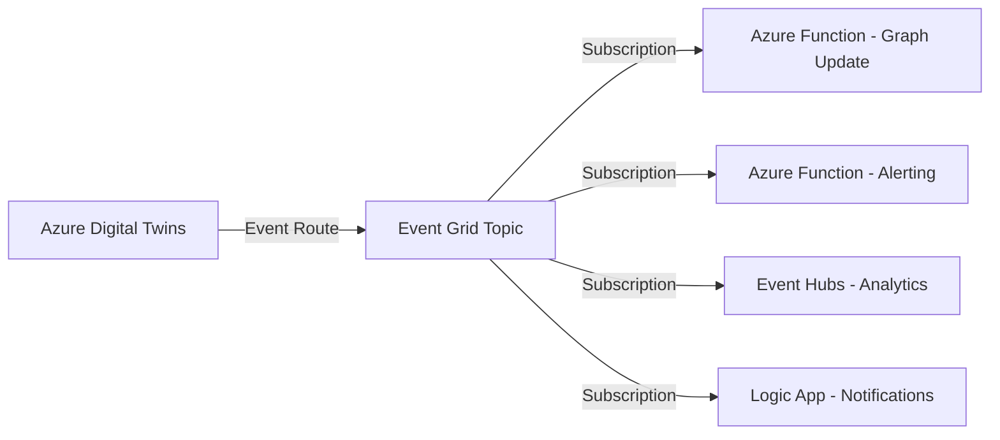
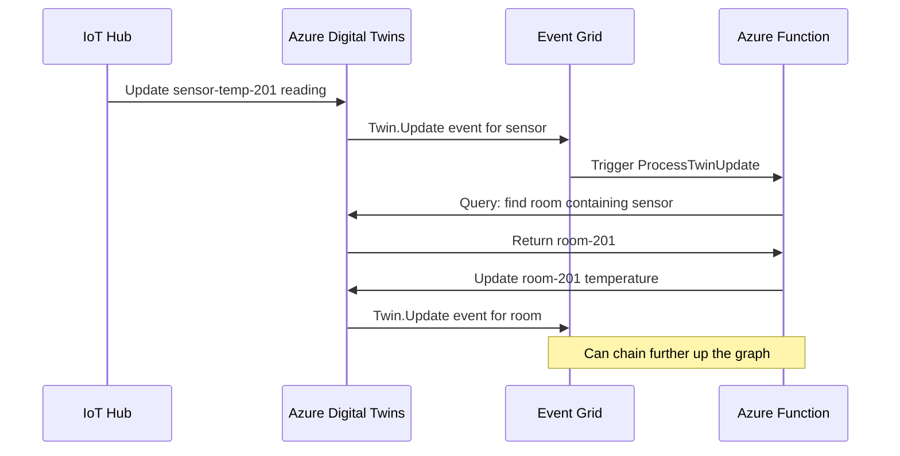

# How to Set Up Event Routes from Azure Digital Twins to Azure Functions and Event Grid

Author: [nawazdhandala](https://www.github.com/nawazdhandala)

Tags: Azure Digital Twins, Event Grid, Azure Functions, Event Routes, IoT Event Processing, Serverless, Event-Driven Architecture

Description: Learn how to set up event routes from Azure Digital Twins to Azure Functions and Event Grid for real-time processing of twin change notifications.

---

Azure Digital Twins generates events whenever twins are created, updated, deleted, or when telemetry flows through the graph. To do anything useful with these events - like updating a downstream database, triggering alerts, or propagating changes through the twin graph - you need to route them to external services. Azure Digital Twins uses Event Grid as its primary event routing mechanism, and from there you can fan out to Azure Functions, Logic Apps, Service Bus, Event Hubs, or any other Event Grid subscriber.

This guide covers setting up the complete event pipeline: creating an Event Grid topic, configuring event routes in Azure Digital Twins, and processing events in Azure Functions.

## The Event Flow Architecture

Before diving into configuration, let us understand how events flow through the system.



Azure Digital Twins emits three categories of events:

1. **Twin lifecycle events** - Created, updated, deleted
2. **Relationship lifecycle events** - Created, deleted
3. **Telemetry events** - Data flowing through the twin graph

Each event route can filter on these categories and on specific twin models, giving you fine-grained control over which events go where.

## Step 1: Create an Event Grid Topic

Event routes in Azure Digital Twins need an Event Grid topic as the destination. Create one in the same region as your Digital Twins instance.

```bash
# Create an Event Grid topic
az eventgrid topic create \
  --name adt-events-topic \
  --resource-group digital-twins-rg \
  --location eastus \
  --input-schema eventgridschema
```

## Step 2: Grant Azure Digital Twins Permission to Publish Events

Azure Digital Twins needs the "Event Grid Data Sender" role on the topic to publish events.

```bash
# Get the Azure Digital Twins managed identity principal ID
ADT_PRINCIPAL=$(az dt show \
  --dt-name my-digital-twins \
  --query identity.principalId -o tsv)

# Get the Event Grid topic resource ID
TOPIC_ID=$(az eventgrid topic show \
  --name adt-events-topic \
  --resource-group digital-twins-rg \
  --query id -o tsv)

# Assign the Event Grid Data Sender role
az role assignment create \
  --assignee "$ADT_PRINCIPAL" \
  --role "EventGrid Data Sender" \
  --scope "$TOPIC_ID"
```

If your Azure Digital Twins instance does not have a system-assigned managed identity, enable it first.

```bash
az dt create --dt-name my-digital-twins \
  --resource-group digital-twins-rg \
  --location eastus \
  --assign-identity
```

## Step 3: Create an Endpoint in Azure Digital Twins

An endpoint connects Azure Digital Twins to an external service. Create an endpoint pointing to the Event Grid topic.

```bash
# Get the Event Grid topic endpoint and key
TOPIC_ENDPOINT=$(az eventgrid topic show \
  --name adt-events-topic \
  --resource-group digital-twins-rg \
  --query endpoint -o tsv)

TOPIC_KEY=$(az eventgrid topic key list \
  --name adt-events-topic \
  --resource-group digital-twins-rg \
  --query key1 -o tsv)

# Create the endpoint in Azure Digital Twins
az dt endpoint create eventgrid \
  --dt-name my-digital-twins \
  --endpoint-name event-grid-endpoint \
  --eventgrid-resource-group digital-twins-rg \
  --eventgrid-topic adt-events-topic
```

## Step 4: Create Event Routes

Now create routes that define which events flow to the endpoint. You can create multiple routes with different filters.

```bash
# Route all twin lifecycle events
az dt route create \
  --dt-name my-digital-twins \
  --route-name twin-lifecycle-route \
  --endpoint-name event-grid-endpoint \
  --filter "type = 'Microsoft.DigitalTwins.Twin.Create' OR type = 'Microsoft.DigitalTwins.Twin.Update' OR type = 'Microsoft.DigitalTwins.Twin.Delete'"

# Route all telemetry events
az dt route create \
  --dt-name my-digital-twins \
  --route-name telemetry-route \
  --endpoint-name event-grid-endpoint \
  --filter "type = 'Microsoft.DigitalTwins.Telemetry'"

# Route relationship events
az dt route create \
  --dt-name my-digital-twins \
  --route-name relationship-route \
  --endpoint-name event-grid-endpoint \
  --filter "type = 'Microsoft.DigitalTwins.Relationship.Create' OR type = 'Microsoft.DigitalTwins.Relationship.Delete'"
```

The filter syntax supports AND, OR, and comparison operators. You can also filter by specific data properties like the twin model.

## Step 5: Create an Azure Function to Process Events

Create an Azure Function triggered by Event Grid events. This function will process twin update events and propagate changes through the graph.

A common pattern is graph propagation: when a sensor twin's temperature reading updates, the function automatically updates the room twin that contains the sensor.

```python
# function_app.py - Azure Function for processing Digital Twin events
import azure.functions as func
import json
import logging
from azure.digitaltwins.core import DigitalTwinsClient
from azure.identity import DefaultAzureCredential

app = func.FunctionApp()

# Initialize the Digital Twins client
ADT_URL = "https://my-digital-twins.api.eus.digitaltwins.azure.net"

def get_adt_client():
    credential = DefaultAzureCredential()
    return DigitalTwinsClient(ADT_URL, credential)

@app.function_name(name="ProcessTwinUpdate")
@app.event_grid_trigger(arg_name="event")
def process_twin_update(event: func.EventGridEvent):
    """Process twin update events and propagate changes through the graph."""
    logging.info(f"Received event: {event.event_type}")

    # Parse the event data
    event_data = event.get_json()
    event_type = event.event_type

    if event_type == "Microsoft.DigitalTwins.Twin.Update":
        handle_twin_update(event_data)
    elif event_type == "Microsoft.DigitalTwins.Telemetry":
        handle_telemetry(event_data, event.subject)

def handle_twin_update(event_data):
    """When a sensor twin updates, propagate to parent room."""
    client = get_adt_client()

    # The patch contains what changed
    patch = event_data.get("data", {}).get("patch", [])
    twin_id = event_data.get("data", {}).get("modelId", "")

    logging.info(f"Twin update - patches: {json.dumps(patch)}")

    # Check if this is a sensor update with a temperature reading
    for operation in patch:
        if operation.get("path") == "/reading":
            sensor_id = event_data.get("data", {}).get("$dtId", "")
            new_value = operation.get("value")

            # Find the room that contains this sensor
            query = f"""
                SELECT room
                FROM digitaltwins room
                JOIN sensor RELATED room.hasSensor
                WHERE sensor.$dtId = '{sensor_id}'
            """

            rooms = client.query_twins(query)
            for result in rooms:
                room = result.get("room", {})
                room_id = room.get("$dtId")

                if room_id:
                    # Update the room's temperature based on sensor reading
                    room_patch = [{"op": "replace", "path": "/temperature", "value": new_value}]
                    client.update_digital_twin(room_id, room_patch)
                    logging.info(f"Updated room {room_id} temperature to {new_value}")

def handle_telemetry(event_data, subject):
    """Process telemetry routed through the twin graph."""
    logging.info(f"Telemetry from twin: {subject}")
    logging.info(f"Telemetry data: {json.dumps(event_data)}")

    # Add your telemetry processing logic here
    # For example, check thresholds and trigger alerts
    telemetry = event_data.get("data", {})
    if "temperature" in telemetry and telemetry["temperature"] > 35:
        logging.warning(f"High temperature alert for twin {subject}: {telemetry['temperature']}")
```

## Step 6: Deploy the Function and Create Event Grid Subscription

Deploy the function to Azure and create an Event Grid subscription that connects the topic to the function.

```bash
# Create the Function App
az functionapp create \
  --name adt-event-processor \
  --resource-group digital-twins-rg \
  --storage-account adtfuncstorage \
  --consumption-plan-location eastus \
  --runtime python \
  --runtime-version 3.11 \
  --functions-version 4

# Deploy the function code
func azure functionapp publish adt-event-processor

# Create an Event Grid subscription pointing to the function
az eventgrid event-subscription create \
  --name adt-function-subscription \
  --source-resource-id "$TOPIC_ID" \
  --endpoint-type azurefunction \
  --endpoint /subscriptions/{sub-id}/resourceGroups/digital-twins-rg/providers/Microsoft.Web/sites/adt-event-processor/functions/ProcessTwinUpdate
```

## Event Payload Structure

Understanding the event payload is critical for writing correct handlers. Here is what a twin update event looks like.

```json
{
  "id": "unique-event-id",
  "subject": "building-hq",
  "eventType": "Microsoft.DigitalTwins.Twin.Update",
  "data": {
    "modelId": "dtmi:com:example:Building;1",
    "patch": [
      {
        "op": "replace",
        "path": "/name",
        "value": "New Headquarters"
      }
    ]
  },
  "dataVersion": "1.0",
  "metadataVersion": "1",
  "eventTime": "2026-02-16T10:30:00.000Z",
  "topic": "/subscriptions/.../providers/Microsoft.EventGrid/topics/adt-events-topic"
}
```

And a telemetry event:

```json
{
  "id": "unique-event-id",
  "subject": "sensor-temp-201",
  "eventType": "Microsoft.DigitalTwins.Telemetry",
  "data": {
    "temperature": 24.5,
    "timestamp": "2026-02-16T10:30:00.000Z"
  },
  "dataVersion": "1.0",
  "eventTime": "2026-02-16T10:30:00.000Z"
}
```

## Graph Propagation Pattern

The most common use case for event routes is graph propagation - automatically updating parent twins when child twins change. Here is the flow.



This cascading update pattern lets you maintain aggregate state at every level of the graph. A building twin can show the average temperature across all rooms, a floor twin can show its average, and each room reflects its sensors.

## Filtering Events at the Route Level

Instead of routing all events and filtering in your function, filter at the route level for better performance and lower cost.

```bash
# Only route updates to Room twins
az dt route create \
  --dt-name my-digital-twins \
  --route-name room-updates-only \
  --endpoint-name event-grid-endpoint \
  --filter "type = 'Microsoft.DigitalTwins.Twin.Update' AND STARTS_WITH($body.$metadata.$model, 'dtmi:com:example:Room')"
```

## Monitoring Event Routes

Check the health of your event routes using Azure Monitor metrics.

```bash
# List all routes and their status
az dt route list --dt-name my-digital-twins

# Check metrics for failed event deliveries
az monitor metrics list \
  --resource /subscriptions/{sub}/resourceGroups/digital-twins-rg/providers/Microsoft.DigitalTwins/digitalTwinsInstances/my-digital-twins \
  --metric "RoutingDeliveries" \
  --interval PT5M
```

Also check the Event Grid topic metrics for delivery failures and the Azure Function logs for processing errors. A healthy pipeline should show zero dead-lettered events and consistent delivery latency.

## Wrapping Up

Event routes are what make Azure Digital Twins a live, reactive system rather than a static data store. By routing twin lifecycle events and telemetry to Azure Functions through Event Grid, you can build graph propagation logic, trigger alerts, feed analytics pipelines, and keep your digital twin graph in sync with the real world. The key is to design your routes with appropriate filters so you process only the events you care about, and to structure your functions for idempotency since Event Grid guarantees at-least-once delivery.
