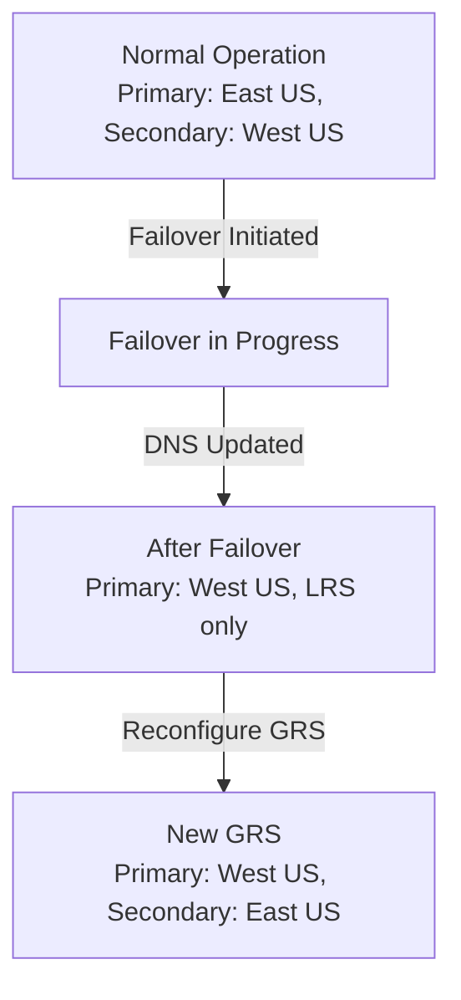

# How to Set Up Geo-Redundant Storage (GRS) and Failover for Azure Storage

Author: [nawazdhandala](https://www.github.com/nawazdhandala)

Tags: Azure, Geo-Redundant Storage, GRS, Disaster Recovery, Failover, Data Redundancy, Business Continuity

Description: A complete guide to configuring geo-redundant storage replication in Azure and performing storage account failover for disaster recovery.

---

Azure Storage replicates your data to protect against hardware failures, but the level of protection depends on the redundancy option you choose. Locally redundant storage (LRS) keeps three copies within a single datacenter, which protects against disk and server failures but not against a datacenter-level outage. Geo-redundant storage (GRS) takes it further by replicating your data to a secondary region hundreds of miles away. This guide covers how to configure GRS, understand its behavior, and perform a failover when needed.

## Understanding the Redundancy Options

Azure Storage offers six redundancy levels, but the geo-redundant ones are the focus here:

| Redundancy | Copies | Regions | Read Access to Secondary |
|-----------|--------|---------|------------------------|
| LRS | 3 | 1 (single datacenter) | No |
| ZRS | 3 | 1 (across availability zones) | No |
| GRS | 6 | 2 (3 primary + 3 secondary) | No |
| GZRS | 6 | 2 (ZRS in primary + LRS in secondary) | No |
| RA-GRS | 6 | 2 | Yes (read-only) |
| RA-GZRS | 6 | 2 | Yes (read-only) |

The key differences between the geo options:

- **GRS**: Three copies in the primary region (LRS), three copies in the secondary region (LRS). Secondary is not readable.
- **GZRS**: Three copies across availability zones in the primary (ZRS), three copies in the secondary (LRS). Better protection in the primary region.
- **RA-GRS/RA-GZRS**: Same as GRS/GZRS but the secondary region is readable. Your applications can read from the secondary endpoint even when the primary is healthy.

## Setting Up Geo-Redundant Storage

### For a New Storage Account

```bash
# Create a storage account with GRS redundancy
az storage account create \
  --name mystorageaccount \
  --resource-group myResourceGroup \
  --location eastus \
  --sku Standard_GRS \
  --kind StorageV2 \
  --access-tier Hot
```

The SKU name determines the redundancy:
- `Standard_GRS` for GRS
- `Standard_RAGRS` for RA-GRS
- `Standard_GZRS` for GZRS
- `Standard_RAGZRS` for RA-GZRS

### Upgrading an Existing Storage Account

You can change the redundancy of an existing account without downtime:

```bash
# Upgrade from LRS to GRS
az storage account update \
  --name mystorageaccount \
  --resource-group myResourceGroup \
  --sku Standard_GRS
```

When you upgrade to GRS, Azure begins replicating your existing data to the secondary region. This happens in the background and can take hours or even days depending on how much data you have. You can check the progress:

```bash
# Check the geo-replication status
az storage account show \
  --name mystorageaccount \
  --resource-group myResourceGroup \
  --query "statusOfSecondary" -o tsv
```

The status will show `available` once the initial replication is complete.

## Understanding the Secondary Endpoint

When GRS is enabled, your storage account gets a secondary endpoint in the paired region. The secondary endpoint follows this naming pattern:

- Primary: `https://mystorageaccount.blob.core.windows.net`
- Secondary: `https://mystorageaccount-secondary.blob.core.windows.net`

The same pattern applies to table, queue, and file endpoints.

### Checking Replication Status

You can check the last sync time to understand how current the secondary data is:

```bash
# Check the last sync time for geo-replication
az storage account show \
  --name mystorageaccount \
  --resource-group myResourceGroup \
  --query "geoReplicationStats" -o json
```

The `lastSyncTime` field tells you the most recent time at which data from the primary was guaranteed to be written to the secondary. Geo-replication is asynchronous, so there is always some lag - typically less than 15 minutes, but Microsoft does not provide an SLA on the replication delay.

## Reading from the Secondary Endpoint (RA-GRS)

If you are using RA-GRS or RA-GZRS, your applications can read from the secondary endpoint. This is useful for:

- Serving read traffic during a primary region outage
- Distributing read workloads across regions
- Validating that your data is properly replicated

Here is a Python example that reads from the secondary endpoint:

```python
from azure.storage.blob import BlobServiceClient
from azure.identity import DefaultAzureCredential

credential = DefaultAzureCredential()

# Connect to the secondary (read-only) endpoint
# Note the '-secondary' suffix in the URL
secondary_client = BlobServiceClient(
    account_url="https://mystorageaccount-secondary.blob.core.windows.net",
    credential=credential
)

# List containers on the secondary
containers = secondary_client.list_containers()
for container in containers:
    print(f"Container: {container.name}")

# Read a specific blob from the secondary
blob_client = secondary_client.get_blob_client("my-container", "data.json")
data = blob_client.download_blob().readall()
print(f"Blob size: {len(data)} bytes")
```

### Implementing Automatic Failover in Application Code

A well-designed application should automatically fall back to the secondary endpoint if the primary is unavailable:

```python
from azure.storage.blob import BlobServiceClient
from azure.identity import DefaultAzureCredential
import logging

def get_blob_with_failover(account_name, container, blob_name):
    """Read a blob with automatic failover to secondary endpoint."""

    credential = DefaultAzureCredential()
    primary_url = f"https://{account_name}.blob.core.windows.net"
    secondary_url = f"https://{account_name}-secondary.blob.core.windows.net"

    # Try primary first
    try:
        client = BlobServiceClient(primary_url, credential=credential)
        blob_client = client.get_blob_client(container, blob_name)
        return blob_client.download_blob().readall()
    except Exception as e:
        logging.warning(f"Primary read failed: {e}. Falling back to secondary.")

    # Fall back to secondary
    try:
        client = BlobServiceClient(secondary_url, credential=credential)
        blob_client = client.get_blob_client(container, blob_name)
        return blob_client.download_blob().readall()
    except Exception as e:
        logging.error(f"Secondary read also failed: {e}")
        raise
```

## Performing a Storage Account Failover

When the primary region experiences a prolonged outage, you can initiate a failover to promote the secondary region to primary. This is a significant operation with important implications.

### What Happens During Failover

1. The secondary region is promoted to become the new primary
2. DNS entries are updated so your existing endpoints point to the new primary region
3. After failover, the account is configured as LRS in the new primary region (geo-replication stops)
4. You need to reconfigure GRS after failover to establish replication to a new secondary



### Initiating Failover

```bash
# Initiate a storage account failover
# WARNING: This is a significant operation - data written after the last sync time may be lost
az storage account failover \
  --name mystorageaccount \
  --resource-group myResourceGroup \
  --no-wait
```

The `--no-wait` flag returns immediately since failover can take up to an hour. Check the status:

```bash
# Monitor failover progress
az storage account show \
  --name mystorageaccount \
  --resource-group myResourceGroup \
  --query "failoverInProgress" -o tsv
```

### Data Loss Considerations

Because geo-replication is asynchronous, a failover can result in data loss. Any data written to the primary after the last sync time will be lost. You can check the last sync time before deciding to fail over:

```bash
# Check last sync time to assess potential data loss
az storage account show \
  --name mystorageaccount \
  --resource-group myResourceGroup \
  --query "geoReplicationStats.lastSyncTime" -o tsv
```

If the last sync time is 10 minutes ago, you could lose up to 10 minutes of data. This is the RPO (Recovery Point Objective) for your storage account.

### After Failover

After the failover completes:

1. **Verify your application works**: Test that reads and writes succeed against the new primary endpoint. The endpoint URLs remain the same - only the underlying region changes.

2. **Reconfigure geo-replication**: The account is now LRS. Upgrade it back to GRS:

```bash
# Re-enable geo-replication after failover
az storage account update \
  --name mystorageaccount \
  --resource-group myResourceGroup \
  --sku Standard_GRS
```

3. **Update any region-specific configurations**: If you had firewall rules or private endpoints tied to the old primary region, update them.

## Testing Failover

You should test failover before you actually need it. Azure provides a way to test failover without impacting production:

1. Create a test storage account with GRS
2. Upload some test data
3. Initiate failover
4. Verify the data is accessible from the new primary
5. Time the failover to understand your RTO

Keep in mind that failover typically takes 30-60 minutes, so your RTO for storage is at least that long.

## Cost Implications

GRS roughly doubles your storage cost compared to LRS since you are storing twice the data. RA-GRS adds a small premium on top of GRS for the read access capability. The exact pricing depends on the region, but here is the general relationship:

- LRS: Base price
- ZRS: ~1.2x LRS
- GRS: ~2x LRS
- RA-GRS: ~2.1x LRS
- GZRS: ~2.4x LRS
- RA-GZRS: ~2.5x LRS

For many production workloads, the cost of GRS is justified by the protection it provides. A regional outage without geo-redundancy means total data unavailability until the region recovers, which could be hours or even days.

Geo-redundant storage is one of those features where the setup is straightforward but the operational implications need careful thought. Understand the replication lag, test your failover process, and make sure your applications can handle the eventual consistency of the secondary endpoint. When a real regional outage happens, you want to know exactly what to do and how long it will take.
