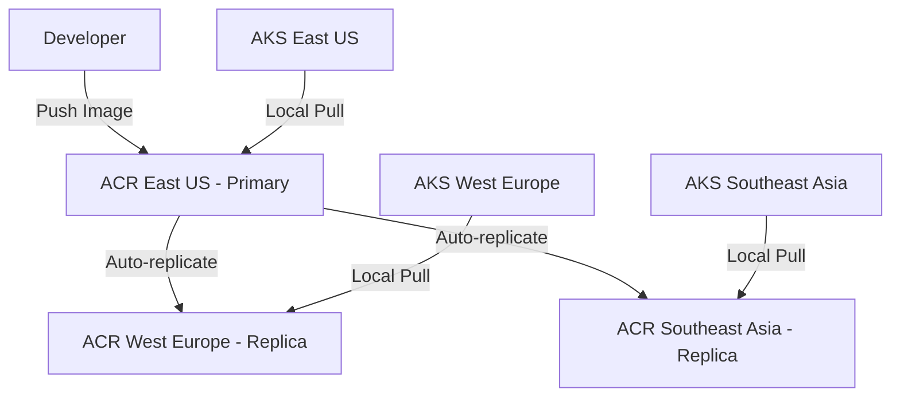

# How to Set Up Geo-Replicated Azure Container Registry for Multi-Region AKS Deployments

Author: [nawazdhandala](https://www.github.com/nawazdhandala)

Tags: ACR, Geo-Replication, Azure, AKS, Container Registry, Multi-Region, DevOps

Description: How to configure Azure Container Registry with geo-replication for faster image pulls and improved reliability across multi-region AKS deployments.

---

Running AKS clusters in multiple Azure regions improves availability and brings applications closer to users. But if all those clusters pull container images from a single registry in one region, you get slow image pulls, increased cross-region bandwidth costs, and a single point of failure. Azure Container Registry geo-replication solves this by automatically replicating your images to registries in multiple regions, so each AKS cluster pulls from a local replica.

## Why Geo-Replication Matters

Without geo-replication, an AKS cluster in Southeast Asia pulling a 500 MB image from a registry in East US has to transfer that data across the Pacific. This adds seconds to every pod startup and minutes to large-scale deployments. With geo-replication, the same cluster pulls from a local replica in the same region, with latency measured in milliseconds rather than seconds.

The benefits go beyond speed:

- **Faster pod startup**: Local pulls reduce the time between scheduling and running.
- **Resilience**: If one region has an outage, clusters in other regions still pull images.
- **Cost savings**: Intra-region data transfer is free. Cross-region transfers are not.
- **Simplified management**: Push once to one registry URL, pull from anywhere.



## Prerequisites

- Azure Container Registry on the **Premium** SKU (geo-replication requires Premium)
- AKS clusters in multiple Azure regions
- Azure CLI 2.40+
- Contributor role on the ACR and AKS resources

## Step 1: Create or Upgrade to Premium ACR

Geo-replication is only available on the Premium SKU. If you have an existing Basic or Standard ACR, upgrade it.

```bash
# Create a new Premium ACR
az acr create \
  --resource-group myResourceGroup \
  --name myregistry \
  --sku Premium \
  --location eastus

# Or upgrade an existing ACR to Premium
az acr update \
  --name myregistry \
  --sku Premium
```

## Step 2: Add Geo-Replications

Add replicas in the regions where your AKS clusters run.

```bash
# Add a replica in West Europe
az acr replication create \
  --registry myregistry \
  --location westeurope

# Add a replica in Southeast Asia
az acr replication create \
  --registry myregistry \
  --location southeastasia

# Add a replica in West US
az acr replication create \
  --registry myregistry \
  --location westus2
```

Each replication creates a read replica of all images in the registry. When you push a new image, it is replicated to all regions automatically.

## Step 3: Verify Replications

Check the status of all replicas.

```bash
# List all replications and their provisioning state
az acr replication list \
  --registry myregistry \
  --output table
```

The output shows each region and its status. All replications should show `Succeeded` in the provisioning state.

## Step 4: Connect AKS Clusters to the ACR

Attach each AKS cluster to the same ACR. The geo-replicated registry uses a single DNS name (`myregistry.azurecr.io`), and Azure automatically routes pulls to the nearest replica.

```bash
# Attach ACR to the East US AKS cluster
az aks update \
  --resource-group myRG-eastus \
  --name myAKS-eastus \
  --attach-acr myregistry

# Attach ACR to the West Europe AKS cluster
az aks update \
  --resource-group myRG-westeurope \
  --name myAKS-westeurope \
  --attach-acr myregistry

# Attach ACR to the Southeast Asia AKS cluster
az aks update \
  --resource-group myRG-southeastasia \
  --name myAKS-southeastasia \
  --attach-acr myregistry
```

All clusters use the same registry URL (`myregistry.azurecr.io`). No region-specific URLs are needed.

## Step 5: Push Images and Verify Replication

Push an image and verify it replicates to all regions.

```bash
# Log in to the registry
az acr login --name myregistry

# Tag and push an image
docker tag my-app:latest myregistry.azurecr.io/my-app:1.0.0
docker push myregistry.azurecr.io/my-app:1.0.0

# Check the image exists in all regions
az acr manifest list-metadata \
  --registry myregistry \
  --name my-app \
  --output table
```

Replication happens asynchronously. For small images (under 100 MB), replication to all regions typically completes within 30 seconds. Larger images take longer but are usually available within a few minutes.

## Step 6: Monitor Replication Status

Check the replication status for specific images.

```bash
# Show replication status for a specific repository
az acr replication show \
  --registry myregistry \
  --name westeurope \
  --query "status" \
  --output json
```

For production environments, set up alerts on replication health.

```bash
# Create a diagnostic setting to send ACR metrics to Log Analytics
az monitor diagnostic-settings create \
  --name acr-diagnostics \
  --resource "/subscriptions/<sub-id>/resourceGroups/myResourceGroup/providers/Microsoft.ContainerRegistry/registries/myregistry" \
  --workspace "<log-analytics-workspace-id>" \
  --metrics '[{"category": "AllMetrics", "enabled": true}]' \
  --logs '[{"category": "ContainerRegistryRepositoryEvents", "enabled": true}, {"category": "ContainerRegistryLoginEvents", "enabled": true}]'
```

## Step 7: Deploy to Multiple Regions

With geo-replication set up, deploying the same image to clusters in different regions uses the same image reference. Each cluster pulls from its nearest replica.

```yaml
# deployment.yaml
# This exact same manifest works in every region
# Azure routes the pull to the nearest ACR replica automatically
apiVersion: apps/v1
kind: Deployment
metadata:
  name: my-app
spec:
  replicas: 3
  selector:
    matchLabels:
      app: my-app
  template:
    metadata:
      labels:
        app: my-app
    spec:
      containers:
      - name: my-app
        # Same image reference regardless of region
        image: myregistry.azurecr.io/my-app:1.0.0
        ports:
        - containerPort: 8080
```

## Step 8: Set Up Webhook Notifications

Configure webhooks to trigger CI/CD pipelines or notifications when images are pushed or replicated.

```bash
# Create a webhook that fires when new images are pushed
az acr webhook create \
  --registry myregistry \
  --name notify-pipeline \
  --uri "https://my-ci-server.example.com/webhook/acr" \
  --actions push \
  --scope "my-app:*"
```

You can create region-specific webhooks to trigger deployments in specific clusters when images are replicated to their region.

## Cost Considerations

Geo-replication adds cost in two areas:

- **Per-replica cost**: Each replica adds a Premium SKU registry cost for that region (around $50/month as of 2026).
- **Storage duplication**: Images are stored in each region. If you have 100 GB of images and 3 replicas, you are storing 300 GB total.
- **Replication bandwidth**: Data transfer between regions for replication is charged at standard Azure egress rates.

To manage costs:

- Only replicate to regions where you have AKS clusters.
- Set up image retention policies to clean up old tags.
- Use image deduplication (shared layers across images reduce storage).

```bash
# Set up a retention policy to automatically delete untagged manifests
az acr config retention update \
  --registry myregistry \
  --status enabled \
  --days 30 \
  --type UntaggedManifests
```

## Handling Replication Lag

There is a brief window between pushing an image and it being available in all regions. For most use cases, this delay is negligible (under a minute). But if you are deploying immediately after pushing, consider these strategies:

- **Wait for replication**: Add a delay in your CI/CD pipeline between push and deploy.
- **Check replication status**: Query the replication status before triggering deployments in remote regions.
- **Deploy to the push region first**: Deploy to the region where the image was pushed, then deploy to other regions after a brief delay.

```bash
# Script to wait for replication to complete
#!/bin/bash
# wait-for-replication.sh
# Waits until an image is available in a specific region

REGISTRY="myregistry"
IMAGE="my-app"
TAG="1.0.0"
TARGET_REGION="westeurope"
MAX_RETRIES=30
RETRY_INTERVAL=10

for i in $(seq 1 $MAX_RETRIES); do
    # Check if the manifest exists in the target region
    STATUS=$(az acr replication show \
        --registry "$REGISTRY" \
        --name "$TARGET_REGION" \
        --query "status.displayStatus" \
        --output tsv)

    if [ "$STATUS" = "Ready" ]; then
        echo "Image replicated to $TARGET_REGION"
        exit 0
    fi

    echo "Waiting for replication... attempt $i/$MAX_RETRIES"
    sleep $RETRY_INTERVAL
done

echo "Replication timeout"
exit 1
```

## Private Endpoints with Geo-Replication

In enterprise environments, you may need private endpoints for each replica. Create private endpoints in each region's VNet.

```bash
# Create a private endpoint for the ACR replica in West Europe
az network private-endpoint create \
  --resource-group myRG-westeurope \
  --name acr-pe-westeurope \
  --vnet-name myVNet-westeurope \
  --subnet private-endpoints \
  --private-connection-resource-id "/subscriptions/<sub-id>/resourceGroups/myResourceGroup/providers/Microsoft.ContainerRegistry/registries/myregistry" \
  --group-id registry \
  --connection-name acr-connection-westeurope
```

Each region needs its own private endpoint and private DNS zone link to ensure local pulls go through the private network.

## Summary

Geo-replicated ACR is the foundation of reliable multi-region AKS deployments. Push once, pull locally from any region. The setup is straightforward - upgrade to Premium SKU, add replications in your target regions, and attach the same registry to all your AKS clusters. Azure handles the routing automatically. The combination of faster pulls, regional resilience, and simplified image management makes geo-replication worth the additional cost for any multi-region deployment strategy.
