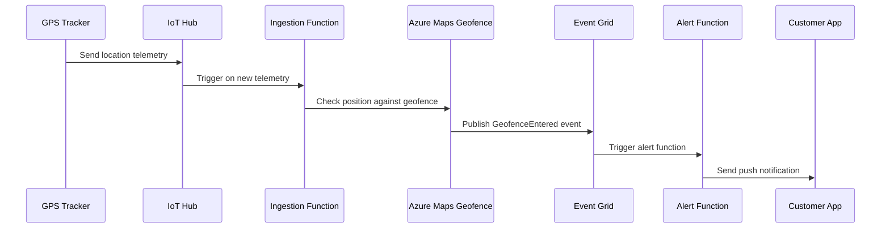

# How to Set Up Geofencing Alerts with Azure Maps and Event Grid

Author: [nawazdhandala](https://www.github.com/nawazdhandala)

Tags: Azure Maps, Geofencing, Event Grid, Location Alerts, Spatial Analytics, IoT Tracking, Azure Functions

Description: Learn how to create geofences with Azure Maps and trigger automated alerts through Event Grid when devices enter or exit defined geographic areas.

---

Geofencing is the practice of defining virtual boundaries on a map and triggering actions when a tracked object enters or exits those boundaries. It is used everywhere - fleet management systems alert dispatchers when trucks leave their assigned routes, retail apps send promotions when customers walk near a store, and safety systems notify supervisors when workers enter restricted areas. Azure Maps provides a Geofencing API that, combined with Event Grid, lets you build automated geofencing workflows without managing any spatial processing infrastructure.

This guide walks through creating geofence boundaries, checking device positions against them, and setting up automated alerts with Event Grid.

## How Azure Maps Geofencing Works

The geofencing workflow has three parts:

1. **Upload the geofence geometry** - Define the boundary as a GeoJSON polygon and upload it to Azure Maps Data Storage
2. **Check positions against the geofence** - Send device coordinates to the Geofencing API to determine if the device is inside or outside the boundary
3. **React to transitions** - Use Event Grid to automatically trigger functions when a device enters or exits the geofence

The Geofencing API evaluates each position check and returns whether the point is inside, outside, or within a configurable buffer zone around the boundary.

## Step 1: Create the Geofence Geometry

Define the geofence as a GeoJSON feature collection. Each feature is a polygon representing a zone.

```python
# create_geofence.py - Upload geofence geometry to Azure Maps
import requests
import json

AZURE_MAPS_KEY = "your-subscription-key"

# Define the geofence as GeoJSON
# This creates two zones: a warehouse zone and a delivery zone
geofence = {
    "type": "FeatureCollection",
    "features": [
        {
            "type": "Feature",
            "geometry": {
                "type": "Polygon",
                "coordinates": [[
                    [-122.3360, 47.6040],
                    [-122.3360, 47.6080],
                    [-122.3280, 47.6080],
                    [-122.3280, 47.6040],
                    [-122.3360, 47.6040]  # Close the polygon
                ]]
            },
            "properties": {
                "geometryId": "warehouse-zone",
                "name": "Main Warehouse Zone"
            }
        },
        {
            "type": "Feature",
            "geometry": {
                "type": "Polygon",
                "coordinates": [[
                    [-122.3500, 47.6180],
                    [-122.3500, 47.6230],
                    [-122.3400, 47.6230],
                    [-122.3400, 47.6180],
                    [-122.3500, 47.6180]
                ]]
            },
            "properties": {
                "geometryId": "delivery-zone-north",
                "name": "North Delivery Zone"
            }
        }
    ]
}

def upload_geofence(geojson_data: dict) -> str:
    """Upload geofence geometry to Azure Maps Data Storage.
    Returns the UDID (unique data ID) for referencing the geofence.
    """
    url = "https://us.atlas.microsoft.com/mapData"
    params = {
        "api-version": "2.0",
        "subscription-key": AZURE_MAPS_KEY,
        "dataFormat": "geojson"
    }

    response = requests.post(
        url,
        params=params,
        json=geojson_data,
        headers={"Content-Type": "application/json"}
    )

    if response.status_code == 202:
        # Long-running operation - poll for completion
        status_url = response.headers["Operation-Location"]
        return poll_upload(status_url)
    elif response.status_code == 200:
        return response.json()["udid"]
    else:
        response.raise_for_status()

def poll_upload(status_url: str) -> str:
    """Poll until the upload completes and return the UDID."""
    import time
    while True:
        response = requests.get(status_url, params={
            "subscription-key": AZURE_MAPS_KEY
        })
        data = response.json()
        if data.get("status") == "Succeeded":
            # Get the UDID from the resource location
            resource_url = data["resourceLocation"]
            return resource_url.split("/")[-1].split("?")[0]
        elif data.get("status") == "Failed":
            raise Exception(f"Upload failed: {data}")
        time.sleep(1)

# Upload the geofence and save the UDID
udid = upload_geofence(geofence)
print(f"Geofence uploaded. UDID: {udid}")
```

Save the UDID - you will need it for all subsequent geofence queries.

## Step 2: Check a Position Against the Geofence

With the geofence uploaded, you can check whether a device's coordinates fall inside or outside the boundaries.

```python
# check_geofence.py - Check if a position is inside the geofence
import requests
from datetime import datetime

AZURE_MAPS_KEY = "your-subscription-key"
GEOFENCE_UDID = "your-geofence-udid"

def check_geofence(device_id: str, lat: float, lon: float) -> dict:
    """Check a device position against the geofence.

    Returns whether the device is inside, outside, or in the buffer zone.
    """
    url = "https://atlas.microsoft.com/spatial/geofence/json"

    params = {
        "api-version": "1.0",
        "subscription-key": AZURE_MAPS_KEY,
        "deviceId": device_id,
        "udid": GEOFENCE_UDID,
        "lat": lat,
        "lon": lon,
        "searchBuffer": 50,  # Buffer zone in meters
        "isAsync": "false",
        "mode": "EnterAndExit"  # Track both enter and exit events
    }

    response = requests.get(url, params=params)
    response.raise_for_status()
    data = response.json()

    results = []
    for geometry in data.get("geometries", []):
        result = {
            "geometryId": geometry["geometryId"],
            "distance": geometry["distance"],  # Negative = inside, positive = outside
            "nearestLat": geometry.get("nearestLat"),
            "nearestLon": geometry.get("nearestLon")
        }

        # Interpret the distance value
        if geometry["distance"] < 0:
            result["status"] = "inside"
        elif geometry["distance"] <= 50:  # Within buffer zone
            result["status"] = "buffer"
        else:
            result["status"] = "outside"

        results.append(result)

    return {
        "deviceId": device_id,
        "timestamp": datetime.utcnow().isoformat(),
        "isEventPublished": data.get("isEventPublished", False),
        "zones": results
    }

# Simulate a delivery truck moving
positions = [
    ("truck-01", 47.6060, -122.3320),  # Inside warehouse zone
    ("truck-01", 47.6100, -122.3300),  # Outside all zones
    ("truck-01", 47.6200, -122.3450),  # Inside delivery zone
    ("truck-01", 47.6250, -122.3450),  # Outside delivery zone
]

for device_id, lat, lon in positions:
    result = check_geofence(device_id, lat, lon)
    print(f"\nDevice: {result['deviceId']} at ({lat}, {lon})")
    for zone in result['zones']:
        print(f"  Zone {zone['geometryId']}: {zone['status']} (distance: {zone['distance']:.1f}m)")
```

## Step 3: Set Up Event Grid Integration

The real power of geofencing comes from automatic notifications when devices cross boundaries. Azure Maps publishes events to Event Grid when geofence transitions occur.

First, register the Azure Maps resource as an Event Grid publisher.

```bash
# Create an Event Grid subscription for geofence events on your Azure Maps account
MAPS_RESOURCE_ID=$(az maps account show \
  --name my-maps-account \
  --resource-group maps-rg \
  --query id -o tsv)

# Create a Function App to handle the events (or use an existing one)
FUNC_RESOURCE_ID="/subscriptions/{sub-id}/resourceGroups/maps-rg/providers/Microsoft.Web/sites/geofence-handler/functions/ProcessGeofenceEvent"

# Create the Event Grid subscription
az eventgrid event-subscription create \
  --name geofence-alerts \
  --source-resource-id "$MAPS_RESOURCE_ID" \
  --endpoint-type azurefunction \
  --endpoint "$FUNC_RESOURCE_ID" \
  --included-event-types \
    "Microsoft.Maps.GeofenceEntered" \
    "Microsoft.Maps.GeofenceExited" \
    "Microsoft.Maps.GeofenceResult"
```

## Step 4: Create an Azure Function to Process Geofence Events

This function handles the events published by Azure Maps when devices enter or exit geofences.

```python
# function_app.py - Process geofence events from Azure Maps
import azure.functions as func
import json
import logging

app = func.FunctionApp()

@app.function_name(name="ProcessGeofenceEvent")
@app.event_grid_trigger(arg_name="event")
def process_geofence_event(event: func.EventGridEvent):
    """Handle geofence enter/exit events from Azure Maps."""
    event_type = event.event_type
    event_data = event.get_json()

    logging.info(f"Received geofence event: {event_type}")
    logging.info(f"Event data: {json.dumps(event_data)}")

    device_id = event_data.get("deviceId", "unknown")
    geometries = event_data.get("geometries", [])

    if event_type == "Microsoft.Maps.GeofenceEntered":
        for geo in geometries:
            zone_id = geo.get("geometryId", "unknown")
            logging.info(f"Device {device_id} ENTERED zone {zone_id}")
            handle_zone_entry(device_id, zone_id, event_data)

    elif event_type == "Microsoft.Maps.GeofenceExited":
        for geo in geometries:
            zone_id = geo.get("geometryId", "unknown")
            logging.info(f"Device {device_id} EXITED zone {zone_id}")
            handle_zone_exit(device_id, zone_id, event_data)


def handle_zone_entry(device_id: str, zone_id: str, event_data: dict):
    """Process a device entering a geofence zone."""
    if zone_id == "warehouse-zone":
        # Truck returned to warehouse - update delivery status
        logging.info(f"Truck {device_id} arrived at warehouse")
        # Update delivery management system
        # Send notification to dispatch

    elif zone_id.startswith("delivery-zone"):
        # Truck entered a delivery zone - notify customer
        logging.info(f"Truck {device_id} entered delivery zone {zone_id}")
        # Send "Your delivery is nearby" notification
        # Update estimated arrival time


def handle_zone_exit(device_id: str, zone_id: str, event_data: dict):
    """Process a device exiting a geofence zone."""
    if zone_id == "warehouse-zone":
        # Truck left the warehouse - delivery run started
        logging.info(f"Truck {device_id} departed warehouse")
        # Start tracking delivery progress
        # Update ETA calculations

    elif zone_id.startswith("delivery-zone"):
        # Truck left a delivery zone - delivery likely complete
        logging.info(f"Truck {device_id} left delivery zone {zone_id}")
        # Mark delivery as completed
        # Move to next stop
```

## End-to-End Architecture

Here is the complete flow from a GPS tracker to an alert notification.



## Continuous Tracking with IoT Hub Integration

In a real system, GPS positions come from IoT devices through IoT Hub. Here is how to wire up the continuous tracking.

```python
# continuous_tracking.py - Bridge IoT Hub telemetry to geofence checks
import azure.functions as func
import json
import logging
import requests
import os

app = func.FunctionApp()

AZURE_MAPS_KEY = os.environ["AZURE_MAPS_KEY"]
GEOFENCE_UDID = os.environ["GEOFENCE_UDID"]

@app.function_name(name="TrackDeviceLocation")
@app.event_hub_message_trigger(
    arg_name="events",
    event_hub_name="my-iot-hub",
    connection="IoTHubConnectionString",
    cardinality="many"
)
def track_device_location(events: list[func.EventHubEvent]):
    """Check each incoming GPS position against the geofence."""
    for event in events:
        try:
            body = json.loads(event.get_body().decode("utf-8"))
            device_id = event.iothub_metadata.get("connection-device-id")

            # Extract GPS coordinates from the telemetry
            lat = body.get("latitude") or body.get("lat")
            lon = body.get("longitude") or body.get("lon")

            if lat and lon and device_id:
                # Check against the geofence
                # The API automatically publishes events to Event Grid
                # when transitions occur
                url = "https://atlas.microsoft.com/spatial/geofence/json"
                params = {
                    "api-version": "1.0",
                    "subscription-key": AZURE_MAPS_KEY,
                    "deviceId": device_id,
                    "udid": GEOFENCE_UDID,
                    "lat": lat,
                    "lon": lon,
                    "searchBuffer": 50,
                    "isAsync": "true",  # Async mode publishes events to Event Grid
                    "mode": "EnterAndExit"
                }

                response = requests.get(url, params=params)
                logging.info(f"Geofence check for {device_id}: {response.status_code}")

        except Exception as e:
            logging.error(f"Error processing event: {str(e)}")
```

## Dynamic Geofences

Sometimes geofences need to change - a delivery zone shifts, a construction site moves, or a temporary restricted area is set up. You can update the geofence geometry by uploading new GeoJSON to the same UDID.

```python
def update_geofence(udid: str, new_geojson: dict):
    """Update an existing geofence with new geometry."""
    url = f"https://us.atlas.microsoft.com/mapData/{udid}"
    params = {
        "api-version": "2.0",
        "subscription-key": AZURE_MAPS_KEY,
        "dataFormat": "geojson"
    }

    response = requests.put(url, params=params, json=new_geojson)
    response.raise_for_status()
    print(f"Geofence {udid} updated successfully")
```

## Buffer Zones and Sensitivity

The `searchBuffer` parameter controls the sensitivity of geofence detection. A larger buffer (e.g., 100 meters) triggers events before the device actually reaches the boundary, which is useful for early warnings. A smaller buffer (e.g., 10 meters) requires the device to be very close to the boundary, which reduces false positives but requires more accurate GPS data.

GPS accuracy on consumer devices is typically 3-5 meters in open sky and 10-20 meters in urban canyons. Set your buffer size with this in mind - if your GPS is accurate to 10 meters, a buffer smaller than 10 meters will produce unreliable results.

## Wrapping Up

Azure Maps geofencing combined with Event Grid gives you a serverless, event-driven system for tracking when objects enter or leave defined areas. The workflow is straightforward: define your boundaries as GeoJSON, upload them to Azure Maps, check device positions against the geofence (either on-demand or continuously via IoT Hub), and let Event Grid route the transition events to your processing logic. The most important design decisions are the geofence shape (matching your real-world zones accurately), the buffer size (balancing sensitivity with GPS accuracy), and the event processing logic (what actually happens when a boundary is crossed).
