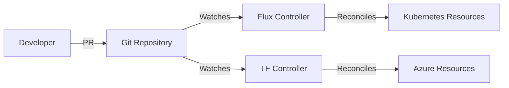

# How to Set Up GitOps for Azure Infrastructure Using Flux and Terraform

Author: [nawazdhandala](https://www.github.com/nawazdhandala)

Tags: GitOps, Azure, Flux, Terraform, Kubernetes, Infrastructure as Code, CI/CD

Description: Set up a GitOps workflow for Azure infrastructure using Flux CD and Terraform to enable declarative, git-driven infrastructure management with automated reconciliation.

---

GitOps takes the idea of Infrastructure as Code one step further. Instead of running `terraform apply` from a pipeline or your laptop, you declare the desired state in a Git repository and let an automated controller continuously reconcile actual state with desired state. Changes happen through pull requests, and the system self-heals when it detects drift.

While GitOps is most commonly associated with Kubernetes workloads (and Flux excels at that), the pattern works for Terraform-managed Azure infrastructure too. In this post, I will show you how to set up a GitOps workflow that combines Flux for Kubernetes resources and Terraform for Azure infrastructure, with Git as the single source of truth for both.

## The GitOps Model

The traditional CI/CD approach for Terraform is push-based: you push code, the pipeline runs `terraform apply`. GitOps flips this to a pull-based model: a controller watches the Git repository and pulls changes when it detects them.



For Kubernetes resources, Flux handles reconciliation natively. For Terraform resources, we use the Terraform Controller for Flux (tf-controller), which runs Terraform within the cluster and reconciles based on Git state.

## Prerequisites

You need:

- An AKS cluster (or any Kubernetes cluster)
- Flux CLI installed locally
- A Git repository for your infrastructure definitions
- Azure credentials for Terraform to manage resources

## Step 1: Install Flux on the AKS Cluster

Bootstrap Flux into your AKS cluster connected to your Git repository:

```bash
# Install the Flux CLI
curl -s https://fluxcd.io/install.sh | bash

# Bootstrap Flux with your GitHub repository
flux bootstrap github \
  --owner=my-org \
  --repository=azure-infrastructure \
  --branch=main \
  --path=clusters/production \
  --personal
```

This installs the Flux controllers and creates the initial repository structure. Flux will now watch the `clusters/production` path in your repo for Kubernetes manifests.

## Step 2: Install the Terraform Controller

The tf-controller extends Flux to manage Terraform resources. Install it as a Flux HelmRelease:

```yaml
# clusters/production/tf-controller/namespace.yaml
apiVersion: v1
kind: Namespace
metadata:
  name: flux-system
---
# clusters/production/tf-controller/helmrepository.yaml
apiVersion: source.toolkit.fluxcd.io/v1beta2
kind: HelmRepository
metadata:
  name: tf-controller
  namespace: flux-system
spec:
  interval: 1h
  url: https://flux-iac.github.io/tofu-controller/
---
# clusters/production/tf-controller/helmrelease.yaml
apiVersion: helm.toolkit.fluxcd.io/v2beta1
kind: HelmRelease
metadata:
  name: tf-controller
  namespace: flux-system
spec:
  interval: 1h
  chart:
    spec:
      chart: tf-controller
      version: ">=0.15.0"
      sourceRef:
        kind: HelmRepository
        name: tf-controller
  values:
    runner:
      image:
        repository: ghcr.io/flux-iac/tf-runner
        tag: v0.15.1
    # Resource limits for the controller
    resources:
      limits:
        memory: 1Gi
      requests:
        cpu: 200m
        memory: 256Mi
```

Commit and push these files. Flux picks them up and installs the Terraform controller.

## Step 3: Configure Azure Credentials

The Terraform controller needs Azure credentials to manage resources. Create a Kubernetes secret with the service principal:

```bash
# Create a secret with Azure credentials for Terraform
kubectl create secret generic azure-credentials \
  --namespace=flux-system \
  --from-literal=ARM_CLIENT_ID="your-client-id" \
  --from-literal=ARM_CLIENT_SECRET="your-client-secret" \
  --from-literal=ARM_SUBSCRIPTION_ID="your-subscription-id" \
  --from-literal=ARM_TENANT_ID="your-tenant-id"
```

For production, use a sealed secret or an external secrets operator to manage these securely.

## Step 4: Define Terraform Resources in Git

Create your Terraform configurations in the repository. The tf-controller will watch these and apply them:

```
azure-infrastructure/
  clusters/
    production/
      tf-controller/       # Controller installation
      terraform/           # Terraform resource definitions
  terraform/
    modules/               # Reusable Terraform modules
    environments/
      production/
        networking/
          main.tf
          variables.tf
        compute/
          main.tf
          variables.tf
```

Here is a Terraform configuration for a resource group and storage account:

```hcl
# terraform/environments/production/networking/main.tf

terraform {
  required_version = ">= 1.5.0"

  # Backend is managed by the tf-controller
  backend "kubernetes" {
    secret_suffix = "networking-prod"
    namespace     = "flux-system"
  }

  required_providers {
    azurerm = {
      source  = "hashicorp/azurerm"
      version = "~> 3.80"
    }
  }
}

provider "azurerm" {
  features {}
}

resource "azurerm_resource_group" "networking" {
  name     = "rg-networking-prod"
  location = "eastus2"
  tags = {
    Environment = "production"
    ManagedBy   = "GitOps-Terraform"
  }
}

resource "azurerm_virtual_network" "main" {
  name                = "vnet-prod"
  location            = azurerm_resource_group.networking.location
  resource_group_name = azurerm_resource_group.networking.name
  address_space       = ["10.0.0.0/16"]
}

resource "azurerm_subnet" "aks" {
  name                 = "snet-aks"
  resource_group_name  = azurerm_resource_group.networking.name
  virtual_network_name = azurerm_virtual_network.main.name
  address_prefixes     = ["10.0.0.0/20"]
}
```

## Step 5: Create Terraform Custom Resources

Now tell the tf-controller to manage this Terraform configuration by creating a `Terraform` custom resource:

```yaml
# clusters/production/terraform/networking.yaml
apiVersion: infra.contrib.fluxcd.io/v1alpha2
kind: Terraform
metadata:
  name: networking-prod
  namespace: flux-system
spec:
  # Reconcile every 10 minutes
  interval: 10m

  # Path to the Terraform files in the Git repository
  path: ./terraform/environments/production/networking

  # Git source reference
  sourceRef:
    kind: GitRepository
    name: flux-system

  # Azure credentials from the secret
  runnerPodTemplate:
    spec:
      envFrom:
        - secretRef:
            name: azure-credentials

  # Auto-approve and apply changes
  approvePlan: auto

  # Force a plan if no changes detected in 1 hour (drift detection)
  retryInterval: 1h

  # Store plan output for auditing
  storeReadablePlan: human

  # Destroy resources if this CR is deleted (optional)
  destroyResourcesOnDeletion: true
```

The `approvePlan: auto` setting means any changes detected by `terraform plan` are automatically applied. For production, you might want manual approval:

```yaml
  # Require manual approval for production changes
  approvePlan: ""  # Empty string means manual approval required
```

With manual approval, the controller runs `terraform plan` and stores the result. You approve the plan by annotating the resource:

```bash
# View the pending plan
kubectl get terraform networking-prod -n flux-system -o yaml

# Approve the plan
kubectl annotate terraform networking-prod \
  -n flux-system \
  "infra.contrib.fluxcd.io/approve=true"
```

## Step 6: Multi-Component Setup

For a real infrastructure, you will have multiple Terraform configurations. Here is how to set up dependencies between them:

```yaml
# clusters/production/terraform/compute.yaml
apiVersion: infra.contrib.fluxcd.io/v1alpha2
kind: Terraform
metadata:
  name: compute-prod
  namespace: flux-system
spec:
  interval: 10m
  path: ./terraform/environments/production/compute
  sourceRef:
    kind: GitRepository
    name: flux-system
  runnerPodTemplate:
    spec:
      envFrom:
        - secretRef:
            name: azure-credentials
  approvePlan: auto

  # Depend on networking being ready first
  dependsOn:
    - name: networking-prod

  # Read outputs from the networking Terraform
  readInputsFromSecrets:
    - name: tfstate-default-networking-prod  # State secret from networking
      as: networking
```

## Step 7: Drift Detection and Self-Healing

The tf-controller automatically detects drift by running `terraform plan` at the configured interval. If Azure resources have been modified outside of Git, the controller detects the difference and reconciles:

```yaml
spec:
  # Check for drift every 10 minutes
  interval: 10m

  # Force reconciliation to detect drift even when Git has not changed
  retryInterval: 30m

  # When drift is detected, automatically apply the correct state
  approvePlan: auto
```

This is the core of GitOps - the system continuously ensures that reality matches the declared state in Git. If someone manually changes a network security group rule in the Azure portal, the controller reverts it on the next reconciliation cycle.

## Monitoring the GitOps Pipeline

Monitor the status of your Terraform reconciliation:

```bash
# Check the status of all Terraform resources
kubectl get terraform -n flux-system

# View detailed status including plan output
kubectl describe terraform networking-prod -n flux-system

# Check Flux source reconciliation
flux get sources git

# View controller logs for debugging
kubectl logs -n flux-system deployment/tf-controller -f
```

Set up alerts for failed reconciliations:

```yaml
# clusters/production/monitoring/tf-alerts.yaml
apiVersion: notification.toolkit.fluxcd.io/v1beta3
kind: Alert
metadata:
  name: terraform-alerts
  namespace: flux-system
spec:
  providerRef:
    name: slack  # Reference to a Slack notification provider
  eventSeverity: error
  eventSources:
    - kind: Terraform
      name: "*"
      namespace: flux-system
```

## The Git Workflow

With everything in place, the workflow for making infrastructure changes is:

1. Create a feature branch
2. Modify the Terraform files
3. Open a pull request - CI runs `terraform plan` for review
4. Review the plan output in the PR
5. Merge to main
6. Flux detects the change and the tf-controller runs `terraform apply`
7. The controller reports success or failure back

No one runs Terraform locally. No one has production credentials on their machine. All changes flow through Git with full audit history.

## When to Use This vs Traditional CI/CD

GitOps with Flux and Terraform adds value when:

- You want continuous drift detection and automatic remediation
- You need a clear audit trail of every infrastructure change
- Multiple teams contribute to infrastructure and you need a consistent workflow
- You are already using Flux for Kubernetes workloads and want a unified approach

Traditional CI/CD pipelines are simpler when:

- Your team is small and infrastructure changes are infrequent
- You do not have a Kubernetes cluster to run the controllers
- You need complex approval workflows that are easier to model in CI/CD

## Wrapping Up

GitOps for Azure infrastructure with Flux and Terraform gives you a declarative, self-healing infrastructure management system. Git becomes the single source of truth, Flux provides the reconciliation loop, and the Terraform controller bridges the gap between Kubernetes-native GitOps and Azure resource management. The setup requires some initial investment, but the payoff is a system that continuously ensures your infrastructure matches your code.
