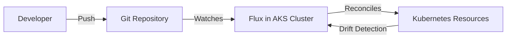

# How to Set Up GitOps with Flux v2 for Continuous Deployment on AKS

Author: [nawazdhandala](https://www.github.com/nawazdhandala)

Tags: AKS, GitOps, Flux, Continuous Deployment, Kubernetes, Azure, Infrastructure as Code

Description: Step-by-step tutorial on setting up Flux v2 for GitOps-based continuous deployment on AKS clusters with automated reconciliation.

---

GitOps is the practice of using Git as the single source of truth for your infrastructure and application configuration. Instead of running kubectl commands or triggering CI/CD pipelines to apply changes, you push changes to a Git repository and a controller in the cluster detects and applies them automatically. Flux v2 is the leading GitOps toolkit for Kubernetes, and it integrates cleanly with AKS.

## Why GitOps Over Traditional CI/CD

Traditional deployment pipelines push changes to the cluster. A CI/CD tool builds the image, runs tests, and then executes kubectl or helm commands against the cluster. This creates several problems:

- The CI/CD tool needs cluster credentials, expanding the attack surface.
- If someone makes a manual change with kubectl, the cluster drifts from what the pipeline deployed.
- There is no single place to see the desired state of the cluster.

GitOps flips this. The cluster pulls its desired state from Git and continuously reconciles. If someone makes a manual change, Flux reverts it. If a new commit appears in Git, Flux applies it. The Git repository becomes the audit log, the rollback mechanism, and the source of truth all at once.



## Prerequisites

- An AKS cluster running Kubernetes 1.24+
- A GitHub or Azure DevOps repository for your Kubernetes manifests
- Azure CLI installed
- Flux CLI installed (https://fluxcd.io/docs/installation/)
- GitHub personal access token with repo permissions (if using GitHub)

## Step 1: Install the Flux CLI

Install the Flux CLI on your local machine.

```bash
# Install Flux CLI on macOS
brew install fluxcd/tap/flux

# Or install on Linux
curl -s https://fluxcd.io/install.sh | sudo bash

# Verify the installation
flux --version
```

Check that your cluster meets the prerequisites.

```bash
# Run the pre-flight check against your AKS cluster
flux check --pre
```

This verifies that your cluster has the necessary API versions and RBAC permissions for Flux.

## Step 2: Bootstrap Flux on the Cluster

Bootstrap installs Flux components on the cluster and creates the Git repository structure. If using GitHub, run the following.

```bash
# Export your GitHub personal access token
export GITHUB_TOKEN=<your-token>

# Bootstrap Flux on the AKS cluster
# This creates Flux controllers and a GitRepository source pointing to your repo
flux bootstrap github \
  --owner=my-org \
  --repository=fleet-config \
  --branch=main \
  --path=clusters/production \
  --personal
```

This command does several things:

1. Creates the `fleet-config` repository if it does not exist.
2. Installs Flux controllers (source-controller, kustomize-controller, helm-controller, notification-controller) in the `flux-system` namespace.
3. Creates a `GitRepository` source pointing at the repository.
4. Creates a `Kustomization` that applies manifests from the `clusters/production` path.

## Step 3: Organize the Repository Structure

A well-structured GitOps repository makes it easier to manage multiple environments and applications. Here is a recommended layout.

```
fleet-config/
  clusters/
    production/
      apps.yaml          # Kustomization pointing to apps/production
      infrastructure.yaml # Kustomization pointing to infrastructure
    staging/
      apps.yaml
      infrastructure.yaml
  apps/
    base/
      my-app/
        deployment.yaml
        service.yaml
        kustomization.yaml
    production/
      my-app/
        kustomization.yaml  # Patches for production
    staging/
      my-app/
        kustomization.yaml  # Patches for staging
  infrastructure/
    sources/
      helm-repos.yaml
    nginx-ingress/
      release.yaml
    cert-manager/
      release.yaml
```

## Step 4: Define a Kustomization for Your Application

Create the `apps.yaml` file in the `clusters/production` directory to tell Flux where to find application manifests.

```yaml
# clusters/production/apps.yaml
# Tells Flux to reconcile application manifests from the apps/production directory
apiVersion: kustomize.toolkit.fluxcd.io/v1
kind: Kustomization
metadata:
  name: apps
  namespace: flux-system
spec:
  interval: 5m
  retryInterval: 1m
  timeout: 3m
  sourceRef:
    kind: GitRepository
    name: flux-system
  path: ./apps/production
  prune: true
  # Health checks ensure resources are actually running
  healthChecks:
  - apiVersion: apps/v1
    kind: Deployment
    name: my-app
    namespace: production
  # Wait for dependencies (infrastructure) before deploying apps
  dependsOn:
  - name: infrastructure
```

Key settings:

- **interval: 5m** - Flux checks for changes every 5 minutes.
- **prune: true** - If you remove a resource from Git, Flux deletes it from the cluster.
- **healthChecks** - Flux monitors deployment health and reports status.
- **dependsOn** - Apps deploy after infrastructure is ready.

## Step 5: Deploy Helm Releases with Flux

Flux can manage Helm releases declaratively. Define a HelmRepository source and a HelmRelease.

```yaml
# infrastructure/sources/helm-repos.yaml
# HelmRepository source for the ingress-nginx chart
apiVersion: source.toolkit.fluxcd.io/v1
kind: HelmRepository
metadata:
  name: ingress-nginx
  namespace: flux-system
spec:
  interval: 1h
  url: https://kubernetes.github.io/ingress-nginx
```

```yaml
# infrastructure/nginx-ingress/release.yaml
# HelmRelease that Flux manages
# Flux installs, upgrades, and rolls back this release automatically
apiVersion: helm.toolkit.fluxcd.io/v2
kind: HelmRelease
metadata:
  name: ingress-nginx
  namespace: ingress-nginx
spec:
  interval: 10m
  chart:
    spec:
      chart: ingress-nginx
      version: "4.8.x"
      sourceRef:
        kind: HelmRepository
        name: ingress-nginx
        namespace: flux-system
  values:
    controller:
      replicaCount: 2
      service:
        annotations:
          service.beta.kubernetes.io/azure-load-balancer-health-probe-request-path: /healthz
  # Automated rollback on upgrade failure
  upgrade:
    remediation:
      retries: 3
      remediateLastFailure: true
  # Rollback configuration
  rollback:
    cleanupOnFail: true
    recreate: false
```

The `upgrade.remediation` section tells Flux to retry a failed upgrade up to 3 times and then roll back to the last successful version. This gives you automated rollbacks for Helm releases managed through GitOps.

## Step 6: Set Up Image Automation

Flux can automatically update your Git repository when new container images are pushed. This closes the loop between building images and deploying them.

```bash
# Install image automation controllers
flux bootstrap github \
  --owner=my-org \
  --repository=fleet-config \
  --branch=main \
  --path=clusters/production \
  --components-extra=image-reflector-controller,image-automation-controller
```

Create an ImageRepository to watch for new tags.

```yaml
# apps/production/my-app/image-policy.yaml
# Watch ACR for new image tags matching semver pattern
apiVersion: image.toolkit.fluxcd.io/v1beta2
kind: ImageRepository
metadata:
  name: my-app
  namespace: flux-system
spec:
  image: myacr.azurecr.io/my-app
  interval: 5m
  provider: azure
---
# Only use tags that match semantic versioning
apiVersion: image.toolkit.fluxcd.io/v1beta2
kind: ImagePolicy
metadata:
  name: my-app
  namespace: flux-system
spec:
  imageRepositoryRef:
    name: my-app
  policy:
    semver:
      range: ">=1.0.0"
```

Add a marker comment in your deployment manifest so Flux knows where to update the tag.

```yaml
# apps/base/my-app/deployment.yaml
containers:
- name: my-app
  image: myacr.azurecr.io/my-app:1.2.3 # {"$imagepolicy": "flux-system:my-app"}
```

When a new image tag matching the semver policy appears in ACR, Flux commits an update to the Git repository, which then triggers reconciliation.

## Step 7: Monitor Flux Status

Check the status of your Flux resources.

```bash
# View all Flux resources and their status
flux get all

# Check a specific Kustomization
flux get kustomizations

# Check Helm releases
flux get helmreleases --all-namespaces

# View Flux events
flux events

# Force reconciliation if you do not want to wait
flux reconcile kustomization apps --with-source
```

## Handling Secrets in GitOps

Secrets cannot go into Git in plain text. Flux integrates with Mozilla SOPS for encrypting secrets in the repository.

```bash
# Create a SOPS-encrypted secret
# First, create the secret YAML
kubectl create secret generic db-credentials \
  --from-literal=password=mysecretpassword \
  --dry-run=client -o yaml > secret.yaml

# Encrypt with SOPS using an Azure Key Vault key
sops --encrypt --azure-kv https://myvault.vault.azure.net/keys/sops-key/abc123 \
  secret.yaml > secret.enc.yaml
```

Configure Flux to decrypt SOPS secrets.

```yaml
# clusters/production/apps.yaml
apiVersion: kustomize.toolkit.fluxcd.io/v1
kind: Kustomization
metadata:
  name: apps
  namespace: flux-system
spec:
  # Enable SOPS decryption
  decryption:
    provider: sops
    secretRef:
      name: sops-azure
  # ... rest of the config
```

## Rollback via Git

One of the biggest advantages of GitOps is that rolling back is just a `git revert`.

```bash
# Find the commit that introduced the problem
git log --oneline

# Revert the commit
git revert abc1234

# Push the revert - Flux applies it automatically
git push origin main
```

No need to find release versions or run rollback commands. The cluster converges to whatever is in Git.

## Summary

Flux v2 brings GitOps to AKS with automatic reconciliation, drift detection, and declarative management of both Kustomize and Helm deployments. The setup involves bootstrapping Flux onto the cluster, organizing your Git repository structure, and defining Kustomizations and HelmReleases. With image automation, the entire pipeline from image build to deployment is automated. And when something goes wrong, rolling back is as simple as reverting a Git commit.
