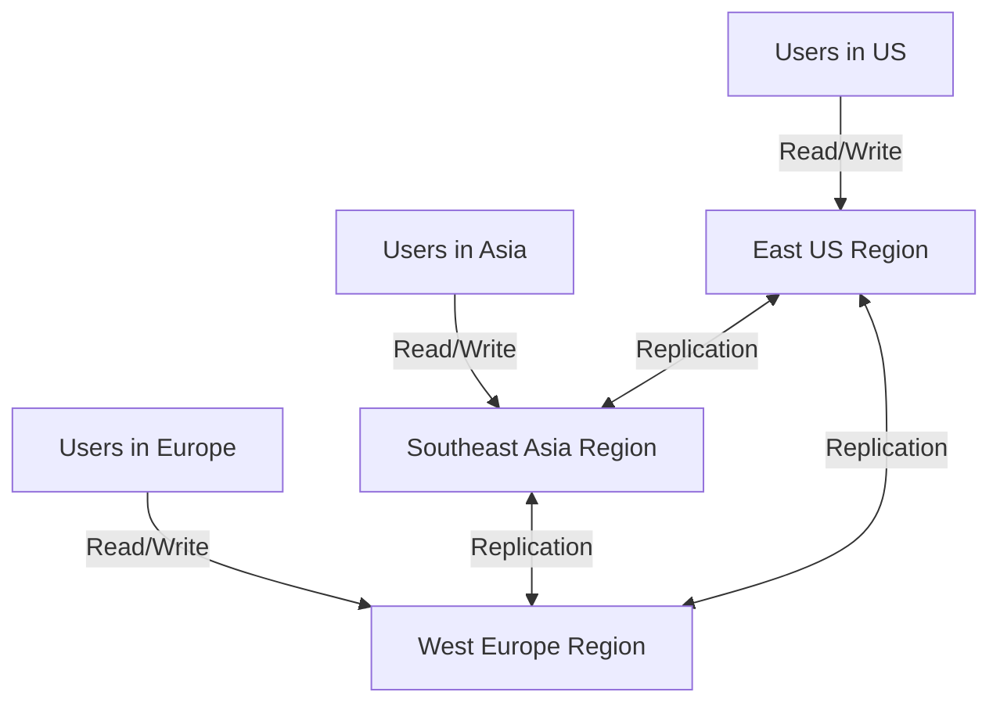

# How to Set Up Global Distribution in Azure Cosmos DB Across Multiple Regions

Author: [nawazdhandala](https://www.github.com/nawazdhandala)

Tags: Azure, Cosmos DB, Global Distribution, Multi-Region, High Availability, Disaster Recovery

Description: Configure Azure Cosmos DB for global distribution across multiple Azure regions with automatic failover, multi-region writes, and low-latency reads worldwide.

---

Azure Cosmos DB was built from the ground up for global distribution. Adding a new region is literally a button click or a single CLI command - no sharding, no replication setup, no complex failover configuration. Your data gets replicated transparently, and clients automatically route to the nearest region. This guide covers how to set it up, configure multi-region writes, handle failover, and optimize your application for a globally distributed database.

## Why Go Multi-Region?

There are three primary reasons to distribute your Cosmos DB account across regions:

1. **Low latency for global users**: Users in Tokyo get sub-10ms reads from a Japan region instead of 200ms+ from a US-based single region.

2. **High availability**: If one region goes down, traffic automatically fails over to another region. Cosmos DB provides 99.999% availability SLA with multi-region configurations.

3. **Disaster recovery**: Your data exists in multiple geographically separated locations. A regional disaster does not mean data loss.

## Adding Read Regions

The simplest multi-region setup is one write region with multiple read regions. This is how most teams start.

### Using Azure Portal

1. Navigate to your Cosmos DB account
2. Click on Replicate data globally under Settings
3. Click on a region on the map or select from the dropdown
4. Click Save

### Using Azure CLI

```bash
# Add a read region to an existing Cosmos DB account
# This example adds Southeast Asia as a second region
az cosmosdb update \
    --name myCosmosAccount \
    --resource-group myResourceGroup \
    --locations regionName=eastus failoverPriority=0 isZoneRedundant=true \
    --locations regionName=southeastasia failoverPriority=1 isZoneRedundant=false
```

The `failoverPriority` parameter determines the failover order. Priority 0 is the write region, and higher numbers are failover candidates in order.

```bash
# Add a third region (Europe)
az cosmosdb update \
    --name myCosmosAccount \
    --resource-group myResourceGroup \
    --locations regionName=eastus failoverPriority=0 isZoneRedundant=true \
    --locations regionName=southeastasia failoverPriority=1 isZoneRedundant=false \
    --locations regionName=westeurope failoverPriority=2 isZoneRedundant=true
```

The replication happens automatically. Depending on the data size, it typically takes a few minutes for the new region to be fully synchronized.

## Enabling Multi-Region Writes

By default, only one region accepts writes. To allow writes in all regions (for lowest write latency globally), enable multi-region writes:

```bash
# Enable multi-region writes on the account
az cosmosdb update \
    --name myCosmosAccount \
    --resource-group myResourceGroup \
    --enable-multiple-write-locations true
```

With multi-region writes enabled, any region can accept both reads and writes. The architecture looks like this:



Multi-region writes introduce the possibility of write conflicts. Cosmos DB handles this with configurable conflict resolution policies, which I will cover later in this post.

## Configuring the SDK for Multi-Region

Your application SDK needs to know about the available regions so it can route requests to the closest one.

### .NET SDK

```csharp
// Configure the Cosmos client for multi-region support
// The SDK automatically routes requests to the nearest available region
CosmosClient client = new CosmosClient(endpoint, key, new CosmosClientOptions
{
    // Specify the preferred regions in order of preference
    // The SDK tries the first region, then falls back to the next
    ApplicationPreferredRegions = new List<string>
    {
        Regions.EastUS,
        Regions.WestEurope,
        Regions.SoutheastAsia
    },

    // Enable automatic region discovery
    // The SDK periodically checks for new regions
    LimitToEndpoint = false
});
```

### Java SDK

```java
// Configure preferred regions in the Java SDK
CosmosClient client = new CosmosClientBuilder()
    .endpoint(endpoint)
    .key(key)
    .preferredRegions(Arrays.asList("East US", "West Europe", "Southeast Asia"))
    .multipleWriteRegionsEnabled(true)
    .buildClient();
```

### Python SDK

```python
# Configure preferred regions in the Python SDK
from azure.cosmos import CosmosClient

client = CosmosClient(
    url=endpoint,
    credential=key,
    preferred_locations=["East US", "West Europe", "Southeast Asia"]
)
```

## Automatic Failover

When a region becomes unavailable, Cosmos DB can automatically fail over to the next region in the failover priority list.

```bash
# Enable automatic failover
az cosmosdb update \
    --name myCosmosAccount \
    --resource-group myResourceGroup \
    --enable-automatic-failover true
```

With automatic failover enabled:

- Read regions: If a read region goes down, the SDK automatically redirects reads to the next closest available region. This happens transparently.
- Write region: If the write region goes down, Cosmos DB promotes the next region in the failover priority list to be the new write region. This takes 1-2 minutes.

You can also trigger a manual failover for testing:

```bash
# Manually trigger a failover to test disaster recovery
# This promotes Southeast Asia to the new write region
az cosmosdb failover-priority-change \
    --name myCosmosAccount \
    --resource-group myResourceGroup \
    --failover-policies southeastasia=0 eastus=1 westeurope=2
```

## Conflict Resolution for Multi-Region Writes

When multi-region writes are enabled, two users in different regions might update the same document simultaneously. Cosmos DB provides three conflict resolution strategies:

### Last Writer Wins (Default)

The write with the highest `_ts` (timestamp) value wins. This is simple and works for many scenarios:

```bash
# Set last-writer-wins conflict resolution (default)
# Uses the _ts system property to determine the winner
az cosmosdb sql container create \
    --account-name myCosmosAccount \
    --database-name mydb \
    --name mycontainer \
    --partition-key-path "/partitionKey" \
    --conflict-resolution-policy-mode "LastWriterWins" \
    --conflict-resolution-policy-path "/_ts" \
    --resource-group myResourceGroup
```

You can also use a custom property instead of `_ts`:

```json
{
    "mode": "LastWriterWins",
    "conflictResolutionPath": "/priority"
}
```

### Custom Stored Procedure

For complex conflict resolution logic, use a stored procedure:

```javascript
// Custom conflict resolution stored procedure
// This procedure merges conflicting documents instead of picking a winner
function resolveConflict(incomingItem, existingItem, isTombstone, conflictingItems) {
    var context = getContext();
    var collection = context.getCollection();

    if (isTombstone) {
        // The existing item was deleted - accept the incoming item
        collection.replaceDocument(
            existingItem._self,
            incomingItem,
            function(err) { if (err) throw err; }
        );
    } else {
        // Merge strategy: keep the higher value for numeric fields
        var merged = existingItem;
        merged.viewCount = Math.max(
            incomingItem.viewCount || 0,
            existingItem.viewCount || 0
        );
        merged.lastUpdated = new Date().toISOString();

        collection.replaceDocument(
            existingItem._self,
            merged,
            function(err) { if (err) throw err; }
        );
    }
}
```

### Custom Conflict Feed

Store all conflicting versions in a conflict feed and resolve them in your application:

```csharp
// Read conflicts from the conflict feed and resolve them in application code
FeedIterator<ConflictProperties> conflictIterator =
    container.Conflicts.GetConflictQueryIterator<ConflictProperties>();

while (conflictIterator.HasMoreResults)
{
    FeedResponse<ConflictProperties> conflicts = await conflictIterator.ReadNextAsync();
    foreach (ConflictProperties conflict in conflicts)
    {
        // Read the conflicting document
        dynamic conflictDoc = await container.Conflicts.ReadCurrentAsync<dynamic>(
            conflict, new PartitionKey(conflict.PartitionKeyValue));

        // Apply your custom resolution logic
        await ResolveConflict(conflictDoc, conflict);

        // Delete the conflict after resolution
        await container.Conflicts.DeleteAsync(conflict, new PartitionKey(conflict.PartitionKeyValue));
    }
}
```

## Monitoring Replication Lag

Check how far behind your read regions are:

```bash
# Monitor replication latency between regions
az monitor metrics list \
    --resource "/subscriptions/{sub}/resourceGroups/{rg}/providers/Microsoft.DocumentDB/databaseAccounts/myCosmosAccount" \
    --metric "ReplicationLatency" \
    --interval PT5M \
    --aggregation Average
```

In the Azure Portal, go to Metrics and select:
- Metric: Replication Latency
- Aggregation: Average
- Split by: Target Region

Typical replication latency between regions is 5-50ms depending on the geographic distance.

## Cost Implications

Each additional region roughly doubles your costs because the data and throughput are replicated:

| Configuration | Approximate Cost Multiplier |
|---------------|----------------------------|
| 1 region | 1x |
| 2 regions (single write) | 2x |
| 3 regions (single write) | 3x |
| 2 regions (multi-write) | 2x (writes cost 2x more per write) |

Multi-region writes also increase write RU costs because each write is replicated synchronously to a quorum of regions.

## Removing a Region

If you no longer need a region, remove it:

```bash
# Remove the Southeast Asia region
# Just omit it from the locations list
az cosmosdb update \
    --name myCosmosAccount \
    --resource-group myResourceGroup \
    --locations regionName=eastus failoverPriority=0 isZoneRedundant=true \
    --locations regionName=westeurope failoverPriority=1 isZoneRedundant=true
```

The removal is graceful - the data in that region is decommissioned and you stop being charged for it.

## Best Practices

1. Place your write region closest to where most writes originate
2. Enable zone redundancy in production regions for intra-region high availability
3. Test failover regularly - do not wait for an actual outage to discover problems
4. Use the SDK's preferred regions feature to ensure optimal routing
5. Monitor replication latency and set alerts for unusual spikes

Global distribution is one of the killer features of Cosmos DB. Setting it up takes minutes, and it gives you something that would take months to build with traditional databases - a globally distributed, automatically replicated, consistently available data layer. Start with two regions and expand as your user base grows geographically.
