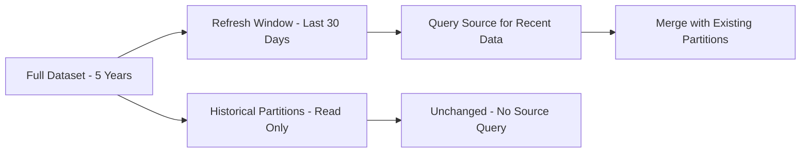

# How to Set Up Incremental Refresh in Power BI for Large Azure Datasets

Author: [nawazdhandala](https://www.github.com/nawazdhandala)

Tags: Power BI, Incremental Refresh, Azure SQL, Performance, Data Modeling, Azure Synapse, Large Datasets

Description: Step-by-step instructions for configuring incremental refresh in Power BI to handle large Azure datasets efficiently without full reloads.

---

When your Power BI dataset grows to millions of rows, a full refresh on every schedule becomes painful. It takes forever, puts heavy load on your Azure data source, and sometimes times out entirely. Incremental refresh solves this by only loading the data that has changed since the last refresh, while keeping historical data intact.

This feature works especially well with Azure data sources like Azure SQL Database and Azure Synapse Analytics, where you can leverage query folding to push the date filtering down to the source. The result is faster refreshes, lower source load, and a much better experience overall.

## How Incremental Refresh Works

The basic idea is straightforward. You define a refresh policy that tells Power BI two things:

1. **How far back to store data** (the historical window)
2. **How far back to refresh data** (the refresh window)

For example, you might store five years of data but only refresh the last 30 days. On each scheduled refresh, Power BI queries the source only for the last 30 days of data and merges it with the existing historical partitions. Old partitions stay untouched.

Behind the scenes, Power BI creates date-based partitions on your table. Each partition covers a time range (day, month, quarter, or year), and only the partitions within the refresh window get reprocessed.



## Prerequisites

- Power BI Desktop (latest version)
- Power BI Premium, Premium Per User, or Power BI Pro with a Premium capacity workspace
- An Azure data source with a reliable date/timestamp column (e.g., OrderDate, ModifiedDate)
- Query folding must work on the date filter (native queries from Azure SQL and Synapse support this)

## Step 1: Create RangeStart and RangeEnd Parameters

Incremental refresh relies on two special parameters: `RangeStart` and `RangeEnd`. Power BI uses these to filter your data during refresh. The names must be exactly `RangeStart` and `RangeEnd` (case-sensitive), and the type must be Date/Time.

In Power BI Desktop, open the Power Query Editor. Click "Manage Parameters" and create two new parameters:

| Parameter | Type | Default Value |
|-----------|------|---------------|
| RangeStart | Date/Time | 1/1/2024 12:00:00 AM |
| RangeEnd | Date/Time | 2/1/2024 12:00:00 AM |

The default values are just for design-time use in Power BI Desktop. The Power BI service overrides them with the actual date ranges during refresh.

## Step 2: Apply the Date Filter to Your Table

Now you need to filter your fact table using these parameters. Open the table in the Power Query Editor and filter the date column to be between `RangeStart` and `RangeEnd`.

For example, if your table is called Orders and has a column called OrderDate:

1. Click the filter dropdown on the OrderDate column
2. Select "Date/Time Filters" then "Between"
3. Set the start value to `RangeStart` and the end value to `RangeEnd`
4. Make sure the filter is "is after or equal to" for the start and "is before" for the end

This should produce M code that looks like the following:

```
// Power Query M code showing the filtered step with RangeStart and RangeEnd
let
    Source = Sql.Database("your-server.database.windows.net", "your-database"),
    dbo_Orders = Source{[Schema="dbo",Item="Orders"]}[Data],

    // Filter to only include rows within the incremental refresh range
    // RangeStart is inclusive, RangeEnd is exclusive
    FilteredRows = Table.SelectRows(
        dbo_Orders,
        each [OrderDate] >= RangeStart and [OrderDate] < RangeEnd
    )
in
    FilteredRows
```

## Step 3: Verify Query Folding

This step is critical. For incremental refresh to be efficient, the date filter must fold back to the source database. If it does not fold, Power BI will pull all the data and filter it locally, which defeats the purpose.

Right-click on the filtered step in the Power Query Editor and check if "View Native Query" is available. If it is, the query is folding. Click it to see the SQL that Power BI will send to the source:

```sql
-- This is the native SQL query that Power BI generates
-- The date filter is pushed down to the database server
SELECT
    [OrderID],
    [OrderDate],
    [CustomerID],
    [ProductID],
    [Quantity],
    [TotalAmount]
FROM [dbo].[Orders]
WHERE
    [OrderDate] >= '2024-01-01 00:00:00'
    AND [OrderDate] < '2024-02-01 00:00:00'
```

If "View Native Query" is greyed out, you have a query folding problem. Common causes include custom M functions applied after the filter, data type conversions that break folding, or using non-foldable transformations. Move the date filter to as late a step as possible in the query, or restructure your transformations.

## Step 4: Define the Incremental Refresh Policy

Close the Power Query Editor and go back to the model view. Right-click the table and select "Incremental refresh and real-time data" (the exact menu name may vary by version).

Configure the policy:

- **Archive data starting**: This defines how much historical data to keep. For example, set it to 5 years.
- **Incrementally refresh data starting**: This defines the refresh window. Set it to 30 days.
- **Only refresh complete days**: Enable this if your source data arrives at the end of each day. It prevents partial-day partitions.
- **Detect data changes**: Optionally, specify a column (like a ModifiedDate or LastUpdated timestamp) that Power BI checks to see if a partition actually needs refreshing. This can further reduce unnecessary processing.

Here is what a typical configuration looks like:

| Setting | Value |
|---------|-------|
| Store rows in the last | 5 Years |
| Refresh rows in the last | 30 Days |
| Only refresh complete days | Yes |
| Detect data changes | ModifiedDate column |

## Step 5: Publish to the Power BI Service

Save your .pbix file and publish it to a Premium workspace. When you publish, Power BI creates the partition structure based on your incremental refresh policy.

The first refresh will be a full refresh since there is no existing data. This initial load might take a while depending on how much historical data you are bringing in. Subsequent refreshes will be incremental.

## Step 6: Monitor Refresh Performance

After the first refresh completes, go to the dataset settings in the Power BI service. Under "Refresh history," you can see how long each refresh took and whether it was incremental.

For deeper monitoring, use the XMLA endpoint (available with Premium) to connect SQL Server Management Studio or Tabular Editor to the dataset. You can inspect the partition structure directly:

```python
# Use the Tabular Object Model (TOM) via Python to inspect partitions
# This requires the pyadomd or pytabular library
import pytabular

# Connect to the Power BI Premium XMLA endpoint
model = pytabular.Tabular(
    "powerbi://api.powerbi.com/v1.0/myorg/YourWorkspace",
    "your-dataset-name"
)

# List all partitions for the Orders table
orders_table = model.Tables["Orders"]
for partition in orders_table.Partitions:
    print(f"Partition: {partition.Name}")
    print(f"  State: {partition.State}")
    print(f"  Refreshed: {partition.RefreshedTime}")
    print(f"  Rows: {partition.Source}")
    print()
```

## Handling Schema Changes

One gotcha with incremental refresh is schema changes. If you add or remove columns from your table, you need to be careful. Minor changes like adding a column to the query might not require a full re-partition, but significant changes can break existing partitions.

If you need to make schema changes, the safest approach is to:

1. Make the change in Power BI Desktop
2. Republish the report
3. If needed, trigger a full refresh using the XMLA endpoint or the enhanced refresh API

## Performance Optimization Tips

To get the best performance out of incremental refresh with Azure data sources:

- **Index your date column**: Make sure the date column used for filtering has an index in Azure SQL Database or Synapse.
- **Use partitioned tables**: If your Azure SQL table is already partitioned by date, query folding aligns nicely with partition elimination.
- **Right-size the refresh window**: Do not make the refresh window larger than necessary. If data only changes in the last 7 days, use 7 days instead of 30.
- **Enable query caching**: In the dataset settings, enable query caching to reduce load on the source for frequently accessed reports.

## Summary

Incremental refresh transforms how Power BI handles large datasets from Azure sources. Instead of pulling everything on every refresh, it intelligently partitions your data and only updates what is necessary. The setup involves creating RangeStart/RangeEnd parameters, applying date filters that fold to the source, defining a refresh policy, and publishing to a Premium workspace. Once configured, you will see dramatically faster refresh times and less strain on your Azure data sources.
