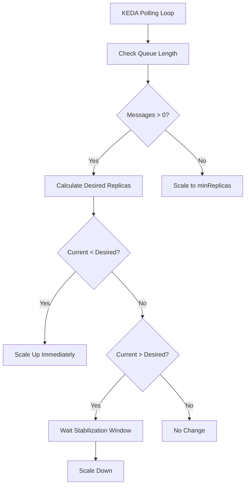

# How to Set Up KEDA-Based Auto-Scaling with Queue Triggers in Azure Container Apps

Author: [nawazdhandala](https://www.github.com/nawazdhandala)

Tags: Azure, Container Apps, KEDA, Auto-Scaling, Queue Triggers, Service Bus, Serverless

Description: A detailed guide to configuring KEDA-based auto-scaling with queue triggers in Azure Container Apps for event-driven workloads.

---

Azure Container Apps has KEDA (Kubernetes Event-Driven Autoscaling) built right into the platform. This means you can scale your containers based on external event sources like message queues, databases, or custom metrics rather than just CPU and memory. Queue-based scaling is especially useful for background workers that process jobs from a queue. When the queue fills up, more replicas spin up. When the queue is empty, the app can scale all the way to zero. This post shows you how to set it up.

## Why KEDA for Queue-Based Scaling?

Traditional auto-scaling based on CPU usage does not work well for queue processors. Your worker might be waiting for messages and showing low CPU usage, but there could be thousands of messages waiting in the queue. CPU-based scaling would keep the replica count low while the backlog grows.

KEDA solves this by monitoring the queue directly. It checks how many messages are waiting and calculates the desired replica count based on a target queue length per replica. If there are 100 messages and you set the target to 10 messages per replica, KEDA scales to 10 replicas.

## Step 1: Create an Azure Service Bus Queue

Let us start with an Azure Service Bus queue, which is one of the most common triggers.

```bash
# Create a Service Bus namespace
az servicebus namespace create \
  --name my-sb-namespace \
  --resource-group my-rg \
  --location eastus \
  --sku Standard

# Create a queue
az servicebus queue create \
  --namespace-name my-sb-namespace \
  --resource-group my-rg \
  --name job-queue \
  --max-size 5120

# Get the connection string for the shared access policy
SB_CONN=$(az servicebus namespace authorization-rule keys list \
  --namespace-name my-sb-namespace \
  --resource-group my-rg \
  --name RootManageSharedAccessKey \
  --query "primaryConnectionString" -o tsv)
```

## Step 2: Deploy a Worker with a Service Bus Queue Scaler

Now deploy a container app that processes messages from this queue and scales based on queue depth.

```bash
# Create the container app with a Service Bus queue scaler
az containerapp create \
  --name job-worker \
  --resource-group my-rg \
  --environment my-env \
  --image myregistry.azurecr.io/job-worker:v1 \
  --min-replicas 0 \
  --max-replicas 20 \
  --secrets "sb-conn=$SB_CONN" \
  --scale-rule-name queue-scaling \
  --scale-rule-type azure-servicebus \
  --scale-rule-metadata \
    queueName=job-queue \
    messageCount=5 \
    namespace=my-sb-namespace \
  --scale-rule-auth \
    connection=sb-conn
```

Key parameters explained:

- `--min-replicas 0` allows the app to scale to zero when the queue is empty
- `--max-replicas 20` caps the maximum number of replicas
- `--scale-rule-metadata messageCount=5` means each replica handles 5 messages (so 100 messages = 20 replicas)
- `--scale-rule-auth` maps the secret to the KEDA trigger authentication

## Step 3: Use Azure Storage Queue as a Trigger

Azure Storage Queues are cheaper than Service Bus and work well for simpler scenarios.

```bash
# Create a storage account and queue
az storage account create \
  --name mystorageacct \
  --resource-group my-rg \
  --location eastus \
  --sku Standard_LRS

az storage queue create \
  --name work-items \
  --account-name mystorageacct

# Get the connection string
STORAGE_CONN=$(az storage account show-connection-string \
  --name mystorageacct \
  --resource-group my-rg \
  --query "connectionString" -o tsv)
```

Deploy with a storage queue scaler.

```bash
# Deploy with Azure Storage Queue scaling
az containerapp create \
  --name storage-worker \
  --resource-group my-rg \
  --environment my-env \
  --image myregistry.azurecr.io/storage-worker:v1 \
  --min-replicas 0 \
  --max-replicas 15 \
  --secrets "storage-conn=$STORAGE_CONN" \
  --scale-rule-name storage-queue-scaling \
  --scale-rule-type azure-queue \
  --scale-rule-metadata \
    queueName=work-items \
    queueLength=10 \
    accountName=mystorageacct \
  --scale-rule-auth \
    connection=storage-conn
```

## Step 4: Configure via ARM/Bicep for More Control

The CLI is great for quick setups, but for production deployments, you typically want the full configuration in an ARM template or Bicep file.

Here is the scaling section of an ARM template that configures multiple scaling rules.

```json
{
  "scale": {
    "minReplicas": 0,
    "maxReplicas": 30,
    "rules": [
      {
        "name": "servicebus-queue-rule",
        "custom": {
          "type": "azure-servicebus",
          "metadata": {
            "queueName": "job-queue",
            "messageCount": "5",
            "namespace": "my-sb-namespace"
          },
          "auth": [
            {
              "secretRef": "sb-connection",
              "triggerParameter": "connection"
            }
          ]
        }
      },
      {
        "name": "cpu-rule",
        "custom": {
          "type": "cpu",
          "metadata": {
            "type": "Utilization",
            "value": "70"
          }
        }
      }
    ]
  }
}
```

This configuration combines queue-based scaling with CPU-based scaling. KEDA evaluates both rules and uses the one that requires more replicas.

## Step 5: Understand the Scaling Behavior

KEDA's scaling algorithm is based on a simple formula.

```
desiredReplicas = ceil(currentQueueLength / messageCountTarget)
```

For example:
- Queue length: 47 messages
- messageCount target: 10
- Desired replicas: ceil(47 / 10) = 5

The scaling engine checks the queue length at regular intervals (typically every 30 seconds). Scale-up happens quickly, usually within a minute. Scale-down is more conservative to avoid thrashing - there is a stabilization window of about 5 minutes before replicas are removed.

Here is the flow.



## Step 6: Handle Scale-to-Zero Gracefully

When scaling to zero, your container is terminated. The next time a message arrives, KEDA triggers a scale-up from zero, which involves pulling the container image and starting the application. This cold start can take anywhere from a few seconds to over a minute depending on your image size and startup time.

To minimize cold start impact:

1. **Keep container images small.** Use multi-stage builds and minimal base images.
2. **Optimize application startup.** Lazy-load dependencies and defer initialization of non-critical resources.
3. **Use a minimum replica of 1 if latency matters.** Setting `minReplicas` to 1 means you always have a warm instance ready, but you pay for it continuously.

```bash
# If cold start is unacceptable, keep at least 1 replica warm
az containerapp update \
  --name job-worker \
  --resource-group my-rg \
  --min-replicas 1
```

## Step 7: Monitor Scaling Events

You can monitor KEDA scaling events in Log Analytics.

```kusto
// View scaling events for a container app
ContainerAppSystemLogs_CL
| where ContainerAppName_s == "job-worker"
| where Log_s contains "scale"
| project TimeGenerated, Log_s
| order by TimeGenerated desc
| take 100
```

Also monitor the queue depth and replica count together to see how well the scaling responds.

```kusto
// Compare queue depth against replica count over time
ContainerAppSystemLogs_CL
| where ContainerAppName_s == "job-worker"
| where Log_s contains "replica"
| extend ReplicaCount = extract("replicas: (\\d+)", 1, Log_s)
| project TimeGenerated, ReplicaCount
| render timechart
```

## Common Pitfalls

**Setting messageCount too low:** If you set `messageCount` to 1, every single message triggers a new replica. This leads to excessive scaling and higher costs. Start with a value that matches how many messages one replica can process per minute.

**Not handling graceful shutdown:** When KEDA scales down, it sends a SIGTERM to your container. Make sure your worker finishes processing the current message before exiting. Do not abandon messages mid-processing.

```javascript
// Handle graceful shutdown in your worker
process.on('SIGTERM', async () => {
  console.log('Received SIGTERM, finishing current message...');
  isShuttingDown = true;

  // Wait for current message to finish processing
  await currentMessagePromise;

  // Close connections cleanly
  await queueClient.close();
  process.exit(0);
});
```

**Forgetting to set maxReplicas:** Without a cap, an unexpected spike in queue messages could spin up hundreds of replicas, leading to a large and unexpected bill.

**Ignoring poison messages:** Messages that always fail processing will be retried indefinitely unless you configure a dead letter queue. This wastes scaling resources on messages that will never succeed.

## Summary

KEDA-based auto-scaling with queue triggers turns Azure Container Apps into a responsive, cost-effective platform for background processing. You define the queue source and a target message count, and the platform handles the rest. Scale-to-zero support means you pay nothing during idle periods, and rapid scale-up ensures your workers keep pace with demand. Combine it with graceful shutdown handling and proper dead letter configuration for a production-ready setup.
