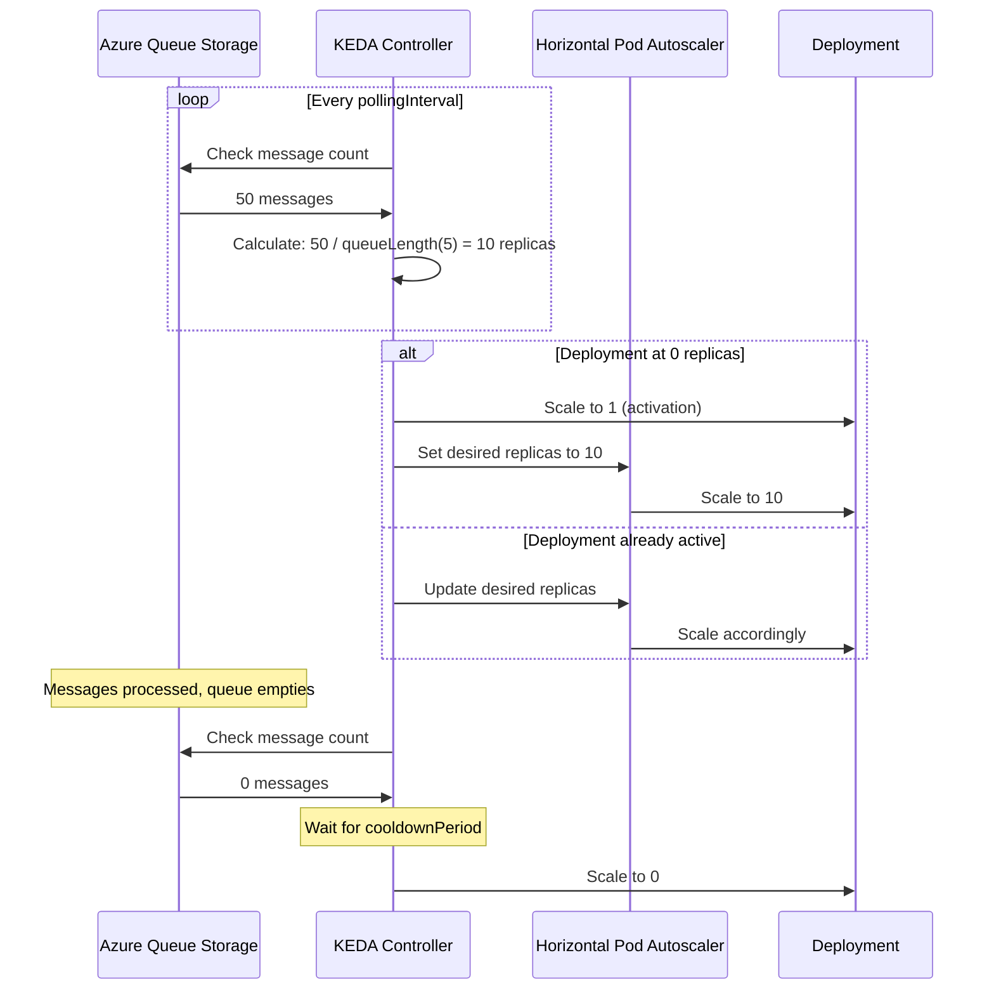

# How to Set Up KEDA with Azure Queue Storage Scaler for Event-Driven Autoscaling on AKS

Author: [nawazdhandala](https://www.github.com/nawazdhandala)

Tags: AKS, KEDA, Azure Queue Storage, Autoscaling, Event-Driven, Kubernetes, Serverless

Description: Learn how to use KEDA on AKS to automatically scale your workloads based on Azure Queue Storage message count for event-driven processing.

---

The Horizontal Pod Autoscaler (HPA) scales based on CPU and memory, but what if your workload is driven by a queue? When messages pile up in Azure Queue Storage, you want more worker pods to process them. When the queue is empty, you want to scale down to zero and stop paying for idle compute. KEDA (Kubernetes Event-Driven Autoscaling) makes this possible. It monitors external event sources and scales your deployments based on the number of events waiting to be processed. In this guide, I will set up KEDA on AKS with the Azure Queue Storage scaler.

## What KEDA Does

KEDA extends Kubernetes with custom scalers that watch external event sources. When events are detected, KEDA activates your deployment (scaling from zero to one) and then works with the HPA to scale further based on demand. When the event source is empty, KEDA scales back to zero.

KEDA supports over 60 scalers including Azure Queue Storage, Service Bus, Kafka, RabbitMQ, Prometheus, and many more. For this guide, we focus on Azure Queue Storage.

## Prerequisites

You need an AKS cluster running Kubernetes 1.24 or later, Helm 3, an Azure Storage account with a queue, and either a connection string or managed identity for authentication.

## Step 1: Install KEDA on AKS

Install KEDA using Helm. KEDA runs as a set of controllers in its own namespace.

```bash
# Add the KEDA Helm repository
helm repo add kedacore https://kedacore.github.io/charts
helm repo update

# Install KEDA
helm install keda kedacore/keda \
  --namespace keda \
  --create-namespace
```

Verify the installation.

```bash
# Check KEDA pods are running
kubectl get pods -n keda

# Verify KEDA CRDs are installed
kubectl get crd | grep keda
```

You should see `scaledobjects.keda.sh`, `scaledjobs.keda.sh`, and `triggerauthentications.keda.sh` among the CRDs.

## Step 2: Create an Azure Storage Queue

Set up the storage account and queue that will drive the scaling.

```bash
# Create a storage account
az storage account create \
  --name mystorageaccount \
  --resource-group myResourceGroup \
  --location eastus \
  --sku Standard_LRS

# Create a queue
az storage queue create \
  --name work-items \
  --account-name mystorageaccount

# Get the connection string
STORAGE_CONNECTION=$(az storage account show-connection-string \
  --name mystorageaccount \
  --resource-group myResourceGroup \
  --query connectionString -o tsv)
```

## Step 3: Store the Connection String as a Secret

Create a Kubernetes secret with the storage connection string.

```bash
# Create a secret with the storage connection string
kubectl create secret generic storage-secret \
  --from-literal=connectionString="$STORAGE_CONNECTION"
```

## Step 4: Deploy the Queue Worker

Create a deployment for the worker that processes messages from the queue.

```yaml
# queue-worker.yaml
# Worker deployment that processes messages from Azure Queue Storage
apiVersion: apps/v1
kind: Deployment
metadata:
  name: queue-worker
  namespace: default
spec:
  # Start with 0 replicas - KEDA will scale up when messages arrive
  replicas: 0
  selector:
    matchLabels:
      app: queue-worker
  template:
    metadata:
      labels:
        app: queue-worker
    spec:
      containers:
        - name: worker
          image: myregistry.azurecr.io/queue-worker:v1
          env:
            # Pass the connection string to the worker
            - name: AZURE_STORAGE_CONNECTION_STRING
              valueFrom:
                secretKeyRef:
                  name: storage-secret
                  key: connectionString
            - name: QUEUE_NAME
              value: "work-items"
          resources:
            requests:
              cpu: 100m
              memory: 128Mi
            limits:
              cpu: 500m
              memory: 256Mi
```

Apply the deployment.

```bash
kubectl apply -f queue-worker.yaml
```

## Step 5: Create the KEDA TriggerAuthentication

TriggerAuthentication defines how KEDA authenticates with the event source. This keeps credentials separate from the ScaledObject.

```yaml
# trigger-auth.yaml
# KEDA authentication using the Kubernetes secret
apiVersion: keda.sh/v1alpha1
kind: TriggerAuthentication
metadata:
  name: storage-auth
  namespace: default
spec:
  secretTargetRef:
    # Reference the connection string from the Kubernetes secret
    - parameter: connection
      name: storage-secret
      key: connectionString
```

Apply it.

```bash
kubectl apply -f trigger-auth.yaml
```

## Step 6: Create the ScaledObject

The ScaledObject is the core KEDA resource. It defines what to scale, what event source to monitor, and the scaling parameters.

```yaml
# scaled-object.yaml
# KEDA ScaledObject that scales the worker based on queue length
apiVersion: keda.sh/v1alpha1
kind: ScaledObject
metadata:
  name: queue-worker-scaler
  namespace: default
spec:
  # Reference to the deployment to scale
  scaleTargetRef:
    name: queue-worker
  # Minimum replicas (0 enables scale-to-zero)
  minReplicaCount: 0
  # Maximum replicas
  maxReplicaCount: 30
  # Cooldown period before scaling down (seconds)
  cooldownPeriod: 60
  # Polling interval for checking the queue (seconds)
  pollingInterval: 15
  triggers:
    - type: azure-queue
      metadata:
        # Name of the Azure Storage queue
        queueName: work-items
        # Scale up when there are more than 5 messages per replica
        queueLength: "5"
        # Use the v2 storage SDK
        accountName: mystorageaccount
      authenticationRef:
        name: storage-auth
```

The `queueLength` parameter is the target messages per replica. If there are 25 messages in the queue and `queueLength` is 5, KEDA will scale to 5 replicas (25 / 5 = 5). This is how KEDA determines the desired replica count.

Apply the ScaledObject.

```bash
kubectl apply -f scaled-object.yaml

# Check the ScaledObject status
kubectl get scaledobject queue-worker-scaler
```

## Step 7: Test the Autoscaling

Add messages to the queue and watch KEDA scale up the workers.

```bash
# Add 50 messages to the queue
for i in $(seq 1 50); do
  az storage message put \
    --queue-name work-items \
    --content "Work item $i" \
    --account-name mystorageaccount
done

# Watch the deployment scale up
kubectl get deploy queue-worker -w

# Watch the HPA that KEDA creates
kubectl get hpa -w
```

With 50 messages and a queueLength of 5, KEDA should scale to 10 replicas. As workers process messages and the queue shrinks, KEDA will scale down. When the queue is empty and the cooldown period passes, it scales back to zero.

## How the Scaling Flow Works



## Step 8: Use Workload Identity Instead of Connection Strings

For production, replace the connection string with workload identity authentication.

```yaml
# trigger-auth-wi.yaml
# KEDA authentication using workload identity
apiVersion: keda.sh/v1alpha1
kind: TriggerAuthentication
metadata:
  name: storage-auth-wi
  namespace: default
spec:
  podIdentity:
    provider: azure-workload
    identityId: <managed-identity-client-id>
```

Update the ScaledObject to use the new authentication.

```yaml
# Updated trigger in the ScaledObject
triggers:
  - type: azure-queue
    metadata:
      queueName: work-items
      queueLength: "5"
      accountName: mystorageaccount
    authenticationRef:
      name: storage-auth-wi
```

Make sure the managed identity has the Storage Queue Data Reader role on the storage account.

## Step 9: Use ScaledJobs for Batch Processing

If each message should be processed by a separate Kubernetes Job instead of a long-running deployment, use a ScaledJob.

```yaml
# scaled-job.yaml
# KEDA ScaledJob for batch-style processing
apiVersion: keda.sh/v1alpha1
kind: ScaledJob
metadata:
  name: queue-job-scaler
  namespace: default
spec:
  jobTargetRef:
    template:
      spec:
        containers:
          - name: worker
            image: myregistry.azurecr.io/batch-worker:v1
            env:
              - name: AZURE_STORAGE_CONNECTION_STRING
                valueFrom:
                  secretKeyRef:
                    name: storage-secret
                    key: connectionString
        restartPolicy: Never
    backoffLimit: 3
  # Maximum concurrent jobs
  maxReplicaCount: 20
  # How many jobs to create per polling interval
  scalingStrategy:
    strategy: default
  triggers:
    - type: azure-queue
      metadata:
        queueName: work-items
        queueLength: "1"
        accountName: mystorageaccount
      authenticationRef:
        name: storage-auth
```

ScaledJobs are ideal for workloads where each message results in a short-lived task. The job runs, processes the message, and exits. KEDA creates new jobs as messages arrive.

## Monitoring KEDA

Keep an eye on KEDA's behavior to ensure scaling is working correctly.

```bash
# Check ScaledObject status
kubectl describe scaledobject queue-worker-scaler

# Check KEDA operator logs
kubectl logs -n keda -l app=keda-operator --tail=50

# Check the HPA that KEDA manages
kubectl get hpa keda-hpa-queue-worker-scaler -o yaml

# View KEDA metrics
kubectl get --raw "/apis/external.metrics.k8s.io/v1beta1/namespaces/default/s0-azure-queue-work-items"
```

## Production Tips

**Set appropriate cooldown periods.** A too-short cooldown causes thrashing (rapidly scaling up and down). Start with 60-120 seconds and adjust based on your workload patterns.

**Size the queueLength correctly.** If each message takes 10 seconds to process and you want each worker to handle about a minute of work, set queueLength to 6. This keeps workers busy without overloading them.

**Set maxReplicaCount.** Without a cap, KEDA could scale to hundreds of replicas during a traffic spike, potentially exhausting your node capacity or hitting Azure quotas.

**Use resource requests.** KEDA works with the cluster autoscaler. If worker pods have resource requests, the autoscaler can provision new nodes as KEDA scales up. Without requests, all pods might land on existing nodes and compete for resources.

**Monitor queue age, not just length.** A queue with 100 old messages is more concerning than one with 100 new messages. Set up alerts on message age to catch processing bottlenecks.

KEDA turns AKS into a serverless-like platform for event-driven workloads. The combination of scale-to-zero, queue-based scaling, and integration with the cluster autoscaler means you pay only for the compute you actually use while maintaining the ability to handle any scale of workload.
