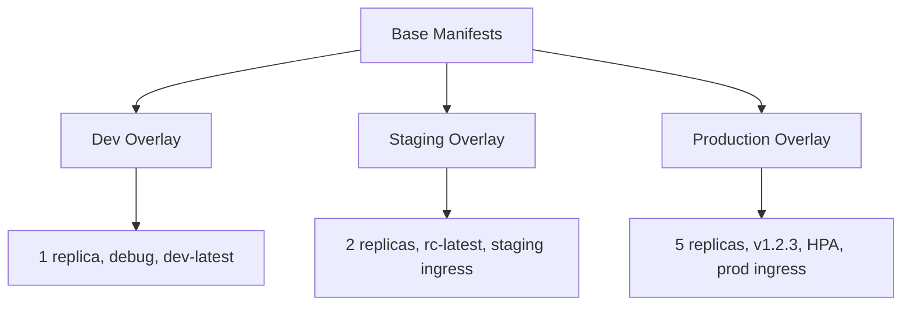

# How to Set Up Kustomize Overlays for Managing AKS Deployments Across Environments

Author: [nawazdhandala](https://www.github.com/nawazdhandala)

Tags: AKS, Kustomize, Kubernetes, DevOps, GitOps, Deployment Management, Configuration

Description: Learn how to use Kustomize overlays to manage AKS deployment configurations across dev, staging, and production environments without duplicating YAML.

---

If you manage AKS deployments across multiple environments, you have probably felt the pain of maintaining nearly identical YAML files for dev, staging, and production. Copy the deployment YAML, change a few values, repeat. Then when you update the base configuration, you have to remember to update it in every environment. Kustomize solves this problem by letting you define a base configuration once and layer environment-specific changes on top using overlays. No templating language, no Helm charts - just plain YAML with a structured way to patch it.

## Why Kustomize Over Helm

Helm is great for packaging reusable charts that other people consume. But for your own application deployments, Helm introduces unnecessary complexity. You need to learn Go templating, maintain a values.yaml, and deal with template rendering issues. Kustomize takes a different approach - you write standard Kubernetes YAML and declare what to change per environment. Since Kustomize is built into kubectl, there is nothing extra to install.

## The Directory Structure

A typical Kustomize project for multi-environment AKS deployments looks like this:

```
k8s/
  base/
    kustomization.yaml
    deployment.yaml
    service.yaml
    configmap.yaml
    hpa.yaml
  overlays/
    dev/
      kustomization.yaml
      replica-patch.yaml
      configmap-patch.yaml
    staging/
      kustomization.yaml
      replica-patch.yaml
      ingress.yaml
    production/
      kustomization.yaml
      replica-patch.yaml
      hpa-patch.yaml
      ingress.yaml
      resource-patch.yaml
```

The base directory contains the complete, working Kubernetes manifests. Each overlay directory contains patches that modify the base for a specific environment.

## Step 1: Create the Base Configuration

Start with the base manifests that define your application.

```yaml
# k8s/base/deployment.yaml
# Base deployment - common across all environments
apiVersion: apps/v1
kind: Deployment
metadata:
  name: web-app
  labels:
    app: web-app
spec:
  replicas: 1
  selector:
    matchLabels:
      app: web-app
  template:
    metadata:
      labels:
        app: web-app
    spec:
      containers:
        - name: web-app
          image: myregistry.azurecr.io/web-app:latest
          ports:
            - containerPort: 8080
          env:
            - name: LOG_LEVEL
              value: "info"
          resources:
            requests:
              cpu: 100m
              memory: 128Mi
            limits:
              cpu: 500m
              memory: 256Mi
          readinessProbe:
            httpGet:
              path: /health
              port: 8080
            initialDelaySeconds: 5
            periodSeconds: 10
```

```yaml
# k8s/base/service.yaml
# Base service definition
apiVersion: v1
kind: Service
metadata:
  name: web-app
spec:
  selector:
    app: web-app
  ports:
    - port: 80
      targetPort: 8080
  type: ClusterIP
```

```yaml
# k8s/base/configmap.yaml
# Base configuration shared across environments
apiVersion: v1
kind: ConfigMap
metadata:
  name: web-app-config
data:
  APP_NAME: "web-app"
  CACHE_TTL: "300"
  MAX_CONNECTIONS: "100"
```

Now create the base kustomization.yaml that references all these resources.

```yaml
# k8s/base/kustomization.yaml
# Base kustomization listing all shared resources
apiVersion: kustomize.config.k8s.io/v1beta1
kind: Kustomization
resources:
  - deployment.yaml
  - service.yaml
  - configmap.yaml
commonLabels:
  managed-by: kustomize
```

## Step 2: Create the Dev Overlay

The dev environment needs fewer replicas, debug logging, and relaxed resource limits.

```yaml
# k8s/overlays/dev/kustomization.yaml
# Dev overlay - references the base and applies patches
apiVersion: kustomize.config.k8s.io/v1beta1
kind: Kustomization
resources:
  - ../../base
namePrefix: dev-
namespace: dev
patches:
  - path: replica-patch.yaml
  - path: configmap-patch.yaml
images:
  - name: myregistry.azurecr.io/web-app
    newTag: dev-latest
```

```yaml
# k8s/overlays/dev/replica-patch.yaml
# Reduce replicas and resources for dev
apiVersion: apps/v1
kind: Deployment
metadata:
  name: web-app
spec:
  replicas: 1
  template:
    spec:
      containers:
        - name: web-app
          resources:
            requests:
              cpu: 50m
              memory: 64Mi
            limits:
              cpu: 200m
              memory: 128Mi
          env:
            - name: LOG_LEVEL
              value: "debug"
```

```yaml
# k8s/overlays/dev/configmap-patch.yaml
# Dev-specific configuration values
apiVersion: v1
kind: ConfigMap
metadata:
  name: web-app-config
data:
  CACHE_TTL: "30"
  MAX_CONNECTIONS: "10"
  DEBUG_MODE: "true"
```

## Step 3: Create the Staging Overlay

Staging mirrors production more closely but may use fewer replicas and different hostnames.

```yaml
# k8s/overlays/staging/kustomization.yaml
# Staging overlay - closer to production configuration
apiVersion: kustomize.config.k8s.io/v1beta1
kind: Kustomization
resources:
  - ../../base
  - ingress.yaml
namePrefix: staging-
namespace: staging
patches:
  - path: replica-patch.yaml
images:
  - name: myregistry.azurecr.io/web-app
    newTag: rc-latest
```

```yaml
# k8s/overlays/staging/replica-patch.yaml
# Staging uses moderate replicas
apiVersion: apps/v1
kind: Deployment
metadata:
  name: web-app
spec:
  replicas: 2
```

```yaml
# k8s/overlays/staging/ingress.yaml
# Staging-specific ingress with staging hostname
apiVersion: networking.k8s.io/v1
kind: Ingress
metadata:
  name: web-app-ingress
  annotations:
    cert-manager.io/cluster-issuer: letsencrypt-staging
spec:
  ingressClassName: nginx
  tls:
    - secretName: staging-tls
      hosts:
        - staging.example.com
  rules:
    - host: staging.example.com
      http:
        paths:
          - path: /
            pathType: Prefix
            backend:
              service:
                name: staging-web-app
                port:
                  number: 80
```

## Step 4: Create the Production Overlay

Production gets the full treatment - more replicas, tighter resource limits, HPA, and production ingress.

```yaml
# k8s/overlays/production/kustomization.yaml
# Production overlay - full production configuration
apiVersion: kustomize.config.k8s.io/v1beta1
kind: Kustomization
resources:
  - ../../base
  - ingress.yaml
  - hpa.yaml
namePrefix: prod-
namespace: production
patches:
  - path: replica-patch.yaml
  - path: resource-patch.yaml
images:
  - name: myregistry.azurecr.io/web-app
    newTag: v1.2.3
```

```yaml
# k8s/overlays/production/replica-patch.yaml
# Production needs more replicas for availability
apiVersion: apps/v1
kind: Deployment
metadata:
  name: web-app
spec:
  replicas: 5
  strategy:
    rollingUpdate:
      maxSurge: 1
      maxUnavailable: 0
```

```yaml
# k8s/overlays/production/resource-patch.yaml
# Production resource limits are tighter
apiVersion: apps/v1
kind: Deployment
metadata:
  name: web-app
spec:
  template:
    spec:
      containers:
        - name: web-app
          resources:
            requests:
              cpu: 500m
              memory: 512Mi
            limits:
              cpu: "1"
              memory: 1Gi
```

```yaml
# k8s/overlays/production/hpa.yaml
# Horizontal Pod Autoscaler for production
apiVersion: autoscaling/v2
kind: HorizontalPodAutoscaler
metadata:
  name: web-app-hpa
spec:
  scaleTargetRef:
    apiVersion: apps/v1
    kind: Deployment
    name: prod-web-app
  minReplicas: 5
  maxReplicas: 20
  metrics:
    - type: Resource
      resource:
        name: cpu
        target:
          type: Utilization
          averageUtilization: 70
```

## Step 5: Build and Preview

Before applying, always preview what Kustomize generates.

```bash
# Preview the dev environment manifests
kubectl kustomize k8s/overlays/dev

# Preview staging
kubectl kustomize k8s/overlays/staging

# Preview production
kubectl kustomize k8s/overlays/production
```

This renders the complete YAML with all patches applied. Review it carefully before deploying.

## Step 6: Apply to AKS

Deploy to each environment using kubectl apply with the -k flag.

```bash
# Deploy to dev
kubectl apply -k k8s/overlays/dev

# Deploy to staging
kubectl apply -k k8s/overlays/staging

# Deploy to production
kubectl apply -k k8s/overlays/production
```

## How the Overlay System Works



## Using Strategic Merge Patches vs JSON Patches

Kustomize supports two patching strategies. The examples above use strategic merge patches, which merge YAML structures together. For more precise changes, use JSON patches.

```yaml
# json-patch.yaml
# JSON patch for precise field modifications
- op: replace
  path: /spec/template/spec/containers/0/env/0/value
  value: "warn"
- op: add
  path: /spec/template/spec/containers/0/env/-
  value:
    name: FEATURE_FLAG_X
    value: "enabled"
```

Reference it in your kustomization.yaml with the target specified.

```yaml
# Using JSON patches in kustomization.yaml
patches:
  - path: json-patch.yaml
    target:
      kind: Deployment
      name: web-app
```

## Generating Secrets and ConfigMaps

Kustomize can generate ConfigMaps and Secrets from files or literals, automatically appending a hash suffix to trigger rolling updates when values change.

```yaml
# In kustomization.yaml
configMapGenerator:
  - name: web-app-env
    literals:
      - DATABASE_HOST=db.production.internal
      - REDIS_HOST=redis.production.internal
secretGenerator:
  - name: web-app-secrets
    files:
      - tls.crt=certs/tls.crt
      - tls.key=certs/tls.key
```

When the content changes, Kustomize generates a new name (like `web-app-env-abc123`), which automatically triggers a rolling update of the deployment referencing it.

## Integration with CI/CD

In your CI/CD pipeline, use Kustomize to set the image tag dynamically.

```bash
# In your CI/CD pipeline, set the image tag to the build SHA
cd k8s/overlays/production
kustomize edit set image myregistry.azurecr.io/web-app:${GIT_SHA}

# Apply the updated manifests
kubectl apply -k .
```

Or use the images transformer in the kustomization.yaml and update it programmatically.

## Best Practices

**Keep the base deployable.** The base configuration should work on its own. If you can run `kubectl apply -k k8s/base` and get a functional (if minimal) deployment, your base is well-structured.

**Use namePrefix or nameSuffix to avoid conflicts.** If you deploy multiple environments to the same cluster, prefixing resource names with the environment prevents naming collisions.

**Commit the rendered output for auditing.** Before deploying, render the full YAML and commit it to a separate branch or directory. This gives you an audit trail of exactly what was deployed.

**Use labels for environment identification.** Add environment-specific labels in each overlay so you can easily filter resources by environment.

Kustomize strikes a good balance between simplicity and power for managing AKS deployments across environments. You keep your Kubernetes YAML clean, avoid the complexity of templating engines, and get a predictable, reviewable deployment process.
