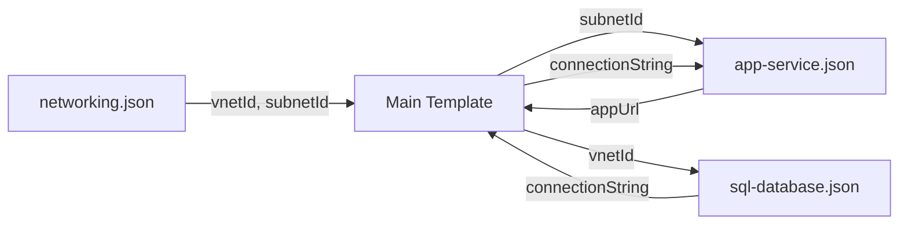

# How to Set Up Linked ARM Templates for Modular Infrastructure Deployments

Author: [nawazdhandala](https://www.github.com/nawazdhandala)

Tags: ARM Templates, Azure, Infrastructure as Code, Linked Templates, Modular Deployment, Azure Resource Manager, DevOps

Description: Learn how to use linked ARM templates to break large infrastructure deployments into reusable, maintainable modules.

---

ARM templates are the original infrastructure-as-code tool for Azure. While Bicep has become the recommended language for new projects, many organizations still have significant investments in ARM templates, and understanding linked templates is essential for maintaining and extending those deployments.

Linked templates let you break a monolithic ARM template into smaller, focused modules. Instead of a single 2000-line JSON file that defines every resource, you have separate templates for networking, compute, storage, and databases that reference each other. This makes templates easier to understand, test, and reuse across projects.

In this post, I will walk through setting up linked templates, handling parameter passing between them, deploying from Azure Pipelines, and managing the template files themselves.

## The Problem with Single-File Templates

A single ARM template that defines everything for a web application might include:

- A virtual network with subnets
- A network security group with rules
- An App Service plan and App Service
- A SQL server and database
- A Key Vault with secrets
- Application Insights
- Storage accounts

That is easily 500+ lines of JSON. Finding the resource you need to modify means scrolling through a wall of nested JSON. Testing one component means deploying everything. And reusing just the networking portion in another project means copy-pasting.

## Linked Template Structure

A linked template deployment consists of a main template that references child templates. The main template passes parameters to each child and can use outputs from one child as inputs to another.

Here is the project structure I recommend.

```
infrastructure/
  main.json                   # Orchestrator template
  main.parameters.dev.json    # Dev environment parameters
  main.parameters.prod.json   # Production parameters
  linked/
    networking.json            # Virtual network and subnets
    sql-database.json          # SQL Server and database
    app-service.json           # App Service plan and app
    key-vault.json             # Key Vault and secrets
    storage.json               # Storage accounts
```

## Creating a Linked Template

Let us build a storage account linked template. Each linked template is a complete ARM template that can be deployed independently.

```json
{
  "$schema": "https://schema.management.azure.com/schemas/2019-04-01/deploymentTemplate.json#",
  "contentVersion": "1.0.0.0",
  "parameters": {
    "storageAccountName": {
      "type": "string",
      "metadata": {
        "description": "Name of the storage account"
      }
    },
    "location": {
      "type": "string",
      "defaultValue": "[resourceGroup().location]",
      "metadata": {
        "description": "Azure region for the storage account"
      }
    },
    "skuName": {
      "type": "string",
      "defaultValue": "Standard_LRS",
      "allowedValues": [
        "Standard_LRS",
        "Standard_GRS",
        "Standard_ZRS"
      ]
    },
    "tags": {
      "type": "object",
      "defaultValue": {}
    }
  },
  "resources": [
    {
      "type": "Microsoft.Storage/storageAccounts",
      "apiVersion": "2023-01-01",
      "name": "[parameters('storageAccountName')]",
      "location": "[parameters('location')]",
      "tags": "[parameters('tags')]",
      "sku": {
        "name": "[parameters('skuName')]"
      },
      "kind": "StorageV2",
      "properties": {
        "supportsHttpsTrafficOnly": true,
        "minimumTlsVersion": "TLS1_2",
        "allowBlobPublicAccess": false
      }
    }
  ],
  "outputs": {
    "storageAccountId": {
      "type": "string",
      "value": "[resourceId('Microsoft.Storage/storageAccounts', parameters('storageAccountName'))]"
    },
    "primaryBlobEndpoint": {
      "type": "string",
      "value": "[reference(parameters('storageAccountName')).primaryEndpoints.blob]"
    }
  }
}
```

## The Main Template

The main template orchestrates the linked templates. Here is where linked template syntax comes into play.

```json
{
  "$schema": "https://schema.management.azure.com/schemas/2019-04-01/deploymentTemplate.json#",
  "contentVersion": "1.0.0.0",
  "parameters": {
    "environment": {
      "type": "string",
      "allowedValues": ["dev", "staging", "prod"]
    },
    "location": {
      "type": "string",
      "defaultValue": "[resourceGroup().location]"
    },
    "templateBaseUrl": {
      "type": "string",
      "metadata": {
        "description": "Base URL where linked templates are stored"
      }
    },
    "templateSasToken": {
      "type": "secureString",
      "metadata": {
        "description": "SAS token for accessing template storage"
      }
    }
  },
  "variables": {
    "baseName": "[concat('myapp-', parameters('environment'))]",
    "storageAccountName": "[concat(replace(variables('baseName'), '-', ''), uniqueString(resourceGroup().id))]"
  },
  "resources": [
    {
      "type": "Microsoft.Resources/deployments",
      "apiVersion": "2021-04-01",
      "name": "storageDeployment",
      "properties": {
        "mode": "Incremental",
        "templateLink": {
          "uri": "[concat(parameters('templateBaseUrl'), '/storage.json', parameters('templateSasToken'))]",
          "contentVersion": "1.0.0.0"
        },
        "parameters": {
          "storageAccountName": {
            "value": "[variables('storageAccountName')]"
          },
          "location": {
            "value": "[parameters('location')]"
          },
          "skuName": {
            "value": "[if(equals(parameters('environment'), 'prod'), 'Standard_GRS', 'Standard_LRS')]"
          },
          "tags": {
            "value": {
              "environment": "[parameters('environment')]",
              "managedBy": "arm-templates"
            }
          }
        }
      }
    },
    {
      "type": "Microsoft.Resources/deployments",
      "apiVersion": "2021-04-01",
      "name": "appServiceDeployment",
      "dependsOn": [
        "storageDeployment"
      ],
      "properties": {
        "mode": "Incremental",
        "templateLink": {
          "uri": "[concat(parameters('templateBaseUrl'), '/app-service.json', parameters('templateSasToken'))]",
          "contentVersion": "1.0.0.0"
        },
        "parameters": {
          "appName": {
            "value": "[concat(variables('baseName'), '-web')]"
          },
          "location": {
            "value": "[parameters('location')]"
          },
          "storageEndpoint": {
            "value": "[reference('storageDeployment').outputs.primaryBlobEndpoint.value]"
          }
        }
      }
    }
  ],
  "outputs": {
    "storageEndpoint": {
      "type": "string",
      "value": "[reference('storageDeployment').outputs.primaryBlobEndpoint.value]"
    }
  }
}
```

The key element is `Microsoft.Resources/deployments` with a `templateLink` property. This tells Azure Resource Manager to fetch the template from the specified URL and deploy it as a nested deployment.

## Hosting Linked Templates

Linked templates must be accessible via a URL. The three common hosting options are:

**Azure Blob Storage (recommended for production)**

Upload templates to a storage account and use a SAS token for access.

```bash
# Create a storage account for templates
az storage account create \
  --name armtemplatesstore \
  --resource-group rg-shared \
  --sku Standard_LRS

# Create a container
az storage container create \
  --name templates \
  --account-name armtemplatesstore

# Upload templates
az storage blob upload-batch \
  --destination templates \
  --source ./linked \
  --account-name armtemplatesstore

# Generate a SAS token (valid for 1 hour)
END_DATE=$(date -u -d "1 hour" '+%Y-%m-%dT%H:%MZ')
SAS_TOKEN=$(az storage container generate-sas \
  --account-name armtemplatesstore \
  --name templates \
  --permissions r \
  --expiry $END_DATE \
  --output tsv)

echo "SAS Token: ?$SAS_TOKEN"
```

**Template specs (Azure-native)**

Template specs store ARM templates directly in Azure as versioned resources.

```bash
# Create a template spec from a linked template
az ts create \
  --name StorageAccountTemplate \
  --version 1.0 \
  --resource-group rg-shared \
  --template-file ./linked/storage.json
```

**GitHub raw URLs (for development only)**

During development, you can reference templates from a GitHub repository using raw URLs. Do not use this for production since public repos expose your infrastructure logic.

## Deploying from Azure Pipelines

Here is a pipeline that uploads linked templates to blob storage and then deploys the main template.

```yaml
# azure-pipelines.yml - Deploy linked ARM templates
trigger:
  branches:
    include:
      - main
  paths:
    include:
      - infrastructure/**

pool:
  vmImage: 'ubuntu-latest'

variables:
  templateStorageAccount: 'armtemplatesstore'
  templateContainer: 'templates'
  resourceGroup: 'rg-myapp-dev'

stages:
  - stage: Deploy
    jobs:
      - job: DeployInfrastructure
        steps:
          # Login to Azure
          - task: AzureCLI@2
            displayName: 'Upload and deploy templates'
            inputs:
              azureSubscription: 'my-connection'
              scriptType: 'bash'
              scriptLocation: 'inlineScript'
              inlineScript: |
                # Upload linked templates to blob storage
                az storage blob upload-batch \
                  --destination $(templateContainer) \
                  --source infrastructure/linked \
                  --account-name $(templateStorageAccount) \
                  --overwrite true

                # Generate SAS token for template access
                END_DATE=$(date -u -d "1 hour" '+%Y-%m-%dT%H:%MZ')
                SAS_TOKEN=$(az storage container generate-sas \
                  --account-name $(templateStorageAccount) \
                  --name $(templateContainer) \
                  --permissions r \
                  --expiry $END_DATE \
                  --output tsv)

                # Get the base URL
                BASE_URL="https://$(templateStorageAccount).blob.core.windows.net/$(templateContainer)"

                # Deploy the main template
                az deployment group create \
                  --resource-group $(resourceGroup) \
                  --template-file infrastructure/main.json \
                  --parameters infrastructure/main.parameters.dev.json \
                  --parameters templateBaseUrl="$BASE_URL" \
                  --parameters templateSasToken="?$SAS_TOKEN"
```

## Chaining Outputs Between Templates

One of the most useful patterns is passing outputs from one linked template to another. The main template can reference outputs using the `reference()` function.



The pattern for referencing outputs in the main template is:

```json
{
  "value": "[reference('networkingDeployment').outputs.subnetId.value]"
}
```

This creates an implicit dependency. Azure Resource Manager knows that `appServiceDeployment` depends on `networkingDeployment` because it references its outputs. You do not always need an explicit `dependsOn`, though I recommend adding one for clarity.

## Validating Before Deployment

Always validate your templates before deploying, especially linked templates where issues in child templates can be hard to debug.

```bash
# Validate the main template (also validates linked templates if accessible)
az deployment group validate \
  --resource-group rg-myapp-dev \
  --template-file infrastructure/main.json \
  --parameters infrastructure/main.parameters.dev.json \
  --parameters templateBaseUrl="$BASE_URL" \
  --parameters templateSasToken="?$SAS_TOKEN"

# Use what-if to preview changes
az deployment group what-if \
  --resource-group rg-myapp-dev \
  --template-file infrastructure/main.json \
  --parameters infrastructure/main.parameters.dev.json \
  --parameters templateBaseUrl="$BASE_URL" \
  --parameters templateSasToken="?$SAS_TOKEN"
```

## Should You Use Linked ARM Templates or Bicep Modules?

If you are starting a new project, use Bicep. Bicep modules are simpler, do not require hosting template files at URLs, and produce more readable code.

If you have existing ARM templates, linked templates are still a valid approach. You do not need to rewrite everything in Bicep right away. Focus on making your existing templates modular and maintainable using linked templates, and migrate to Bicep incrementally.

## Wrapping Up

Linked ARM templates bring modularity to Azure infrastructure deployments. They let you break complex deployments into manageable pieces, reuse templates across projects, and manage dependencies between resources cleanly. The main overhead is hosting the templates at accessible URLs, but once that is set up in your pipeline, it becomes invisible. Whether you are maintaining existing ARM templates or evaluating your options, understanding linked templates is a fundamental Azure skill.
