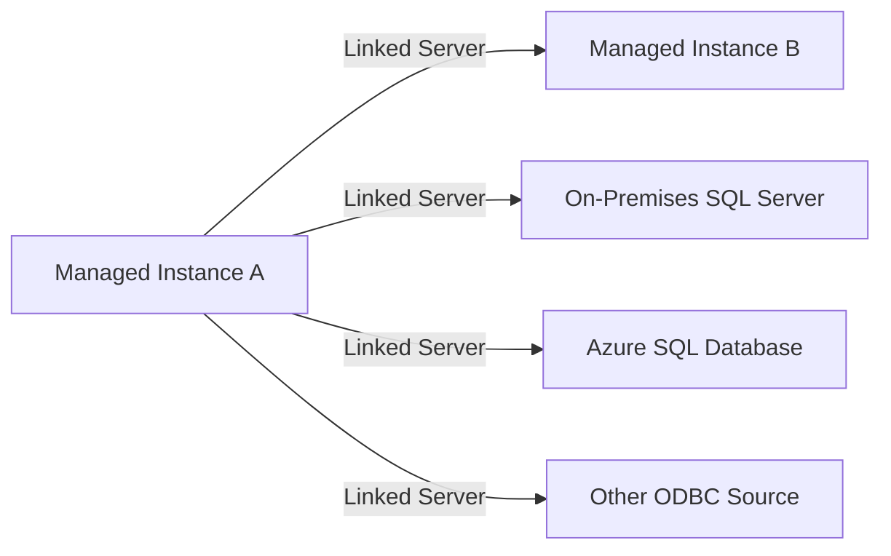

# How to Set Up Linked Servers in Azure SQL Managed Instance

Author: [nawazdhandala](https://www.github.com/nawazdhandala)

Tags: Azure SQL, Managed Instance, Linked Servers, Distributed Queries, Azure, Database, SQL Server

Description: Learn how to configure linked servers in Azure SQL Managed Instance to query data across multiple database servers and integrate with external data sources.

---

Linked servers are a SQL Server feature that lets you query data from remote database servers as if it were local. You can write queries that join tables across different servers, execute remote stored procedures, and integrate data from multiple sources. Azure SQL Managed Instance supports linked servers, making it possible to maintain these patterns when migrating from on-premises SQL Server.

In this post, I will cover how to set up linked servers in Managed Instance, including connections to other Managed Instances, on-premises SQL Servers, and other data sources.

## What Are Linked Servers?

A linked server is a configuration that lets SQL Server communicate with another database server using an OLE DB provider. Once configured, you can:

- Run distributed queries across servers using four-part names: `[LinkedServer].[Database].[Schema].[Table]`
- Execute remote stored procedures
- Use OPENQUERY to send pass-through queries to the remote server
- Participate in distributed transactions

In Managed Instance, linked servers work similarly to on-premises SQL Server, with some networking considerations since the instance lives inside a VNet.



## Setting Up a Linked Server to Another Managed Instance

This is the most common scenario when you have multiple Managed Instances and need to query across them.

### Prerequisites

- Both Managed Instances must be network-accessible to each other (same VNet or peered VNets)
- A SQL login on the remote instance that the linked server will use for authentication
- Port 1433 must be open between the instances in the NSG rules

### Creating the Linked Server

Connect to the Managed Instance where you want to create the linked server and run:

```sql
-- Create a linked server to another Managed Instance
-- This defines the remote server connection using the SQL Native Client provider
EXEC sp_addlinkedserver
    @server = N'RemoteMI',
    @srvproduct = N'',
    @provider = N'SQLNCLI',
    @datasrc = N'remote-mi.abc123.database.windows.net';

-- Configure the login mapping for the linked server
-- This specifies which credentials to use when connecting to the remote server
EXEC sp_addlinkedsrvlogin
    @rmtsrvname = N'RemoteMI',
    @useself = N'False',
    @locallogin = NULL,
    @rmtuser = N'linkedserver_user',
    @rmtpassword = N'YourStrongPassword123!';
```

### Testing the Connection

```sql
-- Test the linked server connection
EXEC sp_testlinkedserver N'RemoteMI';
```

If this returns without errors, the connection is working.

### Querying Through the Linked Server

Use four-part naming to query the remote database:

```sql
-- Query a table on the remote Managed Instance using four-part naming
-- Format: [LinkedServer].[Database].[Schema].[Table]
SELECT TOP 10 *
FROM [RemoteMI].[SalesDB].[dbo].[Customers];
```

You can also join local and remote tables:

```sql
-- Join local orders with remote customer data
SELECT
    o.OrderID,
    o.OrderDate,
    c.CustomerName,
    c.Email
FROM dbo.Orders o
INNER JOIN [RemoteMI].[SalesDB].[dbo].[Customers] c
    ON o.CustomerID = c.CustomerID
WHERE o.OrderDate >= '2026-01-01';
```

### Using OPENQUERY

For better performance on complex queries, use OPENQUERY to push the query execution to the remote server:

```sql
-- OPENQUERY sends the entire query to the remote server for execution
-- This is more efficient than four-part naming for complex queries
SELECT o.OrderID, o.OrderDate, rc.CustomerName
FROM dbo.Orders o
INNER JOIN OPENQUERY(RemoteMI,
    'SELECT CustomerID, CustomerName FROM SalesDB.dbo.Customers WHERE Country = ''US'''
) rc ON o.CustomerID = rc.CustomerID;
```

OPENQUERY is particularly beneficial when:
- The remote table is large and you need to filter it significantly
- The remote query involves aggregation or complex logic
- You want to minimize data transfer between servers

## Setting Up a Linked Server to On-Premises SQL Server

Connecting from Managed Instance to an on-premises SQL Server requires VPN or ExpressRoute connectivity.

### Prerequisites

- VPN or ExpressRoute connection between the VNet and on-premises network
- The on-premises SQL Server must be accessible on port 1433 from the Managed Instance subnet
- A SQL login on the on-premises server

### Creating the Linked Server

```sql
-- Create a linked server to an on-premises SQL Server
-- Use the on-premises server's IP address or hostname (resolvable from within the VNet)
EXEC sp_addlinkedserver
    @server = N'OnPremServer',
    @srvproduct = N'',
    @provider = N'SQLNCLI',
    @datasrc = N'10.100.1.50,1433';

-- Configure login mapping
EXEC sp_addlinkedsrvlogin
    @rmtsrvname = N'OnPremServer',
    @useself = N'False',
    @locallogin = NULL,
    @rmtuser = N'linked_user',
    @rmtpassword = N'OnPremPassword123!';
```

Note: Use the IP address rather than the hostname unless you have DNS resolution configured between the VNet and on-premises.

### Testing and Querying

```sql
-- Test the connection to the on-premises server
EXEC sp_testlinkedserver N'OnPremServer';

-- Query data from the on-premises server
SELECT TOP 100 *
FROM [OnPremServer].[InventoryDB].[dbo].[Products];
```

## Setting Up a Linked Server to Azure SQL Database

You can also create a linked server from Managed Instance to a regular Azure SQL Database.

```sql
-- Create a linked server to an Azure SQL Database
EXEC sp_addlinkedserver
    @server = N'AzureSQLDB',
    @srvproduct = N'',
    @provider = N'SQLNCLI',
    @datasrc = N'myserver.database.windows.net',
    @catalog = N'mydb';

-- Configure login mapping
EXEC sp_addlinkedsrvlogin
    @rmtsrvname = N'AzureSQLDB',
    @useself = N'False',
    @locallogin = NULL,
    @rmtuser = N'sqladmin',
    @rmtpassword = N'YourPassword123!';
```

Note: Azure SQL Database requires TLS encryption, so make sure the connection uses the encrypted protocol (the default SQLNCLI provider handles this automatically).

## Configuring Linked Server Options

You can tune linked server behavior with `sp_serveroption`:

```sql
-- Enable RPC (Remote Procedure Call) to execute stored procedures remotely
EXEC sp_serveroption @server = N'RemoteMI', @optname = 'rpc', @optvalue = 'true';
EXEC sp_serveroption @server = N'RemoteMI', @optname = 'rpc out', @optvalue = 'true';

-- Set the connection timeout (seconds)
EXEC sp_serveroption @server = N'RemoteMI', @optname = 'connect timeout', @optvalue = '30';

-- Set the query timeout (seconds, 0 = no timeout)
EXEC sp_serveroption @server = N'RemoteMI', @optname = 'query timeout', @optvalue = '300';

-- Enable lazy schema validation for better performance
-- The server won't validate the schema until query execution
EXEC sp_serveroption @server = N'RemoteMI', @optname = 'lazy schema validation', @optvalue = 'true';
```

### Executing Remote Stored Procedures

With RPC enabled, you can execute stored procedures on the remote server:

```sql
-- Execute a stored procedure on the remote server
EXEC [RemoteMI].[SalesDB].[dbo].[usp_GetCustomerOrders] @CustomerID = 12345;
```

## Managing Linked Servers

### Viewing Existing Linked Servers

```sql
-- List all linked servers on the current instance
SELECT
    name AS LinkedServerName,
    product,
    provider,
    data_source,
    catalog
FROM sys.servers
WHERE is_linked = 1;
```

### Modifying a Linked Server

To change the data source or provider:

```sql
-- Drop and recreate is the safest approach for modifications
EXEC sp_dropserver @server = N'RemoteMI', @droplogins = 'droplogins';

-- Recreate with new settings
EXEC sp_addlinkedserver
    @server = N'RemoteMI',
    @srvproduct = N'',
    @provider = N'SQLNCLI',
    @datasrc = N'new-remote-mi.abc456.database.windows.net';
```

### Dropping a Linked Server

```sql
-- Remove a linked server and its login mappings
EXEC sp_dropserver @server = N'RemoteMI', @droplogins = 'droplogins';
```

## Performance Considerations

Linked server queries can be slow if not designed carefully. Here are some tips:

**Minimize data transfer.** Filter data on the remote server rather than pulling everything locally. Use OPENQUERY to push WHERE clauses to the remote side.

**Avoid distributed joins on large tables.** If you need to join a large remote table with a large local table, consider copying the necessary data locally first using INSERT INTO...SELECT or a staging table.

**Use OPENQUERY for complex queries.** Four-part naming can result in the local server pulling the entire remote table and filtering locally. OPENQUERY forces the filter to execute remotely.

**Monitor query plans.** Use SET STATISTICS IO ON and examine the execution plan to see how much data is being transferred.

**Consider indexing on the remote side.** The remote server needs appropriate indexes for queries coming through the linked server, just like it would for any other query.

```sql
-- Bad: This might pull the entire remote table locally before filtering
SELECT * FROM [RemoteMI].[SalesDB].[dbo].[Orders]
WHERE OrderDate > '2026-01-01';

-- Better: OPENQUERY ensures the filter runs on the remote server
SELECT * FROM OPENQUERY(RemoteMI,
    'SELECT * FROM SalesDB.dbo.Orders WHERE OrderDate > ''2026-01-01''');
```

## Security Considerations

**Use dedicated service accounts.** Create SQL logins specifically for linked server connections with minimal required permissions. Do not use the sa account or admin credentials.

**Limit permissions on the remote side.** The remote login should only have access to the specific databases, schemas, and tables needed. Use the principle of least privilege.

**Audit linked server usage.** Monitor who is using linked servers and what queries they are running. Linked servers can be a vector for data exfiltration if not properly controlled.

**Consider network security.** Ensure NSG rules allow traffic only between the specific subnets that need it, not broadly to all sources.

## Limitations in Managed Instance

While Managed Instance supports most linked server functionality, there are some limitations:

- Only the SQLNCLI and MSOLEDBSQL providers are available (no custom OLE DB providers)
- Distributed transactions (MSDTC) are supported between Managed Instances but may require additional configuration
- Linked servers to non-SQL sources (Oracle, MySQL, etc.) are limited to available providers

## Summary

Linked servers in Azure SQL Managed Instance let you maintain distributed query patterns that are common in on-premises SQL Server environments. Set them up to connect to other Managed Instances, on-premises servers, or Azure SQL Databases. Pay attention to networking requirements (VNet peering, VPN, NSG rules), use OPENQUERY for better performance on remote queries, and follow security best practices with dedicated service accounts and minimal permissions. When migrating from on-premises, recreating linked servers is a key post-migration step that requires careful testing to ensure queries work correctly in the cloud network topology.
