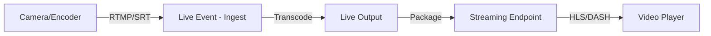

# How to Set Up Live Streaming with Low Latency Using Azure Media Services Live Events

Author: [nawazdhandala](https://www.github.com/nawazdhandala)

Tags: Azure Media Services, Live Streaming, Low Latency, RTMP, HLS, Live Events, Video Streaming

Description: A step-by-step guide to setting up live streaming with low latency using Azure Media Services live events, including encoder configuration and playback setup.

---

Live streaming is everywhere - product launches, gaming broadcasts, corporate town halls, sports events, and live commerce. The challenge is not just getting video from a camera to viewers, but doing it with low enough latency that the experience feels live. Azure Media Services provides a managed live streaming infrastructure that handles the ingest, transcoding, packaging, and delivery of live video. With the low-latency mode enabled, you can achieve glass-to-glass latency under 10 seconds, which is good enough for most interactive scenarios.

This guide covers setting up a complete live streaming pipeline using Azure Media Services, from creating the live event to configuring an encoder and serving the stream to viewers.

## Architecture of Live Streaming in Azure Media Services

The live streaming pipeline has four stages:



1. **Ingest** - Your encoder (OBS, Wirecast, or hardware encoder) sends an RTMP or SRT stream to the Live Event's ingest URL
2. **Live Event** - Azure transcodes the stream into multiple bitrates (adaptive bitrate streaming)
3. **Live Output** - The transcoded stream is written to an Asset for packaging and optional DVR
4. **Streaming Endpoint** - Serves the packaged stream to viewers over HLS and DASH protocols

## Prerequisites

- An Azure Media Services account (v3 API)
- A streaming endpoint in "Running" state
- An RTMP-capable encoder (we will use OBS Studio in this example)
- The Azure CLI with the Media Services extension

```bash
# Create a Media Services account if you don't have one
az ams account create \
  --name my-media-services \
  --resource-group media-rg \
  --location eastus \
  --storage-account mediastorage

# Start the default streaming endpoint
az ams streaming-endpoint start \
  --name default \
  --account-name my-media-services \
  --resource-group media-rg
```

## Step 1: Create a Live Event

A Live Event is the entry point for your live stream. There are two types:

- **Pass-through** - The encoder does the transcoding. Azure just packages and delivers. Lower cost, but your encoder must send all quality levels.
- **Standard encoding** - Azure transcodes the single-bitrate input into multiple bitrates. Simpler encoder setup, but costs more due to transcoding compute.

For most scenarios, standard encoding is the right choice because it simplifies the encoder configuration.

```bash
# Create a live event with standard encoding and low latency
az ams live-event create \
  --name my-live-event \
  --account-name my-media-services \
  --resource-group media-rg \
  --streaming-protocol RTMP \
  --encoding-type Standard \
  --preset-name Default720p \
  --ips AllowAll \
  --stream-options LowLatency

# The output includes the ingest URLs - save these for your encoder
az ams live-event show \
  --name my-live-event \
  --account-name my-media-services \
  --resource-group media-rg \
  --query input.endpoints
```

The `--stream-options LowLatency` flag is key. Without it, the default latency can be 20-30 seconds. With low latency enabled, you typically see 5-10 seconds.

The command returns two ingest URLs (primary and secondary for redundancy). They look like:

```
rtmp://my-live-event-myms.channel.media.azure.net:1935/live/a1b2c3d4
```

## Step 2: Create a Live Output

A Live Output connects the Live Event to an Asset where the stream is recorded. This enables DVR functionality and VOD (video on demand) after the stream ends.

```bash
# Create an asset to store the live stream recording
az ams asset create \
  --name live-stream-asset \
  --account-name my-media-services \
  --resource-group media-rg

# Create the live output connecting the event to the asset
# Archive window determines how far back viewers can seek (DVR)
az ams live-output create \
  --name my-live-output \
  --account-name my-media-services \
  --resource-group media-rg \
  --live-event-name my-live-event \
  --asset-name live-stream-asset \
  --archive-window-length PT4H \
  --manifest-name "stream"
```

The `--archive-window-length PT4H` parameter means viewers can seek back up to 4 hours in the live stream. This is useful for viewers who join late and want to rewind.

## Step 3: Start the Live Event

```bash
# Start the live event - this allocates encoding resources
az ams live-event start \
  --name my-live-event \
  --account-name my-media-services \
  --resource-group media-rg
```

Starting the live event provisions the transcoding infrastructure. This can take 1-2 minutes. Once running, the event is ready to receive your encoder's stream.

## Step 4: Configure Your Encoder

Open OBS Studio (or your encoder of choice) and configure the streaming settings.

**OBS Studio settings:**

1. Go to Settings > Stream
2. Set Service to "Custom"
3. Set Server to the primary ingest URL from Step 1 (everything before the last path segment)
4. Set Stream Key to the last path segment of the ingest URL

**Recommended encoding settings for Azure Media Services:**

| Setting | Value |
|---|---|
| Encoder | x264 or NVENC |
| Rate Control | CBR (Constant Bitrate) |
| Bitrate | 2500-4000 Kbps |
| Keyframe Interval | 2 seconds |
| Resolution | 1280x720 (input) |
| Frame Rate | 30 fps |
| Audio Codec | AAC |
| Audio Bitrate | 128 Kbps |
| Audio Sample Rate | 48 kHz |

The keyframe interval of 2 seconds is important. Azure Media Services segments the stream at keyframe boundaries, and shorter intervals mean lower latency because segments can be smaller.

## Step 5: Create a Streaming Locator

A streaming locator generates the playback URLs for viewers.

```bash
# Create a streaming locator for the live asset
az ams streaming-locator create \
  --name live-stream-locator \
  --account-name my-media-services \
  --resource-group media-rg \
  --asset-name live-stream-asset \
  --streaming-policy-name Predefined_ClearStreamingOnly

# Get the streaming URLs
az ams streaming-locator get-paths \
  --name live-stream-locator \
  --account-name my-media-services \
  --resource-group media-rg
```

This returns HLS and DASH manifest URLs. For low-latency HLS (LL-HLS), append `(format=m3u8-cmaf)` to the path.

Example HLS URL:
```
https://my-media-services-usea.streaming.media.azure.net/abc123/stream.ism/manifest(format=m3u8-cmaf)
```

## Step 6: Set Up the Video Player

Use Azure Media Player or any HLS/DASH-compatible player to display the stream.

```html
<!DOCTYPE html>
<html>
<head>
    <title>Live Stream Viewer</title>
    <!-- Azure Media Player -->
    <link href="https://amp.azure.net/libs/amp/latest/skins/amp-default/azuremediaplayer.min.css" rel="stylesheet">
    <script src="https://amp.azure.net/libs/amp/latest/azuremediaplayer.min.js"></script>
    <style>
        body { margin: 0; padding: 20px; background: #1a1a1a; font-family: Arial, sans-serif; }
        .player-container { max-width: 900px; margin: 0 auto; }
        h1 { color: white; text-align: center; }
        .status { color: #ccc; text-align: center; margin-top: 10px; font-size: 14px; }
    </style>
</head>
<body>
    <div class="player-container">
        <h1>Live Stream</h1>

        <video id="azureMediaPlayer"
               class="azuremediaplayer amp-default-skin amp-big-play-centered"
               width="100%"
               tabindex="0">
        </video>

        <div class="status" id="status">Connecting to live stream...</div>
    </div>

    <script>
        // Initialize Azure Media Player
        var playerOptions = {
            autoplay: true,
            controls: true,
            logo: { enabled: false },
            // Low-latency heuristic profile
            heuristicProfile: "LowLatency"
        };

        var player = amp("azureMediaPlayer", playerOptions);

        // Set the live stream source
        player.src([{
            src: "https://my-media-services-usea.streaming.media.azure.net/abc123/stream.ism/manifest(format=m3u8-cmaf)",
            type: "application/vnd.ms-sstr+xml"
        }]);

        // Update status based on player events
        player.addEventListener('playing', function () {
            document.getElementById('status').textContent = 'LIVE';
            document.getElementById('status').style.color = '#e74c3c';
        });

        player.addEventListener('waiting', function () {
            document.getElementById('status').textContent = 'Buffering...';
        });

        player.addEventListener('error', function () {
            document.getElementById('status').textContent = 'Stream unavailable';
        });
    </script>
</body>
</html>
```

Alternatively, use HLS.js for a lighter player.

```html
<!-- Lightweight HLS.js player -->
<script src="https://cdn.jsdelivr.net/npm/hls.js@latest"></script>
<video id="video" controls autoplay style="width: 100%;"></video>

<script>
    var videoElement = document.getElementById('video');
    var hlsUrl = 'https://my-media-services-usea.streaming.media.azure.net/abc123/stream.ism/manifest(format=m3u8-cmaf)';

    if (Hls.isSupported()) {
        var hls = new Hls({
            // Low-latency configuration
            liveSyncDurationCount: 3,
            liveMaxLatencyDurationCount: 5,
            lowLatencyMode: true,
            enableWorker: true
        });
        hls.loadSource(hlsUrl);
        hls.attachMedia(videoElement);
    } else if (videoElement.canPlayType('application/vnd.apple.mpegurl')) {
        // Native HLS support (Safari)
        videoElement.src = hlsUrl;
    }
</script>
```

## Step 7: Stop the Live Event

When the broadcast is over, stop the live event to release the encoding resources and stop billing.

```bash
# Stop the live event
az ams live-event stop \
  --name my-live-event \
  --account-name my-media-services \
  --resource-group media-rg

# Delete the live output first, then the live event
az ams live-output delete \
  --name my-live-output \
  --account-name my-media-services \
  --resource-group media-rg \
  --live-event-name my-live-event

az ams live-event delete \
  --name my-live-event \
  --account-name my-media-services \
  --resource-group media-rg
```

The asset remains after the live event is deleted, so you can create a new streaming locator to serve the recorded stream as video on demand.

## Latency Optimization Tips

Getting the lowest possible latency requires tuning at every stage of the pipeline.

**Encoder side:**
- Use a 2-second keyframe interval (GOP size)
- Use CBR, not VBR - variable bitrate causes inconsistent segment sizes
- Use hardware encoding (NVENC, QuickSync) for lower encoding latency
- Keep the output resolution at 720p - higher resolutions increase encoding time

**Azure side:**
- Always enable the `LowLatency` stream option
- Use the Standard encoding type with a 720p preset
- Ensure the streaming endpoint is in the same region as the live event

**Player side:**
- Use the `LowLatency` heuristic profile in Azure Media Player
- Configure HLS.js with low `liveSyncDurationCount` values
- Reduce buffer sizes to the minimum that avoids rebuffering

## Cost Considerations

Live events are billed per minute of running time, regardless of whether anyone is watching. A Standard encoding live event costs more than a Pass-through event because Azure is doing the transcoding. The streaming endpoint has a separate cost based on the streaming units allocated.

Key cost tips:
- Stop live events when not in use. Do not leave them running overnight.
- Use Pass-through events if your encoder can produce multiple bitrates.
- Scale streaming endpoints based on expected viewer count.

## Wrapping Up

Azure Media Services live streaming handles the heavy infrastructure work of live video - transcoding, adaptive bitrate packaging, CDN delivery, and DVR. With the low-latency option enabled and proper encoder settings, you can deliver a sub-10-second latency experience to viewers on any device. The setup involves creating a live event, connecting your encoder, creating a live output for DVR, and generating playback URLs for your player. The most important optimization is the keyframe interval on your encoder - keep it at 2 seconds for the best balance of latency and quality.
