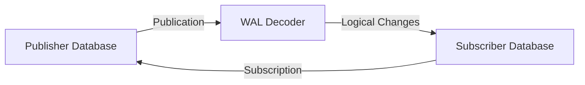

# How to Set Up Logical Replication in Azure Database for PostgreSQL

Author: [nawazdhandala](https://www.github.com/nawazdhandala)

Tags: Azure, PostgreSQL, Logical Replication, Data Sync, Flexible Server, Database Migration, Replication

Description: A hands-on guide to configuring logical replication in Azure Database for PostgreSQL Flexible Server for selective table replication and data synchronization.

---

PostgreSQL offers two types of replication: physical and logical. Physical replication (what read replicas use) copies the entire database byte-for-byte. Logical replication is more selective - it lets you replicate specific tables between PostgreSQL databases, even across different versions. This makes it useful for migrations, data distribution, reporting database feeds, and microservice architectures where each service needs a subset of data from a central database.

In this post, I will walk through setting up logical replication on Azure Database for PostgreSQL Flexible Server, covering both the publisher (source) and subscriber (target) configuration.

## How Logical Replication Works

Logical replication uses a publish-subscribe model:

- The **publisher** (source) declares which tables to replicate by creating a publication.
- The **subscriber** (target) creates a subscription that connects to the publisher and starts receiving changes.



Unlike physical replication, logical replication:

- Works at the table level (you can replicate specific tables).
- Supports cross-version replication (e.g., PostgreSQL 14 to 16).
- Allows the subscriber to have additional indexes, tables, or different schemas.
- Lets the subscriber be writable (though writing to replicated tables is risky).
- Replicates INSERT, UPDATE, and DELETE operations.
- Does NOT replicate DDL (schema changes), sequences, or large objects.

## Prerequisites

### On the Publisher (Source)

- Azure Database for PostgreSQL Flexible Server or an on-premises PostgreSQL 10+.
- The `wal_level` parameter must be set to `logical`.
- The tables being published must have a primary key or REPLICA IDENTITY set.

### On the Subscriber (Target)

- Azure Database for PostgreSQL Flexible Server.
- Network connectivity to the publisher (direct, VPN, or peering).
- The target tables must already exist with a matching schema.

## Step 1: Configure the Publisher

### Set the WAL Level

```bash
# Set wal_level to logical on the publisher
az postgres flexible-server parameter set \
  --resource-group myResourceGroup \
  --server-name my-pg-publisher \
  --name wal_level \
  --value logical

# Increase max_replication_slots (each subscription uses one slot)
az postgres flexible-server parameter set \
  --resource-group myResourceGroup \
  --server-name my-pg-publisher \
  --name max_replication_slots \
  --value 10

# Increase max_wal_senders
az postgres flexible-server parameter set \
  --resource-group myResourceGroup \
  --server-name my-pg-publisher \
  --name max_wal_senders \
  --value 10

# Restart required for wal_level change
az postgres flexible-server restart \
  --resource-group myResourceGroup \
  --name my-pg-publisher
```

### Verify the WAL Level

```sql
-- Confirm wal_level is set to logical
SHOW wal_level;
-- Should return: logical
```

### Create a Replication User

Create a dedicated user for replication:

```sql
-- Create a user with replication privileges
CREATE USER replication_user WITH REPLICATION LOGIN PASSWORD 'ReplicationPass123!';

-- Grant access to the database
GRANT CONNECT ON DATABASE myapp TO replication_user;

-- Grant usage on the schema
GRANT USAGE ON SCHEMA public TO replication_user;

-- Grant select on all tables being published
GRANT SELECT ON ALL TABLES IN SCHEMA public TO replication_user;
```

### Ensure Tables Have Primary Keys

Logical replication requires a way to identify rows for UPDATE and DELETE operations. Tables need either a primary key or a REPLICA IDENTITY:

```sql
-- Check which tables lack primary keys
SELECT t.table_schema, t.table_name
FROM information_schema.tables t
LEFT JOIN information_schema.table_constraints tc
    ON t.table_schema = tc.table_schema
    AND t.table_name = tc.table_name
    AND tc.constraint_type = 'PRIMARY KEY'
WHERE t.table_schema = 'public'
  AND t.table_type = 'BASE TABLE'
  AND tc.constraint_name IS NULL;
```

For tables without primary keys, you have two options:

```sql
-- Option 1: Add a primary key (preferred)
ALTER TABLE my_table ADD PRIMARY KEY (id);

-- Option 2: Set REPLICA IDENTITY FULL (slower but works without PK)
-- This compares all column values to identify rows
ALTER TABLE my_table REPLICA IDENTITY FULL;
```

### Create the Publication

```sql
-- Publish specific tables
CREATE PUBLICATION my_publication FOR TABLE users, orders, products;

-- Or publish all tables in the database
CREATE PUBLICATION my_full_publication FOR ALL TABLES;

-- Or publish only INSERT operations (skip UPDATE/DELETE)
CREATE PUBLICATION my_insert_only_pub FOR TABLE events
    WITH (publish = 'insert');
```

Verify the publication:

```sql
-- List all publications
SELECT pubname, puballtables, pubinsert, pubupdate, pubdelete
FROM pg_publication;

-- List tables in a publication
SELECT * FROM pg_publication_tables
WHERE pubname = 'my_publication';
```

## Step 2: Configure the Subscriber

### Prepare the Target Database

The target database needs the same table structure. Export the schema from the publisher:

```bash
# Dump only the schema from the publisher
pg_dump \
  --host=my-pg-publisher.postgres.database.azure.com \
  --username=pgadmin \
  --dbname=myapp \
  --schema-only \
  --no-owner \
  --no-privileges \
  > schema.sql

# Apply the schema to the subscriber
psql "host=my-pg-subscriber.postgres.database.azure.com port=5432 dbname=myapp user=pgadmin sslmode=require" \
  < schema.sql
```

### Create the Subscription

Connect to the subscriber database and create the subscription:

```sql
-- Create the subscription
-- This starts the initial data copy and then continuous replication
CREATE SUBSCRIPTION my_subscription
CONNECTION 'host=my-pg-publisher.postgres.database.azure.com port=5432 dbname=myapp user=replication_user password=ReplicationPass123! sslmode=require'
PUBLICATION my_publication;
```

When you create a subscription, PostgreSQL:

1. Creates a replication slot on the publisher.
2. Takes a snapshot of the published tables.
3. Copies all existing data to the subscriber (initial sync).
4. Starts streaming changes (ongoing replication).

### Verify the Subscription

```sql
-- Check subscription status on the subscriber
SELECT subname, subenabled, subconninfo
FROM pg_subscription;

-- Check the replication status
SELECT
    srsubid,
    srrelid::regclass AS table_name,
    srsubstate AS state
FROM pg_subscription_rel;
```

The `srsubstate` values:

| State | Meaning |
|-------|---------|
| i | Initializing (initial data copy in progress) |
| d | Data copy completed, waiting for sync |
| s | Synchronized (initial sync done) |
| r | Ready (streaming changes) |

## Step 3: Monitor Replication

### On the Publisher

```sql
-- Check replication slots and their lag
SELECT
    slot_name,
    slot_type,
    active,
    pg_wal_lsn_diff(pg_current_wal_lsn(), confirmed_flush_lsn) AS lag_bytes,
    pg_size_pretty(pg_wal_lsn_diff(pg_current_wal_lsn(), confirmed_flush_lsn)) AS lag_pretty
FROM pg_replication_slots
WHERE slot_type = 'logical';

-- Check active replication connections
SELECT
    pid,
    usename,
    client_addr,
    state,
    sent_lsn,
    write_lsn,
    flush_lsn,
    replay_lsn
FROM pg_stat_replication;
```

### On the Subscriber

```sql
-- Check subscription worker status
SELECT
    subname,
    pid,
    received_lsn,
    latest_end_lsn,
    latest_end_time
FROM pg_stat_subscription;
```

## Managing the Subscription

### Adding Tables to an Existing Publication

On the publisher:

```sql
-- Add a new table to the publication
ALTER PUBLICATION my_publication ADD TABLE new_table;
```

On the subscriber, refresh the subscription to pick up the new table:

```sql
-- Refresh to sync the new table (copies existing data first)
ALTER SUBSCRIPTION my_subscription REFRESH PUBLICATION;
```

### Pausing and Resuming Replication

```sql
-- Pause replication (subscriber side)
ALTER SUBSCRIPTION my_subscription DISABLE;

-- Resume replication
ALTER SUBSCRIPTION my_subscription ENABLE;
```

### Removing a Subscription

```sql
-- Drop the subscription (also removes the replication slot on the publisher)
DROP SUBSCRIPTION my_subscription;
```

If the publisher is unreachable when you drop the subscription, the replication slot will remain on the publisher. Clean it up manually:

```sql
-- On the publisher: drop an orphaned replication slot
SELECT pg_drop_replication_slot('my_subscription');
```

## Common Use Cases

### Cross-Region Data Distribution

Replicate data to a database in another region for low-latency reads:

```sql
-- On the publisher in East US
CREATE PUBLICATION regional_pub FOR TABLE products, categories, pricing;

-- On the subscriber in West Europe
CREATE SUBSCRIPTION regional_sub
CONNECTION 'host=publisher.postgres.database.azure.com port=5432 dbname=myapp user=replication_user password=ReplicationPass123! sslmode=require'
PUBLICATION regional_pub;
```

### Feeding a Reporting Database

Replicate specific tables to a reporting database that has its own indexes and materialized views:

```sql
-- On the publisher (OLTP database)
CREATE PUBLICATION reporting_pub FOR TABLE orders, customers, products, line_items;

-- On the subscriber (reporting database)
-- After the initial sync, add reporting-specific indexes
CREATE INDEX idx_orders_reporting ON orders (order_date, status);
CREATE MATERIALIZED VIEW daily_revenue AS
SELECT DATE(order_date) AS day, SUM(total) AS revenue
FROM orders
GROUP BY DATE(order_date);
```

### Zero-Downtime Major Version Upgrade

Use logical replication to migrate from PostgreSQL 14 to 16:

1. Create a new Flexible Server on PostgreSQL 16.
2. Set up logical replication from 14 to 16.
3. Once in sync, cut over your application to the new server.
4. Drop the subscription and decommission the old server.

## Troubleshooting

**Subscription stuck in "initializing"**: Check network connectivity between publisher and subscriber. Verify the replication user has SELECT access on all tables.

**Replication slot growing in size**: If the subscriber is down or slow, WAL accumulates in the replication slot. Monitor slot lag and set up alerts.

**Conflict on the subscriber**: If you write to a replicated table on the subscriber and it conflicts with an incoming change, replication stops. Check the PostgreSQL logs and resolve the conflict.

**Sequence values not replicated**: Logical replication does not replicate sequences. If you promote the subscriber, manually set sequence values.

## Summary

Logical replication in Azure Database for PostgreSQL Flexible Server gives you fine-grained control over data replication between databases. It is more flexible than physical replication because it works at the table level and supports cross-version scenarios. The setup requires some care - WAL level configuration, proper permissions, schema preparation - but once running, it is reliable and low-overhead. Use it for selective replication, reporting database feeds, cross-region data distribution, or as a migration tool for zero-downtime version upgrades.
