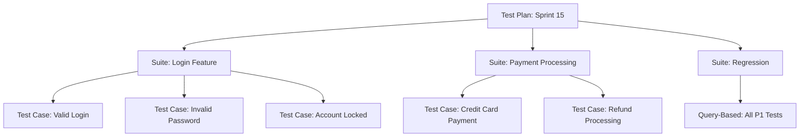
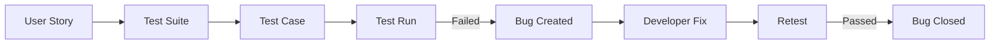

# How to Set Up Manual Test Plans and Test Suites in Azure Test Plans

Author: [nawazdhandala](https://www.github.com/nawazdhandala)

Tags: Azure Test Plans, Manual Testing, Test Suites, QA, Azure DevOps, Test Management, Quality Assurance

Description: Organize and execute manual testing effectively using test plans, test suites, and test cases in Azure Test Plans.

---

Not everything can be automated. User experience testing, exploratory testing, accessibility testing, and complex end-to-end scenarios often require a human tester who can observe subtleties that automated tests miss. Azure Test Plans provides the structure and tooling to make manual testing organized, repeatable, and traceable.

In this post, I will walk through setting up test plans, organizing test suites, writing effective test cases, executing test runs, and connecting everything back to your work items and pipelines.

## Understanding the Hierarchy

Azure Test Plans uses a three-level hierarchy:

- **Test Plan**: The top level, usually aligned with a sprint or release. A test plan contains test suites.
- **Test Suite**: A grouping of test cases. Suites can be static (manually curated), requirement-based (linked to work items), or query-based (dynamically populated).
- **Test Case**: An individual test with steps, expected results, and parameters.

## Creating a Test Plan

Navigate to **Test Plans** in your Azure DevOps project. Click **+ New Test Plan**.

Configure the plan:

- **Name**: Use a clear naming convention like "Sprint 15 - Release 2.3" or "Quarterly Regression Q1 2026"
- **Area path**: Match your project's area path structure
- **Iteration**: Link to the sprint or release iteration
- **Start and End dates**: When testing should occur

I create one test plan per sprint for feature testing and one per release for regression testing. This keeps things organized and lets you track test completion per sprint.

## Creating Test Suites

Within your test plan, create test suites to organize test cases. Azure Test Plans supports three types.

### Static Test Suites

Static suites contain test cases that you manually add. Use these for curated collections of tests.

Click the **+** button on the test plan node and select **New static suite**. Name it something descriptive like "Login and Authentication" or "Checkout Flow."

### Requirement-Based Test Suites

These are the most powerful type. A requirement-based suite automatically includes test cases linked to a specific user story or requirement. When you add a test case to a user story, it appears in the suite.

To create one:

1. Click **+** and select **New requirement-based suite**
2. Search for the user story you want to associate
3. Select it and click **Create suites**

Now every test case linked to that user story appears in this suite. As new test cases are added to the story, they automatically show up.

### Query-Based Test Suites

Query-based suites are dynamically populated based on a work item query. For example, you could create a suite that contains all test cases tagged as "regression" or all test cases with priority 1.

Create one by:

1. Click **+** and select **New query-based suite**
2. Define a query like: `Work Item Type = Test Case AND Tags Contains regression`
3. The suite automatically updates as test cases matching the query are created or modified

## Writing Effective Test Cases

A test case in Azure Test Plans consists of:

- **Title**: What this test validates
- **Steps**: Numbered actions the tester performs
- **Expected Results**: What should happen at each step
- **Parameters**: Variable data for running the same test with different inputs

### Creating a Test Case

Click **New Test Case** within a test suite. Here is an example for testing a login feature.

**Title**: Verify successful login with valid credentials

**Steps**:

| Step | Action | Expected Result |
|------|--------|----------------|
| 1 | Navigate to the login page | Login form is displayed with email and password fields |
| 2 | Enter a valid email address | Email is accepted in the field |
| 3 | Enter the correct password | Password is masked in the field |
| 4 | Click the "Sign In" button | User is redirected to the dashboard |
| 5 | Verify the welcome message | "Welcome, [username]" is displayed in the header |

### Using Shared Steps

If multiple test cases share the same steps (like "Log in as admin" or "Navigate to settings"), create shared steps to avoid duplication.

1. Select the common steps in a test case
2. Click **Create shared steps**
3. Give them a name like "Login as Admin"
4. In other test cases, insert the shared steps by clicking **Insert shared steps**

When you update shared steps, all test cases that reference them are updated automatically.

### Parameterized Test Cases

Parameters let you run the same test case with different data. Instead of creating separate test cases for "login with user A" and "login with user B," you parameterize the test.

In the test case steps, use parameters with the `@` prefix:

| Step | Action | Expected Result |
|------|--------|----------------|
| 1 | Navigate to @url | Login page loads |
| 2 | Enter @email in the email field | Email is accepted |
| 3 | Enter @password in the password field | Password is masked |
| 4 | Click Sign In | Welcome message shows @expectedName |

Then define the parameter values in the **Parameters** tab:

| @url | @email | @password | @expectedName |
|------|--------|-----------|---------------|
| /login | admin@test.com | Admin123! | Admin User |
| /login | user@test.com | User456! | Regular User |
| /login | viewer@test.com | View789! | Viewer User |

The test case runs three times, once for each row of data.

## Executing Test Runs

When it is time to test, you can run tests from the test plan directly.

### Running Tests in the Web Runner

1. Select the test cases you want to run (or select an entire suite)
2. Click **Run** to open the Web Runner
3. For each step, mark it as **Passed**, **Failed**, or **Blocked**
4. If a step fails, you can:
   - Add a comment explaining the failure
   - Take a screenshot (the runner can capture screenshots)
   - Create a bug directly from the test run (pre-populated with test details)

### Running Tests on Desktop

For more demanding testing scenarios, use the **Test Runner** desktop app. It provides:

- Screen recording during test execution
- Automatic screenshot capture on each step
- Audio recording for narrating observations
- Image annotation tools

### Exploratory Testing

Azure Test Plans supports exploratory testing through the Test and Feedback browser extension. This is for unscripted testing where the tester explores the application freely.

1. Install the **Test and Feedback** extension from the marketplace
2. Connect it to your Azure DevOps project
3. Start an exploratory session
4. As you find issues, create bugs directly from the extension with screenshots and session recordings

The extension captures:

- Screenshots with annotations
- Screen recordings
- Browser console logs
- System information

All of this is automatically attached to any bugs you create during the session.

## Tracking Test Results

### Test Plan Progress

The Test Plans view shows a summary of test execution for each suite:

- **Passed**: Tests that passed in the current run
- **Failed**: Tests that failed
- **Blocked**: Tests that could not be run (usually due to environment issues)
- **Not Applicable**: Tests marked as not applicable for this cycle
- **Not Run**: Tests that have not been executed yet

### Outcome Trends

Over multiple test runs, you can see trends in the **Charts** tab:

- Test execution progress over time
- Pass/fail trends across sprints
- Tester productivity (tests run per day)

### Linking Test Results to Work Items

When a test fails and you create a bug, the bug is automatically linked to:

- The test case that failed
- The test run where it was found
- The requirement (user story) that the test suite is based on

This creates full traceability from requirement to test to bug to fix.

## Test Configurations

If you need to run the same tests across different configurations (browsers, operating systems, devices), use test configurations.

Go to **Test Plans > Configurations** and create configurations like:

- **Chrome on Windows**
- **Firefox on Linux**
- **Safari on macOS**
- **Mobile - iOS Safari**
- **Mobile - Android Chrome**

Assign configurations to test suites or individual test cases. Each configuration creates a separate test point, so the same test case appears once for each assigned configuration.

## Best Practices for Test Plans

**Align test plans with sprints or releases.** This makes it clear what needs to be tested and when.

**Use requirement-based suites for feature testing.** They automatically stay in sync with your user stories.

**Create a regression suite.** Use a query-based suite that includes all test cases tagged as "regression." Run this before every release.

**Keep test cases atomic.** Each test case should validate one thing. Long test cases with many steps are harder to maintain and diagnose when they fail.

**Clean up regularly.** Archive old test plans and review test cases that have been failing or skipped for multiple sprints. They might be outdated.

**Use shared steps for common workflows.** Login sequences, navigation patterns, and setup procedures that appear in many tests should be shared steps.

## Wrapping Up

Azure Test Plans brings structure to manual testing that spreadsheets and ad-hoc testing cannot match. Test plans organize what needs to be tested, test suites group related tests, parameterized test cases reduce duplication, and the execution runner captures rich evidence of testing. The traceability from requirements through tests to bugs closes the loop between development and quality assurance. Start with a simple test plan for your current sprint, add test suites for each feature, and build from there.
