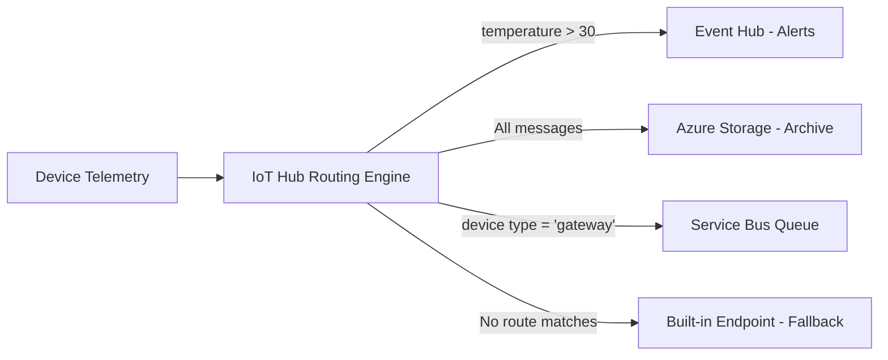

# How to Set Up Message Routing from Azure IoT Hub to Azure Storage and Event Hubs

Author: [nawazdhandala](https://www.github.com/nawazdhandala)

Tags: Azure IoT Hub, Message Routing, Event Hubs, Azure Storage, IoT, Telemetry, Data Pipeline

Description: Learn how to configure message routing in Azure IoT Hub to direct device telemetry to Azure Storage for archival and Event Hubs for real-time processing.

---

IoT devices generate a constant stream of telemetry data - temperature readings, location updates, sensor measurements, status reports. By default, this data lands in IoT Hub's built-in Event Hub-compatible endpoint where a single consumer reads it. But in a real production system, you need that data flowing to multiple destinations: cold storage for long-term archival, Event Hubs for real-time stream processing, Service Bus for reliable message queuing, and maybe different routes for different types of messages.

Azure IoT Hub message routing lets you define rules that direct messages to different endpoints based on message properties, body content, or device metadata. This guide covers setting up the two most common routing destinations: Azure Storage and Event Hubs.

## How Message Routing Works

When a device sends a message to IoT Hub, the routing engine evaluates it against all defined routes. If a message matches a route's condition, it is sent to that route's endpoint. A message can match multiple routes, in which case it is sent to all matching endpoints.



If no custom routes match a message, it goes to the built-in endpoint (unless the fallback route is disabled). This is an important safety net - you do not want to silently drop messages.

## Prerequisites

- An Azure IoT Hub (S1 tier or higher - routing is not available on the free tier)
- Devices sending telemetry to the hub
- An Azure Storage account for archival
- An Azure Event Hub namespace and event hub for stream processing

## Step 1: Create the Destination Endpoints

First, set up the services that will receive the routed messages.

### Create Azure Storage Account and Container

```bash
# Create a storage account for IoT telemetry archival
az storage account create \
    --resource-group rg-iot-production \
    --name stiottelemetry2026 \
    --location eastus2 \
    --sku Standard_LRS \
    --kind StorageV2

# Create a container for the telemetry data
az storage container create \
    --account-name stiottelemetry2026 \
    --name telemetry-archive
```

### Create Event Hub

```bash
# Create an Event Hub namespace
az eventhubs namespace create \
    --resource-group rg-iot-production \
    --name ehns-iot-processing \
    --location eastus2 \
    --sku Standard \
    --capacity 2

# Create an event hub for alerts/real-time processing
az eventhubs eventhub create \
    --resource-group rg-iot-production \
    --namespace-name ehns-iot-processing \
    --name eh-iot-alerts \
    --message-retention 7 \
    --partition-count 4

# Create an authorization rule for IoT Hub to send messages
az eventhubs eventhub authorization-rule create \
    --resource-group rg-iot-production \
    --namespace-name ehns-iot-processing \
    --eventhub-name eh-iot-alerts \
    --name iot-hub-sender \
    --rights Send
```

## Step 2: Add Custom Endpoints to IoT Hub

Register the storage account and event hub as endpoints in IoT Hub.

### Using Azure CLI

```bash
# Get the Event Hub connection string
EH_CONN_STRING=$(az eventhubs eventhub authorization-rule keys list \
    --resource-group rg-iot-production \
    --namespace-name ehns-iot-processing \
    --eventhub-name eh-iot-alerts \
    --name iot-hub-sender \
    --query "primaryConnectionString" -o tsv)

# Add Event Hub as a routing endpoint
az iot hub routing-endpoint create \
    --resource-group rg-iot-production \
    --hub-name iothub-production-001 \
    --endpoint-name "eh-alerts-endpoint" \
    --endpoint-type eventhub \
    --endpoint-resource-group rg-iot-production \
    --endpoint-subscription-id "<subscription-id>" \
    --connection-string "$EH_CONN_STRING"

# Get the Storage connection string
STORAGE_CONN_STRING=$(az storage account show-connection-string \
    --resource-group rg-iot-production \
    --name stiottelemetry2026 \
    --query "connectionString" -o tsv)

# Add Storage as a routing endpoint
az iot hub routing-endpoint create \
    --resource-group rg-iot-production \
    --hub-name iothub-production-001 \
    --endpoint-name "storage-archive-endpoint" \
    --endpoint-type azurestoragecontainer \
    --endpoint-resource-group rg-iot-production \
    --endpoint-subscription-id "<subscription-id>" \
    --connection-string "$STORAGE_CONN_STRING" \
    --container-name "telemetry-archive" \
    --encoding json \
    --file-name-format "{iothub}/{partition}/{YYYY}/{MM}/{DD}/{HH}/{mm}" \
    --batch-frequency 60 \
    --max-chunk-size 100
```

The storage endpoint configuration deserves attention:

**encoding** - Choose `json` for human-readable output or `avro` for more compact, schema-based format. JSON is easier to work with; Avro is better for large-scale analytics.

**file-name-format** - Controls how files are organized in blob storage. The format above creates a folder structure like: `iothub-production-001/0/2026/02/16/14/30` (hub/partition/year/month/day/hour/minute).

**batch-frequency** - How often (in seconds) to write a batch to storage. Range: 60-720 seconds.

**max-chunk-size** - Maximum size (in MB) of each blob before a new one is created. Range: 10-500 MB.

## Step 3: Create Routing Rules

Now create routes that direct messages to the appropriate endpoints based on conditions.

### Route All Messages to Storage (Archival)

```bash
# Route all device messages to storage for long-term archival
# The query "true" matches every message
az iot hub route create \
    --resource-group rg-iot-production \
    --hub-name iothub-production-001 \
    --route-name "archive-all-telemetry" \
    --source DeviceMessages \
    --endpoint-name "storage-archive-endpoint" \
    --condition "true" \
    --enabled true
```

### Route Alert Messages to Event Hub

```bash
# Route high-temperature alerts to Event Hub for real-time processing
# This uses a query that checks the message body for temperature values
az iot hub route create \
    --resource-group rg-iot-production \
    --hub-name iothub-production-001 \
    --route-name "temperature-alerts" \
    --source DeviceMessages \
    --endpoint-name "eh-alerts-endpoint" \
    --condition '$body.temperature > 30 OR $body.temperature < 5' \
    --enabled true
```

### Route Based on Message Properties

Devices can set application properties on messages that the routing engine can evaluate:

```bash
# Route messages with a specific application property
# Devices set message.custom_properties["severity"] = "critical"
az iot hub route create \
    --resource-group rg-iot-production \
    --hub-name iothub-production-001 \
    --route-name "critical-alerts" \
    --source DeviceMessages \
    --endpoint-name "eh-alerts-endpoint" \
    --condition "severity = 'critical'" \
    --enabled true
```

### Route Based on System Properties

You can also route based on device ID, content type, or other system properties:

```bash
# Route messages from gateway devices to a separate endpoint
az iot hub route create \
    --resource-group rg-iot-production \
    --hub-name iothub-production-001 \
    --route-name "gateway-telemetry" \
    --source DeviceMessages \
    --endpoint-name "eh-alerts-endpoint" \
    --condition "connectionDeviceId = 'gateway-001' OR connectionDeviceId = 'gateway-002'" \
    --enabled true
```

## Step 4: Configure the Fallback Route

The fallback route catches messages that do not match any custom route. By default, it sends them to the built-in Event Hub endpoint.

```bash
# Verify the fallback route is enabled
az iot hub route show \
    --resource-group rg-iot-production \
    --hub-name iothub-production-001 \
    --route-name '$fallback'
```

If you have a route that matches all messages (like the archive route with condition "true"), the fallback route will not receive any messages because everything is already routed. This is fine if you are intentionally handling all messages through custom routes.

## Step 5: Enrich Messages with IoT Hub Data

Message enrichments add metadata to messages before they are delivered to endpoints. This is useful for adding device twin tags or other contextual information to the message payload.

```bash
# Add device twin tag data to messages routed to storage
# This adds the device's location information to every message
az iot hub message-enrichment create \
    --resource-group rg-iot-production \
    --hub-name iothub-production-001 \
    --key "deviceLocation" \
    --value '$twin.tags.location.building' \
    --endpoints "storage-archive-endpoint"

# Add the device ID as an enrichment (useful for multi-tenant scenarios)
az iot hub message-enrichment create \
    --resource-group rg-iot-production \
    --hub-name iothub-production-001 \
    --key "sourceDeviceId" \
    --value '$twin.deviceId' \
    --endpoints "storage-archive-endpoint" "eh-alerts-endpoint"
```

Enrichments are added as message application properties, not to the message body. The downstream consumer reads them from the message metadata.

## Step 6: Send Messages from Devices with Routing Properties

For routing to work effectively, devices should include relevant properties in their messages:

```python
# Device-side code for sending telemetry with routing properties
# These properties enable the routing engine to direct messages correctly
from azure.iot.device import IoTHubDeviceClient, Message
import json
import time

client = IoTHubDeviceClient.create_from_connection_string(CONNECTION_STRING)
client.connect()

def send_telemetry(temperature, humidity, pressure):
    """
    Send a telemetry message with properties that enable routing.
    """
    # Build the message payload
    payload = json.dumps({
        "temperature": temperature,
        "humidity": humidity,
        "pressure": pressure,
        "timestamp": time.strftime("%Y-%m-%dT%H:%M:%SZ", time.gmtime())
    })

    # Create the message
    msg = Message(payload)

    # Set content type and encoding (required for body-based routing queries)
    msg.content_type = "application/json"
    msg.content_encoding = "utf-8"

    # Set application properties for property-based routing
    if temperature > 30 or temperature < 5:
        msg.custom_properties["severity"] = "critical"
        msg.custom_properties["alertType"] = "temperature"
    else:
        msg.custom_properties["severity"] = "normal"

    msg.custom_properties["sensorType"] = "environmental"

    # Send the message
    client.send_message(msg)
    print(f"Sent: temp={temperature}, severity={msg.custom_properties['severity']}")

# Simulated telemetry loop
while True:
    temp = read_temperature_sensor()
    humidity = read_humidity_sensor()
    pressure = read_pressure_sensor()

    send_telemetry(temp, humidity, pressure)
    time.sleep(TELEMETRY_INTERVAL)
```

Important: For body-based routing queries (like `$body.temperature > 30`), the message must have `content_type` set to `application/json` and `content_encoding` set to `utf-8`. Without these, the routing engine cannot parse the message body and the route will not match.

## Step 7: Verify Routing

After setting up routes, verify they are working:

```bash
# Test a route with a sample message
az iot hub message-route test \
    --resource-group rg-iot-production \
    --hub-name iothub-production-001 \
    --route-name "temperature-alerts" \
    --body '{"temperature": 35, "humidity": 60}' \
    --app-properties '{"severity": "critical"}' \
    --system-properties '{"contentType": "application/json", "contentEncoding": "utf-8"}'

# Check routing metrics in the portal
# Navigate to IoT Hub -> Metrics
# Look at "Routing: messages delivered to storage" and "Routing: messages delivered to Event Hub"
```

Also check the dead letter endpoint. Messages that fail to deliver to an endpoint (e.g., the Event Hub is temporarily unavailable) are retried and eventually dead-lettered. Monitor dead-lettered message counts to catch endpoint health issues.

## Monitoring and Troubleshooting

**No messages reaching storage** - Check that the route condition matches. Test with a simple `true` condition first. Verify the storage connection string and container name are correct.

**No messages reaching Event Hub** - Verify the Event Hub authorization rule has Send permission. Check that the Event Hub is not at capacity.

**Body-based routing not working** - Ensure devices set `content_type` to `application/json` and `content_encoding` to `utf-8`. Without these, body queries cannot be evaluated.

**Messages going to fallback instead of custom routes** - Review route conditions. Use the route test feature to debug query syntax.

## Wrapping Up

Message routing transforms IoT Hub from a simple message broker into a smart data distribution layer. By defining routes with conditions, you can split your device telemetry into different streams - hot path data to Event Hubs for real-time analytics, all messages to storage for archival, critical alerts to Service Bus for guaranteed processing. Combined with message enrichments and proper device-side property tagging, routing gives you the flexibility to build sophisticated data pipelines without writing any custom routing code.
