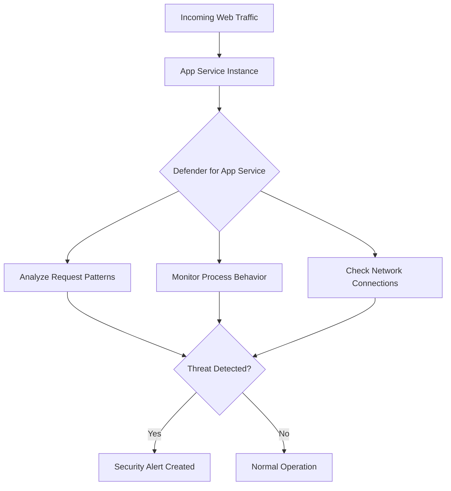

# How to Set Up Microsoft Defender for App Service to Detect Web Application Threats

Author: [nawazdhandala](https://www.github.com/nawazdhandala)

Tags: Microsoft Defender, App Service, Web Application Security, Threat Detection, Azure, Application Security, Cloud Security

Description: Learn how to enable and configure Microsoft Defender for App Service to detect web application attacks including command injection and scanning activity.

---

Web applications hosted on Azure App Service are exposed to the internet by design. They handle user input, serve APIs, and process data from external sources. This makes them a prime target for attackers who probe for vulnerabilities through automated scanners, attempt injection attacks, and exploit misconfigurations.

Microsoft Defender for App Service adds a threat detection layer that monitors your App Service instances for suspicious activity. It watches the incoming requests, the application behavior, and the underlying sandbox for signs of compromise. This guide covers how to enable it, what it detects, and how to configure alerts and responses.

## What Defender for App Service Detects

Defender for App Service uses multiple detection engines to identify threats at different layers.

**Web application attacks:**
- SQL injection attempts in query parameters and request bodies
- Cross-site scripting (XSS) patterns in user input
- Command injection attempts (e.g., trying to run shell commands through the application)
- Local file inclusion and path traversal attacks

**Reconnaissance activity:**
- Vulnerability scanner fingerprints (tools like Nmap, Nikto, Burp Suite)
- Automated crawling patterns that deviate from normal user behavior
- Probing for known vulnerable paths (e.g., `.env`, `wp-admin`, `phpMyAdmin`)

**Post-exploitation indicators:**
- Outbound connections to known command-and-control servers
- Suspicious process execution in the App Service sandbox
- Web shell detection (files that provide remote command execution)
- Cryptocurrency mining activity consuming CPU resources

**Azure-specific threats:**
- Access from anonymizing networks (Tor exit nodes)
- Access from suspicious Azure IP addresses
- Management API calls from unexpected locations



## Prerequisites

- An Azure App Service plan (Basic tier or higher - Free and Shared tiers are not supported)
- Owner or Contributor access to the subscription
- Microsoft Defender for Cloud enabled on the subscription

## Step 1: Enable Defender for App Service

Enable the protection at the subscription level to cover all App Service instances.

```bash
# Enable Microsoft Defender for App Service at the subscription level
az security pricing create \
  --name AppServices \
  --tier Standard
```

Verify the protection is active.

```bash
# Check the Defender for App Service pricing tier
az security pricing show \
  --name AppServices \
  --query '{name: name, tier: pricingTier, freeTrialRemaining: freeTrialRemainingTime}'
```

You can also enable it through the Azure portal: navigate to Microsoft Defender for Cloud > Environment settings > Your subscription > Defender plans, and toggle App Services to On.

## Step 2: Review the Detection Coverage

After enabling Defender, it starts monitoring your App Service instances immediately. There is no agent to install because Defender integrates with the App Service platform at the infrastructure level.

Check which App Service instances are covered.

```bash
# List App Service instances and their Defender coverage status
az webapp list \
  --query '[].{name: name, resourceGroup: resourceGroup, state: state, sku: appServicePlan}' \
  --output table
```

All App Service instances on Basic, Standard, Premium, Isolated, and Elastic Premium plans are automatically protected once the subscription-level Defender plan is enabled.

## Step 3: Configure Alert Notifications

Set up email notifications so your security team gets alerted immediately when threats are detected.

```bash
# Configure security contact for alert notifications
az security contact create \
  --name "default1" \
  --emails "security-team@contoso.com" \
  --alert-notifications on \
  --alerts-to-admins on
```

You can also route alerts to specific teams based on severity. Create an action group for high-severity alerts.

```bash
# Create an action group for critical web app security alerts
az monitor action-group create \
  --resource-group monitoring-rg \
  --name "webapp-security-alerts" \
  --short-name "WebAppSec" \
  --action email security-team security-team@contoso.com \
  --action email dev-lead dev-lead@contoso.com
```

## Step 4: Investigate Security Alerts

When Defender detects a threat, it creates a security alert in Microsoft Defender for Cloud. Navigate to Defender for Cloud > Security alerts and filter by resource type "App Service."

Each alert includes detailed context.

Here is how to query alerts programmatically.

```bash
# List recent App Service security alerts
az security alert list \
  --query "[?contains(alertType, 'AppServices')].{type: alertType, severity: severity, status: status, time: timeGeneratedUtc, app: compromisedEntity}" \
  --output table
```

Common alert types you might see:

| Alert | Severity | Description |
|---|---|---|
| AppServices_SQLInjection | Medium | SQL injection attempt detected in request |
| AppServices_CommandInjection | High | Command injection attempt in request parameters |
| AppServices_DanglingDnsRecord | Medium | DNS record pointing to decommissioned App Service |
| AppServices_WebShell | High | Potential web shell detected on the application |
| AppServices_SuspiciousProcessExecution | High | Unexpected process running in App Service sandbox |
| AppServices_TorAccess | Low | Access from Tor network detected |

## Step 5: Integrate with Microsoft Sentinel

For organizations using Microsoft Sentinel, forward Defender for Cloud alerts to Sentinel for centralized investigation and automated response.

```bash
# Enable the Microsoft Defender for Cloud data connector in Sentinel
az sentinel data-connector create \
  --resource-group sentinel-rg \
  --workspace-name sentinel-workspace \
  --data-connector-id "MicrosoftDefenderForCloud" \
  --kind "AzureSecurityCenter"
```

In Sentinel, you can create automation rules that respond to specific App Service alert types. For example, automatically isolate an App Service by restricting its network access when a web shell is detected.

## Step 6: Set Up Automated Responses

Create a Logic App that triggers on specific Defender alerts and takes automated action.

Here is a practical example: when a command injection alert fires, the Logic App disables the App Service to stop potential exploitation while the team investigates.

```powershell
# PowerShell script for automated response to high-severity App Service alerts
# This can be triggered by a Logic App or Azure Automation

param(
    [string]$AlertResourceId,
    [string]$AlertType,
    [string]$Severity
)

# Only auto-respond to high-severity alerts
if ($Severity -ne "High") {
    Write-Output "Alert severity is $Severity, skipping auto-response"
    return
}

# Extract the App Service name and resource group from the alert
$parts = $AlertResourceId -split "/"
$rgName = $parts[4]
$appName = $parts[8]

# Stop the App Service to contain the threat
Write-Output "Stopping App Service $appName in resource group $rgName"
Stop-AzWebApp -ResourceGroupName $rgName -Name $appName

# Add an IP restriction to block the attacking IP (if available)
# This is more surgical than stopping the entire app
# Add-AzWebAppAccessRestrictionRule ...

# Create an incident in your ticketing system
Write-Output "Alert type: $AlertType - App Service stopped for investigation"
```

## Step 7: Harden Your App Service Configuration

Defender detects threats, but prevention is always better. Here are security configurations that reduce your attack surface.

```bash
# Enforce HTTPS only
az webapp update \
  --resource-group myResourceGroup \
  --name myWebApp \
  --set httpsOnly=true

# Set minimum TLS version to 1.2
az webapp config set \
  --resource-group myResourceGroup \
  --name myWebApp \
  --min-tls-version 1.2

# Disable FTP access (common attack vector)
az webapp config set \
  --resource-group myResourceGroup \
  --name myWebApp \
  --ftps-state Disabled

# Enable managed identity (eliminates stored credentials)
az webapp identity assign \
  --resource-group myResourceGroup \
  --name myWebApp

# Restrict inbound traffic to specific IP ranges or VNet
az webapp config access-restriction add \
  --resource-group myResourceGroup \
  --name myWebApp \
  --rule-name "AllowCorporateOnly" \
  --action Allow \
  --ip-address "203.0.113.0/24" \
  --priority 100
```

## Step 8: Monitor Defender Effectiveness

Track how Defender is performing over time. Look at the volume and types of alerts to understand your threat landscape.

```kql
// Query Defender for Cloud alerts for App Service in Log Analytics
SecurityAlert
| where TimeGenerated > ago(30d)
| where ProductName == "Azure Security Center"
| where AlertType startswith "AppServices"
| summarize AlertCount = count() by AlertType, Severity
| order by AlertCount desc
```

```kql
// Track alert trends over time to identify patterns
SecurityAlert
| where TimeGenerated > ago(90d)
| where AlertType startswith "AppServices"
| summarize DailyAlerts = count() by bin(TimeGenerated, 1d), Severity
| render timechart
```

## Handling Dangling DNS Alerts

One unique alert type is the "dangling DNS record" detection. This fires when a DNS CNAME record points to an App Service that no longer exists, creating a subdomain takeover vulnerability. An attacker could create a new App Service with the same name and intercept traffic meant for your domain.

When you receive this alert:
1. Identify the DNS record in question
2. Either create a new App Service to claim the name or remove the DNS record
3. Audit all your DNS records for similar stale entries

## Cost Considerations

Microsoft Defender for App Service is priced per App Service instance per hour. The exact cost depends on your region, but it is typically a few dollars per App Service per month. For production applications exposed to the internet, this is a small price for the detection coverage it provides.

You get a 30-day free trial when you first enable it, which is enough time to evaluate the detection quality in your environment.

## Wrapping Up

Microsoft Defender for App Service provides runtime threat detection for your web applications without any code changes or agent installations. It catches SQL injection, command injection, web shells, reconnaissance activity, and post-exploitation behavior. Enable it at the subscription level, configure alert notifications, integrate with Sentinel for automated response, and harden your App Service configurations to reduce the attack surface. The combination of detection and prevention gives you a solid security posture for internet-facing web applications on Azure.
