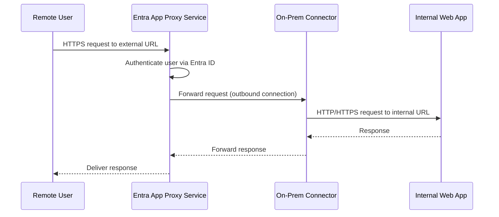

# How to Set Up Microsoft Entra Application Proxy for Secure Remote Access to On-Premises Apps

Author: [nawazdhandala](https://www.github.com/nawazdhandala)

Tags: Azure, Microsoft Entra, Application Proxy, Remote Access, Hybrid Identity, Security, Zero Trust

Description: Complete guide to deploying Microsoft Entra Application Proxy to publish on-premises web applications securely without a VPN or inbound firewall ports.

---

Most organizations still run critical applications on-premises. Traditionally, giving remote users access to these apps meant setting up a VPN, which creates a broad network-level tunnel that violates zero-trust principles. Microsoft Entra Application Proxy offers an alternative: it publishes on-premises web applications through the cloud so users can access them with a browser, authenticated by Entra ID, without any inbound firewall ports or VPN connections.

In this post, I will walk through the full setup process - from installing the connector on your network to publishing an application and securing it with Conditional Access.

## How Application Proxy Works

The architecture has three main components:

1. **Application Proxy Service:** Runs in the Microsoft cloud. It handles incoming user requests and routes them to the right connector.
2. **Application Proxy Connector:** A lightweight agent you install on a Windows Server in your on-premises network (or any network that can reach your internal app). The connector makes outbound connections to the cloud service - no inbound ports needed.
3. **The Internal Application:** Your on-premises web app that you want to publish.



The key security advantage: the connector only makes outbound connections to Azure on ports 80 and 443. Your firewall does not need any inbound rules, and the connector does not need to be in a DMZ.

## Prerequisites

Before starting, verify you have:

- Microsoft Entra ID P1 or P2 license (included in Microsoft 365 E3/E5)
- A Windows Server (2016 or later) on your network that can reach the internal application. This server will run the connector.
- The connector server must be able to reach `*.msappproxy.net` and `*.servicebus.windows.net` on ports 443 and 80
- An internal web application you want to publish (any HTTP/HTTPS application)
- Global Administrator or Application Administrator role in Entra ID

## Step 1: Install the Application Proxy Connector

Go to the Microsoft Entra admin center. Navigate to Applications, then Application Proxy. You will see a prompt to download the connector if none are installed.

Click "Download connector service" to get the installer. Copy the installer to your Windows Server and run it. The installation wizard will:

1. Install the connector service
2. Prompt you to sign in with your Entra ID admin account
3. Register the connector with your tenant
4. Start the connector service

The connector runs as a Windows service called "Microsoft Entra Private Network Connector." After installation, verify it is running:

```powershell
# Check the connector service status
Get-Service -Name "WAPCSvc"

# Check the connector updater service (handles auto-updates)
Get-Service -Name "WAPCUpdaterSvc"

# Verify outbound connectivity to the Application Proxy service
# This should return 200 OK
Invoke-WebRequest -Uri "https://adoncs.msappproxy.net/ssp/health" -UseBasicParsing
```

For production, install at least two connectors on separate servers for high availability. You can group connectors into "Connector groups" and assign applications to specific groups.

## Step 2: Create a Connector Group

Connector groups let you assign specific connectors to specific applications. This is useful when you have connectors in different network segments serving different applications.

```powershell
# Install the Microsoft Graph module if needed
# Install-Module Microsoft.Graph -Force

Connect-MgGraph -Scopes "Directory.ReadWrite.All"

# Create a new connector group
$group = New-MgOnPremisePublishingProfileConnectorGroup `
    -OnPremisesPublishingProfileId "applicationProxy" `
    -Name "US-East Data Center Connectors" `
    -Region "nam"

Write-Output "Connector Group ID: $($group.Id)"
```

After creating the group, go back to the Entra admin center, navigate to Application Proxy, and move your connectors into the appropriate group.

## Step 3: Publish an Internal Application

Now you can publish your on-premises application. In the Entra admin center, go to Applications, then Enterprise Applications, and click "New application." Select "On-premises application."

Fill in these fields:

**Name:** Give it a meaningful name that users will see, like "Intranet HR Portal."

**Internal URL:** The URL of the application as accessed from your internal network. For example: `https://hr.internal.contoso.com/`

**External URL:** The URL users will access from outside. Entra ID generates one based on your tenant name, like `https://hr-contoso.msappproxy.net`. You can also use a custom domain.

**Pre-authentication:** Choose "Microsoft Entra ID" to require users to authenticate before reaching the app. This is the recommended setting. Choose "Passthrough" if the application handles its own authentication.

**Connector Group:** Select the connector group you created.

Here is the equivalent using Microsoft Graph API:

```powershell
# Publish an on-premises application through Application Proxy
Connect-MgGraph -Scopes "Application.ReadWrite.All"

# Create the application registration
$app = New-MgApplication -DisplayName "Intranet HR Portal" `
    -Web @{
        # Redirect URI for authentication flow
        RedirectUris = @("https://hr-contoso.msappproxy.net/")
    }

# Configure Application Proxy settings on the service principal
$sp = New-MgServicePrincipal -AppId $app.AppId

# Set Application Proxy properties
# Note: These are set through the onPremisesPublishing property
$proxySettings = @{
    InternalUrl = "https://hr.internal.contoso.com/"
    ExternalUrl = "https://hr-contoso.msappproxy.net/"
    ExternalAuthenticationType = "aadPreAuthentication"
    IsTranslateHostHeaderEnabled = $true
    IsTranslateLinksInBodyEnabled = $false
}
```

## Step 4: Configure Single Sign-On

Application Proxy supports several SSO methods to pass the user's identity to the backend application:

- **Integrated Windows Authentication (IWA):** The connector performs Kerberos constrained delegation on behalf of the user. Best for apps that use Windows authentication.
- **Header-based:** The connector passes user attributes as HTTP headers. Good for legacy apps.
- **Password-based:** Users sign in once to Entra ID, and the proxy replays stored credentials to the app.
- **SAML:** For apps that support SAML-based SSO.

For Kerberos-based SSO, the connector server needs to be domain-joined, and you need to configure Kerberos constrained delegation:

```powershell
# On a domain controller, set up KCD for the connector's computer account
# Replace values with your actual connector server and service account

# Get the connector server's computer account
$connectorComputer = Get-ADComputer -Identity "CONNECTOR-SERVER"

# Set the SPN for the target application's service account
# This allows the connector to request Kerberos tickets on behalf of users
Set-ADUser -Identity "svc-hrapp" -ServicePrincipalNames @{
    Add = "HTTP/hr.internal.contoso.com"
}

# Grant the connector server permission to delegate to the SPN
Set-ADComputer -Identity $connectorComputer `
    -PrincipalsAllowedToDelegateToAccount (Get-ADUser "svc-hrapp")
```

## Step 5: Configure Custom Domains

The default external URL uses `msappproxy.net`, which is not user-friendly. You can configure a custom domain like `hr.contoso.com` for a better experience.

To use a custom domain:

1. In the application's Application Proxy settings, change the External URL to your custom domain
2. Upload the TLS certificate (PFX format) for that domain
3. Add a CNAME DNS record pointing your custom domain to the default msappproxy.net URL

```bash
# Example DNS record (configure in your DNS provider)
# hr.contoso.com  CNAME  hr-contoso.msappproxy.net
```

The TLS certificate must be valid for the custom domain and include the full certificate chain. Let's Encrypt certificates work fine for this.

## Step 6: Apply Conditional Access Policies

One of the biggest advantages of Application Proxy over VPN is that each application can have its own Conditional Access policy. You can require MFA for a finance app but not for the employee directory.

Create a Conditional Access policy targeting the published application:

1. Go to Protection, then Conditional Access
2. Create a new policy
3. Under Cloud apps, select the enterprise application you created ("Intranet HR Portal")
4. Set conditions as needed (location, device platform, risk level)
5. Under Grant, require MFA or compliant device

This means even if an attacker steals a user's password, they cannot access the application without satisfying the Conditional Access requirements.

## Monitoring and Troubleshooting

Application Proxy logs sign-in events in the Entra ID sign-in logs. You can also enable connector-level diagnostic logs.

On the connector server, check the event logs:

```powershell
# Check Application Proxy connector event logs
# These logs show connection issues and authentication failures
Get-EventLog -LogName "Application" -Source "Microsoft AAD Application Proxy Connector" -Newest 20 |
    Format-Table TimeGenerated, EntryType, Message -Wrap
```

Common issues and solutions:

- **502 Bad Gateway:** The connector cannot reach the internal application. Verify the internal URL is accessible from the connector server.
- **Authentication loops:** Often caused by cookie domain mismatches. Enable "Translate URLs in headers" in the proxy settings.
- **Slow performance:** The connector is in a different region than the Entra Application Proxy service. Use the connector group region setting to match your location.
- **Kerberos SSO failing:** Check that the connector server has the correct SPNs registered and KCD is configured. Run `klist` on the connector server to verify ticket acquisition.

## Best Practices

- Deploy at least two connectors per connector group for high availability.
- Place connectors close (network-wise) to the applications they serve. Do not route connector traffic through VPN tunnels or WAN links when possible.
- Use custom domains for a professional user experience.
- Always use Entra ID pre-authentication instead of passthrough. Passthrough mode skips all Entra ID security features.
- Regularly update connectors. They auto-update by default, but verify the updater service is running.
- Monitor connector health in the Entra admin center. Unhealthy connectors show a warning icon.

## Summary

Microsoft Entra Application Proxy is a clean solution for publishing on-premises web applications without VPNs or inbound firewall rules. Install connectors in your network, publish applications with internal and external URLs, configure SSO, and layer Conditional Access policies on top. The result is zero-trust access to your internal apps with per-application security policies - a significant upgrade over the traditional VPN approach.
