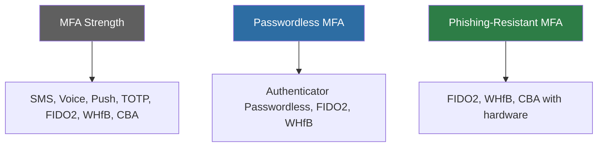

# How to Set Up Microsoft Entra Conditional Access Authentication Strength for Phishing-Resistant MFA

Author: [nawazdhandala](https://www.github.com/nawazdhandala)

Tags: Azure, Microsoft Entra, Conditional Access, Authentication Strength, MFA, Phishing Resistant, Security

Description: A practical guide to configuring authentication strength policies in Microsoft Entra Conditional Access to enforce phishing-resistant MFA methods for high-risk scenarios.

---

Not all MFA methods are created equal. SMS verification codes can be intercepted through SIM swapping. Phone calls can be social-engineered. Even push notifications on the Authenticator app can be approved through MFA fatigue attacks. Authentication strength is a Conditional Access feature that lets you specify which authentication methods satisfy MFA requirements, ensuring that only the strongest methods are accepted for your most sensitive scenarios.

This guide covers the built-in authentication strengths, how to create custom ones, and how to deploy them through Conditional Access policies.

## Understanding Authentication Strength Levels

Microsoft defines three built-in authentication strengths:

**MFA strength (default):** Any method that satisfies multi-factor authentication. This includes:
- Microsoft Authenticator push notification
- OATH hardware/software tokens
- SMS verification
- Voice call
- FIDO2 security key
- Windows Hello for Business
- Certificate-based authentication

**Passwordless MFA strength:** Methods that do not require a password:
- Microsoft Authenticator (passwordless phone sign-in)
- FIDO2 security key
- Windows Hello for Business

**Phishing-resistant MFA strength:** Methods that are resistant to phishing attacks:
- FIDO2 security key
- Windows Hello for Business
- Certificate-based authentication (when configured with smart card or hardware-bound certificate)



Phishing-resistant MFA is the strongest because these methods cannot be intercepted by a fake login page. The credential is bound to the specific site's origin (FIDO2, WHfB) or requires physical possession of a certificate on a smart card.

## When to Use Each Strength Level

- **MFA strength:** General-purpose MFA for regular users accessing standard applications
- **Passwordless MFA:** Improved user experience and security for users who have enrolled in passwordless methods
- **Phishing-resistant MFA:** Required for administrators, privileged operations, sensitive data access, and compliance scenarios (like CISA's Zero Trust mandate requiring phishing-resistant MFA)

## Step 1: Check Which Methods Your Users Have Registered

Before enforcing authentication strength, verify that your users have the required methods registered. If you enforce phishing-resistant MFA but nobody has a FIDO2 key, everyone gets locked out.

```powershell
# Connect to Microsoft Graph
Connect-MgGraph -Scopes "UserAuthenticationMethod.Read.All"

# Check authentication methods registered for a specific user
$methods = Get-MgUserAuthenticationMethod -UserId "admin@contoso.com"

foreach ($method in $methods) {
    Write-Output "Method: $($method.AdditionalProperties['@odata.type'])"
}

# Get a broader view: count of users with each method type
# Check how many users have FIDO2 keys registered
$fido2Users = Get-MgReportAuthenticationMethodUserRegistrationDetail `
    -Filter "methodsRegistered/any(m: m eq 'fido2')"

Write-Output "Users with FIDO2 keys: $($fido2Users.Count)"
```

You can also check the Authentication Methods Activity report in the Entra admin center under Monitoring and Health.

## Step 2: Create a Custom Authentication Strength (Optional)

If the built-in strengths do not match your needs, create a custom one. For example, you might want to allow only FIDO2 security keys (not Windows Hello) for a specific scenario.

Go to the Entra admin center. Navigate to Protection, then Authentication methods, then Authentication strengths. Click "New authentication strength."

**Name:** "FIDO2 Only"

**Allowed methods:** Check only "FIDO2 security key"

**Combination details:** You can restrict further by specifying which FIDO2 key models (AAGUIDs) are allowed.

Using Microsoft Graph:

```powershell
# Create a custom authentication strength
$strengthParams = @{
    DisplayName = "FIDO2 Security Keys Only"
    Description = "Requires FIDO2 security key - no other MFA methods accepted"
    AllowedCombinations = @(
        "fido2"
    )
}

$customStrength = New-MgPolicyAuthenticationStrengthPolicy -BodyParameter $strengthParams

Write-Output "Custom strength ID: $($customStrength.Id)"
```

You can also create a custom strength that allows specific combinations:

```powershell
# Custom strength allowing FIDO2 or certificate-based authentication
$strengthParams = @{
    DisplayName = "Hardware-Bound Phishing Resistant"
    Description = "Requires FIDO2 key or smart card certificate"
    AllowedCombinations = @(
        "fido2",
        "x509CertificateMultiFactor"
    )
}

New-MgPolicyAuthenticationStrengthPolicy -BodyParameter $strengthParams
```

## Step 3: Create a Conditional Access Policy with Authentication Strength

Now create a Conditional Access policy that requires the authentication strength. This replaces the traditional "Require MFA" grant control with a more specific requirement.

In the Entra admin center, go to Protection, then Conditional Access. Create a new policy:

**Name:** "Require phishing-resistant MFA for admins"

**Assignments:**

- **Users:** Select "Directory roles" and check Global Administrator, Security Administrator, Exchange Administrator, and other privileged roles
- **Cloud apps:** All cloud apps (or specific high-sensitivity apps)
- **Conditions:** Optionally add conditions like "All devices" or specific platforms

**Grant:**

- Select "Grant access"
- Check "Require authentication strength"
- Select "Phishing-resistant MFA" (or your custom strength)
- Click "Select"

**Session:** Leave default unless you need specific session controls.

**Enable policy:** Start with "Report-only" to test before enforcing.

Here is the equivalent using Microsoft Graph:

```powershell
# Create a Conditional Access policy requiring phishing-resistant MFA
$policyParams = @{
    DisplayName = "Require phishing-resistant MFA for admins"
    State = "enabledForReportingButNotEnforced"
    Conditions = @{
        Users = @{
            IncludeRoles = @(
                # Global Administrator role template ID
                "62e90394-69f5-4237-9190-012177145e10",
                # Security Administrator
                "194ae4cb-b126-40b2-bd5b-6091b380977d",
                # Exchange Administrator
                "29232cdf-9323-42fd-ade2-1d097af3e4de"
            )
        }
        Applications = @{
            IncludeApplications = @("All")
        }
    }
    GrantControls = @{
        Operator = "OR"
        # Use authentication strength instead of traditional MFA requirement
        AuthenticationStrength = @{
            Id = "00000000-0000-0000-0000-000000000004"
            # This is the built-in Phishing-resistant MFA strength ID
        }
    }
}

New-MgIdentityConditionalAccessPolicy -BodyParameter $policyParams
```

## Step 4: Test with the What If Tool

Before enabling the policy, test it:

1. Go to Conditional Access, then What If
2. Select an admin user
3. Select a cloud app (like Azure Management)
4. Run the simulation

The result should show your new policy applies and requires the phishing-resistant authentication strength. Check that the user has at least one registered method that satisfies the requirement.

## Step 5: Handle the Transition Period

When rolling out authentication strength enforcement, you will have a transition period where some users have the required methods registered and others do not. Handle this gracefully:

**Phase 1 - Report only:** Deploy the policy in report-only mode for 2-4 weeks. Monitor sign-in logs to see how many users would be affected.

```powershell
# Find sign-ins that would fail the authentication strength requirement
# Look at report-only results in sign-in logs
```

```
// KQL query for sign-ins affected by report-only authentication strength policy
SigninLogs
| where TimeGenerated > ago(7d)
| mv-expand ConditionalAccessPolicies
| where ConditionalAccessPolicies.displayName == "Require phishing-resistant MFA for admins"
| where ConditionalAccessPolicies.result == "reportOnlyFailure"
| summarize FailureCount = count() by UserPrincipalName
| order by FailureCount desc
```

**Phase 2 - Enroll users:** Work with affected users to register FIDO2 keys or set up Windows Hello for Business. Distribute security keys and provide enrollment instructions.

**Phase 3 - Enforce:** Switch the policy from report-only to enabled. Monitor for locked-out users.

**Safety net:** Keep a Temporary Access Pass (TAP) process ready for users who lose their security key and need temporary access.

## Step 6: Combine with Registration Policy

You should also configure a registration policy to encourage or require users to register phishing-resistant methods:

```powershell
# Require admins to register a FIDO2 key when they next sign in
# This uses the Authentication Methods Registration Campaign feature

$campaignParams = @{
    RegistrationEnforcement = @{
        AuthenticationMethodsRegistrationCampaign = @{
            State = "enabled"
            SnoozeDurationInDays = 3
            IncludeTargets = @(
                @{
                    Id = "admin-group-id"
                    TargetType = "group"
                    TargetedAuthenticationMethod = "microsoftAuthenticator"
                }
            )
        }
    }
}

# Note: The registration campaign currently supports Authenticator
# For FIDO2, you need to communicate and guide users manually
```

## Step 7: Monitor Authentication Strength Usage

Track how authentication strength policies are working in production:

```
// Authentication methods used by admins over the past 30 days
SigninLogs
| where TimeGenerated > ago(30d)
| where UserType == "Member"
// Filter for admin sign-ins using directory role info
| where AuthenticationDetails has "fido2"
    or AuthenticationDetails has "windowsHelloForBusiness"
    or AuthenticationDetails has "x509Certificate"
| mv-expand AuthenticationDetails
| extend AuthMethod = tostring(AuthenticationDetails.authenticationMethod)
| summarize
    SignInCount = count()
    by AuthMethod, UserPrincipalName
| order by SignInCount desc
```

## Exceptions and Fallback Scenarios

Even with phishing-resistant MFA, you need exception handling:

- **Break-glass accounts:** Always keep at least two emergency access accounts that are excluded from all Conditional Access policies. Store their credentials in a physical safe.
- **Temporary Access Pass:** When a user loses their security key, issue a TAP so they can sign in temporarily and register a new key.
- **Guest users:** External users may not have phishing-resistant methods. Create separate policies with appropriate strength for guests.

## Best Practices

- Start with administrators. They are the highest-risk accounts and typically have the fewest complaints about additional security requirements.
- Use report-only mode for at least two weeks before enforcement. Analyze which users would be affected and verify they have appropriate methods registered.
- Combine authentication strength with other Conditional Access conditions. For example, require phishing-resistant MFA only from non-compliant devices or untrusted locations.
- Do not create too many custom authentication strengths. Keep it simple - most organizations need at most the three built-in strengths plus one or two custom ones.
- Document which methods satisfy each strength level and share this with your helpdesk team.
- Plan for hardware failures. FIDO2 keys can break or be lost. Every user with phishing-resistant MFA enforcement should have at least two registered methods.

## Summary

Authentication strength in Conditional Access lets you move beyond the binary "MFA required or not" decision to specifying exactly which MFA methods are acceptable. For your most sensitive scenarios - admin access, financial systems, compliance requirements - enforce phishing-resistant MFA to protect against the most sophisticated attacks. Roll it out gradually, starting with report-only mode, enrolling users in the required methods, and then enforcing. The result is a measurably stronger authentication posture for your highest-risk access patterns.
