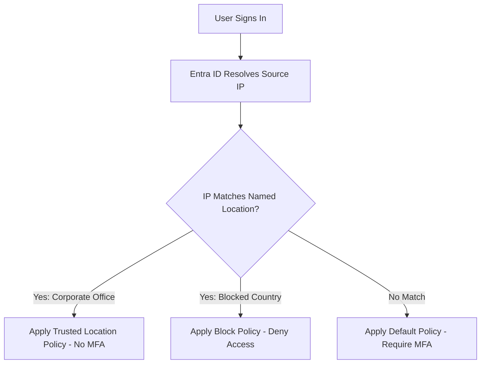

# How to Set Up Microsoft Entra Conditional Access with Named Locations and IP-Based Restrictions

Author: [nawazdhandala](https://www.github.com/nawazdhandala)

Tags: Conditional Access, Named Locations, Microsoft Entra ID, IP Restrictions, Zero Trust, Security, Access Control

Description: A step-by-step guide to configuring named locations and using them in Conditional Access policies to enforce IP-based access restrictions in Microsoft Entra ID.

---

Not all sign-in locations carry the same risk. A user signing in from your corporate office is far less suspicious than the same user signing in from a country your organization has never operated in. Microsoft Entra Conditional Access lets you define named locations based on IP ranges, countries, or GPS coordinates, and then use those locations as conditions in your access policies.

This is one of the most practical Conditional Access features because it directly addresses real-world scenarios: blocking access from high-risk countries, reducing MFA friction for office-based users, and alerting on sign-ins from unexpected networks. This guide walks through the full setup.

## How Named Locations Work

Named locations are definitions that label IP ranges or geographic regions with a friendly name. They do not enforce anything by themselves - they are building blocks that you reference in Conditional Access policies.

When a user signs in, Entra ID determines their location from the source IP address of the authentication request. It then checks whether that IP matches any named location. The Conditional Access policy uses this match to decide what to do.



## Types of Named Locations

Microsoft Entra ID supports three types of named locations:

1. **IP ranges**: Specific IPv4 or IPv6 CIDR blocks. Use this for corporate offices, VPN gateways, and known partner networks.

2. **Countries/Regions**: Geographic locations based on the IP-to-country mapping. Use this for blocking access from countries where your organization does not operate.

3. **GPS-based (Compliant Network)**: Requires the Microsoft Authenticator app to report the device's GPS location. More precise than IP-based, but requires specific device configurations.

## Step 1: Create IP-Based Named Locations

Start by defining your corporate network locations. Navigate to Microsoft Entra admin center > Protection > Conditional Access > Named locations.

### Corporate Office Locations

```powershell
# Connect to Microsoft Graph
Connect-MgGraph -Scopes "Policy.ReadWrite.ConditionalAccess"

# Create a named location for your main office
$mainOffice = @{
    "@odata.type" = "#microsoft.graph.ipNamedLocation"
    DisplayName = "Main Office - New York"
    IsTrusted = $true  # Mark as trusted to reduce MFA prompts
    IpRanges = @(
        @{
            "@odata.type" = "#microsoft.graph.iPv4CidrRange"
            CidrAddress = "203.0.113.0/24"  # Replace with your actual office IP range
        },
        @{
            "@odata.type" = "#microsoft.graph.iPv4CidrRange"
            CidrAddress = "198.51.100.0/24"  # Secondary ISP range
        }
    )
}

New-MgIdentityConditionalAccessNamedLocation -BodyParameter $mainOffice
```

You can also use the Azure CLI.

```bash
# Create a named location using the Graph API via Azure CLI
az rest --method POST \
  --url "https://graph.microsoft.com/v1.0/identity/conditionalAccess/namedLocations" \
  --body '{
    "@odata.type": "#microsoft.graph.ipNamedLocation",
    "displayName": "Branch Office - London",
    "isTrusted": true,
    "ipRanges": [
      {"@odata.type": "#microsoft.graph.iPv4CidrRange", "cidrAddress": "192.0.2.0/24"},
      {"@odata.type": "#microsoft.graph.iPv4CidrRange", "cidrAddress": "10.0.0.0/8"}
    ]
  }'
```

### VPN Gateway Locations

If your users connect through a corporate VPN, add the VPN gateway's public IP as a trusted location.

```powershell
# Create a named location for VPN exit points
$vpnLocation = @{
    "@odata.type" = "#microsoft.graph.ipNamedLocation"
    DisplayName = "Corporate VPN Gateways"
    IsTrusted = $true
    IpRanges = @(
        @{
            "@odata.type" = "#microsoft.graph.iPv4CidrRange"
            CidrAddress = "203.0.113.50/32"  # VPN gateway 1
        },
        @{
            "@odata.type" = "#microsoft.graph.iPv4CidrRange"
            CidrAddress = "203.0.113.51/32"  # VPN gateway 2
        }
    )
}

New-MgIdentityConditionalAccessNamedLocation -BodyParameter $vpnLocation
```

## Step 2: Create Country-Based Named Locations

For blocking access from specific countries or allowing only from approved countries.

```powershell
# Create a named location for blocked countries
$blockedCountries = @{
    "@odata.type" = "#microsoft.graph.countryNamedLocation"
    DisplayName = "High-Risk Countries"
    CountriesAndRegions = @("KP", "IR", "SY", "RU")  # ISO 3166-1 alpha-2 codes
    IncludeUnknownCountriesAndRegions = $true  # Also block unknown locations
}

New-MgIdentityConditionalAccessNamedLocation -BodyParameter $blockedCountries

# Create a named location for approved operating countries
$approvedCountries = @{
    "@odata.type" = "#microsoft.graph.countryNamedLocation"
    DisplayName = "Approved Operating Countries"
    CountriesAndRegions = @("US", "GB", "DE", "FR", "CA", "AU")
    IncludeUnknownCountriesAndRegions = $false
}

New-MgIdentityConditionalAccessNamedLocation -BodyParameter $approvedCountries
```

## Step 3: Create Conditional Access Policies Using Named Locations

Now use these named locations in Conditional Access policies.

### Policy 1: Skip MFA for Trusted Office Locations

This policy reduces friction for users signing in from corporate offices while still requiring MFA for all other locations.

```powershell
# Create a policy that skips MFA for trusted locations
$skipMfaPolicy = @{
    DisplayName = "Skip MFA for Corporate Offices"
    State = "enabled"
    Conditions = @{
        Users = @{
            IncludeUsers = @("All")
            ExcludeUsers = @("break-glass-account-id")
        }
        Applications = @{
            IncludeApplications = @("All")
        }
        Locations = @{
            IncludeLocations = @("AllTrusted")  # All named locations marked as trusted
            ExcludeLocations = @()
        }
    }
    GrantControls = @{
        Operator = "OR"
        BuiltInControls = @("compliantDevice")  # Still require device compliance
    }
}

New-MgIdentityConditionalAccessPolicy -BodyParameter $skipMfaPolicy
```

Note that I still require a compliant device even from trusted locations. This provides a second factor without requiring an interactive MFA prompt, which is a good balance between security and usability.

### Policy 2: Block Access from High-Risk Countries

```powershell
# Get the ID of the blocked countries named location
$blockedLocationId = (Get-MgIdentityConditionalAccessNamedLocation |
    Where-Object { $_.DisplayName -eq "High-Risk Countries" }).Id

# Create a policy that blocks access from high-risk countries
$blockPolicy = @{
    DisplayName = "Block Access from High-Risk Countries"
    State = "enabled"
    Conditions = @{
        Users = @{
            IncludeUsers = @("All")
            ExcludeUsers = @("break-glass-account-id")
        }
        Applications = @{
            IncludeApplications = @("All")
        }
        Locations = @{
            IncludeLocations = @($blockedLocationId)
        }
    }
    GrantControls = @{
        Operator = "OR"
        BuiltInControls = @("block")
    }
}

New-MgIdentityConditionalAccessPolicy -BodyParameter $blockPolicy
```

### Policy 3: Require MFA from Non-Trusted Locations

This is the most common pattern - users from unknown networks must complete MFA.

```powershell
# Create a policy requiring MFA from untrusted locations
$mfaPolicy = @{
    DisplayName = "Require MFA Outside Trusted Locations"
    State = "enabled"
    Conditions = @{
        Users = @{
            IncludeUsers = @("All")
            ExcludeUsers = @("break-glass-account-id")
        }
        Applications = @{
            IncludeApplications = @("All")
        }
        Locations = @{
            IncludeLocations = @("All")
            ExcludeLocations = @("AllTrusted")  # Exclude trusted named locations
        }
    }
    GrantControls = @{
        Operator = "OR"
        BuiltInControls = @("mfa")
    }
}

New-MgIdentityConditionalAccessPolicy -BodyParameter $mfaPolicy
```

## Step 4: Test Policies in Report-Only Mode

Before enforcing new policies, run them in report-only mode to understand the impact.

```powershell
# Update a policy to report-only mode for testing
Update-MgIdentityConditionalAccessPolicy `
    -ConditionalAccessPolicyId $mfaPolicy.Id `
    -State "enabledForReportingButNotEnforced"
```

Check the sign-in logs to see which sign-ins would have been affected.

```kql
// Query sign-in logs for report-only policy results
SigninLogs
| where TimeGenerated > ago(7d)
| where ConditionalAccessPolicies has "Require MFA Outside Trusted Locations"
| mv-expand CAPolicy = parse_json(ConditionalAccessPolicies)
| where CAPolicy.displayName == "Require MFA Outside Trusted Locations"
| summarize
    WouldRequireMFA = countif(CAPolicy.result == "reportOnlyFailure"),
    WouldAllow = countif(CAPolicy.result == "reportOnlySuccess" or CAPolicy.result == "reportOnlyNotApplied")
    by bin(TimeGenerated, 1d)
| render columnchart
```

## Step 5: Handle VPN and Remote Work Scenarios

Remote workers signing in from home may trigger MFA every time unless you account for their home networks. Here are a few strategies:

**Strategy 1: Use compliant devices instead of MFA**

If your remote users have company-managed devices enrolled in Intune, you can require device compliance instead of MFA. The device serves as the second factor.

**Strategy 2: Register work-from-home IPs**

For organizations with mostly static remote workers, you can add their home ISP IP ranges as named locations. This is fragile because residential IPs change, but it works for some scenarios.

**Strategy 3: Use authentication strengths**

Instead of skipping MFA for trusted locations, require stronger MFA methods from untrusted locations. For example, require FIDO2 security keys from outside the office while accepting push notifications from inside.

```powershell
# Create a policy with authentication strength based on location
$authStrengthPolicy = @{
    DisplayName = "Strong Auth Required Outside Office"
    State = "enabled"
    Conditions = @{
        Users = @{ IncludeUsers = @("All"); ExcludeUsers = @("break-glass-id") }
        Applications = @{ IncludeApplications = @("All") }
        Locations = @{
            IncludeLocations = @("All")
            ExcludeLocations = @("AllTrusted")
        }
    }
    GrantControls = @{
        Operator = "OR"
        AuthenticationStrength = @{
            Id = "00000000-0000-0000-0000-000000000004"  # Phishing-resistant MFA
        }
    }
}
```

## Step 6: Monitor Location-Based Sign-In Patterns

Set up monitoring to detect when users sign in from unexpected locations.

```kql
// Detect sign-ins from new countries for each user (last 7 days vs. historical)
let historical_countries = SigninLogs
    | where TimeGenerated between (ago(90d) .. ago(7d))
    | where ResultType == 0
    | distinct UserPrincipalName, Location;
SigninLogs
| where TimeGenerated > ago(7d)
| where ResultType == 0
| where Location !in (
    (historical_countries | where UserPrincipalName == UserPrincipalName | project Location)
)
| summarize NewLocationSignIns = count() by UserPrincipalName, Location, IPAddress
| order by NewLocationSignIns desc
```

```kql
// Track the effectiveness of location-based policies
SigninLogs
| where TimeGenerated > ago(30d)
| extend IsFromTrustedLocation = iff(NetworkLocationDetails has "trustedNamedLocation", "Trusted", "Untrusted")
| summarize
    SignIns = count(),
    MFARequired = countif(AuthenticationRequirement == "multiFactorAuthentication"),
    Blocked = countif(ResultType != 0)
    by IsFromTrustedLocation, bin(TimeGenerated, 1d)
| render columnchart
```

## Maintaining Named Locations

Corporate IP ranges change when you switch ISPs, open new offices, or update VPN infrastructure. Build a process for keeping named locations current.

```powershell
# List all named locations and their configuration
Get-MgIdentityConditionalAccessNamedLocation |
    Select-Object DisplayName, Id, @{
        Name='Type'; Expression={$_.'@odata.type'}
    }, @{
        Name='IsTrusted'; Expression={$_.AdditionalProperties.isTrusted}
    } | Format-Table

# Update an existing named location with new IP ranges
Update-MgIdentityConditionalAccessNamedLocation `
    -NamedLocationId "location-id" `
    -BodyParameter @{
        "@odata.type" = "#microsoft.graph.ipNamedLocation"
        DisplayName = "Main Office - New York (Updated)"
        IsTrusted = $true
        IpRanges = @(
            @{"@odata.type"="#microsoft.graph.iPv4CidrRange"; "cidrAddress"="203.0.113.0/24"},
            @{"@odata.type"="#microsoft.graph.iPv4CidrRange"; "cidrAddress"="198.51.100.0/23"}
        )
    }
```

Set a calendar reminder to review named locations quarterly. Stale IP ranges can either lock out users from new offices or leave old office IPs trusted after you have vacated the space.

## Best Practices

1. **Always have a break-glass account excluded from all location-based policies.** If you misconfigure a policy and lock everyone out, the break-glass account is your recovery path.

2. **Start with report-only mode.** Run every new policy in report-only for at least a week before enforcing. Location-based policies can have unexpected impacts on traveling users and remote workers.

3. **Mark VPN gateways as trusted, not individual user IPs.** VPN traffic exits through a small number of gateway IPs, making them reliable trust anchors.

4. **Combine location policies with device compliance.** Location alone is not a strong security signal because VPNs and IP spoofing exist. Adding device compliance provides a much stronger assurance.

5. **Use country blocking cautiously.** Blocking entire countries can impact legitimate travelers. Consider requiring strong MFA from blocked countries instead of outright blocking, unless regulatory requirements demand it.

6. **Document the business reason for each named location.** When someone new joins the team, they should be able to understand why each location exists and who it affects.

## Wrapping Up

Named locations and IP-based Conditional Access policies are foundational components of a Zero Trust architecture. They let you differentiate between sign-ins from known, trusted networks and sign-ins from unknown or risky locations, applying appropriate security controls to each. Define your corporate networks as trusted locations, block high-risk countries, require stronger authentication from untrusted networks, and monitor sign-in patterns for anomalies. The key is to start in report-only mode, validate the impact, and then enforce incrementally.
