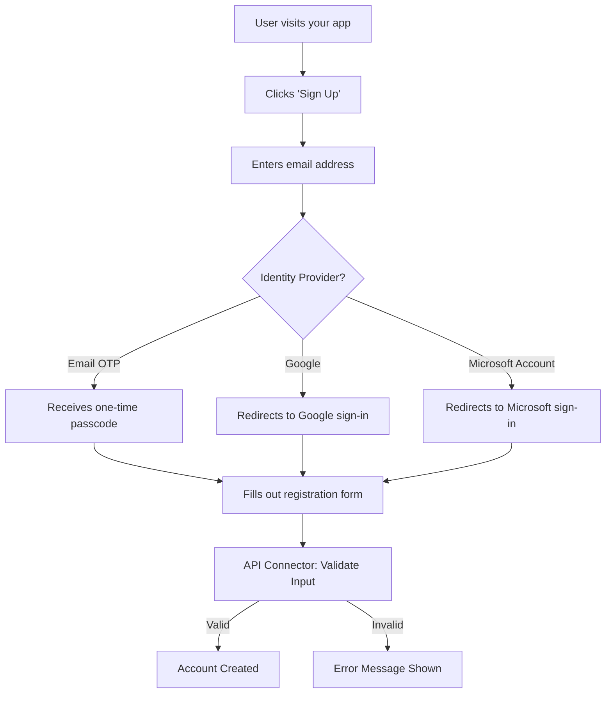

# How to Set Up Microsoft Entra External Identities Self-Service Sign-Up Flows with API Connectors

Author: [nawazdhandala](https://www.github.com/nawazdhandala)

Tags: Azure, Microsoft Entra, External Identities, Self-Service Sign-Up, API Connectors, B2B, Identity Management

Description: Step-by-step guide to configuring self-service sign-up user flows in Microsoft Entra External Identities with API connectors for custom validation and enrichment.

---

When you need to let external users sign themselves up for your application - partners, customers, vendors - you do not want to manually create accounts for each one. Microsoft Entra External Identities provides self-service sign-up flows that let users register on their own, and API connectors give you hooks into that registration process to validate data, run custom business logic, or enrich user profiles before the account is created.

In this post, I will walk through setting up a complete self-service sign-up flow with API connectors that validate the user's email domain and add custom attributes to their profile during registration.

## What Are Self-Service Sign-Up Flows?

Self-service sign-up user flows define the registration experience for external users. When someone visits your application and does not have an account, the user flow guides them through providing their information, authenticating (via email OTP, Google, Facebook, or other identity providers), and creating a guest account in your directory.

The flow looks like this from the user's perspective:



API connectors let you insert custom logic at two points in this flow:

1. **After federating with an identity provider** - Right after the user authenticates but before they see the attribute collection form.
2. **Before creating the user** - After the user fills out the registration form but before the account is actually created in your directory.

## Step 1: Enable Self-Service Sign-Up on Your Tenant

Self-service sign-up is enabled at the tenant level. If it is not already enabled, you need to turn it on.

```bash
# Check current external collaboration settings
az rest --method GET \
  --url "https://graph.microsoft.com/v1.0/policies/authorizationPolicy" \
  --query "allowedToSignUpEmailBasedSubscriptions"
```

If this returns `false`, enable it through the Entra admin center: Go to Microsoft Entra admin center, then Identity, then External Identities, then External collaboration settings. Under "Enable guest self-service sign up via user flows," toggle it to Yes.

## Step 2: Create Custom User Attributes

Before building the user flow, define any custom attributes you want to collect during registration. These might be things like company name, job title, or a reason for requesting access.

This PowerShell script creates custom user attributes for the sign-up flow:

```powershell
# Connect to Microsoft Graph
Connect-MgGraph -Scopes "IdentityUserFlow.ReadWrite.All"

# Create a custom attribute for company name
$companyAttribute = @{
    displayName = "Company Name"
    description = "The name of the user's company"
    dataType = "String"
}

New-MgIdentityUserFlowAttribute -BodyParameter $companyAttribute

# Create a custom attribute for department
$deptAttribute = @{
    displayName = "Department"
    description = "The user's department"
    dataType = "String"
}

New-MgIdentityUserFlowAttribute -BodyParameter $deptAttribute

# Create a custom attribute for access justification
$justificationAttribute = @{
    displayName = "Access Justification"
    description = "Why the user needs access to the application"
    dataType = "String"
}

New-MgIdentityUserFlowAttribute -BodyParameter $justificationAttribute
```

## Step 3: Build the API Connector

The API connector calls your custom REST API during the sign-up flow. Let us build an Azure Function that validates the user's email domain and enriches their profile.

This Azure Function validates that the user's email belongs to an approved partner domain and adds role information:

```python
# Azure Function: ValidateSignUp
# This function is called by the Entra ID user flow during sign-up
import json
import logging
import azure.functions as func

# List of approved partner domains
APPROVED_DOMAINS = [
    "partner-company.com",
    "trusted-vendor.org",
    "consulting-firm.net",
]

# Domain-to-role mapping for automatic role assignment
DOMAIN_ROLE_MAP = {
    "partner-company.com": "Partner",
    "trusted-vendor.org": "Vendor",
    "consulting-firm.net": "Consultant",
}


def main(req: func.HttpRequest) -> func.HttpResponse:
    logging.info("Sign-up validation triggered")

    try:
        # Parse the request body from Entra ID
        req_body = req.get_json()
    except ValueError:
        return func.HttpResponse(
            json.dumps({"version": "1.0.0", "action": "ShowBlockPage",
                        "userMessage": "Invalid request"}),
            status_code=200,
            mimetype="application/json",
        )

    # Extract the user's email address
    email = req_body.get("email", "").lower()
    display_name = req_body.get("displayName", "")

    logging.info(f"Validating sign-up for: {email}")

    # Extract the domain from the email
    domain = email.split("@")[-1] if "@" in email else ""

    # Check if the domain is approved
    if domain not in APPROVED_DOMAINS:
        # Block the sign-up with a user-friendly message
        return func.HttpResponse(
            json.dumps({
                "version": "1.0.0",
                "action": "ShowBlockPage",
                "userMessage": (
                    f"Sign-up is currently limited to approved partner "
                    f"organizations. Your domain ({domain}) is not in "
                    f"our approved list. Please contact "
                    f"partnerships@yourcompany.com to request access."
                ),
            }),
            status_code=200,
            mimetype="application/json",
        )

    # Domain is approved - enrich the user profile with additional attributes
    partner_role = DOMAIN_ROLE_MAP.get(domain, "External")

    # Return a continuation response with enriched attributes
    return func.HttpResponse(
        json.dumps({
            "version": "1.0.0",
            "action": "Continue",
            # These attributes will be written to the user's profile
            "extension_<app-id>_PartnerRole": partner_role,
            "jobTitle": f"{partner_role} User",
        }),
        status_code=200,
        mimetype="application/json",
    )
```

Deploy this function to Azure Functions with HTTP trigger authentication. Make note of the function URL and the function key, which you will need for the API connector configuration.

## Step 4: Configure the API Connector in Entra ID

Register your API endpoint as an API connector in the Entra admin center.

This creates the API connector using Microsoft Graph PowerShell:

```powershell
# Create the API connector that calls your Azure Function
$apiConnector = @{
    displayName = "Validate Partner Domain"
    targetUrl = "https://func-signup-validation.azurewebsites.net/api/ValidateSignUp"
    authenticationConfiguration = @{
        "@odata.type" = "#microsoft.graph.basicAuthentication"
        username = "apiconnector"
        password = "<your-function-key>"
    }
}

$connector = New-MgIdentityApiConnector -BodyParameter $apiConnector
Write-Output "API Connector ID: $($connector.Id)"
```

You can also use certificate-based authentication or client credentials for the API connector, which is more secure than basic authentication for production use.

## Step 5: Create the User Flow

Now create the self-service sign-up user flow and wire everything together.

Navigate to the Entra admin center, then go to Identity, External Identities, User flows. Click "New user flow" and configure it.

Alternatively, use PowerShell:

```powershell
# Create the self-service sign-up user flow
$userFlow = @{
    id = "B2X_1_PartnerSignUp"
    userFlowType = "signUpOrSignIn"
    userFlowTypeVersion = 1
    # Enable email one-time passcode as an identity provider
    identityProviders = @()
}

# Note: Full user flow creation requires the beta endpoint
# For production, use the Entra admin center UI
```

In the admin center, configure these settings:

1. **Identity providers** - Enable "Email one-time passcode" at minimum. Add Google or Microsoft account if you want social sign-up.
2. **User attributes** - Select the built-in attributes (Display Name, Email Address) and your custom attributes (Company Name, Department, Access Justification).
3. **Page layouts** - Customize the look and feel of the sign-up page if needed.

## Step 6: Attach API Connectors to the User Flow

Connect your API connector to the user flow at the appropriate step.

In the Entra admin center, open your user flow, click "API connectors," and configure:

- **Before creating the user** - Select your "Validate Partner Domain" API connector.

This means after the user fills out the registration form and clicks submit, Entra ID will call your API before creating the account. If the API returns a block response, the user sees the error message and the account is not created.

## Step 7: Assign the User Flow to an Application

The user flow needs to be associated with an application registration so it triggers when users sign up for that specific app.

```powershell
# Get your application's service principal
$app = Get-MgServicePrincipal -Filter "displayName eq 'My Partner Portal'"

# Associate the user flow with the application
# This is done through the app's authentication configuration
$appUpdate = @{
    selfServiceSignUp = @{
        isEnabled = $true
        userFlows = @(
            @{
                id = "B2X_1_PartnerSignUp"
            }
        )
    }
}
```

In the admin center, go to Enterprise applications, select your app, and under Properties, set "Enable users to sign in" to Yes and configure the self-service sign-up settings.

## Step 8: Test the Complete Flow

Test the sign-up flow end-to-end:

1. Open your application's sign-in page in an incognito window.
2. Click "Sign up" or "No account? Create one."
3. Enter an email address from an approved domain.
4. Complete the authentication (email OTP).
5. Fill out the registration form with the custom attributes.
6. Submit - the API connector validates and enriches the data.
7. The account is created with the enriched attributes.

Then test with a non-approved domain to verify the block page works:

1. Repeat the process with a personal email like gmail.com.
2. After submitting the form, you should see the block message from your API.
3. No account should be created.

## Handling Edge Cases in Your API

Here are some patterns for common validation scenarios in the API connector:

This extended validation function handles multiple business rules:

```python
def validate_signup(email, company_name, justification):
    """
    Run multiple validation checks on the sign-up request.
    Returns (is_valid, message, enriched_attributes) tuple.
    """
    domain = email.split("@")[-1].lower()

    # Check 1: Domain allowlist
    if domain not in APPROVED_DOMAINS:
        return False, f"Domain {domain} is not approved for self-service sign-up.", {}

    # Check 2: Company name must match the domain
    expected_company = DOMAIN_COMPANY_MAP.get(domain, "")
    if expected_company and company_name.lower() != expected_company.lower():
        return False, "The company name does not match our records for your domain.", {}

    # Check 3: Justification must be at least 20 characters
    if len(justification) < 20:
        return False, "Please provide a more detailed justification for your access request.", {}

    # Check 4: Rate limiting - prevent abuse
    recent_signups = count_recent_signups_from_domain(domain, hours=24)
    if recent_signups > 50:
        return False, "Too many sign-up requests from your organization. Please try again later.", {}

    # All checks passed - return enriched attributes
    enriched = {
        "partner_role": DOMAIN_ROLE_MAP.get(domain, "External"),
        "approved_at": datetime.utcnow().isoformat(),
    }
    return True, "", enriched
```

## Monitoring and Troubleshooting

Enable Application Insights on your Azure Function to monitor API connector calls. Look for:

- **Failed invocations** - These indicate issues with your API endpoint.
- **High latency** - The API connector has a timeout (currently around 10 seconds). If your API takes too long, the sign-up will fail.
- **Block rate** - Track how many sign-ups are being blocked to detect potential issues with your validation logic.

In the Entra ID audit logs, you can also see sign-up flow events:

```kusto
// Check sign-up flow events in Entra ID audit logs
AuditLogs
| where TimeGenerated > ago(7d)
| where OperationName contains "user flow"
| project TimeGenerated, OperationName, Result, TargetResources
| order by TimeGenerated desc
```

## Wrapping Up

Self-service sign-up flows with API connectors give you the best of both worlds: users can register on their own without waiting for IT, and you maintain control over who gets in through programmatic validation. The API connector pattern is flexible enough to handle domain validation, custom business rules, integration with CRM systems, and whatever other logic your sign-up process requires. Start with basic domain validation, get the flow working end-to-end, and then layer on additional validation as your requirements become clearer. The ability to control the sign-up process through code means you can adapt it as your partner ecosystem evolves without changing the underlying identity infrastructure.
