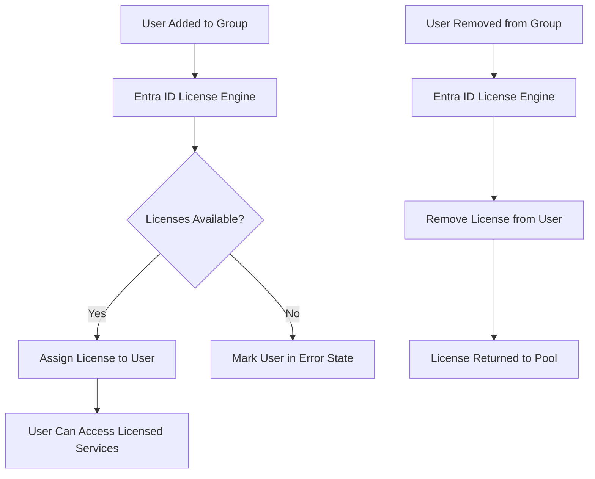

# How to Set Up Microsoft Entra ID Group-Based License Assignment and Troubleshoot Assignment Errors

Author: [nawazdhandala](https://www.github.com/nawazdhandala)

Tags: Azure, Microsoft Entra ID, License Management, Group-Based Licensing, Troubleshooting, Microsoft 365, Identity Management

Description: A comprehensive guide to setting up group-based license assignment in Microsoft Entra ID and troubleshooting common errors like conflicting plans and insufficient licenses.

---

Manually assigning Microsoft 365 and Azure licenses to individual users is tedious, error-prone, and nearly impossible to maintain at scale. Someone joins the marketing team and needs an E3 license. Someone transfers to engineering and needs their E3 swapped for an E5 plus a Power BI Pro license. Someone leaves and their license should be freed up. Group-based licensing automates all of this by assigning licenses based on group membership. Add a user to the "Marketing" group, and they automatically get the correct licenses. Remove them, and the licenses are released.

In this post, I will walk through setting up group-based licensing, configuring service plan selections, and troubleshooting the errors that inevitably come up.

## How Group-Based Licensing Works

The concept is simple: you assign one or more license SKUs to an Entra ID group. Any user who is a member of that group automatically receives those licenses. When the user is removed from the group, the licenses are unassigned.



The license engine runs asynchronously. When you add a user to a group, the license is not assigned instantly - it can take a few minutes to process. The engine also handles conflicts, where a user is in multiple groups that assign the same license.

## Prerequisites

Group-based licensing requires:

- Microsoft Entra ID P1 or P2 licenses (or Microsoft 365 E3/E5 which include Entra ID P1/P2).
- The licenses you want to assign must be purchased and available in your tenant.
- You need the License Administrator, User Administrator, or Global Administrator role.

## Step 1: Plan Your License Groups

Before creating groups, plan your licensing strategy. I recommend creating groups based on license requirements, not organizational structure. Here is a common pattern:

| Group Name | Licenses | Purpose |
|------------|----------|---------|
| License-M365-E3 | Microsoft 365 E3 | Standard office workers |
| License-M365-E5 | Microsoft 365 E5 | Users needing advanced security/compliance |
| License-PowerBI-Pro | Power BI Pro | Business intelligence users |
| License-Visio-Plan2 | Visio Plan 2 | Process designers and architects |
| License-Project-Plan3 | Project Plan 3 | Project managers |

This approach keeps licensing separate from organizational groups. A user in the "Engineering" org group might also be in "License-M365-E5" and "License-PowerBI-Pro."

## Step 2: Create License Assignment Groups

Create the groups in Entra ID. You can use security groups or Microsoft 365 groups.

This PowerShell script creates the license assignment groups:

```powershell
# Connect to Microsoft Graph
Connect-MgGraph -Scopes "Group.ReadWrite.All", "Directory.ReadWrite.All"

# Create license assignment groups
$groups = @(
    @{ Name = "License-M365-E3"; Description = "Assigns Microsoft 365 E3 licenses" },
    @{ Name = "License-M365-E5"; Description = "Assigns Microsoft 365 E5 licenses" },
    @{ Name = "License-PowerBI-Pro"; Description = "Assigns Power BI Pro licenses" },
    @{ Name = "License-Visio-Plan2"; Description = "Assigns Visio Plan 2 licenses" }
)

foreach ($group in $groups) {
    $newGroup = New-MgGroup -BodyParameter @{
        displayName     = $group.Name
        description     = $group.Description
        mailEnabled     = $false
        mailNickname    = $group.Name.Replace("-", "").ToLower()
        securityEnabled = $true
        groupTypes      = @()
    }
    Write-Output "Created group: $($newGroup.DisplayName) (ID: $($newGroup.Id))"
}
```

## Step 3: Assign Licenses to Groups

Now assign the appropriate license SKUs to each group.

First, find the available license SKUs in your tenant:

```powershell
# List available license SKUs with their service plans
$licenses = Get-MgSubscribedSku
foreach ($lic in $licenses) {
    $available = $lic.PrepaidUnits.Enabled - $lic.ConsumedUnits
    Write-Output "$($lic.SkuPartNumber) - Total: $($lic.PrepaidUnits.Enabled), Used: $($lic.ConsumedUnits), Available: $available"
}
```

Now assign the license to a group. This assigns the Microsoft 365 E3 license to the license group with specific service plans enabled:

```powershell
# Get the group and SKU details
$group = Get-MgGroup -Filter "displayName eq 'License-M365-E3'"
$sku = Get-MgSubscribedSku | Where-Object { $_.SkuPartNumber -eq "ENTERPRISEPACK" }

# You can optionally disable specific service plans within the license
# For example, disable Yammer if your org does not use it
$disabledPlans = $sku.ServicePlans | Where-Object {
    $_.ServicePlanName -in @("YAMMER_ENTERPRISE", "SWAY")
} | Select-Object -ExpandProperty ServicePlanId

# Assign the license to the group
Set-MgGroupLicense -GroupId $group.Id -AddLicenses @(
    @{
        SkuId         = $sku.SkuId
        DisabledPlans = $disabledPlans
    }
) -RemoveLicenses @()

Write-Output "License assigned to group $($group.DisplayName)"
Write-Output "Disabled service plans: YAMMER_ENTERPRISE, SWAY"
```

For the E5 group:

```powershell
# Assign M365 E5 to its group
$groupE5 = Get-MgGroup -Filter "displayName eq 'License-M365-E5'"
$skuE5 = Get-MgSubscribedSku | Where-Object { $_.SkuPartNumber -eq "ENTERPRISEPREMIUM" }

Set-MgGroupLicense -GroupId $groupE5.Id -AddLicenses @(
    @{
        SkuId         = $skuE5.SkuId
        DisabledPlans = @()  # Enable all service plans for E5 users
    }
) -RemoveLicenses @()
```

## Step 4: Add Users to License Groups

Add users to the appropriate groups to trigger license assignment.

```powershell
# Add a user to the E3 license group
$user = Get-MgUser -Filter "userPrincipalName eq 'jane.doe@company.com'"
$group = Get-MgGroup -Filter "displayName eq 'License-M365-E3'"

New-MgGroupMember -GroupId $group.Id -DirectoryObjectId $user.Id
Write-Output "Added $($user.DisplayName) to $($group.DisplayName)"
```

For bulk user assignment, read from a CSV file:

```powershell
# Bulk add users from a CSV file
# CSV format: UserPrincipalName,LicenseGroup
$assignments = Import-Csv "license-assignments.csv"

foreach ($assignment in $assignments) {
    $user = Get-MgUser -Filter "userPrincipalName eq '$($assignment.UserPrincipalName)'"
    $group = Get-MgGroup -Filter "displayName eq '$($assignment.LicenseGroup)'"

    if ($user -and $group) {
        try {
            New-MgGroupMember -GroupId $group.Id -DirectoryObjectId $user.Id
            Write-Output "OK: $($assignment.UserPrincipalName) added to $($assignment.LicenseGroup)"
        }
        catch {
            Write-Output "ERROR: $($assignment.UserPrincipalName) - $($_.Exception.Message)"
        }
    }
}
```

## Step 5: Monitor License Assignment Status

After adding users to groups, check that licenses were assigned successfully. The processing is asynchronous, so give it a few minutes.

This checks the license assignment status for a group and identifies any users with errors:

```powershell
# Check for license assignment errors in a group
$group = Get-MgGroup -Filter "displayName eq 'License-M365-E3'"

# Get members with license processing state
$members = Get-MgGroupMember -GroupId $group.Id -All

foreach ($member in $members) {
    $user = Get-MgUser -UserId $member.Id -Property "id,displayName,licenseAssignmentStates"

    foreach ($licState in $user.LicenseAssignmentStates) {
        if ($licState.State -ne "Active") {
            Write-Output "ERROR: $($user.DisplayName) - State: $($licState.State) - Error: $($licState.Error)"
        }
    }
}
```

## Step 6: Troubleshoot Common Assignment Errors

Here are the most common errors you will encounter and how to fix them:

### Error: "Not enough licenses"

This occurs when you run out of available licenses for the SKU. The user is placed in an error state and will automatically get the license when one becomes available (for example, when another user is removed from the group).

Fix: Purchase more licenses or remove licenses from users who no longer need them.

```powershell
# Find users with "NotEnoughLicenses" errors
$groups = Get-MgGroup -Filter "assignedLicenses/any()"
foreach ($group in $groups) {
    $processingState = Get-MgGroupLicenseProcessingState -GroupId $group.Id
    if ($processingState) {
        Write-Output "Group: $($group.DisplayName) - Errors exist"
    }
}
```

### Error: "Conflicting service plans"

This happens when a user is in two groups that assign licenses with overlapping service plans. For example, if a user is in both the E3 and E5 groups, many service plans overlap.

Fix: Restructure your groups so users are only in one group that includes the services they need, or disable the conflicting service plans in one of the license assignments.

```powershell
# Resolve conflicting plans by disabling overlap in the lower-tier license
# For E3 group, disable plans that are also in E5
$skuE3 = Get-MgSubscribedSku | Where-Object { $_.SkuPartNumber -eq "ENTERPRISEPACK" }
$skuE5 = Get-MgSubscribedSku | Where-Object { $_.SkuPartNumber -eq "ENTERPRISEPREMIUM" }

# Find service plans that exist in both E3 and E5
$e3Plans = $skuE3.ServicePlans | Select-Object -ExpandProperty ServicePlanId
$e5Plans = $skuE5.ServicePlans | Select-Object -ExpandProperty ServicePlanId
$overlapping = $e3Plans | Where-Object { $_ -in $e5Plans }

Write-Output "Found $($overlapping.Count) overlapping service plans"
# If a user needs both E3 and E5, disable the overlapping plans in E3
```

### Error: "Usage location not set"

Licenses require a usage location on the user object. Some licenses are not available in all countries, so Entra ID checks the usage location before assigning.

Fix: Set the usage location for all users before adding them to license groups.

```powershell
# Set usage location for users missing it
$usersWithoutLocation = Get-MgUser -All -Filter "usageLocation eq null" -Property "id,displayName,usageLocation"

foreach ($user in $usersWithoutLocation) {
    Update-MgUser -UserId $user.Id -UsageLocation "US"
    Write-Output "Set usage location for $($user.DisplayName) to US"
}
```

### Error: "Mutually exclusive service plans"

Some license SKUs contain service plans that cannot coexist on the same user. For example, certain Exchange Online plans are mutually exclusive.

Fix: Disable one of the conflicting plans in one of the license group assignments.

## Step 7: Use Dynamic Groups for Automatic Membership

For even more automation, use dynamic groups that automatically add users based on attributes like department, job title, or location.

This creates a dynamic group that automatically includes all users in the Engineering department:

```powershell
# Create a dynamic group for Engineering department E5 licenses
New-MgGroup -BodyParameter @{
    displayName       = "License-Dynamic-E5-Engineering"
    description       = "Auto-assigns E5 licenses to Engineering department"
    mailEnabled       = $false
    mailNickname      = "licensedynamice5eng"
    securityEnabled   = $true
    groupTypes        = @("DynamicMembership")
    membershipRule    = '(user.department -eq "Engineering")'
    membershipRuleProcessingState = "On"
}
```

Dynamic groups re-evaluate membership automatically when user attributes change. When someone transfers from Marketing to Engineering, their department attribute update triggers a group membership change, which triggers the license change. No manual intervention needed.

## Step 8: Set Up Alerts for License Issues

Create a monitoring runbook that checks for license assignment errors and alerts your team.

This script can run as an Azure Automation runbook on a daily schedule:

```powershell
# Check all license groups for assignment errors
$licenseGroups = Get-MgGroup -Filter "assignedLicenses/any()" -All
$errors = @()

foreach ($group in $licenseGroups) {
    $members = Get-MgGroupMember -GroupId $group.Id -All

    foreach ($member in $members) {
        $user = Get-MgUser -UserId $member.Id -Property "id,displayName,userPrincipalName,licenseAssignmentStates"

        foreach ($state in $user.LicenseAssignmentStates) {
            if ($state.State -eq "Error") {
                $errors += [PSCustomObject]@{
                    Group = $group.DisplayName
                    User  = $user.UserPrincipalName
                    Error = $state.Error
                }
            }
        }
    }
}

if ($errors.Count -gt 0) {
    # Send alert to the IT team
    $errorReport = $errors | Format-Table -AutoSize | Out-String
    Write-Output "Found $($errors.Count) license assignment errors:"
    Write-Output $errorReport
    # Send email notification via your preferred method
}
else {
    Write-Output "No license assignment errors found."
}
```

## Wrapping Up

Group-based licensing transforms license management from a manual, error-prone process into an automated, policy-driven one. Combined with dynamic groups, you can create a fully hands-off licensing system where users automatically get the right licenses based on their department, role, or any other attribute. The troubleshooting side is equally important - when you have thousands of users and dozens of license groups, errors will occur. Having a monitoring script that catches and reports errors before users start complaining about missing access is worth the investment. Set up the groups, assign the licenses, enable monitoring, and let the system handle the day-to-day license management for you.
