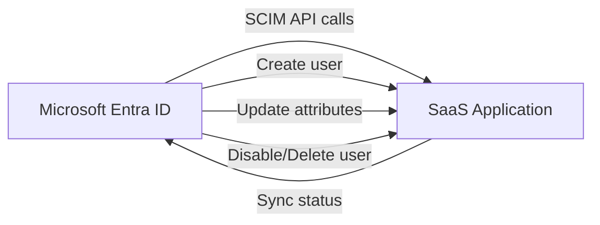

# How to Set Up Microsoft Entra ID Provisioning for Automatic User Lifecycle Management in SaaS Apps

Author: [nawazdhandala](https://www.github.com/nawazdhandala)

Tags: Azure, Microsoft Entra, User Provisioning, SCIM, SaaS, Identity Lifecycle, Automation

Description: Learn how to configure automatic user provisioning in Microsoft Entra ID to create, update, and deactivate user accounts in SaaS applications like Salesforce, Slack, and ServiceNow.

---

When someone joins your organization, they need accounts in a dozen SaaS applications. When they leave, those accounts need to be deactivated immediately. Doing this manually does not scale and creates security risks - orphaned accounts in SaaS apps are a common finding in security audits.

Microsoft Entra ID provisioning automates this lifecycle. It creates user accounts in SaaS applications when users are assigned, updates attributes when they change, and deactivates or deletes accounts when users are unassigned or leave the organization. In this guide, I will walk through setting it up end to end.

## How Entra ID Provisioning Works

The provisioning service in Entra ID uses the SCIM (System for Cross-domain Identity Management) protocol to communicate with SaaS applications. SCIM is an industry standard for user management APIs.

The flow looks like this:



The provisioning service runs on a cycle (every 20-40 minutes by default) and:

1. Checks Entra ID for users and groups assigned to the application
2. Compares them with the users in the target application
3. Creates new users, updates changed attributes, and disables removed users
4. Logs every action in the provisioning logs

## Prerequisites

- Microsoft Entra ID P1 or P2 license
- Application Administrator or Cloud Application Administrator role
- The target SaaS application must support SCIM 2.0 (most major SaaS apps do)
- Admin credentials for the target application to set up the SCIM connection

## Step 1: Add the SaaS Application from the Gallery

Most popular SaaS applications are pre-integrated in the Entra ID application gallery with provisioning support.

Go to the Microsoft Entra admin center. Navigate to Applications, then Enterprise Applications. Click "New application" and search for your target application (for example, Salesforce).

Click on the application and then "Create." This adds it to your tenant.

Using Microsoft Graph PowerShell:

```powershell
# Connect to Microsoft Graph
Connect-MgGraph -Scopes "Application.ReadWrite.All"

# Search for the application template in the gallery
$templates = Get-MgApplicationTemplate -Filter "displayName eq 'Salesforce'"

# Instantiate the application from the template
$app = Invoke-MgInstantiateApplicationTemplate `
    -ApplicationTemplateId $templates[0].Id `
    -DisplayName "Salesforce - Production"

Write-Output "Application ID: $($app.Application.AppId)"
Write-Output "Service Principal ID: $($app.ServicePrincipal.Id)"
```

## Step 2: Configure Provisioning Credentials

After adding the application, go to its Provisioning page. Set the provisioning mode to "Automatic."

Under Admin Credentials, you need to provide:

- **Tenant URL:** The SCIM endpoint URL of the target application. For Salesforce, this is something like `https://yourinstance.salesforce.com/services/scim/v2`
- **Secret Token:** An API token or OAuth token that authorizes Entra ID to manage users in the target application

Each application has its own way of generating these credentials. For Salesforce:

1. Log into Salesforce as an admin
2. Go to Setup, then search for "Connected Apps"
3. Create or find the connected app for Entra ID provisioning
4. Generate the OAuth token

Click "Test Connection" to verify that Entra ID can reach the application's SCIM endpoint. If the test fails, the most common issues are:

- Incorrect SCIM URL (check for trailing slashes)
- Expired or invalid token
- The application's SCIM API is not enabled
- Network restrictions blocking the connection from Azure's IP ranges

## Step 3: Configure Attribute Mappings

Attribute mappings define how Entra ID user attributes map to the target application's user attributes. Each gallery application comes with default mappings, but you will usually need to customize them.

Go to the Provisioning page and click "Mappings." You will see two mapping sets:

- **Provision Azure Active Directory Users:** Maps Entra ID user attributes to application user attributes
- **Provision Azure Active Directory Groups:** Maps Entra ID groups to application groups (if supported)

Click on the user mapping to see the details. Common mappings include:

| Entra ID Attribute | Application Attribute | Notes |
|---|---|---|
| userPrincipalName | userName | Usually the unique identifier |
| mail | emails[type eq "work"].value | Work email address |
| givenName | name.givenName | First name |
| surname | name.familyName | Last name |
| displayName | displayName | Full display name |
| department | urn:ietf:params:scim:schemas:extension:enterprise:2.0:User:department | Department |
| jobTitle | title | Job title |
| accountEnabled | active | Controls if the account is enabled |

You can customize mappings by:

- Changing the source attribute
- Using expressions to transform values
- Setting default values
- Making attributes required or optional

Here is an expression example that constructs a username from first and last name:

```
// Expression to create a username from given name and surname
// Converts to lowercase and removes spaces
ToLower(Join(".", [givenName], [surname]))
```

## Step 4: Configure Scoping Filters

You probably do not want to provision every user in your tenant to every application. Scoping filters let you control which users are provisioned:

**Assignment-based scoping (recommended):** Only users and groups explicitly assigned to the application are provisioned. This is the default.

**Attribute-based scoping:** Provision users based on attribute values. For example, only provision users where department equals "Sales" to the Salesforce application.

To add a scoping filter:

1. Go to Provisioning, then Mappings, then the user mapping
2. Click "Source Object Scope"
3. Add scoping clauses

Example: Provision only users in the Sales department who have a manager assigned:

```
Clause 1: department EQUALS "Sales"
AND
Clause 2: manager IS NOT NULL
```

## Step 5: Assign Users and Groups

If using assignment-based scoping (the default), assign users or groups to the application:

```powershell
# Assign a group to the enterprise application
# All members of this group will be provisioned
$servicePrincipalId = "your-sp-id"
$groupId = "sales-team-group-id"

New-MgServicePrincipalAppRoleAssignment `
    -ServicePrincipalId $servicePrincipalId `
    -PrincipalId $groupId `
    -PrincipalType "Group" `
    -AppRoleId "00000000-0000-0000-0000-000000000000" `
    -ResourceId $servicePrincipalId
```

Using groups is the best practice because it scales better than individual user assignments and integrates with your group management processes.

## Step 6: Start Provisioning

After configuring credentials, mappings, and assignments, start the provisioning service:

1. Go to the Provisioning page
2. Set the Provisioning Status to "On"
3. Click "Save"

The first cycle is an "initial cycle" that processes all assigned users. This can take anywhere from 20 minutes to several hours depending on the number of users. Subsequent incremental cycles process only changes and run every 20-40 minutes.

```powershell
# Start provisioning using Microsoft Graph
# First, get the provisioning job
$jobs = Get-MgServicePrincipalSynchronizationJob `
    -ServicePrincipalId $servicePrincipalId

# Start the job
Start-MgServicePrincipalSynchronizationJob `
    -ServicePrincipalId $servicePrincipalId `
    -SynchronizationJobId $jobs[0].Id
```

## Step 7: Monitor Provisioning Logs

Provisioning logs are critical for understanding what the service is doing. Go to the enterprise application, then Provisioning logs.

Each log entry shows:

- **Action:** Create, Update, Delete, Disable, or Other
- **Status:** Success, Failure, Skipped
- **Source identity:** The user in Entra ID
- **Target identity:** The user in the target application
- **Modified properties:** Which attributes were changed

Common failure reasons:

- **Duplicate value:** The target application rejected the user because the username or email already exists
- **Required attribute missing:** A mandatory attribute in the target application was not mapped
- **API error:** The target application's SCIM endpoint returned an error

You can also query provisioning logs programmatically:

```powershell
# Get recent provisioning logs for the application
$logs = Get-MgAuditLogProvisioning `
    -Filter "servicePrincipal/id eq '$servicePrincipalId'" `
    -Top 50

foreach ($log in $logs) {
    $status = $log.ProvisioningStatusInfo.Status
    $action = $log.ProvisioningAction
    $source = $log.SourceIdentity.DisplayName
    Write-Output "$status | $action | $source"
}
```

## Handling Deprovisioning

When a user is unassigned from the application (or disabled in Entra ID, or removed from the assigned group), the provisioning service needs to handle their account in the target application. You have two options:

- **Disable the account:** Set the `active` attribute to false. The user cannot sign in but their data is preserved.
- **Delete the account:** Remove the user entirely from the target application.

Most organizations choose "Disable" to preserve audit trails and data. Configure this in the provisioning settings under "Actions."

## On-Demand Provisioning

You do not have to wait for the next cycle to provision a specific user. On-demand provisioning lets you trigger provisioning for a single user immediately:

1. Go to Provisioning, then "Provision on demand"
2. Search for the user
3. Click "Provision"

The tool shows you exactly what would happen - which attributes would be set, whether it would be a create or update operation, and any errors. This is invaluable for testing your attribute mappings before turning on the full provisioning cycle.

## Provisioning to Non-Gallery Applications

If your target application supports SCIM but is not in the Entra ID gallery, you can still configure provisioning:

1. Add a "Non-gallery application" (or "Enterprise Application" with SCIM)
2. Configure the SCIM endpoint URL and authentication token manually
3. Define attribute mappings from scratch (there are no pre-built defaults)

This works for custom internal applications that expose a SCIM API.

## Best Practices

- Use groups for assignment instead of individual users. It is much easier to manage.
- Test attribute mappings with on-demand provisioning before starting the full cycle.
- Monitor provisioning logs weekly for failures, especially after changes to the target application.
- Set up email notifications for provisioning failures. Go to Provisioning settings and enable notification emails.
- Document your attribute mappings and scoping rules. When something breaks six months from now, you need to know why it was configured that way.
- Handle the "day zero" scenario: when you first enable provisioning, existing users in the target application may not match Entra ID users. Use the matching attribute (usually email) to link existing accounts instead of creating duplicates.

## Summary

Microsoft Entra ID provisioning automates the tedious and error-prone process of managing user accounts across SaaS applications. Configure the SCIM connection, define your attribute mappings, scope to the right users, and start the provisioning cycle. The service handles creating, updating, and disabling accounts automatically, and the provisioning logs give you full visibility into every action taken. Combined with group-based assignment, this gives you a scalable user lifecycle management system.
