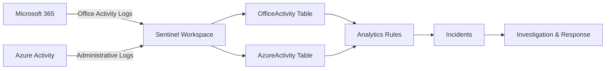

# How to Set Up Microsoft Sentinel Data Connectors for Microsoft 365 and Azure Activity Logs

Author: [nawazdhandala](https://www.github.com/nawazdhandala)

Tags: Azure, Microsoft Sentinel, Data Connectors, Microsoft 365, SIEM, Security Monitoring, Log Analytics

Description: A practical guide to connecting Microsoft 365 and Azure Activity log sources to Microsoft Sentinel for centralized security monitoring and threat detection.

---

Microsoft Sentinel is a cloud-native SIEM (Security Information and Event Management) platform that collects data from across your environment, detects threats, and helps you respond to incidents. But Sentinel is only as useful as the data you feed into it. Without data connectors, it is just an empty dashboard waiting for logs.

The two most foundational data sources for any Azure organization are Microsoft 365 logs (Exchange, SharePoint, Teams) and Azure Activity logs (who did what to which Azure resource). Setting up these connectors is usually the first thing you do after provisioning a Sentinel workspace, and this guide covers both in detail.

## How Sentinel Data Connectors Work

Data connectors are the bridges between your data sources and the Sentinel workspace (which is really a Log Analytics workspace underneath). When you enable a connector, it starts ingesting data into specific tables:



Each data source writes to its own table, and then you write analytics rules (detection queries) that run against those tables to generate incidents.

## Prerequisites

You need the following:

- An Azure subscription with a deployed Microsoft Sentinel workspace
- Global Administrator or Security Administrator role for Microsoft 365 connector
- Owner or Contributor role on the Azure subscription for Activity log connector
- A Log Analytics workspace linked to Sentinel

If you do not have a Sentinel workspace yet, here is how to create one:

```powershell
# Create a resource group for Sentinel
New-AzResourceGroup -Name "sentinel-rg" -Location "eastus"

# Create a Log Analytics workspace
$workspace = New-AzOperationalInsightsWorkspace `
    -ResourceGroupName "sentinel-rg" `
    -Name "sentinel-workspace" `
    -Location "eastus" `
    -Sku "PerGB2018"

# Enable Microsoft Sentinel on the workspace
# This adds the SecurityInsights solution
New-AzMonitorLogAnalyticsSolution `
    -Type "SecurityInsights" `
    -ResourceGroupName "sentinel-rg" `
    -Location "eastus" `
    -WorkspaceResourceId $workspace.ResourceId

Write-Host "Sentinel workspace created and enabled."
```

## Step 1: Connect Microsoft 365 Logs

The Microsoft 365 connector brings in audit logs from Exchange Online, SharePoint Online, and Microsoft Teams. These logs include events like email access, file sharing, team creation, and administrative actions.

### Enable via the Azure Portal

1. Navigate to Microsoft Sentinel in the Azure portal.
2. Select your Sentinel workspace.
3. Go to Configuration, then Data connectors.
4. Search for "Microsoft 365" in the connector gallery.
5. Click on Microsoft 365 and then click Open connector page.
6. Under Configuration, you will see toggle switches for:
   - Exchange
   - SharePoint
   - Teams
7. Enable all three (or select only the ones relevant to your monitoring needs).
8. Click Apply Changes.

The connector typically starts ingesting data within a few minutes. Historical data from the past 7 days may also be pulled in, depending on the connector version.

### Enable via PowerShell

```powershell
# Connect to Azure and set the context
Connect-AzAccount
$subscriptionId = "YOUR_SUBSCRIPTION_ID"
$resourceGroupName = "sentinel-rg"
$workspaceName = "sentinel-workspace"

# The Microsoft 365 data connector uses the Office ATP connector type
# Enable it using the Sentinel REST API via PowerShell
$uri = "https://management.azure.com/subscriptions/$subscriptionId/resourceGroups/$resourceGroupName/providers/Microsoft.OperationalInsights/workspaces/$workspaceName/providers/Microsoft.SecurityInsights/dataConnectors/office365-connector?api-version=2023-02-01"

# Define the connector configuration
$body = @{
    kind = "Office365"
    properties = @{
        tenantId = (Get-AzContext).Tenant.Id
        dataTypes = @{
            exchange = @{
                state = "enabled"  # Enable Exchange Online logs
            }
            sharePoint = @{
                state = "enabled"  # Enable SharePoint Online logs
            }
            teams = @{
                state = "enabled"  # Enable Microsoft Teams logs
            }
        }
    }
} | ConvertTo-Json -Depth 5

# Create the data connector
$token = (Get-AzAccessToken -ResourceUrl "https://management.azure.com").Token
$headers = @{ Authorization = "Bearer $token"; "Content-Type" = "application/json" }
Invoke-RestMethod -Uri $uri -Method PUT -Headers $headers -Body $body

Write-Host "Microsoft 365 data connector enabled."
```

### Verify Data Is Flowing

After enabling the connector, verify that data is arriving in the workspace:

```kusto
// Check if Office 365 activity data is being ingested
// You should see records within 10-15 minutes of enabling the connector
OfficeActivity
| where TimeGenerated > ago(1h)
| summarize Count = count() by OfficeWorkload
| sort by Count desc
```

If the query returns results for Exchange, SharePoint, or Teams, the connector is working. If not, wait a few more minutes and check again. If data still does not appear after 30 minutes, verify that you have the correct permissions and that audit logging is enabled in your Microsoft 365 tenant.

## Step 2: Connect Azure Activity Logs

Azure Activity logs capture control plane operations across your subscriptions - resource creation, deletion, modification, role assignments, policy changes, and more.

### Enable via the Azure Portal

1. In Microsoft Sentinel, go to Data connectors.
2. Search for "Azure Activity" and click on it.
3. Click Open connector page.
4. Under Configuration, you will see a link to "Launch Azure Policy Assignment wizard."
5. Click on it. This opens the Azure Policy assignment page for the "Configure Azure Activity logs to stream to specified Log Analytics workspace" policy.
6. On the Basics tab, set the scope to the subscriptions you want to monitor.
7. On the Parameters tab, select your Sentinel Log Analytics workspace.
8. On the Remediation tab, check "Create a remediation task" to apply the policy to existing subscriptions.
9. Click Review + create, then Create.

### Enable via Azure CLI

```bash
# Create a diagnostic setting on the subscription to send Activity logs
# to the Sentinel Log Analytics workspace
az monitor diagnostic-settings subscription create \
    --name "sentinel-activity-logs" \
    --subscription YOUR_SUBSCRIPTION_ID \
    --workspace /subscriptions/YOUR_SUBSCRIPTION_ID/resourceGroups/sentinel-rg/providers/Microsoft.OperationalInsights/workspaces/sentinel-workspace \
    --logs '[
        {"category": "Administrative", "enabled": true},
        {"category": "Security", "enabled": true},
        {"category": "ServiceHealth", "enabled": true},
        {"category": "Alert", "enabled": true},
        {"category": "Recommendation", "enabled": true},
        {"category": "Policy", "enabled": true},
        {"category": "Autoscale", "enabled": true},
        {"category": "ResourceHealth", "enabled": true}
    ]'
```

### Verify Azure Activity Data

```kusto
// Check if Azure Activity logs are being ingested
// Look for recent administrative operations
AzureActivity
| where TimeGenerated > ago(1h)
| summarize Count = count() by CategoryValue
| sort by Count desc
```

You should see categories like Administrative, Security, and Policy in the results.

## Step 3: Validate Both Connectors

Once both connectors are enabled, check the Data connectors page in Sentinel. Each connector should show a green status indicator and a "Connected" label. You can also check the data volume:

```kusto
// Check data ingestion volume for both tables over the past 24 hours
// This helps you understand your data costs
union
    (OfficeActivity | where TimeGenerated > ago(24h) | summarize Records = count(), Size = sum(_BilledSize) | extend Source = "Microsoft 365"),
    (AzureActivity | where TimeGenerated > ago(24h) | summarize Records = count(), Size = sum(_BilledSize) | extend Source = "Azure Activity")
| project Source, Records, SizeMB = round(Size / 1048576.0, 2)
```

## Step 4: Create Basic Analytics Rules

With data flowing in, create some basic detection rules to start getting value from the data immediately.

### Detect Mass File Downloads from SharePoint

```kusto
// Detect users downloading an unusually high number of files from SharePoint
// This could indicate data exfiltration
OfficeActivity
| where OfficeWorkload == "SharePoint"
| where Operation == "FileDownloaded"
| summarize DownloadCount = count() by UserId, bin(TimeGenerated, 1h)
| where DownloadCount > 50
```

### Detect Suspicious Azure Resource Deletions

```kusto
// Detect mass resource deletions that could indicate a compromised admin account
// or an accidental destructive operation
AzureActivity
| where OperationNameValue endswith "DELETE"
| where ActivityStatusValue == "Success"
| summarize DeleteCount = count() by Caller, bin(TimeGenerated, 1h)
| where DeleteCount > 10
```

## Step 5: Manage Data Retention and Costs

Data ingestion into Sentinel is billed per GB ingested. Microsoft 365 and Azure Activity logs can generate significant volume in larger organizations. Here are some cost management tips:

- Microsoft 365 logs are free for the first 90 days of retention (basic logs tier).
- Azure Activity logs are free to ingest into Sentinel (they are part of the free data sources).
- Set appropriate retention periods - 90 days is often sufficient for operational monitoring, with longer retention for compliance needs.
- Use data collection rules to filter out low-value events before they reach Sentinel.

## Common Troubleshooting

If data is not flowing after enabling a connector, check these common issues:

**Microsoft 365 connector issues:**
- Verify that unified audit logging is enabled in the Microsoft Purview compliance portal.
- Check that the account enabling the connector has Global Administrator or Security Administrator permissions.
- Ensure the Entra ID tenant ID matches between your Azure subscription and Microsoft 365 tenant.

**Azure Activity connector issues:**
- Verify the diagnostic setting was created on the correct subscription.
- Check that the Log Analytics workspace referenced in the diagnostic setting is the same one used by Sentinel.
- If using the Azure Policy method, verify the remediation task completed successfully.

## Conclusion

Setting up the Microsoft 365 and Azure Activity data connectors in Microsoft Sentinel is the foundation of security monitoring for any Azure organization. These two data sources give you visibility into user actions across Office workloads and administrative operations across Azure resources. Once the data is flowing, you can build detection rules, investigate incidents, and create workbooks to visualize security trends. The connectors take just minutes to configure, but the visibility they provide is invaluable for detecting compromised accounts, data exfiltration attempts, and unauthorized infrastructure changes.
