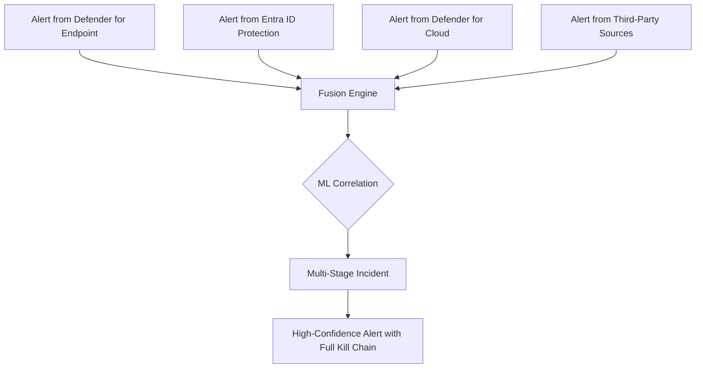

# How to Set Up Microsoft Sentinel Fusion Detection for Advanced Multi-Stage Attack Identification

Author: [nawazdhandala](https://www.github.com/nawazdhandala)

Tags: Azure, Microsoft Sentinel, Fusion Detection, Threat Detection, SIEM, Multi-Stage Attacks, Security Analytics

Description: Learn how to configure Microsoft Sentinel Fusion detection rules to automatically identify advanced multi-stage attacks by correlating alerts across multiple data sources.

---

Modern attackers rarely rely on a single technique. They chain together multiple steps - initial access through a phishing email, lateral movement via compromised credentials, data staging, and finally exfiltration. Each step individually might look benign or generate a low-severity alert that gets lost in the noise. But when you connect the dots across those steps, the picture of a coordinated attack becomes clear. That is exactly what Microsoft Sentinel's Fusion detection does.

Fusion is Sentinel's built-in machine learning engine that automatically correlates alerts from multiple sources and identifies multi-stage attack patterns. In this post, I will explain how Fusion works, how to enable and configure it, and what you can expect from it in practice.

## How Fusion Detection Works

Fusion takes a fundamentally different approach from traditional SIEM correlation rules. Instead of requiring you to define every possible attack sequence manually, Fusion uses machine learning to discover correlations between alerts that match known attack patterns.

Here is the basic workflow:



Fusion combines alerts from various sources - Microsoft Defender products, Entra ID Protection, third-party firewalls, and more - and looks for patterns that match the MITRE ATT&CK framework's attack stages. When it finds a sequence of alerts that together tell the story of a multi-stage attack, it generates a single high-confidence incident with all the correlated evidence.

## What Fusion Can Detect

Fusion comes with pre-built detection scenarios covering several categories:

**Ransomware** - Correlates suspicious sign-in activity with mass file encryption indicators, data exfiltration patterns, and known ransomware behaviors.

**Compute resource abuse** - Identifies scenarios where compromised credentials are used to spin up compute resources for cryptocurrency mining.

**Credential access with lateral movement** - Detects when stolen credentials are used to move across systems, combining identity alerts with endpoint detection alerts.

**Data exfiltration** - Correlates suspicious sign-in alerts with unusual data transfer patterns to cloud storage or external destinations.

**Denial of service** - Identifies coordinated attacks that combine initial compromise with service disruption activities.

## Step 1: Verify Prerequisites

Fusion needs data from multiple sources to work effectively. The more data sources you connect to Sentinel, the better Fusion can correlate events.

At minimum, you should have these data connectors enabled:

- Microsoft Entra ID (sign-in and audit logs)
- Microsoft Defender for Cloud
- Microsoft Defender for Endpoint
- Microsoft Defender for Identity
- Microsoft Defender for Cloud Apps

Additional sources that improve Fusion's effectiveness include:

- Azure Activity logs
- Microsoft Defender for Office 365
- Third-party firewall logs (Palo Alto, Fortinet, Check Point)
- AWS CloudTrail (for multi-cloud environments)

Check your current connectors with this command:

```bash
# List all data connectors configured in your Sentinel workspace
az sentinel data-connector list \
  --resource-group rg-sentinel \
  --workspace-name law-sentinel-prod \
  --query "[].{name:name, kind:kind}" -o table
```

## Step 2: Enable the Fusion Analytics Rule

Fusion comes as a built-in analytics rule in Sentinel. It should be enabled by default when you set up Sentinel, but let us verify and enable it if needed.

In the Azure portal, navigate to Microsoft Sentinel, then go to Analytics in the left menu. Click on the "Rule templates" tab and search for "Advanced Multistage Attack Detection." This is the Fusion rule.

If it shows as "Not configured," click on it and then click "Create rule." The creation wizard is straightforward since Fusion does not require custom query logic - it is entirely ML-driven.

You can also check and enable it using the Azure CLI:

```bash
# Check if the Fusion rule is active
az sentinel alert-rule list \
  --resource-group rg-sentinel \
  --workspace-name law-sentinel-prod \
  --query "[?kind=='Fusion'].{name:name, displayName:displayName, enabled:enabled}" -o table
```

## Step 3: Configure Fusion Source Signals

Starting with the updated Fusion experience, you can now configure which source signals Fusion uses for its correlations. This lets you fine-tune which alert sources feed into the ML engine.

In the Sentinel portal, go to Analytics, find the Fusion rule, and click "Edit." In the configuration panel, you will see a list of source signals grouped by product:

- **Microsoft Defender alerts** - Alerts from Defender for Endpoint, Identity, Cloud Apps, and Office 365.
- **Microsoft Entra ID Protection** - Risky sign-in alerts, impossible travel, unfamiliar sign-in properties.
- **Microsoft Defender for Cloud** - Resource-level security alerts.
- **Scheduled analytics rules** - Your custom analytics rules can also feed into Fusion.
- **Third-party alerts** - Alerts from non-Microsoft security products.

Enable or disable source signals based on what is relevant to your environment. I recommend enabling everything you have data for and then tuning down if you get too many false positives from a specific source.

## Step 4: Configure Severity and Automation

Fusion incidents are typically generated with High severity because they represent correlated multi-stage attacks with high confidence. However, you can configure automation rules to adjust the handling based on your needs.

This creates an automation rule that assigns Fusion incidents to your security team and sets the appropriate status:

```bash
# Create an automation rule for Fusion incidents
az sentinel automation-rule create \
  --resource-group rg-sentinel \
  --workspace-name law-sentinel-prod \
  --automation-rule-name "Handle-Fusion-Incidents" \
  --display-name "Route Fusion Incidents to SOC" \
  --order 1 \
  --triggering-logic "{\"isEnabled\":true,\"triggersOn\":\"Incidents\",\"triggersWhen\":\"Created\",\"conditions\":[{\"conditionType\":\"Property\",\"conditionProperties\":{\"propertyName\":\"IncidentProviderName\",\"operator\":\"Equals\",\"propertyValues\":[\"Fusion\"]}}]}" \
  --actions "[{\"order\":1,\"actionType\":\"ModifyProperties\",\"actionConfiguration\":{\"owner\":{\"objectId\":\"<soc-team-group-id>\"}}}]"
```

## Step 5: Integrate Custom Analytics Rules with Fusion

One of the most powerful features of the updated Fusion engine is the ability to include your own custom Scheduled analytics rules as source signals. This means your custom detections can be correlated with alerts from other sources by the Fusion ML engine.

To make a custom rule eligible for Fusion correlation, it needs to:

1. Be a Scheduled analytics rule (not NRT or other types).
2. Have MITRE ATT&CK tactics mapped to the rule.
3. Produce alerts with entity mappings (accounts, hosts, IPs).

Here is an example of a custom analytics rule that is Fusion-compatible. This KQL query detects unusual PowerShell execution patterns and maps to the Execution tactic:

```kusto
// Detect suspicious PowerShell execution with encoded commands
// This feeds into Fusion as a source signal for the Execution stage
SecurityEvent
| where TimeGenerated > ago(1h)
| where EventID == 4688
| where Process == "powershell.exe" or Process == "pwsh.exe"
| where CommandLine contains "-EncodedCommand"
    or CommandLine contains "-enc "
    or CommandLine contains "FromBase64String"
| extend
    AccountName = TargetUserName,
    HostName = Computer,
    ProcessCommandLine = CommandLine
| project
    TimeGenerated,
    AccountName,
    HostName,
    ProcessCommandLine,
    ParentProcessName
```

When you create this as a Scheduled analytics rule, map it to the "Execution" MITRE ATT&CK tactic and configure entity mappings for Account and Host. Fusion will then consider alerts from this rule when building its multi-stage attack correlations.

## Step 6: Investigate Fusion Incidents

When Fusion generates an incident, it consolidates all the correlated alerts into a single incident with a descriptive name that tells you the attack story. For example, you might see an incident named "Suspicious sign-in followed by anomalous Office 365 activity and suspicious Azure resource deployment."

The incident detail page shows you the full timeline of events:

1. The initial access event (e.g., a sign-in from an anonymous IP)
2. The persistence or lateral movement event (e.g., mail forwarding rule creation)
3. The impact event (e.g., mass file download or resource deployment)

Each event links back to the original alert with full details. This is incredibly valuable for incident response because the Fusion engine has already done the correlation work that would normally take an analyst considerable time.

## Step 7: Monitor Fusion Performance

Keep an eye on how Fusion is performing in your environment. You can use the following KQL query in your Sentinel workspace to analyze Fusion incident trends.

This query summarizes Fusion incidents over the past 30 days by severity and attack scenario:

```kusto
// Analyze Fusion incident trends over the past 30 days
SecurityIncident
| where TimeGenerated > ago(30d)
| where ProviderName == "Fusion"
| summarize
    IncidentCount = count(),
    AvgAlertCount = avg(AdditionalData.alertsCount)
    by
    Severity,
    Title
| order by IncidentCount desc
```

## Tuning and Reducing False Positives

Fusion is designed to be high-signal with low false positive rates, but no ML system is perfect. Here are some tuning strategies:

**Review and close false positives promptly.** While Fusion does not have an explicit feedback loop in the UI, consistently closing false positives as "False Positive" helps your SOC team track patterns and identify source signals that might need tuning.

**Tune the source signals.** If a particular data source is generating noisy alerts that lead to bad Fusion correlations, consider tuning that source directly rather than disabling it in Fusion. For example, if Entra ID Protection is flagging legitimate VPN traffic as suspicious sign-ins, fix the named locations configuration in Entra ID.

**Use automation rules to filter.** If certain Fusion scenarios are consistently irrelevant to your environment, create automation rules that automatically close those specific incident types.

## Wrapping Up

Microsoft Sentinel's Fusion detection is one of the most valuable built-in capabilities of the platform. It does the heavy lifting of correlating alerts across multiple security products and identifying the multi-stage attack patterns that individual detections would miss. The setup is straightforward since it is mostly about having the right data connectors in place and enabling the built-in rule. The real power comes from feeding it rich data from multiple sources and integrating your own custom detections into the correlation engine. For any organization running Sentinel, Fusion should be one of the first things you enable and one of the last things you would ever want to turn off.
