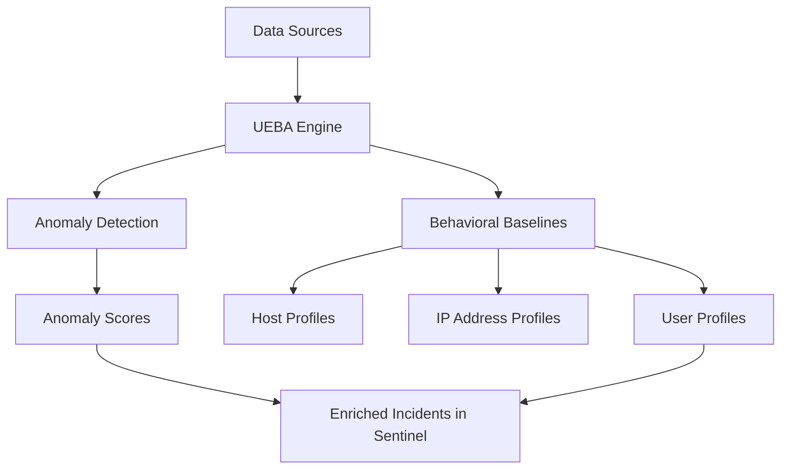

# How to Set Up Microsoft Sentinel Incident Investigation with Entity Behavior Analytics (UEBA)

Author: [nawazdhandala](https://www.github.com/nawazdhandala)

Tags: Azure, Microsoft Sentinel, UEBA, Entity Behavior Analytics, Incident Investigation, Threat Detection, Security Analytics

Description: Learn how to enable and use Entity Behavior Analytics (UEBA) in Microsoft Sentinel to identify anomalous user and entity behaviors during incident investigations.

---

Security alerts tell you that something happened. Entity Behavior Analytics (UEBA) tells you whether what happened is normal. When you are investigating an incident in Microsoft Sentinel, UEBA gives you context about the entities involved - users, hosts, IP addresses - by establishing behavioral baselines and highlighting deviations. Instead of manually sifting through thousands of log entries trying to figure out if a user's behavior is suspicious, UEBA surfaces the anomalies for you.

In this post, I will walk through enabling UEBA in Sentinel, configuring the data sources that feed it, and show how to use it effectively during incident investigations.

## What UEBA Does

UEBA builds behavioral profiles for entities in your environment. It learns what "normal" looks like for each user, each host, and each IP address based on historical activity patterns. Then it flags activities that deviate from those patterns.

For example, UEBA can identify:

- A user who normally logs in from New York during business hours suddenly logging in from Eastern Europe at 3 AM.
- An account that typically accesses 2-3 file shares suddenly accessing 50 different shares in an hour.
- A device that normally generates minimal network traffic suddenly pushing gigabytes of data to an external IP.
- A user performing administrative actions they have never performed before.



## Step 1: Enable UEBA in Microsoft Sentinel

UEBA is not enabled by default. You need to turn it on and configure which data sources it should analyze.

In the Azure portal, navigate to Microsoft Sentinel, then go to Settings, then click on "Settings" again under the Configuration section. Find "Entity behavior analytics" and click "Set UEBA."

You can also enable it through the API. This command enables UEBA on your Sentinel workspace:

```bash
# Enable UEBA through the REST API
az rest --method PUT \
  --url "https://management.azure.com/subscriptions/<sub-id>/resourceGroups/rg-sentinel/providers/Microsoft.OperationalInsights/workspaces/law-sentinel-prod/providers/Microsoft.SecurityInsights/settings/EntityAnalytics?api-version=2023-02-01" \
  --body '{
    "kind": "EntityAnalytics",
    "properties": {
      "entityProviders": ["AzureActiveDirectory", "ActiveDirectory"]
    }
  }'
```

## Step 2: Configure Data Sources

UEBA needs data to build behavioral profiles. The more data sources you connect, the richer the profiles and the better the anomaly detection. Configure the following data sources at minimum:

**Microsoft Entra ID** - Sign-in logs and audit logs are essential for user behavior profiling. These provide authentication patterns, location data, and administrative activity.

**Active Directory** (if you have on-premises AD synced through the Defender for Identity sensor) - Provides on-premises authentication and lateral movement data.

**Azure Activity** - Resource management operations in Azure.

**Security Events** (from Windows VMs via the Azure Monitor Agent) - Login events, process execution, and other OS-level activity.

Verify that the necessary data connectors are active:

```bash
# Check which data connectors are enabled
az sentinel data-connector list \
  --resource-group rg-sentinel \
  --workspace-name law-sentinel-prod \
  --query "[].{name:name, kind:kind}" -o table
```

In the UEBA settings, select all available data sources. The configuration page will show checkboxes for each supported data source type.

## Step 3: Wait for Baseline Learning

After enabling UEBA, Sentinel needs time to build behavioral baselines. The learning period is typically 14-21 days. During this time, UEBA is analyzing historical data and establishing what "normal" looks like for each entity.

You will start seeing anomaly data after the learning period, but the accuracy improves over time as UEBA collects more data. Do not expect immediate results - this is a system that gets better the longer it runs.

## Step 4: Understand the UEBA Tables

UEBA populates several tables in your Log Analytics workspace that you can query directly:

**BehaviorAnalytics** - The main table containing anomaly detections. Each row represents an anomalous activity with a score indicating how unusual it is.

**IdentityInfo** - User identity information enriched from Entra ID and Active Directory.

**UserAccessAnalytics** - Tracks which resources users access and identifies unusual access patterns.

**UserPeerAnalytics** - Identifies peer groups (users with similar roles and activity patterns) and flags when someone behaves differently from their peers.

Here is a query to explore UEBA anomalies. This finds the top anomalies detected in the past week ranked by investigation priority:

```kusto
// Find the most significant UEBA anomalies from the past 7 days
BehaviorAnalytics
| where TimeGenerated > ago(7d)
| where ActivityInsights has "True"
| summarize
    AnomalyCount = count(),
    MaxScore = max(InvestigationPriority),
    Activities = make_set(ActivityType)
    by
    UserPrincipalName,
    SourceIPAddress
| where MaxScore > 5
| order by MaxScore desc
| take 20
```

## Step 5: Use UEBA During Incident Investigation

When investigating an incident in Sentinel, UEBA enriches the entity pages with behavioral context. Here is how to use it effectively.

When you open an incident and see a user entity, click on the user to open their entity page. The page shows:

- **Activity timeline** - A chronological view of the user's activities.
- **Anomalies** - Activities that deviate from the user's baseline.
- **Investigation priority score** - A composite score indicating how suspicious the user's recent behavior is.
- **Peer comparison** - How the user's behavior compares to their peers.

This KQL query provides a detailed behavioral profile for a specific user during an investigation:

```kusto
// Investigate a specific user's anomalous behavior
let targetUser = "suspicious.user@company.com";
// First, look at UEBA anomalies for this user
BehaviorAnalytics
| where TimeGenerated > ago(30d)
| where UserPrincipalName == targetUser
| project
    TimeGenerated,
    ActivityType,
    ActionType,
    SourceIPAddress,
    SourceIPLocation,
    DevicesInsight,
    ActivityInsights,
    InvestigationPriority,
    UsersInsights
| order by TimeGenerated desc
```

For a more comprehensive investigation, combine UEBA data with raw log data:

```kusto
// Correlate UEBA anomalies with actual sign-in events
let targetUser = "suspicious.user@company.com";
let anomalyTimes = BehaviorAnalytics
| where TimeGenerated > ago(7d)
| where UserPrincipalName == targetUser
| where InvestigationPriority > 3
| project AnomalyTime = TimeGenerated;
// Join with sign-in logs to get the full picture
SigninLogs
| where TimeGenerated > ago(7d)
| where UserPrincipalName == targetUser
| join kind=inner (anomalyTimes) on $left.TimeGenerated == $right.AnomalyTime
| project
    TimeGenerated,
    AppDisplayName,
    IPAddress,
    Location,
    DeviceDetail,
    ConditionalAccessStatus,
    RiskLevelAggregated,
    Status
| order by TimeGenerated desc
```

## Step 6: Create Analytics Rules Based on UEBA

You can create Sentinel analytics rules that trigger based on UEBA anomaly scores. This turns UEBA insights into actionable incidents.

This creates an analytics rule that generates an incident when a user's investigation priority exceeds a threshold:

```kusto
// Analytics rule: High-priority UEBA anomaly detected
// Trigger an incident when a user's investigation priority exceeds 7
BehaviorAnalytics
| where TimeGenerated > ago(1h)
| where InvestigationPriority > 7
| summarize
    AnomalyCount = count(),
    MaxPriority = max(InvestigationPriority),
    AnomalousActivities = make_set(ActivityType),
    SourceIPs = make_set(SourceIPAddress)
    by
    UserPrincipalName
| extend
    AccountName = tostring(split(UserPrincipalName, "@")[0]),
    AccountDomain = tostring(split(UserPrincipalName, "@")[1])
```

Save this as a Scheduled analytics rule in Sentinel with a 1-hour lookback window. Map the UserPrincipalName to an Account entity for proper entity mapping.

## Step 7: Integrate UEBA with Investigation Bookmarks

During an investigation, you can save UEBA findings as bookmarks that become part of the incident evidence. This is valuable for documenting what anomalies you found and building a timeline of the attack.

In the Sentinel investigation graph, when you expand an entity and see UEBA anomalies, you can bookmark specific anomalies. These bookmarks appear in the incident timeline and can be included in incident reports.

## Understanding Investigation Priority Scores

The investigation priority score ranges from 0 to 10, where higher scores indicate more suspicious behavior:

- **0-2**: Normal activity. No significant deviations from baseline.
- **3-5**: Mildly anomalous. Some deviation from normal patterns. Worth checking during an investigation but unlikely to be malicious on its own.
- **6-8**: Significantly anomalous. Multiple deviations or high-confidence anomalies. Should be investigated.
- **9-10**: Highly anomalous. Strong indicators of compromised or malicious behavior. Requires immediate investigation.

The score is calculated based on multiple factors including:
- How far the activity deviates from the user's baseline
- How far the activity deviates from the user's peer group
- The rarity of the activity across the entire organization
- The sensitivity of the resources accessed

## Tuning UEBA for Your Environment

UEBA will generate some noise, especially in the first few months. Here are some tuning strategies:

**Exclude service accounts.** Service accounts often have patterns that look anomalous to UEBA (repetitive scheduled tasks, access from the same IP at the same time every day, etc.). Identify your service accounts and either exclude them or adjust your analytics rules to filter them out.

**Account for expected changes.** When an employee changes roles, their behavior will naturally shift and UEBA will flag it. During organizational changes, expect higher anomaly volumes and triage accordingly.

**Combine UEBA with other signals.** A UEBA anomaly on its own is not always actionable. Combine it with alerts from Defender products, suspicious sign-in reports from Entra ID, and other context to make investigation decisions.

## Wrapping Up

UEBA transforms incident investigation from a manual log-diving exercise into an intelligence-driven process. Instead of asking "what did this user do?" you can start with "what did this user do that was unusual?" The behavioral baselines give you context that raw logs simply cannot provide - whether an activity is normal for this user, normal for their peer group, or truly anomalous. Enable it, give it time to learn your environment, and then use it as a core part of your investigation workflow. The investigation priority scores and peer comparisons will save your analysts significant time on every incident they work.
