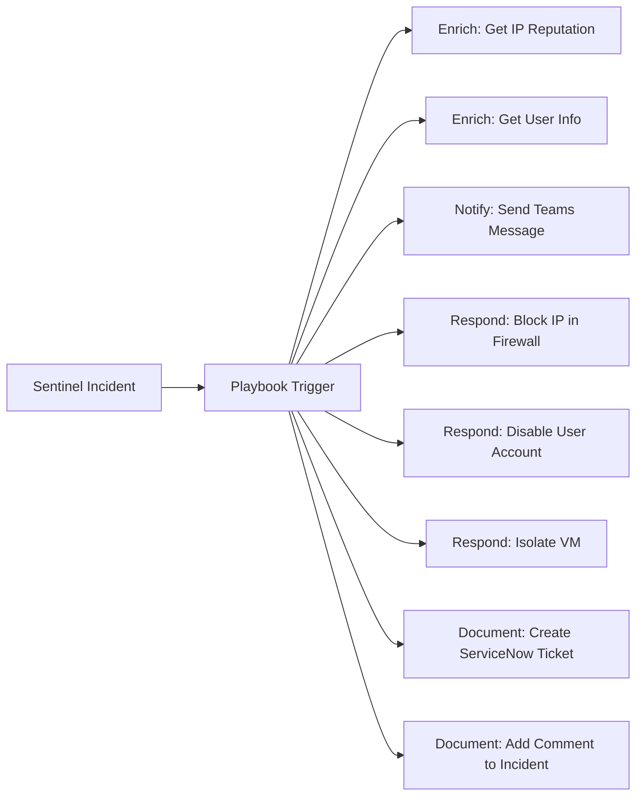

# How to Set Up Microsoft Sentinel Playbooks Using Logic Apps for Automated Incident Response

Author: [nawazdhandala](https://www.github.com/nawazdhandala)

Tags: Azure, Microsoft Sentinel, Playbooks, Logic Apps, SOAR, Automated Response, Incident Response

Description: Learn how to create Microsoft Sentinel playbooks using Azure Logic Apps to automate incident response actions like blocking IPs, disabling accounts, and sending notifications.

---

When a security incident is detected in Microsoft Sentinel, every minute counts. Manually investigating and responding to each alert does not scale, especially when you are dealing with dozens or hundreds of alerts per day. Sentinel playbooks, built on Azure Logic Apps, let you automate response actions so that common, well-understood incidents are handled immediately without waiting for a human analyst.

This guide shows you how to build playbooks for the most common automated response scenarios, from sending notifications to actively blocking threats.

## What Playbooks Can Do

Playbooks are Azure Logic Apps that are triggered by Sentinel alerts or incidents. They can perform any action that Logic Apps connectors support, which means practically anything:



Common playbook actions include:
- Sending notifications to Teams, Slack, or email
- Enriching alerts with threat intelligence lookups
- Blocking malicious IPs in Azure Firewall or NSGs
- Disabling compromised user accounts
- Resetting user passwords
- Isolating compromised VMs
- Creating tickets in ServiceNow, Jira, or other ITSM tools
- Adding investigation comments to incidents

## Prerequisites

You need:
- Microsoft Sentinel workspace
- Logic App Contributor role
- Sentinel Responder or Sentinel Contributor role
- Managed identity permissions for the target services (Entra ID, Firewall, etc.)

## Step 1: Create a Basic Notification Playbook

Let us start with a simple playbook that sends a Teams message when a high-severity incident is created.

### Via the Azure Portal

1. In Sentinel, go to Automation.
2. Click Create, then Playbook with incident trigger.
3. On the Basics tab:
   - Name: "Notify-Teams-HighSeverity"
   - Resource group: Select your Sentinel resource group
   - Enable managed identity: Yes (System assigned)
4. Click Next and then Create and continue to designer.

In the Logic App designer:

5. The trigger "Microsoft Sentinel incident" is already added.
6. Click the + button to add a new step.
7. Search for "Microsoft Teams" and select "Post message in a chat or channel."
8. Configure the Teams action:
   - Team: Select your security operations team
   - Channel: Select the incidents channel
   - Message: Use dynamic content from the trigger

The message body can include dynamic content from the incident:

```
High Severity Incident Created

Title: @{triggerBody()?['object']?['properties']?['title']}
Severity: @{triggerBody()?['object']?['properties']?['severity']}
Description: @{triggerBody()?['object']?['properties']?['description']}
Incident URL: @{triggerBody()?['object']?['properties']?['incidentUrl']}

Entities:
@{join(triggerBody()?['object']?['properties']?['relatedEntities'], ', ')}
```

9. Save the Logic App.

## Step 2: Grant the Playbook Permissions

The playbook's managed identity needs permissions to interact with Sentinel and other services:

```powershell
# Get the playbook's managed identity
$logicApp = Get-AzResource -Name "Notify-Teams-HighSeverity" -ResourceType "Microsoft.Logic/workflows"
$principalId = (Get-AzADServicePrincipal -DisplayName "Notify-Teams-HighSeverity").Id

# Grant the playbook the Sentinel Responder role on the resource group
# This allows the playbook to update incidents (add comments, change status)
New-AzRoleAssignment `
    -ObjectId $principalId `
    -RoleDefinitionName "Microsoft Sentinel Responder" `
    -Scope "/subscriptions/SUB_ID/resourceGroups/sentinel-rg"

Write-Host "Sentinel Responder role assigned to playbook managed identity."
```

## Step 3: Create an Account Disable Playbook

This playbook automatically disables a user account when Sentinel detects a compromised credential:

The Logic App definition in code view:

```json
{
    "definition": {
        "triggers": {
            "Microsoft_Sentinel_incident": {
                "type": "ApiConnectionWebhook",
                "inputs": {
                    "body": {
                        "callback_url": "@{listCallbackUrl()}"
                    },
                    "host": {
                        "connection": {
                            "name": "@parameters('$connections')['azuresentinel']['connectionId']"
                        }
                    },
                    "path": "/incident-creation"
                }
            }
        },
        "actions": {
            "Extract_Account_Entities": {
                "type": "ParseJson",
                "inputs": {
                    "content": "@triggerBody()?['object']?['properties']?['relatedEntities']"
                }
            },
            "For_Each_Account": {
                "type": "Foreach",
                "foreach": "@body('Extract_Account_Entities')",
                "actions": {
                    "Disable_User_Account": {
                        "type": "Http",
                        "inputs": {
                            "method": "PATCH",
                            "uri": "https://graph.microsoft.com/v1.0/users/@{items('For_Each_Account')?['properties']?['aadUserId']}",
                            "body": {
                                "accountEnabled": false
                            },
                            "authentication": {
                                "type": "ManagedServiceIdentity"
                            }
                        }
                    },
                    "Add_Comment_To_Incident": {
                        "type": "ApiConnection",
                        "inputs": {
                            "body": {
                                "incidentArmId": "@triggerBody()?['object']?['id']",
                                "message": "Automated action: Disabled user account @{items('For_Each_Account')?['properties']?['friendlyName']} due to compromised credential detection."
                            }
                        }
                    }
                }
            }
        }
    }
}
```

To build this in the designer:

1. Create a new playbook with an incident trigger.
2. Add a "Parse JSON" action to extract entities from the incident.
3. Add a "For each" loop over the account entities.
4. Inside the loop, add an HTTP action that calls Microsoft Graph to disable the user.
5. Add an "Add comment to incident" action that documents what was done.

The managed identity needs the User.ReadWrite.All permission on Microsoft Graph:

```powershell
# Grant the playbook permission to disable user accounts
$graphApp = Get-MgServicePrincipal -Filter "appId eq '00000003-0000-0000-c000-000000000000'"
$playbookSP = Get-MgServicePrincipal -Filter "displayName eq 'Disable-Compromised-Account'"

# Find the User.ReadWrite.All application permission
$permission = $graphApp.AppRoles | Where-Object { $_.Value -eq "User.ReadWrite.All" }

# Grant the permission
New-MgServicePrincipalAppRoleAssignment `
    -ServicePrincipalId $playbookSP.Id `
    -PrincipalId $playbookSP.Id `
    -ResourceId $graphApp.Id `
    -AppRoleId $permission.Id

Write-Host "User.ReadWrite.All permission granted to playbook."
```

## Step 4: Create an IP Blocking Playbook

This playbook blocks malicious IP addresses by adding them to an Azure Firewall deny list or an NSG rule:

```powershell
# PowerShell script that the Logic App can call via an Azure Automation runbook
# This adds a malicious IP to an NSG deny rule

param(
    [Parameter(Mandatory=$true)]
    [string]$MaliciousIP,

    [Parameter(Mandatory=$true)]
    [string]$IncidentId
)

# Connect using the managed identity
Connect-AzAccount -Identity

$nsgName = "perimeter-nsg"
$rgName = "networking-rg"

# Get the NSG
$nsg = Get-AzNetworkSecurityGroup -Name $nsgName -ResourceGroupName $rgName

# Check if the block rule already exists
$blockRule = $nsg.SecurityRules | Where-Object { $_.Name -eq "Block-Sentinel-Automated" }

if ($blockRule) {
    # Add the IP to the existing rule's source address list
    $currentIPs = $blockRule.SourceAddressPrefix
    if ($MaliciousIP -notin $currentIPs) {
        $blockRule.SourceAddressPrefix += $MaliciousIP
        Set-AzNetworkSecurityGroup -NetworkSecurityGroup $nsg
        Write-Output "Added $MaliciousIP to existing block rule."
    }
    else {
        Write-Output "$MaliciousIP is already blocked."
    }
}
else {
    # Create a new block rule
    $nsg | Add-AzNetworkSecurityRuleConfig `
        -Name "Block-Sentinel-Automated" `
        -Description "Automated block rule from Sentinel incident $IncidentId" `
        -Access Deny `
        -Protocol "*" `
        -Direction Inbound `
        -Priority 100 `
        -SourceAddressPrefix $MaliciousIP `
        -SourcePortRange "*" `
        -DestinationAddressPrefix "*" `
        -DestinationPortRange "*"

    Set-AzNetworkSecurityGroup -NetworkSecurityGroup $nsg
    Write-Output "Created new block rule for $MaliciousIP."
}
```

In the Logic App designer, you would:

1. Use the incident trigger.
2. Extract IP entities from the incident.
3. For each IP, call the Azure Automation runbook with the IP address.
4. Add a comment to the incident documenting the action.

## Step 5: Create an Enrichment Playbook

This playbook enriches incidents with threat intelligence before an analyst reviews them:

1. Create a playbook with an incident trigger.
2. Extract IP entities from the incident.
3. For each IP, call a threat intelligence API (like VirusTotal, AbuseIPDB, or Microsoft's own TI):

```json
{
    "Check_IP_Reputation": {
        "type": "Http",
        "inputs": {
            "method": "GET",
            "uri": "https://api.abuseipdb.com/api/v2/check",
            "headers": {
                "Key": "@parameters('AbuseIPDB_API_Key')",
                "Accept": "application/json"
            },
            "queries": {
                "ipAddress": "@{items('For_Each_IP')?['properties']?['address']}",
                "maxAgeInDays": "90"
            }
        }
    }
}
```

4. Parse the response and add the reputation data as a comment on the incident.
5. If the IP has a high abuse confidence score, change the incident severity to High.

## Step 6: Connect Playbooks to Analytics Rules

You can configure playbooks to run automatically when specific analytics rules fire:

1. In Sentinel, go to Automation.
2. Click Create, then Automation rule.
3. Configure the rule:
   - Name: "Auto-respond to brute force incidents"
   - Trigger: When incident is created
   - Conditions: Analytic rule name contains "Brute Force"
   - Actions:
     - Run playbook: "Block-Malicious-IP"
     - Run playbook: "Notify-Teams-HighSeverity"
4. Set the order (playbooks run in the specified order).
5. Click Apply.

```powershell
# You can also create automation rules via the API
# This connects a playbook to specific incident types
$automationRule = @{
    DisplayName = "Auto-respond to brute force"
    Order = 1
    TriggeringLogic = @{
        IsEnabled = $true
        TriggersOn = "Incidents"
        TriggersWhen = "Created"
        Conditions = @(
            @{
                ConditionType = "Property"
                ConditionProperties = @{
                    PropertyName = "IncidentProviderName"
                    Operator = "Equals"
                    PropertyValues = @("Azure Sentinel")
                }
            }
        )
    }
    Actions = @(
        @{
            ActionType = "RunPlaybook"
            Order = 1
            ActionConfiguration = @{
                LogicAppResourceId = "/subscriptions/SUB_ID/resourceGroups/sentinel-rg/providers/Microsoft.Logic/workflows/Block-Malicious-IP"
                TenantId = "YOUR_TENANT_ID"
            }
        }
    )
}

Write-Host "Create automation rules through the Sentinel portal for the best experience."
```

## Step 7: Test Your Playbooks

Always test playbooks before connecting them to automation rules:

1. In Sentinel, find a recent incident.
2. Click Actions, then Run playbook.
3. Select the playbook to test.
4. Monitor the Logic App run history to see if it executed successfully.
5. Check the incident comments for any automated additions.
6. Verify that the action was taken (IP blocked, account disabled, notification sent).

For testing without affecting production:
- Create a test incident manually in Sentinel.
- Use a test user account for the account disable playbook.
- Use a test NSG for the IP blocking playbook.

## Best Practices

Keep these principles in mind when building playbooks:

Start with notifications and enrichment before building response playbooks. You want to trust that the playbook logic is correct before it starts disabling accounts or blocking IPs.

Always add a comment to the incident documenting what the playbook did. This creates an audit trail and helps analysts understand the current state of an incident.

Use managed identities for authentication whenever possible. Avoid storing credentials in playbook parameters.

Add error handling to your playbooks. If an API call fails, the playbook should log the error and continue rather than failing silently.

Implement a feedback loop. When analysts identify false positives, update the analytics rules to reduce false triggers rather than disabling the playbook.

Test with low-severity incidents first. Do not connect a destructive playbook (like account disable) to a new analytics rule until you are confident in the rule's accuracy.

## Conclusion

Sentinel playbooks transform your security operations from reactive to proactive. By automating common response actions like notifications, IP blocking, and account disabling, you reduce response time from minutes or hours to seconds. Start with simple notification playbooks, then add enrichment, and finally build active response playbooks as you gain confidence in your analytics rules. The combination of accurate detection rules and well-tested playbooks is what turns a SIEM from a log viewer into a true security operations platform.
