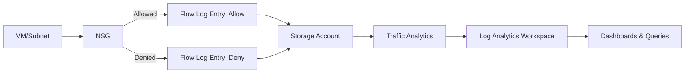

# How to Set Up Network Security Group Flow Logs and Analyze Them with Traffic Analytics

Author: [nawazdhandala](https://www.github.com/nawazdhandala)

Tags: Azure, NSG Flow Logs, Traffic Analytics, Network Security, Network Monitoring, Log Analytics, Azure Network Watcher

Description: A practical guide to enabling NSG flow logs in Azure and using Traffic Analytics to visualize and analyze network traffic patterns and security threats.

---

When something goes wrong with network connectivity in Azure, or when you need to investigate suspicious traffic, NSG (Network Security Group) flow logs are your best friend. They capture information about every IP flow that passes through a network security group - source and destination IPs, ports, protocol, whether the traffic was allowed or denied, and byte/packet counts. Traffic Analytics takes this raw data and turns it into actionable visualizations showing traffic patterns, hotspots, and potential security threats.

In this guide, I will walk through setting up both NSG flow logs and Traffic Analytics from scratch.

## What NSG Flow Logs Capture

Every time traffic hits a network security group rule, the flow is logged. Each log entry includes:

- Timestamp
- Source IP and port
- Destination IP and port
- Protocol (TCP, UDP, or other)
- Direction (inbound or outbound)
- Whether the traffic was allowed or denied
- Byte count and packet count (in version 2 flow logs)
- Flow state (begin, continuing, end)



## Prerequisites

You need:

- Azure subscription
- Network Watcher enabled in the region where your NSGs exist (it is enabled by default in most cases)
- A storage account in the same region as the NSG for storing flow logs
- A Log Analytics workspace for Traffic Analytics
- Network Contributor role or higher

## Step 1: Verify Network Watcher Is Enabled

Network Watcher is a regional service that must be enabled in each region where you have NSGs:

```powershell
# Check if Network Watcher is enabled in your region
$networkWatchers = Get-AzNetworkWatcher

foreach ($nw in $networkWatchers) {
    Write-Host "Region: $($nw.Location) - Name: $($nw.Name) - State: $($nw.ProvisioningState)"
}

# If not enabled in your region, create it
$rg = Get-AzResourceGroup -Name "NetworkWatcherRG" -ErrorAction SilentlyContinue
if (-not $rg) {
    New-AzResourceGroup -Name "NetworkWatcherRG" -Location "eastus"
}

New-AzNetworkWatcher `
    -Name "NetworkWatcher_eastus" `
    -ResourceGroupName "NetworkWatcherRG" `
    -Location "eastus"

Write-Host "Network Watcher enabled in eastus."
```

## Step 2: Create a Storage Account for Flow Logs

Flow logs are stored in a storage account. Create one dedicated to this purpose:

```powershell
# Create a storage account for NSG flow logs
# Must be in the same region as the NSGs
New-AzStorageAccount `
    -ResourceGroupName "networking-rg" `
    -Name "nsgflowlogsstorage" `
    -Location "eastus" `
    -SkuName "Standard_LRS" `
    -Kind "StorageV2" `
    -MinimumTlsVersion "TLS1_2"

Write-Host "Storage account created for flow logs."
```

## Step 3: Enable NSG Flow Logs

### Via the Azure Portal

1. Navigate to Network Watcher in the Azure portal.
2. Click on NSG flow logs in the left menu (under Logs).
3. Click Create or select an existing NSG.
4. Configure the flow log:
   - **Target NSG**: Select the NSG you want to monitor
   - **Storage account**: Select the storage account from Step 2
   - **Retention (days)**: Set between 1 and 365 days
   - **Flow log version**: Select Version 2 (includes byte and packet counts)
   - **Traffic Analytics**: Enable (we will configure this next)
   - **Traffic Analytics processing interval**: 10 minutes or 60 minutes
   - **Log Analytics workspace**: Select your workspace
5. Click Review + create, then Create.

### Via PowerShell

```powershell
# Get the NSG you want to enable flow logs for
$nsg = Get-AzNetworkSecurityGroup `
    -ResourceGroupName "production-rg" `
    -Name "web-tier-nsg"

# Get the storage account
$storageAccount = Get-AzStorageAccount `
    -ResourceGroupName "networking-rg" `
    -Name "nsgflowlogsstorage"

# Get the Log Analytics workspace for Traffic Analytics
$workspace = Get-AzOperationalInsightsWorkspace `
    -ResourceGroupName "monitoring-rg" `
    -Name "central-log-analytics"

# Enable NSG flow logs with version 2 and Traffic Analytics
$flowLogConfig = @{
    Name = "web-tier-nsg-flowlog"
    NetworkWatcherName = "NetworkWatcher_eastus"
    ResourceGroupName = "NetworkWatcherRG"
    TargetResourceId = $nsg.Id
    StorageId = $storageAccount.Id
    Enabled = $true
    # Version 2 includes byte and packet counters
    FormatVersion = 2
    # Retain logs for 30 days in storage
    RetentionInDays = 30
    RetentionEnabled = $true
    # Enable Traffic Analytics
    EnableTrafficAnalytics = $true
    TrafficAnalyticsWorkspaceId = $workspace.ResourceId
    TrafficAnalyticsInterval = 10  # Process every 10 minutes
}

Set-AzNetworkWatcherFlowLog @flowLogConfig

Write-Host "NSG flow logs enabled with Traffic Analytics."
```

## Step 4: Enable Flow Logs for All NSGs

In a production environment, you want flow logs on every NSG. Here is how to enable them in bulk:

```powershell
# Enable flow logs for all NSGs in a subscription
$nsgs = Get-AzNetworkSecurityGroup
$storageAccount = Get-AzStorageAccount -ResourceGroupName "networking-rg" -Name "nsgflowlogsstorage"
$workspace = Get-AzOperationalInsightsWorkspace -ResourceGroupName "monitoring-rg" -Name "central-log-analytics"

foreach ($nsg in $nsgs) {
    $region = $nsg.Location
    $nwName = "NetworkWatcher_$region"

    try {
        $flowLogConfig = @{
            Name = "$($nsg.Name)-flowlog"
            NetworkWatcherName = $nwName
            ResourceGroupName = "NetworkWatcherRG"
            TargetResourceId = $nsg.Id
            StorageId = $storageAccount.Id
            Enabled = $true
            FormatVersion = 2
            RetentionInDays = 30
            RetentionEnabled = $true
            EnableTrafficAnalytics = $true
            TrafficAnalyticsWorkspaceId = $workspace.ResourceId
            TrafficAnalyticsInterval = 10
        }

        Set-AzNetworkWatcherFlowLog @flowLogConfig
        Write-Host "Enabled flow logs for: $($nsg.Name) in $region"
    }
    catch {
        Write-Warning "Failed to enable flow logs for $($nsg.Name): $($_.Exception.Message)"
    }
}
```

## Step 5: Explore Traffic Analytics

After 10-30 minutes (depending on your processing interval), Traffic Analytics data starts appearing in the Azure portal:

1. Navigate to Network Watcher.
2. Click on Traffic Analytics.
3. You will see the main dashboard with:
   - A geo-map showing traffic flows between regions
   - Top talking hosts (most active IPs)
   - Traffic distribution by protocol
   - Blocked traffic visualization
   - Top conversations

The dashboard is interactive - click on any element to drill down into details.

## Step 6: Query Flow Logs in Log Analytics

Traffic Analytics writes processed data to the Log Analytics workspace in the `AzureNetworkAnalytics_CL` table. Here are some useful queries:

### Find Top Denied Traffic

```kusto
// Find the most frequently denied traffic flows
// This reveals what is being blocked by your NSG rules
AzureNetworkAnalytics_CL
| where TimeGenerated > ago(24h)
| where SubType_s == "FlowLog"
| where FlowStatus_s == "D"  // D = Denied
| summarize
    DeniedFlows = count(),
    BytesSent = sum(tolong(BytesSentDestToSrc_d)),
    BytesReceived = sum(tolong(BytesSentSrcToDest_d))
    by SrcIP_s, DestIP_s, DestPort_d, L7Protocol_s
| sort by DeniedFlows desc
| take 20
```

### Detect Unusual Outbound Connections

```kusto
// Find VMs making connections to an unusual number of external IPs
// This could indicate compromised VMs doing reconnaissance or C2 communication
AzureNetworkAnalytics_CL
| where TimeGenerated > ago(1h)
| where SubType_s == "FlowLog"
| where FlowDirection_s == "O"  // Outbound traffic
| where FlowStatus_s == "A"    // Allowed traffic
| where ipv4_is_private(DestIP_s) == false  // External destinations only
| summarize
    UniqueDestinations = dcount(DestIP_s),
    TotalFlows = count(),
    DestinationSample = make_set(DestIP_s, 10)
    by SrcIP_s, VM_s
| where UniqueDestinations > 100  // Threshold for suspicious activity
| sort by UniqueDestinations desc
```

### Analyze Traffic by Application

```kusto
// Break down traffic by detected application protocol
// Useful for understanding what applications are running on your network
AzureNetworkAnalytics_CL
| where TimeGenerated > ago(24h)
| where SubType_s == "FlowLog"
| where FlowStatus_s == "A"
| summarize
    Flows = count(),
    TotalBytes = sum(tolong(BytesSentSrcToDest_d) + tolong(BytesSentDestToSrc_d))
    by L7Protocol_s
| extend TotalMB = round(TotalBytes / 1048576.0, 2)
| sort by TotalBytes desc
```

### Find Flows to Known Malicious IPs

```kusto
// Cross-reference flow data with threat intelligence
// Identifies connections to known malicious infrastructure
AzureNetworkAnalytics_CL
| where TimeGenerated > ago(24h)
| where SubType_s == "FlowLog"
| where FlowStatus_s == "A"
| join kind=inner (
    ThreatIntelligenceIndicator
    | where TimeGenerated > ago(30d)
    | where isnotempty(NetworkIP)
    | distinct NetworkIP
) on $left.DestIP_s == $right.NetworkIP
| project
    TimeGenerated,
    SourceVM = VM_s,
    SourceIP = SrcIP_s,
    MaliciousDestIP = DestIP_s,
    DestPort = DestPort_d,
    Protocol = L7Protocol_s
```

## Step 7: Create Alerts Based on Flow Data

Set up alerts for suspicious network patterns:

```powershell
# Create an alert rule for excessive denied traffic from a single source
# This could indicate a scanning or brute force attempt
$alertCondition = New-AzScheduledQueryRuleConditionObject `
    -Query "AzureNetworkAnalytics_CL | where SubType_s == 'FlowLog' | where FlowStatus_s == 'D' | summarize DeniedFlows = count() by SrcIP_s, bin(TimeGenerated, 5m) | where DeniedFlows > 1000" `
    -TimeAggregation Count `
    -Operator GreaterThan `
    -Threshold 0 `
    -MetricMeasureColumn "DeniedFlows"

Write-Host "Configure this query as a scheduled query alert rule in Azure Monitor."
Write-Host "Set the frequency to every 5 minutes with a lookback of 5 minutes."
```

## Cost Management Tips

NSG flow logs generate data that is stored in both a storage account and a Log Analytics workspace. Here are ways to manage costs:

- Use Version 2 flow logs only if you need byte and packet counts. Version 1 is cheaper but provides less detail.
- Set a reasonable retention period in storage (30 days is often sufficient for operational monitoring).
- Set a 10-minute processing interval for Traffic Analytics if you need near-real-time analysis, or 60 minutes if you can tolerate some delay and want to reduce costs.
- Use data collection rules to filter out low-value flow data before it reaches Log Analytics.
- Focus flow logs on critical NSGs (like those protecting production subnets) and skip NSGs on development or test environments.

## Conclusion

NSG flow logs combined with Traffic Analytics provide deep visibility into network traffic patterns across your Azure environment. The setup involves enabling Network Watcher, configuring flow logs on your NSGs, and connecting Traffic Analytics to a Log Analytics workspace. Once data is flowing, use the built-in Traffic Analytics dashboard for quick insights and KQL queries for detailed investigation. The queries in this guide cover the most common analysis scenarios - finding denied traffic, detecting unusual outbound connections, identifying application traffic, and correlating with threat intelligence. This visibility is essential for both network troubleshooting and security monitoring.
