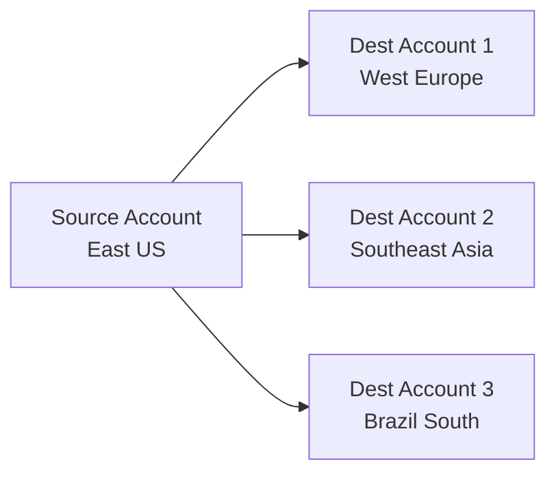

# How to Set Up Object Replication Between Azure Storage Accounts

Author: [nawazdhandala](https://www.github.com/nawazdhandala)

Tags: Azure, Blob Storage, Object Replication, Data Replication, Azure Storage, Disaster Recovery, Geo-Redundancy

Description: A hands-on guide to configuring object replication between Azure Storage accounts for disaster recovery, latency reduction, and data distribution scenarios.

---

Object replication in Azure Blob Storage asynchronously copies block blobs from a source storage account to a destination storage account. This is different from geo-redundant storage (GRS), which replicates your entire account at the infrastructure level. Object replication gives you granular control over what gets replicated, where it goes, and under what conditions.

I have used this feature in scenarios where teams needed data available in multiple regions for local reads, or where compliance required copies of data in specific geographies. Let me walk through how to set it up and what to watch out for.

## When to Use Object Replication

Object replication makes sense in several scenarios:

- **Reducing read latency.** Replicate data to a region closer to your users so they read from a local copy instead of crossing the globe.
- **Compute efficiency.** If you process data in multiple regions, replicate the data to where the compute runs instead of moving it on demand.
- **Data distribution.** Share data with partners or other teams through a separate storage account while keeping your primary account unaffected.
- **Disaster recovery.** Maintain a copy of critical data in a secondary region that you control.

Object replication does not replace backup. Deletions and overwrites also replicate to the destination. If someone deletes a blob in the source, it eventually gets deleted in the destination too. Use versioning and soft delete on both accounts for proper data protection.

## Prerequisites

Both the source and destination storage accounts must meet these requirements:

- General-purpose v2 (GPv2) or BlobStorage account types
- Blob versioning must be enabled on both accounts
- Change feed must be enabled on the source account
- The accounts can be in the same or different regions, and even in different subscriptions

Let me set up the prerequisites first:

```bash
# Enable versioning on both storage accounts
az storage account blob-service-properties update \
  --account-name sourcestorageaccount \
  --resource-group sourceresourcegroup \
  --enable-versioning true

az storage account blob-service-properties update \
  --account-name deststorageaccount \
  --resource-group destresourcegroup \
  --enable-versioning true

# Enable change feed on the source account
az storage account blob-service-properties update \
  --account-name sourcestorageaccount \
  --resource-group sourceresourcegroup \
  --enable-change-feed true
```

## Setting Up a Replication Policy

A replication policy defines which blobs get replicated from source to destination. It contains one or more rules, each specifying a source container and destination container, along with optional filters.

### Using Azure CLI

```bash
# Create a replication policy with a rule that replicates from one container to another
az storage account or-policy create \
  --account-name deststorageaccount \
  --resource-group destresourcegroup \
  --source-account sourcestorageaccount \
  --destination-account deststorageaccount \
  --source-container sourcecontainer \
  --destination-container destcontainer \
  --min-creation-time "2026-01-01T00:00:00Z"
```

The `--min-creation-time` parameter tells Azure to only replicate blobs created after the specified time. Without it, all existing blobs get replicated, which could take a long time and incur significant costs for large containers.

### Using the Azure Portal

1. Navigate to the destination storage account.
2. Under "Data management," click "Object replication."
3. Click "Set up replication rules."
4. Select the source storage account.
5. Choose the source and destination containers.
6. Configure filters if needed.
7. Click "Save and apply."

Azure creates the policy on the destination account and automatically creates a corresponding policy on the source account.

### Using Bicep

```bicep
// Define an object replication policy on the destination storage account
resource replicationPolicy 'Microsoft.Storage/storageAccounts/objectReplicationPolicies@2023-01-01' = {
  name: '${destStorageAccount.name}/default'
  properties: {
    sourceAccount: sourcestorageaccount.id
    destinationAccount: deststorageaccount.id
    rules: [
      {
        sourceContainer: 'sourcecontainer'
        destinationContainer: 'destcontainer'
        filters: {
          prefixMatch: [
            'important-data/'
          ]
          minCreationTime: '2026-01-01T00:00:00Z'
        }
      }
    ]
  }
}
```

## Filtering What Gets Replicated

You do not have to replicate everything in a container. Replication rules support filters:

- **Prefix match** - Only replicate blobs whose names start with specific prefixes. For example, `logs/production/` would only replicate blobs under that path.
- **Minimum creation time** - Only replicate blobs created after a specific date.

You can combine both filters:

```bash
# Create a rule that only replicates blobs with a specific prefix
# created after a specific date
az storage account or-policy rule add \
  --account-name deststorageaccount \
  --resource-group destresourcegroup \
  --policy-id $POLICY_ID \
  --source-container sourcecontainer \
  --destination-container destcontainer \
  --prefix-match "critical-data/" "audit-logs/" \
  --min-creation-time "2026-02-01T00:00:00Z"
```

## Monitoring Replication Status

You can check the replication status of individual blobs to see if they have been successfully replicated:

```python
from azure.storage.blob import BlobServiceClient

# Connect to the source storage account
blob_service_client = BlobServiceClient.from_connection_string("source-connection-string")
container_client = blob_service_client.get_container_client("sourcecontainer")

# Check replication status for blobs in the container
blob_list = container_client.list_blobs(include=["copy"])

for blob in blob_list:
    # The object replication source properties show the replication status
    if blob.object_replication_source_properties:
        for policy in blob.object_replication_source_properties:
            for rule in policy.rules:
                print(f"Blob: {blob.name}")
                print(f"  Policy: {policy.policy_id}")
                print(f"  Rule: {rule.rule_id}")
                print(f"  Status: {rule.status}")
```

Replication status values include:

- **Complete** - The blob has been successfully replicated.
- **Failed** - Replication failed. Check the reason.

## Replication Lag

Object replication is asynchronous. There is no SLA on how quickly blobs are replicated. In practice, most blobs replicate within minutes, but during high-throughput periods or for large blobs, it can take longer.

The replication lag depends on:

- The size of the blobs being replicated
- The rate of new blobs being created
- Network conditions between the source and destination regions
- Whether the destination region is experiencing throttling

Do not build applications that depend on real-time replication. Treat it as eventually consistent and design your systems accordingly.

## Multiple Rules and Policies

A single replication policy can contain up to 1000 rules. This lets you set up fine-grained replication where different containers or prefixes get replicated to different destinations.

You can also create multiple policies to replicate from one source to multiple destinations:



Each destination gets its own policy with its own set of rules.

## Cross-Subscription and Cross-Tenant Replication

Object replication works across subscriptions within the same Azure AD tenant. Cross-tenant replication is also possible but requires additional configuration and may be restricted by organizational policies.

To check if cross-tenant replication is allowed:

```bash
# Check if cross-tenant replication is allowed on the storage account
az storage account show \
  --name mystorageaccount \
  --resource-group myresourcegroup \
  --query "allowCrossTenantReplication"
```

Some organizations disable cross-tenant replication as a security measure to prevent data from being replicated to accounts outside their control.

## Cost Considerations

Object replication costs come from several sources:

- **Bandwidth charges** for data transfer between regions. Same-region replication has no bandwidth cost.
- **Transaction costs** for the read operations on the source and write operations on the destination.
- **Storage costs** for the replicated data in the destination account.
- **Change feed** costs for tracking changes on the source account.

For large-scale replication across regions, bandwidth is usually the biggest cost factor. Monitor your replication costs through Azure Cost Management and set up budget alerts.

## Deleting a Replication Policy

If you no longer need replication, remove the policy from the destination account:

```bash
# List replication policies on the destination account
az storage account or-policy list \
  --account-name deststorageaccount \
  --resource-group destresourcegroup

# Delete a replication policy
az storage account or-policy delete \
  --account-name deststorageaccount \
  --resource-group destresourcegroup \
  --policy-id $POLICY_ID
```

Deleting the policy stops new blobs from replicating but does not delete already-replicated blobs from the destination. Those blobs remain and are billed normally.

## Best Practices

**Enable versioning and soft delete on both accounts.** Since replication also replicates deletions, you want protection at the destination too.

**Use prefix filters wisely.** Replicating entire containers when you only need specific data wastes bandwidth and storage.

**Monitor replication status.** Set up alerts for replication failures so you catch issues before they become problems.

**Test failover scenarios.** If you are using replication for disaster recovery, periodically test that your applications can switch to reading from the destination account.

**Consider the direction.** Replication is one-way. If you need bidirectional replication, you need two policies (one in each direction), but be careful about creating infinite loops with bidirectional setups.

## Wrapping Up

Object replication is a flexible tool for distributing Azure Blob Storage data across regions and accounts. The setup is straightforward once you have the prerequisites in place, and the filtering options give you control over what gets replicated. Just remember that it is asynchronous, it replicates deletions too, and you should always pair it with versioning and soft delete for proper data protection.
