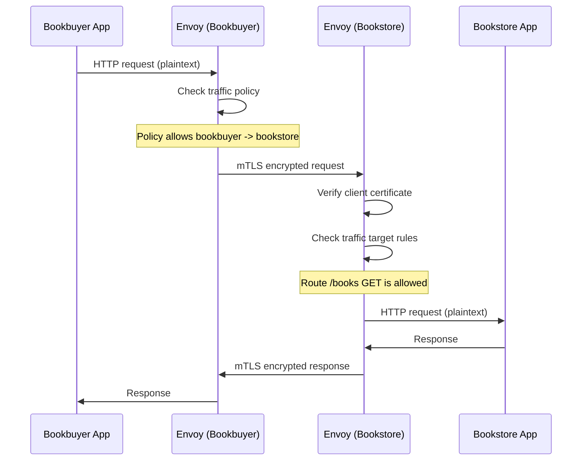

# How to Set Up Open Service Mesh on AKS for Mutual TLS and Traffic Management

Author: [nawazdhandala](https://www.github.com/nawazdhandala)

Tags: AKS, Open Service Mesh, mTLS, Service Mesh, Kubernetes, Traffic Management, Security

Description: Step-by-step guide to installing Open Service Mesh on AKS and configuring mutual TLS encryption and traffic management policies.

---

Service meshes add a layer of infrastructure between your services that handles encryption, observability, and traffic control without changing your application code. Open Service Mesh (OSM) is a lightweight, Envoy-based service mesh that integrates natively with AKS. It provides mutual TLS (mTLS) for all service-to-service communication, traffic access policies, and observability features. In this guide, I will walk through installing OSM on AKS, onboarding your services, and configuring mTLS and traffic management policies.

## What Open Service Mesh Provides

OSM injects an Envoy sidecar proxy into each pod. All traffic between services flows through these sidecars, which handle:

- **Mutual TLS** - Every connection between services is encrypted and both sides verify each other's identity. No more plaintext traffic within the cluster.
- **Traffic access control** - Define which services can communicate with each other. By default, all traffic is denied unless explicitly allowed.
- **Traffic splitting** - Route a percentage of traffic to different service versions for canary deployments.
- **Observability** - Automatic metrics, traces, and access logs for all service-to-service calls.
- **Retry policies** - Automatic retries for failed requests with configurable backoff.

## Prerequisites

You need an AKS cluster running Kubernetes 1.24 or later and the Azure CLI with the aks-preview extension. OSM is available as an AKS add-on, which means Microsoft manages the control plane for you.

## Step 1: Enable the OSM Add-on

Enable OSM as an AKS add-on. This is simpler and more maintainable than installing OSM manually.

```bash
# Enable the OSM add-on on an existing cluster
az aks enable-addons \
  --addons open-service-mesh \
  --resource-group myResourceGroup \
  --name myAKSCluster

# Verify OSM is running
kubectl get pods -n kube-system -l app=osm-controller
kubectl get pods -n kube-system -l app=osm-injector
```

You should see the osm-controller and osm-injector pods running in kube-system.

Install the OSM CLI for easier management.

```bash
# Install the OSM CLI
OSM_VERSION=$(kubectl get deployment -n kube-system osm-controller -o jsonpath='{.spec.template.spec.containers[0].image}' | cut -d: -f2)
curl -sL "https://github.com/openservicemesh/osm/releases/download/${OSM_VERSION}/osm-${OSM_VERSION}-linux-amd64.tar.gz" | tar xz
sudo mv ./linux-amd64/osm /usr/local/bin/
```

## Step 2: Onboard Namespaces to the Mesh

OSM only manages services in namespaces that are explicitly enrolled. This gives you control over which services are part of the mesh.

```bash
# Create namespaces for your services
kubectl create namespace bookstore
kubectl create namespace bookbuyer

# Add namespaces to the mesh
osm namespace add bookstore
osm namespace add bookbuyer

# Verify the namespaces are enrolled
osm namespace list
```

When you add a namespace, OSM adds the label `openservicemesh.io/monitored-by=osm` to it. Any new pods created in enrolled namespaces will automatically get the Envoy sidecar injected.

## Step 3: Deploy Sample Services

Deploy two services that will communicate through the mesh.

```yaml
# bookstore-deployment.yaml
# Bookstore service - serves book data
apiVersion: apps/v1
kind: Deployment
metadata:
  name: bookstore
  namespace: bookstore
spec:
  replicas: 2
  selector:
    matchLabels:
      app: bookstore
  template:
    metadata:
      labels:
        app: bookstore
    spec:
      containers:
        - name: bookstore
          image: openservicemesh/bookstore:latest
          ports:
            - containerPort: 14001
---
apiVersion: v1
kind: Service
metadata:
  name: bookstore
  namespace: bookstore
spec:
  selector:
    app: bookstore
  ports:
    - port: 14001
      targetPort: 14001
```

```yaml
# bookbuyer-deployment.yaml
# Bookbuyer service - calls the bookstore API
apiVersion: apps/v1
kind: Deployment
metadata:
  name: bookbuyer
  namespace: bookbuyer
spec:
  replicas: 1
  selector:
    matchLabels:
      app: bookbuyer
  template:
    metadata:
      labels:
        app: bookbuyer
    spec:
      containers:
        - name: bookbuyer
          image: openservicemesh/bookbuyer:latest
          ports:
            - containerPort: 14001
---
apiVersion: v1
kind: Service
metadata:
  name: bookbuyer
  namespace: bookbuyer
spec:
  selector:
    app: bookbuyer
  ports:
    - port: 14001
      targetPort: 14001
```

Apply both.

```bash
kubectl apply -f bookstore-deployment.yaml
kubectl apply -f bookbuyer-deployment.yaml

# Verify pods have 2 containers (app + envoy sidecar)
kubectl get pods -n bookstore
kubectl get pods -n bookbuyer
```

Each pod should show 2/2 in the READY column, confirming the Envoy sidecar was injected.

## Step 4: Verify Mutual TLS

OSM enables mTLS by default for all traffic between meshed services. Verify it is working.

```bash
# Check the mesh configuration
kubectl get meshconfig osm-mesh-config -n kube-system -o jsonpath='{.spec.certificate}'

# Check if mTLS is enforced
kubectl get meshconfig osm-mesh-config -n kube-system -o jsonpath='{.spec.traffic.enablePermissiveTrafficPolicyMode}'
```

With mTLS enabled, all traffic between the bookbuyer and bookstore flows through encrypted tunnels between their Envoy sidecars. Certificates are automatically rotated by OSM.

## Step 5: Configure Traffic Access Policies

By default, OSM operates in permissive mode where all services can communicate. For production, switch to restrictive mode and define explicit access policies.

```bash
# Disable permissive mode (enable restrictive mode)
kubectl patch meshconfig osm-mesh-config -n kube-system \
  --type merge \
  --patch '{"spec":{"traffic":{"enablePermissiveTrafficPolicyMode":false}}}'
```

Now all traffic is denied by default. Create a traffic access policy to allow the bookbuyer to call the bookstore.

```yaml
# traffic-access.yaml
# Allow bookbuyer to access the bookstore service
apiVersion: access.smi-spec.io/v1alpha3
kind: TrafficTarget
metadata:
  name: bookstore-access
  namespace: bookstore
spec:
  # The service that is being accessed
  destination:
    kind: ServiceAccount
    name: default
    namespace: bookstore
  # The services that are allowed to access it
  sources:
    - kind: ServiceAccount
      name: default
      namespace: bookbuyer
  # The routes that are allowed
  rules:
    - kind: HTTPRouteGroup
      name: bookstore-routes
      matches:
        - buy-books
        - get-books
---
# Define which HTTP routes are allowed
apiVersion: specs.smi-spec.io/v1alpha4
kind: HTTPRouteGroup
metadata:
  name: bookstore-routes
  namespace: bookstore
spec:
  matches:
    - name: buy-books
      pathRegex: /buy
      methods:
        - POST
    - name: get-books
      pathRegex: /books
      methods:
        - GET
```

Apply the policy.

```bash
kubectl apply -f traffic-access.yaml
```

Now only the bookbuyer can call the bookstore's `/buy` (POST) and `/books` (GET) endpoints. All other traffic is blocked.

## Step 6: Configure Traffic Splitting

Route traffic between different versions of a service for canary deployments.

```yaml
# traffic-split.yaml
# Split traffic between two versions of the bookstore
apiVersion: split.smi-spec.io/v1alpha2
kind: TrafficSplit
metadata:
  name: bookstore-split
  namespace: bookstore
spec:
  # The root service that receives traffic
  service: bookstore
  backends:
    # Send 80% of traffic to v1
    - service: bookstore-v1
      weight: 80
    # Send 20% of traffic to v2
    - service: bookstore-v2
      weight: 20
```

This requires separate services for each version.

```yaml
# bookstore-v2.yaml
# Version 2 of the bookstore service
apiVersion: v1
kind: Service
metadata:
  name: bookstore-v2
  namespace: bookstore
spec:
  selector:
    app: bookstore
    version: v2
  ports:
    - port: 14001
```

## The mTLS and Traffic Flow

Here is how traffic flows through the mesh with mTLS and access policies.



## Step 7: Observability

OSM automatically collects metrics from the Envoy sidecars. Configure Prometheus and Grafana to visualize them.

```bash
# Check OSM metrics configuration
kubectl get meshconfig osm-mesh-config -n kube-system \
  -o jsonpath='{.spec.observability}'

# OSM exposes Prometheus metrics at each sidecar
# You can scrape them with your existing Prometheus setup
```

OSM exposes standard Envoy metrics including request count, latency histograms, and error rates, broken down by source service, destination service, and HTTP method.

## Step 8: Certificate Management

OSM manages mTLS certificates automatically. You can configure the certificate provider and rotation settings.

```bash
# Check certificate configuration
kubectl get meshconfig osm-mesh-config -n kube-system \
  -o jsonpath='{.spec.certificate}' | jq

# The default certificate validity is 24 hours
# Certificates are rotated automatically before expiry
```

For production, you can configure OSM to use cert-manager or HashiCorp Vault as the certificate provider instead of the built-in certificate manager.

## Troubleshooting

**Sidecar not injected.** Check that the namespace is enrolled with `osm namespace list`. Verify the pods were created after namespace enrollment (existing pods need to be restarted).

```bash
# Restart pods to trigger sidecar injection
kubectl rollout restart deployment bookstore -n bookstore
```

**Traffic blocked after switching to restrictive mode.** Create TrafficTarget resources for every legitimate service-to-service communication path. Check the OSM controller logs for denied connections.

```bash
# Check OSM controller logs for traffic denials
kubectl logs -n kube-system -l app=osm-controller --tail=50
```

**High latency after enabling the mesh.** The Envoy sidecar adds a small amount of latency (typically 1-3ms per hop). This is expected. If latency is much higher, check the Envoy sidecar resource usage and increase its CPU limits if needed.

**Certificate errors.** If you see certificate-related errors, check that the OSM certificate provider is healthy and that the cluster's clock is synchronized. Certificate validation fails with clock skew.

## Best Practices

**Start with permissive mode.** Deploy OSM and onboard namespaces in permissive mode first. Monitor traffic patterns using the observability features. Then create traffic access policies based on observed patterns before switching to restrictive mode.

**Use service accounts for identity.** Traffic policies in OSM are based on Kubernetes service accounts. Create dedicated service accounts for each service instead of using the default account. This gives you finer-grained access control.

**Monitor sidecar resource usage.** The Envoy sidecar consumes CPU and memory. For high-throughput services, you may need to increase the sidecar resource limits through the OSM mesh configuration.

Open Service Mesh on AKS adds a strong security posture to your microservices with minimal effort. The combination of automatic mTLS, explicit traffic access policies, and built-in observability addresses three of the biggest challenges in microservice architectures: security, access control, and visibility.
