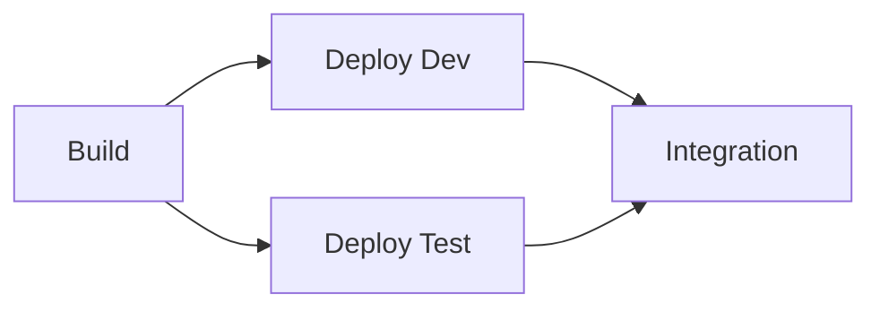
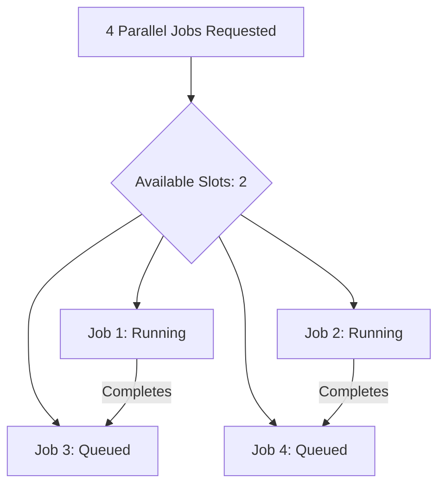

# How to Set Up Parallel Jobs in Azure Pipelines to Speed Up Build and Test Execution

Author: [nawazdhandala](https://www.github.com/nawazdhandala)

Tags: Azure Pipelines, Parallel Jobs, CI/CD, Performance, Build Optimization, Azure DevOps, Testing

Description: Configure parallel jobs in Azure Pipelines to dramatically reduce build and test execution time by running work concurrently.

---

A slow CI/CD pipeline is a silent productivity killer. When developers wait 30 minutes for a build to complete, they context-switch, lose focus, and stack up changes that are harder to debug when something breaks. Parallelism is the most effective way to reduce pipeline duration, and Azure Pipelines supports several levels of it.

In this post, I will cover the different types of parallelism available in Azure Pipelines, show practical configurations for common scenarios, and share the patterns I have used to cut pipeline times by 60-70%.

## Levels of Parallelism

Azure Pipelines supports parallelism at multiple levels:

1. **Parallel stages**: Independent stages that run simultaneously
2. **Parallel jobs within a stage**: Multiple jobs in a stage running on separate agents
3. **Parallel steps within a job**: Running tasks concurrently (limited support)
4. **Parallel test execution**: Splitting tests across multiple agents
5. **Matrix strategies**: Running the same job with different configurations simultaneously

Each level addresses a different bottleneck, and they can be combined.

## Parallel Stages

If your pipeline has stages that do not depend on each other, they run in parallel by default. The key is managing `dependsOn` correctly.

```yaml
# Stages without dependencies run in parallel
stages:
  - stage: Build
    jobs:
      - job: BuildApp
        steps:
          - script: echo "Building application"

  # These two stages depend on Build but not each other
  # They run in parallel after Build completes
  - stage: DeployDev
    dependsOn: Build
    jobs:
      - job: DeployToDevA
        steps:
          - script: echo "Deploying to Dev Region A"

  - stage: DeployTest
    dependsOn: Build
    jobs:
      - job: DeployToTest
        steps:
          - script: echo "Deploying to Test"

  # This stage depends on both parallel stages
  - stage: Integration
    dependsOn:
      - DeployDev
      - DeployTest
    jobs:
      - job: RunIntegration
        steps:
          - script: echo "Running integration tests"
```



The Deploy Dev and Deploy Test stages run simultaneously because neither depends on the other. The Integration stage waits for both to complete.

## Parallel Jobs Within a Stage

This is where you get the biggest wins. Instead of running everything sequentially in one job, split the work across multiple jobs that execute on separate agents.

Here is a common pattern: building and testing the frontend and backend in parallel.

```yaml
# Parallel jobs for frontend and backend
stages:
  - stage: BuildAndTest
    jobs:
      # Backend job runs on its own agent
      - job: Backend
        pool:
          vmImage: 'ubuntu-latest'
        steps:
          - task: DotNetCoreCLI@2
            displayName: 'Build backend'
            inputs:
              command: 'build'
              projects: 'src/backend/**/*.csproj'

          - task: DotNetCoreCLI@2
            displayName: 'Test backend'
            inputs:
              command: 'test'
              projects: 'tests/backend/**/*.csproj'

      # Frontend job runs on a separate agent simultaneously
      - job: Frontend
        pool:
          vmImage: 'ubuntu-latest'
        steps:
          - task: NodeTool@0
            inputs:
              versionSpec: '20.x'

          - script: |
              cd src/frontend
              npm ci
              npm run build
              npm test
            displayName: 'Build and test frontend'

      # Linting runs in parallel with both
      - job: Lint
        pool:
          vmImage: 'ubuntu-latest'
        steps:
          - script: |
              npm ci
              npm run lint
            displayName: 'Run linters'
```

All three jobs start at the same time. If the backend takes 10 minutes, the frontend takes 8 minutes, and linting takes 3 minutes, the total stage time is 10 minutes (the longest job) instead of 21 minutes (all three sequential).

## Matrix Strategy

The matrix strategy runs the same job with different configurations in parallel. This is perfect for testing across multiple platforms, language versions, or configurations.

```yaml
# Matrix strategy for cross-platform testing
jobs:
  - job: Test
    strategy:
      matrix:
        # Each entry creates a parallel job with specific variable values
        linux_node18:
          vmImage: 'ubuntu-latest'
          nodeVersion: '18.x'
        linux_node20:
          vmImage: 'ubuntu-latest'
          nodeVersion: '20.x'
        windows_node20:
          vmImage: 'windows-latest'
          nodeVersion: '20.x'
        macos_node20:
          vmImage: 'macOS-latest'
          nodeVersion: '20.x'
      maxParallel: 4  # Run all 4 configurations simultaneously
    pool:
      vmImage: $(vmImage)
    steps:
      - task: NodeTool@0
        inputs:
          versionSpec: $(nodeVersion)

      - script: |
          node --version
          npm ci
          npm test
        displayName: 'Install and test'
```

This creates four parallel jobs, each running on a different combination of OS and Node.js version. The `maxParallel` parameter controls how many run at once (useful if you have limited parallel job capacity).

## Parallel Test Execution

For large test suites, you can split tests across multiple agents using the `parallel` keyword on a job.

```yaml
# Split tests across 4 parallel agents
jobs:
  - job: TestParallel
    strategy:
      parallel: 4  # Run 4 agents, each getting a slice of the tests
    pool:
      vmImage: 'ubuntu-latest'
    steps:
      - task: DotNetCoreCLI@2
        displayName: 'Run test slice'
        inputs:
          command: 'test'
          projects: '**/*Tests.csproj'
          arguments: '--configuration Release'
        env:
          # Azure Pipelines sets these variables automatically
          SYSTEM_TOTALJOBSINPHASE: $(System.TotalJobsInPhase)
          SYSTEM_JOBPOSITIONINPHASE: $(System.JobPositionInPhase)
```

Azure Pipelines uses its built-in test slicing to distribute tests across the agents. It can use historical test run data to balance the slices so each agent finishes at roughly the same time.

For more control over how tests are distributed, you can do it manually.

```yaml
# Manual test slicing
jobs:
  - job: TestSlice1
    pool:
      vmImage: 'ubuntu-latest'
    steps:
      - script: dotnet test --filter "Category=UnitTests"
        displayName: 'Unit tests'

  - job: TestSlice2
    pool:
      vmImage: 'ubuntu-latest'
    steps:
      - script: dotnet test --filter "Category=IntegrationTests"
        displayName: 'Integration tests'

  - job: TestSlice3
    pool:
      vmImage: 'ubuntu-latest'
    steps:
      - script: dotnet test --filter "Category=E2ETests"
        displayName: 'E2E tests'
```

## Understanding Parallel Job Limits

Azure DevOps has limits on how many parallel jobs you can run simultaneously. These limits depend on your plan and agent type.

**Microsoft-hosted agents:**
- Free tier: 1 parallel job (limited minutes per month)
- Basic plan: 1 parallel job (unlimited minutes)
- Additional parallel jobs: Purchasable in increments

**Self-hosted agents:**
- Free tier: 1 parallel job
- Each additional agent counts as an additional parallel job
- No minute limits

To check your current limits, go to **Organization Settings > Parallel jobs**.

If you have 2 parallel jobs and a pipeline tries to run 4 jobs simultaneously, 2 will start immediately and 2 will queue until a slot opens up.



## Optimizing for Parallelism

### Minimize Dependencies Between Jobs

Jobs that depend on other jobs cannot run in parallel. Design your pipeline so that independent work happens in separate jobs with no `dependsOn` relationships.

```yaml
# Bad: Sequential jobs that could be parallel
jobs:
  - job: A
    steps:
      - script: echo "Build backend"
  - job: B
    dependsOn: A  # Unnecessary dependency
    steps:
      - script: echo "Build frontend"

# Good: Parallel jobs with no unnecessary dependencies
jobs:
  - job: A
    steps:
      - script: echo "Build backend"
  - job: B
    # No dependsOn - runs in parallel with A
    steps:
      - script: echo "Build frontend"
```

### Share Artifacts Between Parallel Jobs

When parallel jobs need the same built artifact, use pipeline artifacts to share them.

```yaml
stages:
  - stage: Build
    jobs:
      - job: BuildApp
        steps:
          - script: npm run build
          - publish: $(System.DefaultWorkingDirectory)/dist
            artifact: app-build

  - stage: Test
    dependsOn: Build
    jobs:
      # Both test jobs download the same artifact
      - job: UnitTests
        steps:
          - download: current
            artifact: app-build
          - script: npm run test:unit

      - job: E2ETests
        steps:
          - download: current
            artifact: app-build
          - script: npm run test:e2e
```

### Use Caching to Speed Up Each Job

Even with parallelism, each job still needs to install dependencies. Caching reduces that time.

```yaml
# Cache npm packages across pipeline runs
steps:
  - task: Cache@2
    displayName: 'Cache npm'
    inputs:
      key: 'npm | "$(Agent.OS)" | package-lock.json'
      restoreKeys: |
        npm | "$(Agent.OS)"
      path: $(npm_config_cache)

  - script: npm ci
    displayName: 'Install dependencies'
```

## Measuring the Impact

To see how parallelism affects your pipeline, compare the total elapsed time before and after. Azure DevOps shows the duration of each job in the pipeline run view.

Before parallelism:
```
Build Backend:      5 min
Build Frontend:     4 min
Test Backend:       8 min
Test Frontend:      6 min
Lint:               2 min
Total:             25 min
```

After parallelism:
```
Build Backend + Build Frontend + Lint:  5 min (parallel, limited by longest)
Test Backend + Test Frontend:           8 min (parallel, limited by longest)
Total:                                 13 min
```

That is a 48% reduction just from running independent work in parallel.

## Fan-Out / Fan-In Pattern

A common pipeline pattern is to fan out (run multiple parallel jobs), then fan in (combine results in a single job).

```yaml
jobs:
  # Fan out: run tests in parallel
  - job: TestWindows
    pool:
      vmImage: 'windows-latest'
    steps:
      - script: dotnet test --logger trx
      - publish: TestResults
        artifact: results-windows

  - job: TestLinux
    pool:
      vmImage: 'ubuntu-latest'
    steps:
      - script: dotnet test --logger trx
      - publish: TestResults
        artifact: results-linux

  # Fan in: aggregate results
  - job: AggregateResults
    dependsOn:
      - TestWindows
      - TestLinux
    steps:
      - download: current
        artifact: results-windows
      - download: current
        artifact: results-linux
      - task: PublishTestResults@2
        inputs:
          testResultsFormat: 'VSTest'
          testResultsFiles: '**/*.trx'
          mergeTestResults: true
```

## Wrapping Up

Parallel jobs are the most effective way to speed up Azure Pipelines. Start by identifying independent work in your pipeline and splitting it into separate jobs. Add matrix strategies for cross-platform testing. Use caching to speed up each individual job. And keep an eye on your parallel job limits to ensure you have enough capacity. The combination of these techniques can cut your pipeline time in half or more, giving your team faster feedback and more time for actual development.
