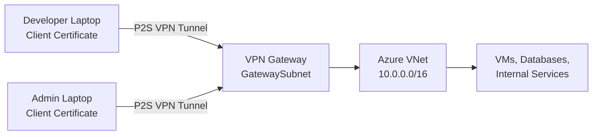

# How to Set Up Point-to-Site VPN with Azure VPN Gateway Using Certificate Authentication

Author: [nawazdhandala](https://www.github.com/nawazdhandala)

Tags: Azure, VPN Gateway, Point-to-Site VPN, Certificate Authentication, Remote Access, Azure Networking

Description: A complete walkthrough for configuring a point-to-site VPN connection to Azure using certificate-based authentication for secure remote access.

---

Point-to-site (P2S) VPN lets individual users connect their laptops or desktops directly to an Azure virtual network from anywhere. Unlike site-to-site VPN which connects entire networks, P2S connects individual devices. This is ideal for remote workers who need to access resources in Azure VNets, developers who need direct access to Azure VMs and services, and administrators who need management access without exposing resources publicly.

Certificate authentication is one of the most secure options for P2S VPN. Each client gets a certificate installed on their device, and the VPN gateway validates the certificate before allowing the connection. No passwords to phish, no credentials to leak.

## Architecture



## Prerequisites

- An Azure subscription
- Azure CLI installed
- OpenSSL installed (for certificate generation)
- A VPN client on your device (built into Windows, available for macOS/Linux)

## Step 1: Create the VNet and VPN Gateway

```bash
# Create a resource group
az group create --name rg-p2s-demo --location eastus

# Create a VNet with a workload subnet
az network vnet create \
  --resource-group rg-p2s-demo \
  --name vnet-demo \
  --location eastus \
  --address-prefixes 10.0.0.0/16 \
  --subnet-name subnet-workloads \
  --subnet-prefixes 10.0.0.0/24

# Create the GatewaySubnet
az network vnet subnet create \
  --resource-group rg-p2s-demo \
  --vnet-name vnet-demo \
  --name GatewaySubnet \
  --address-prefixes 10.0.255.0/27

# Create a public IP for the VPN gateway
az network public-ip create \
  --resource-group rg-p2s-demo \
  --name pip-vpn-gw \
  --sku Standard \
  --allocation-method Static
```

## Step 2: Create the VPN Gateway

This step takes 30-45 minutes. The gateway is a pair of VMs that Azure provisions in the GatewaySubnet.

```bash
# Create the VPN gateway (takes 30-45 minutes)
az network vnet-gateway create \
  --resource-group rg-p2s-demo \
  --name vng-p2s \
  --location eastus \
  --vnet vnet-demo \
  --gateway-type Vpn \
  --vpn-type RouteBased \
  --sku VpnGw2 \
  --public-ip-addresses pip-vpn-gw \
  --no-wait
```

Wait for provisioning to complete:

```bash
# Check provisioning status
az network vnet-gateway show \
  --resource-group rg-p2s-demo \
  --name vng-p2s \
  --query "provisioningState" -o tsv
```

## Step 3: Generate the Root Certificate

The root certificate is the trust anchor. You upload its public key to the VPN gateway. Client certificates signed by this root will be trusted by the gateway.

```bash
# Generate a self-signed root CA certificate
openssl req -x509 -new -nodes \
  -newkey rsa:4096 \
  -keyout rootCA.key \
  -out rootCA.crt \
  -days 3650 \
  -subj "/CN=AzureVPN-RootCA"
```

This creates a root CA certificate valid for 10 years. Keep the `rootCA.key` file secure - anyone with it can sign new client certificates.

## Step 4: Generate a Client Certificate

Each user or device gets its own client certificate signed by the root CA.

```bash
# Generate a client private key
openssl genrsa -out client1.key 2048

# Create a certificate signing request (CSR)
openssl req -new \
  -key client1.key \
  -out client1.csr \
  -subj "/CN=P2SClient1"

# Sign the client certificate with the root CA
openssl x509 -req \
  -in client1.csr \
  -CA rootCA.crt \
  -CAkey rootCA.key \
  -CAcreateserial \
  -out client1.crt \
  -days 365

# Export the client certificate as PFX (for Windows) or P12 (for macOS)
openssl pkcs12 -export \
  -out client1.pfx \
  -inkey client1.key \
  -in client1.crt \
  -certfile rootCA.crt \
  -passout pass:ClientCert2026!
```

## Step 5: Extract the Root Certificate Public Key

The VPN gateway needs the root certificate's public key in Base64 format.

```bash
# Extract the public key in Base64 (remove headers and newlines)
ROOT_CERT_DATA=$(openssl x509 -in rootCA.crt -outform der | base64 | tr -d '\n')

echo $ROOT_CERT_DATA
```

## Step 6: Configure Point-to-Site on the VPN Gateway

Now configure the gateway to accept P2S connections with certificate authentication.

```bash
# Configure P2S VPN on the gateway
az network vnet-gateway update \
  --resource-group rg-p2s-demo \
  --name vng-p2s \
  --address-prefixes "172.16.0.0/24" \
  --client-protocol OpenVPN \
  --root-cert-name "AzureVPN-RootCA" \
  --root-cert-data "$ROOT_CERT_DATA"
```

Key parameters:

- `--address-prefixes "172.16.0.0/24"`: The VPN client address pool. Connected clients get IPs from this range. This must not overlap with your VNet or on-premises address spaces.
- `--client-protocol OpenVPN`: Uses OpenVPN protocol (SSL/TLS based, works through most firewalls). Other options are SSTP (Windows only) and IKEv2.
- `--root-cert-name` and `--root-cert-data`: The root CA certificate that the gateway trusts.

## Step 7: Download the VPN Client Configuration

Azure generates VPN client configuration files that you can distribute to users.

```bash
# Generate VPN client configuration package
az network vnet-gateway vpn-client generate \
  --resource-group rg-p2s-demo \
  --name vng-p2s \
  --output tsv
```

This returns a URL to download a ZIP file containing configuration profiles for different VPN clients (Windows, macOS, Linux, OpenVPN).

## Step 8: Configure the VPN Client

### Windows

1. Install the client certificate (`client1.pfx`) by double-clicking it and following the import wizard
2. Extract the downloaded ZIP file
3. For OpenVPN: import the `OpenVPN/vpnconfig.ovpn` file into the OpenVPN Connect client
4. For native VPN: run the installer from the `WindowsAmd64` or `WindowsX86` folder

### macOS

1. Import the client certificate into the Keychain
2. Install the OpenVPN Connect client
3. Import the `OpenVPN/vpnconfig.ovpn` profile

### Linux

1. Install OpenVPN: `sudo apt install openvpn`
2. Copy the client certificate and key to `/etc/openvpn/`
3. Edit the `OpenVPN/vpnconfig.ovpn` file to point to the correct certificate paths

```bash
# Connect from Linux
sudo openvpn --config vpnconfig.ovpn \
  --cert client1.crt \
  --key client1.key
```

## Step 9: Verify the Connection

After connecting, verify you can reach Azure resources.

```bash
# Check your VPN-assigned IP
ip addr show tun0  # Linux
ipconfig           # Windows

# You should see an IP from 172.16.0.0/24

# Ping a VM in the Azure VNet
ping 10.0.0.4

# SSH to a VM (if Linux)
ssh azureuser@10.0.0.4
```

## Certificate Revocation

If a client certificate is compromised (laptop stolen, employee leaves), you need to revoke it.

```bash
# Get the thumbprint of the certificate to revoke
THUMBPRINT=$(openssl x509 -in client1.crt -noout -fingerprint -sha1 | sed 's/://g' | cut -d= -f2)

# Add the certificate to the revocation list
az network vnet-gateway revoked-cert create \
  --resource-group rg-p2s-demo \
  --gateway-name vng-p2s \
  --name "RevokedClient1" \
  --thumbprint $THUMBPRINT
```

Once revoked, that specific client certificate can no longer establish a VPN connection, even though the root CA that signed it is still trusted.

## Adding Multiple Root Certificates

If different teams use different CAs, you can add multiple root certificates.

```bash
# Add a second root certificate
ROOT_CERT_DATA_2=$(openssl x509 -in rootCA-team2.crt -outform der | base64 | tr -d '\n')

az network vnet-gateway root-cert create \
  --resource-group rg-p2s-demo \
  --gateway-name vng-p2s \
  --name "RootCA-Team2" \
  --public-cert-data $ROOT_CERT_DATA_2
```

## Scaling Considerations

The VPN gateway SKU determines how many concurrent P2S connections are supported:

| SKU | Max P2S Connections |
|---|---|
| VpnGw1 | 250 |
| VpnGw2 | 500 |
| VpnGw3 | 1000 |
| VpnGw4 | 5000 |
| VpnGw5 | 10000 |

Choose the SKU based on your expected concurrent user count.

## Troubleshooting

**Connection fails with certificate error.** Verify the client certificate was signed by a root CA that is uploaded to the gateway. Check certificate expiration dates. Ensure the client certificate chain is complete.

**Connected but cannot reach resources.** Check that the VPN client address pool does not overlap with the VNet address space. Verify NSG rules allow traffic from the VPN client pool (172.16.0.0/24). Check route tables on the target subnet.

**Slow performance.** P2S VPN performance depends on the user's internet connection and the gateway SKU. VpnGw2 and above provide better throughput. Using OpenVPN protocol instead of SSTP generally gives better performance on non-Windows platforms.

**DNS resolution not working.** Configure custom DNS servers in the P2S configuration so VPN clients use Azure DNS for name resolution.

```bash
# Add custom DNS servers to the gateway
az network vnet-gateway update \
  --resource-group rg-p2s-demo \
  --name vng-p2s \
  --dns-servers 10.0.0.10 168.63.129.16
```

## Cleanup

```bash
# Delete the resource group
az group delete --name rg-p2s-demo --yes --no-wait
```

## Wrapping Up

Point-to-site VPN with certificate authentication gives remote users secure, encrypted access to your Azure virtual network resources. The setup involves creating a VPN gateway, generating root and client certificates, uploading the root certificate to Azure, and distributing client certificates and VPN profiles to users. Certificate-based authentication is stronger than password authentication since there are no credentials that can be phished or brute-forced. For teams where every member needs direct access to Azure VNet resources, P2S VPN with certificates is a solid and well-tested solution.
